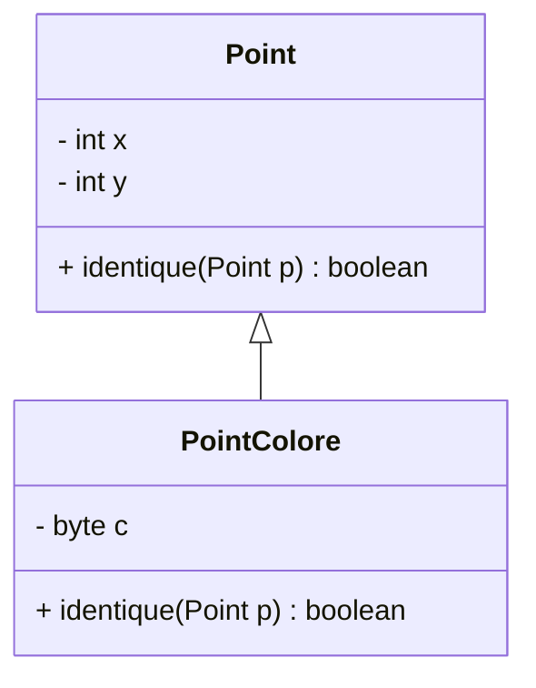

---
## Membres
	1.  Salif Biaye
    2.  Ndeye Astou Diagouraga
    3.  Cheikh Ahmeth Tidiane thiandoum
    4.  Anna Sow
    5.  Ndeye Penda Diene
    6. Assane Mbengue
---

## Introduction

Dans ce projet, nous avons développé deux classes en Java :

- **`Point`** : Une classe de base représentant un point dans un plan cartésien, avec des coordonnées `x` et `y`.
- **`PointColore`** : Une classe dérivée de `Point`, ajoutant un attribut supplémentaire `c` pour représenter une couleur.

L'objectif principal était de permettre la comparaison de deux instances pour déterminer si elles sont identiques. Cette comparaison diffère selon que l'on compare des objets `Point` ou des objets `PointColore`.

---

## Classe `Point`

### Définition

La classe `Point` contient :

- Deux attributs `x` et `y` pour représenter les coordonnées.
- Une méthode `identique(Point p)` qui compare les coordonnées de l'objet courant avec celles de l'objet passé en paramètre.

### Implémentation

```java
public class Point {
    private int x;
    private int y;

    public Point(int x, int y) {
        this.x = x;
        this.y = y;
    }

    public boolean identique(Point p) {
        return this.x == p.x && this.y == p.y;
    }
}
```

---

## Classe `PointColore`

### Définition

La classe `PointColore` hérite de `Point` et ajoute :

- Un attribut `c` (de type `byte`) pour représenter la couleur.
- Une redéfinition de la méthode `identique` pour inclure la comparaison de l'attribut `c`.

### Problème initial

Si nous écrivons une méthode `identique` spécifique pour `PointColore` prenant un paramètre de type `PointColore`, par exemple :

```java
public boolean identique(PointColore p) {
    return super.identique(p) && this.c == p.c;
}
```

### Résultat
```java
public class Main {
    public static void main(String[] args) {
        Point p1 = new PointColore(1, 2, (byte) 3);
        Point p2 = new PointColore(1, 2, (byte) 4);

        System.out.println(p1.identique(p2)); // Affiche True 
    }
}
```

Cette méthode ne sera jamais appelée si l'objet à comparer est de type `Point` (même s'il est une instance de `PointColore`).. Cela est lié au concept de _surclassement_ et de _liaison dynamique_ en Java.

En Java, lors de l'appel d'une méthode sur une instance, le choix de la méthode à exécuter est réalisé à l'exécution (liaison dynamique), en fonction du type réel de l'objet. Cependant, la signature de la méthode est résolue à la compilation en fonction du type de la référence.

Dans cet exemple, si une instance de `PointColore` est référencée par une variable de type `Point` :

```java
Point p = new PointColore(1, 2, (byte) 3);
p.identique(autrePoint);
```

Le compilateur recherche une méthode `identique` avec un paramètre de type `Point` dans la classe de la référence (ici, `Point`). Il ne considère pas la méthode spécifique à `PointColore` qui prend un paramètre de type `PointColore`. Ainsi, la méthode à exécuter sera celle de `Point` , qui ne compare que les coordonnées `x` et `y`.

Ce comportement limite la méthode `identique(PointColore)` car elle ne sera utilisable que si la référence est explicitement de type `PointColore`. Par conséquent, pour comparer les couleurs correctement, nous devons redéfinir la méthode `identique` en utilisant le type général `Point` tout en gérant dynamiquement les instances de `PointColore`.

### Solution : Redéfinir la méthode `identique`

Pour résoudre ce problème, nous redéfinissons la méthode `identique` en vérifiant si l'objet passé en paramètre est une instance de `PointColore`. Si c'est le cas, nous effectuons un **cast** et comparons l'attribut `c`.

### Implémentation corrigée

```java
public class PointColore extends Point {
    private final byte c;

    public PointColore(int x, int y, byte c) {
        super(x, y);
        this.c = c;
    }

    @Override
    public boolean identique(Point p) {
        if (p instanceof PointColore) {
            PointColore pc = (PointColore) p;
            return super.identique(p) && this.c == pc.c;
        }
        return false;
    }
}
```

---

## Exemple d'utilisation

Voici un exemple illustrant le fonctionnement des classes :

### Code complet

```java
public class Main {
    public static void main(String[] args) {
        Point p1 = new PointColore(1, 2, (byte) 3);
        Point p2 = new PointColore(1, 2, (byte) 4);

        System.out.println(p1.identique(p2)); // Affiche false car les couleurs diffèrent.
    }
}
```

### Illustration de l'héritage

Un diagramme UML des relations entre `Point` et `PointColore` :



---

## Conclusion

En utilisant la redéfinition de la méthode `identique` et en vérifiant  le type de l'objet passé en paramètre, nous avons assuré que :

1. Les objets `Point` peuvent être comparés uniquement sur leurs coordonnées `x` et `y`.
2. Les objets `PointColore` sont comparés sur leurs coordonnées `x`, `y` et leur attribut `c`.