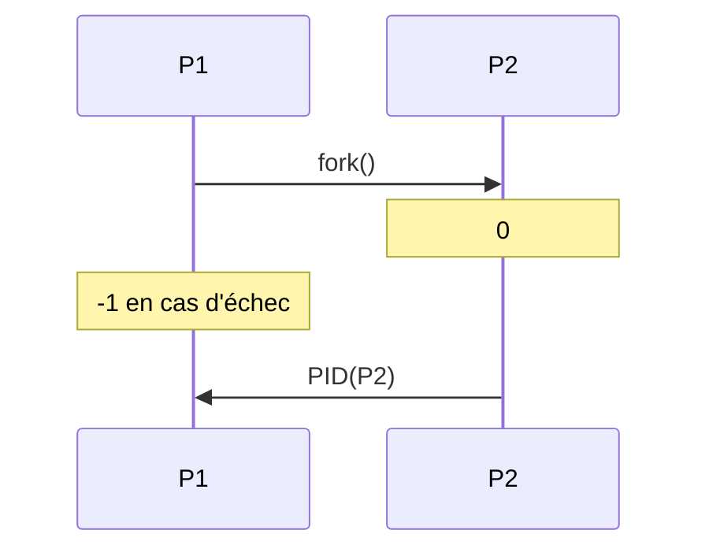
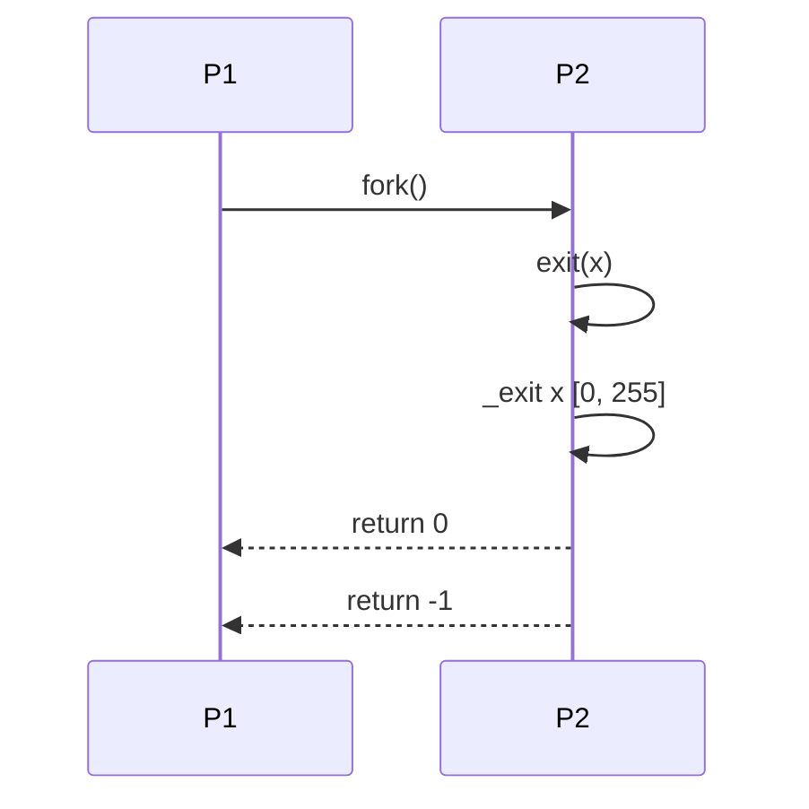
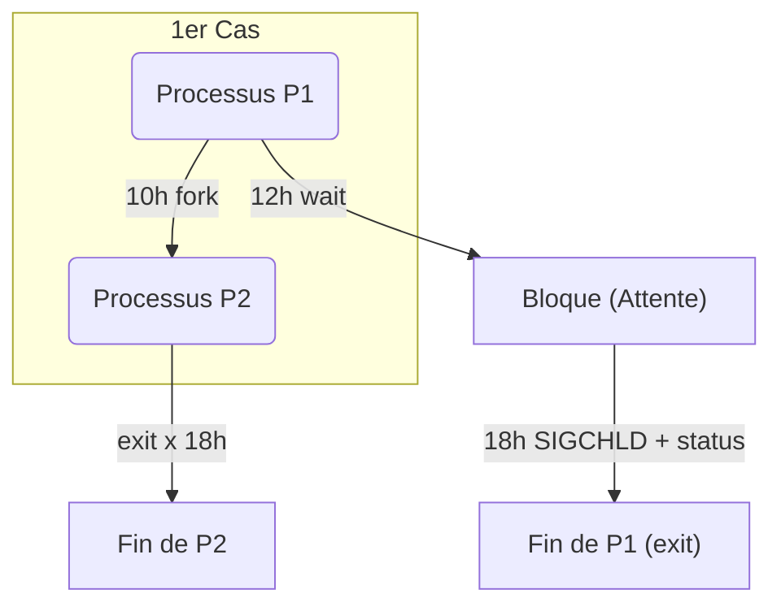
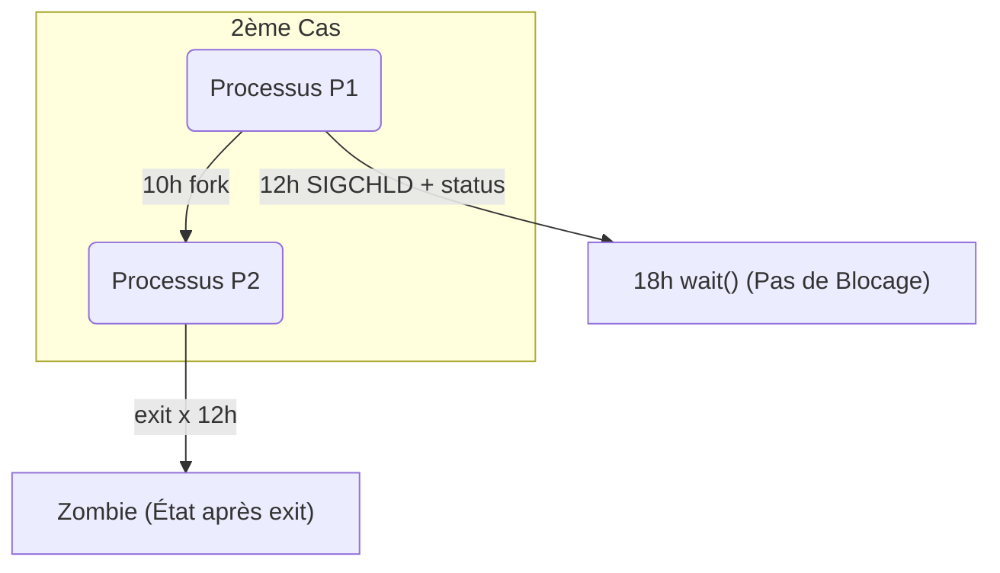
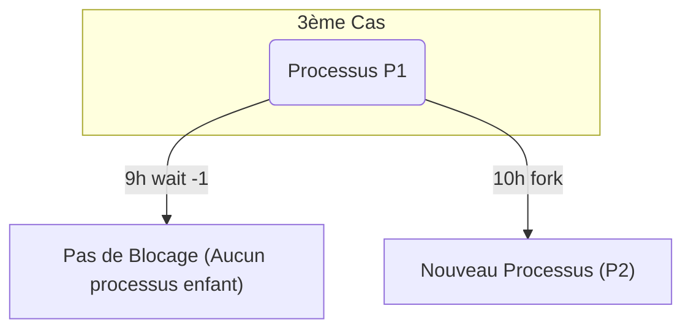

---
Une **instance** d'exécution d'un programme

## Ressources
- **Matérielles**
  - CPU
  - Périphériques
- **Logicielle**
  - Code
  - contexte
  - mémoire

## Mode d'exécution
### Mode utilisateur VS Mode Noyau

## Identification des processus

`PID process identifier` c'est un numéro unique qui vient a sa naissance il est coder  de la même manière qu'un entier non signe qui est 4 octets 0 ----> 2^32

`-start-kernel()` il va créer 
- un Processus 0
	- Initialiser les structures de données du noyau
	- Autoriser les interruptions
	- Créer un thread init (destiner a une tache spécifique)
	- Dormir (a son réveil il tue tout le monde)

`# init 0` entraine un arrêt brutal du système
	- il va créer d'autres thread de gestion:
		- Cache
		- Swap
		- autre
    - `exec(-)`
	    - INIT de PID =1 

## Informations sur les processus
commande `ps` avec d'autres options `-aux` par exemple il donne une cartographie du système a un instant t
il y a une versions `top` elle donne l'état du système a un temps réel
# Processus et Identification

## Fonctions et Processus

- **`pid_t getpid(void)`** : Fonction qui retourne l'identifiant du processus courant.
- **`pid_t getppid(void)`** : Fonction qui retourne l'identifiant du processus parent.

---

### Exemple de Processus

1. **Processus P1**
   - `getpid();` → `PID(P1)`
   - **Créer un processus** → Nouveau processus P2
   - `PPID(P2) = PID(P1)`

2. **Processus P2**
   - `getpid();` → `PID(P2)`
   - `getppid();` → `PID(P1)`

---

### Résumé des Relations entre Processus

- **P1** est le processus parent de **P2**.
- **P2** peut obtenir le PID de **P1** en utilisant `getppid()`.

## Propriétaire Réel vs Propriétaire effective

## Créations de processus

## Attributs non copiés

- Numéro de processus
- Numéro de processus du père
- Temps d'exécution
- Priorité du processus
- Verrous sur les fichiers

## Différents types de terminaison de processus

- **Terminaison normale**, avec un code de retour :
  - Fin de la fonction `main()`
    - `return 0;`
  - Un processus courant se termine automatiquement lorsqu'il cesse d'exécuter la fonction `main()`.
  - Primitive système `exit()` :
    - `exit(1);`

- **Terminaison anormale**, par un signal :
  - Envoyé par l'utilisateur :
    - Touches `<Ctrl-C>` ou commande `kill`
  - Envoyé par un autre processus :
    - Primitive `kill()`
  - Envoyé par le noyau :
    - En cas d'erreur d'exécution

## Terminaison de processus

### Actions réalisées à la terminaison d'un processus

- À la terminaison d'un processus :
    1. Ses ressources sont libérées
    2. Ses fichiers ouverts sont fermés
    3. Ses enfants sont adoptés par `init`
    4. Son père reçoit un signal `SIGCHLD`
    5. Son état d'exécution devient "terminé" : `zombie`
    6. Son entrée dans la table de processus n'est pas libérée
        - Le PID et le PCB d'un processus terminé ne sont pas libérés tant que son père ne ramasse ses cendres

## Terminaison du processus courant

### Terminaison explicite d'un processus

- Appel système : `_exit`
- Appel de la fonction : `void exit(int statut)`
    - Ces deux primitives provoquent la terminaison du processus courant, i.e. termine le processus appelant.
    - Le paramètre statut spécifie un code de retour :
        - compris entre 0 et 255, à communiquer au processus père.
        - **Terminaison normale** : retourner la valeur 0 ou `EXIT_SUCCESS`
        - **Fin anormale** : `EXIT_FAILURE`

- Avant de terminer l'exécution du processus, `exit()` exécute les fonctions de « nettoyage » des librairies standard.
    - Ferme les descripteurs de fichiers ouverts
    - Un signal `SIGCHLD` est envoyé au processus père
    - Le `PPID` des processus fils du processus sortant devient 1 (`init`)

## Attente de terminaison d'un fils
### 1er cas

### 2ème  cas

### 3ème  cas

