---

<div class="rapport-container">

<div class="page-de-garde">
    <h1 class="universite">Université Cheikh Anta Diop de Dakar</h1>
    <h2 class="ecole">École Supérieure Polytechnique</h2>
    
            <!-- Insérez ici le logo de l'UCAD si disponible -->
            <!--  -->
<div align="center">

![[logo_esp.png| 300]]

</div>
        
    <h3 class="titre-rapport">Rapport Unifié : Solutions Réseaux Avancées</h3>
    <div class="auteurs">
        <p class="label">Présenté par :</p>
        <p class="nom">Salif BIAYE</p>
        <p class="nom">Ndeye Astou DIAGOURAGA</p>
    </div>
    <div class="supervisor" style="padding: 15px; border-radius: 5px; margin: 20px 0;">

### Sous la direction de :
#### Dr Keba
*Enseignant*

</div>

---

<div  style="border: 3px double #1a5f7a; padding: 20px ;0;">

### Année universitaire 2024-2025
**

</div>
</div>

<div style="page-break-after: always;">
</div>
<h2>Table des Matières</h2>
<nav class="table-des-matieres">
    <ul>
        <li><a href="#kerberos-ldap-dns"><h2>1. Rapport Kerberos, LDAP et DNS</h2></a></li>
        <li><a href="#Protocole-acces"><h2>2. Protocoles d'Accès et Services de Partage</h2></a></li>
        <li><a href="#asterisk-ldap"><h2>3. Rapport Asterisk et LDAP (BONUS VIDEO)</h2></a></li>
        <li><a href="#iredmail-ldap"><h2>4. Rapport iRedMail et LDAP (BONUS VIDEO)</h2></a></li>
        <li><a href="#webrtc-jitsi"><h2>5. Rapport WebRTC avec Jitsi Meet (BONUS VIDEO)</h2></a></li>
        <li><a href="#pfsense-radius"><h2>6. Rapport PfSense et RADIUS (BONUS VIDEO)</h2></a></li>
    </ul>
</nav>
<div class="diagramme-mermaid" align ="center">

![[Mediamodifier-Design-Template.png]]

</div>
<div style="page-break-after: always;">
</div>
<div id="#kerberos-ldap-dns" class="rapport-container">
<div class="page-de-garde">
    <h1 class="universite">Université Cheikh Anta Diop de Dakar</h1>
    <h2 class="ecole">École Supérieure Polytechnique</h2>
    
            <!-- Insérez ici le logo de l'UCAD si disponible -->
            <!--  -->
<div align="center">

![[logo_esp.png| 300]]

</div>
        
    <h3 class="titre-rapport">Configuration DNS et Couplage Kerberos/LDAP</h3>
    <div class="auteurs">
        <p class="label">Présenté par :</p>
        <p class="nom">Salif BIAYE</p>
        <p class="nom">Ndeye Astou DIAGOURAGA</p>
    </div>
    <div class="supervisor" style="padding: 15px; border-radius: 5px; margin: 20px 0;">

### Sous la direction de :
#### Dr Keba
*Enseignant*

</div>

---

<div  style="border: 3px double #1a5f7a; padding: 20px ;0;">

### Année universitaire 2024-2025
**

</div>
</div>
<div style="page-break-after: always;">
</div>
<h2>Table des Matières</h2>
<nav class="table-des-matieres">
    <ul>
        <li><a href="#dns"><h3>I. Configuration DNS</h3></a>
            <ul>
                <li><a href="#intro-dns"><h4>I.1. Introduction</h4></a></li>
                <li><a href="#config-dns"><h4>I.2. Configuration Serveur</h4></a></li>
                <li><a href="#test-dns"><h4>I.3. Tests et Validation</h4></a></li>
            </ul>
        </li>
        <li><a href="#kerberos"><h3>II. Couplage Kerberos/LDAP</h3></a>
            <ul>
                <li><a href="#config-ldap"><h4>II.1. Configuration LDAP</h4></a></li>
                <li><a href="#config-krb"><h4>II.2. Intégration Kerberos</h4></a></li>
                <li><a href="#tests"><h4>II.3. Tests d'Intégration</h4></a></li>
            </ul>
        </li>
        <li><a href="#conclusion"><h3>III. Conclusion</h3></a></li>
    </ul>
</nav>

<main>

<div id="dns" class="section-rapport">
<h2>I. Configuration du Serveur DNS</h2>
        
<div id="intro-dns" class="bloc-contenu">
<h3>I.1. Introduction</h3>

<p>

Ce rapport présente les étapes pour configurer un serveur DNS (Domain Name System) pour le domaine **smarttech.sn**. La configuration du DNS est cruciale pour permettre la résolution des noms de domaine vers les adresses IP, facilitant ainsi l’accès aux services associés à ce domaine.

</p>

<div class="diagramme-mermaid" align ="center">

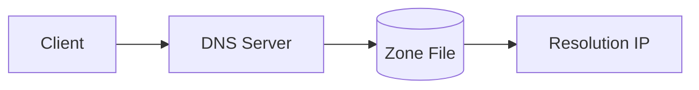

</div>

<p>
Avant de commencer la configuration du serveur DNS, il est essentiel de remplir les pré-requis suivants :

●      Disposer d'un serveur DNS fonctionnel (par exemple, **BIND** sous Linux).

●      Un domaine enregistré (smarttech.sn).

●      Des droits administratifs sur le serveur DNS.

●      Un fichier de zone pour le domaine **smarttech.sn**.
</p>


</div>

<div id="config-dns" class="bloc-contenu">
<h3>I.2. Configuration du Serveur</h3>

>[! Pour installer BIND (le serveur DNS le plus couramment utilisé), on exécute les commandes suivantes sur un système Ubuntu :]


<div class="bloc-code">

```bash
sudo apt update  
sudo apt install bind9 bind9utils bind9-doc
```

</div>


Le fichier **named.conf** est utilisé pour configurer BIND et définir les zones de DNS. Ce fichier se trouve généralement dans le répertoire **/etc/bind/**. Ajoutez la configuration suivante pour inclure la zone **smarttech.sn** :

<div class="bloc-code">

```bash
zone "smarttech.sn" {  
    type master;  
    file "/etc/bind/db.smarttech.sn";  
};
```

</div>

Le fichier de zone contient les enregistrements DNS pour le domaine. On crée un fichier **/etc/bind/db.smarttech.sn** avec le contenu suivant :

<div class="bloc-code">

```bash
TTL    86400  
@       **IN**      **SOA**     kdc.smarttech.sn. admin.smarttech.sn. (  
                        20250303 ; Serial                        3600       ; Refresh                        1800       ; Retry                        1209600    ; Expire                        86400 )    ; Minimum TTL; Definition des serveurs DNS  
@        **IN**      **NS**      kdc.smarttech.sn.kdc     **IN**      **A**       192.168.1.211  
  
  
  
www     **IN**      **A**       192.168.1.200  
mail    **IN**      **A**       192.168.1.201 ; Enregistrement A pour mail

@       IN      MX      10 mail.smarttech.sn.  ; Enregistrement MX pour le serveur de messagerie
```

</div>
<p>

●      **SOA (Start of Authority)** : Indique les informations de base sur la zone.

●      **NS (Name Server)** : Définit les serveurs DNS autoritaires pour le domaine.

●      **A (Address)** : Associe des noms d'hôtes à des adresses IP.

●      **MX (Mail Exchanger)** : Pour la gestion des emails.

</p>


</div>

<div id="test-dns" class="bloc-contenu">
<h3>I.3. Validation DNS</h3>

<p>

Une fois les configurations effectuées, redémarrez le service BIND pour appliquer les modifications :

</p>

<div class="bloc-code">

```bash
sudo systemctl restart bind9
```

</div>

<p>

Vérifiez que le serveur DNS fonctionne correctement en utilisant des outils comme **dig** ou **nslookup** :

</p>


<div class="bloc-code">

```bash
dig @localhost smarttech.sn
nslookup mail.smarttech.sn
```

</div>

<div class="diagramme-mermaid" align="center">

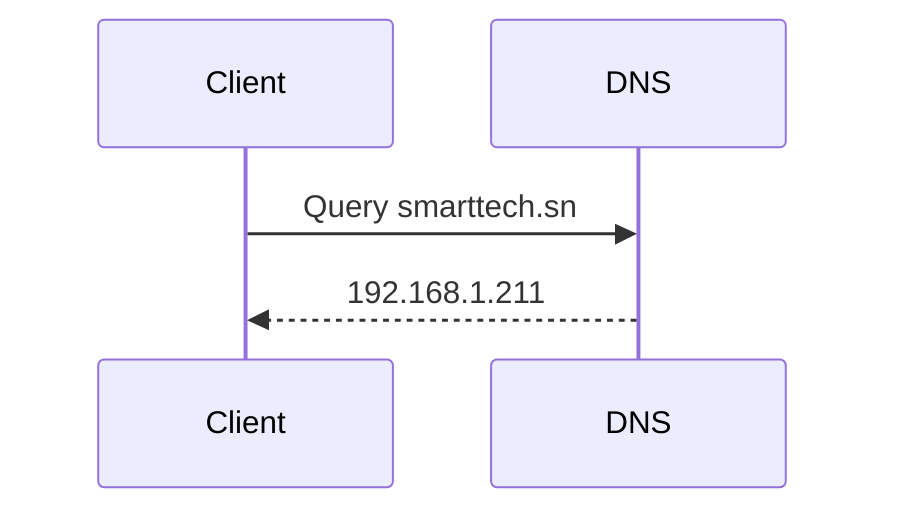

</div>
<div style="page-break-after: always;">
</div>

>[! On obtient ce qui suit:]

<div class="bloc-code">

```bash
root@server:/home/server# dig @localhost smarttech.sn

; <<>> DiG 9.18.30-0ubuntu0.22.04.2-Ubuntu <<>> @localhost smarttech.sn
; (1 server found)

;; global options: +cmd
;; Got answer:

;; ->>HEADER<<- opcode: QUERY, status: NOERROR, id: 1894
;; flags: qr aa rd ra; QUERY: 1, ANSWER: 0, AUTHORITY: 1, ADDITIONAL: 1

;; OPT PSEUDOSECTION:
; EDNS: version: 0, flags: udp: 1232
; COOKIE: 2fcc35a089dbda540100000067c5b8ca05c24d5c69afd507 (good)

;; QUESTION SECTION:
;smarttech.sn.                  IN      A

;; AUTHORITY SECTION:
smarttech.sn.          604800  IN      SOA     kdc.smarttech.sn. admin.smarttech.sn. 20250303 604800 86400 2419200 604800

;; Query time: 274 msec
;; SERVER: 127.0.0.1#53(localhost) (UDP)
;; WHEN: Mon Mar 03 14:12:26 GMT 2025
```
</div>

>[! on peut aussi faire un nslookup pour verifier]

<div class="bloc-code">

```bash
root@server:/home/server# nslookup kdc.smarttech.sn
Server:         127.0.0.53
Address:        127.0.0.53#53

Name:   kdc.smarttech.sn
Address: 192.168.1.211

Name:   kdc.smarttech.sn
Address: fd00::ae77:529b:c27d:59db

Name:   kdc.smarttech.sn
Address: fd00::eb47:b1a2:2d20:e082

Name:   kdc.smarttech.sn
Address: fe80::989c:7743:7e28:7163

root@server:/home/server#
```
</div>

<div class="bloc-code">

```bash
root@server:/home/server# named-checkzone smarttech.sn /etc/bind/db.smarttech.sn
zone smarttech.sn/IN: loaded serial 20250303
OK
```

</div>

La configuration du serveur DNS pour le domaine **smarttech.sn** assure une résolution correcte des noms de domaine et une gestion efficace des services réseau. Cependant, pour renforcer la sécurité, il est essentiel d'intégrer **Kerberos**, un protocole d'authentification centralisée. Tandis que le DNS garantit l'accès aux ressources, **Kerberos** assure que seules les entités authentifiées peuvent y accéder. Cette transition permet de sécuriser les communications et d'assurer un contrôle d'accès solide au sein de notre réseau.

</div>
    </div>

<div id="kerberos" class="section-rapport">
<h2>II. Intégration Kerberos/LDAP</h2>

>[! Introduction]
Kerberos et LDAP sont deux technologies essentielles dans les environnements d'entreprise pour assurer une authentification centralisée et sécurisée. LDAP (Lightweight Directory Access Protocol) est un protocole utilisé pour accéder et gérer un annuaire d'utilisateurs, tandis que Kerberos est un protocole d'authentification sécurisé basé sur un système de tickets.

Le couplage de Kerberos et LDAP permet d'utiliser LDAP comme base d'annuaire centralisée et d'exploiter Kerberos pour authentifier nos utilisateurs de manière sécurisée.

>[!Objectif du couplage]

L'intégration de Kerberos avec LDAP vise à :

●      Centraliser la gestion des utilisateurs et des mots de passe.

●      Sécuriser l'authentification avec Kerberos.

●      Faciliter l'administration des accès réseau.

●      Permettre l'authentification unique (SSO - Single Sign-On).

>[!Prerequis]

Avant de procéder à l'installation et à la configuration, il est nécessaire de disposer :

●      D'un serveur Linux (Ubuntu dans notre cas).

●      Des paquets krb5-kdc, krb5-admin-server, krb5-user pour Kerberos.

●      D'un serveur LDAP fonctionnel (ex : OpenLDAP).

●      Des paquets libnss-ldap, libpam-krb5, krb5-config, krb5-user pour l'intégration LDAP-Kerberos.

>[!Remarque:]

- notre nom de domaine est smarttech.sn

- l’adresse IP de notre serveur est 192.168.1.211

- le hostname de notre machine kdc.smarttech.sn

<div id="config-ldap" class="bloc-contenu">
<h3>II.1. Configuration LDAP</h3>
<p>

Nous allons installer le serveur OpenLDAP sur le même hôte que le KDC, afin de simplifier la communication entre eux.

</p>

>[!Installation des paquets necessaires]

<div class="bloc-code">

```bash
sudo apt install krb5-kdc-ldap krb5-admin-server
```

</div>

>[!Extraction du fichier kerberos.schema.gz]

kerberos.schema.gz contient la définition des objets et attributs nécessaires pour stocker des informations Kerberos dans un annuaire LDAP.

<div class="bloc-code">

```bash
sudo cp /usr/share/doc/krb5-kdc-ldap/kerberos.schema.gz /etc/ldap/schema/  
sudo gunzip /etc/ldap/schema/kerberos.schema.gz
```

</div>

>[!Ajout du schema kerberos dans l’arborescence]
Le fichier schema doit etre converti au format ldif avant de pouvoir etre ajoute. Pour cela on installe:

<div class="bloc-code">

```bash
sudo apt install schema2ldif
```
</div>

>[!Pour importer le schéma Kerberos, on execute:]

<div class="bloc-code">

```bash
$ sudo ldap-schema-manager -i kerberos.schema  
SASL/EXTERNAL authentication started  
SASL username: gidNumber=0+uidNumber=0,cn=peercred,cn=external,cn=auth  
SASL SSF: 0executing 'ldapadd -Y EXTERNAL -H ldapi:/// -f /etc/ldap/schema/kerberos.ldif'  
SASL/EXTERNAL authentication started  
SASL username: gidNumber=0+uidNumber=0,cn=peercred,cn=external,cn=auth  
SASL SSF: 0**adding** new entry "cn=kerberos,cn=schema,cn=config"
```

</div>

>[!Indexons un attribut souvent utilisé dans les recherches]

<div class="bloc-code">

```bash
$ sudo ldapmodify -Q -Y EXTERNAL -H ldapi:/// <<EOF  
dn: olcDatabase={1}mdb,cn=config  
add: olcDbIndex  
olcDbIndex: krbPrincipalName eq,pres,sub  
EOF
modifying entry "olcDatabase={1}mdb,cn=config"
```
</div>

>[!Creation des entrees ldap pour les entrees administratives kerberos]

<div class="bloc-code">

```bash
**$ ldapadd -x -D cn=admin,dc=smarttech,dc=sn -W <<EOF  
dn: uid=kdc-service,dc=smarttech,dc=sn  
uid: kdc-service  
objectClass: account  
objectClass: simpleSecurityObject  
userPassword: {CRYPT}x  
description: Account used for the Kerberos KDC  
  
dn: uid=kadmin-service,dc=smarttech,dc=sn  
uid: kadmin-service  
objectClass: account  
objectClass: simpleSecurityObject  
userPassword: {CRYPT}x  
description: Account used for the Kerberos Admin server  
EOF  
Enter LDAP Password:  
adding new entry "uid=kdc-service,dc=smarttech,dc=sn"  
  
adding new entry "uid=kadmin-service,dc=smarttech,dc=sn"**
```

</div>

>[!On va ensuite devenir un mot de passe pour chaque entire: kdc-service et kadmin-service]

<div class="bloc-code">

```bash
$ ldappasswd -x -D cn=admin,dc=smarttech,dc=sn -W -S uid=kdc-service,dc=smarttech,dc=sn  
**New** password:******Re-enter **new** password:******  
Enter LDAP Password: ******
```

</div>

>[!mise a jour des listes de controle d’acces ACL]

<div class="bloc-code">

```bash
**$ sudo ldapmodify -Q -Y EXTERNAL -H ldapi:/// <<EOF  
dn: olcDatabase={1}mdb,cn=config  
add: olcAccess  
olcAccess: {2}to attrs=krbPrincipalKey  by anonymous auth  by dn.exact="uid=kdc-service,dc=smarttech,dc=sn" read  by dn.exact="uid=kadmin-service,dc=smarttech,dc=sn" write  by self write  by * none  
-  
add: olcAccess  
olcAccess: {3}to dn.subtree="cn=krbContainer,dc=smarttech,dc=sn"  
  by dn.exact="uid=kdc-service,dc=smarttech,dc=sn" read  by dn.exact="uid=kadmin-service,dc=smarttech,dc=sn" write  by * none  
EOF  
  
modifying entry "olcDatabase={1}mdb,cn=config"**
```

</div>
<p>
Notre annuaire LDAP est maintenant prêt à servir de base de données principale Kerberos.
</p>


<div class="diagramme-mermaid" align="center">

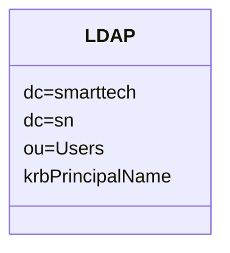

</div>
        </div>

<div id="config-krb" class="bloc-contenu">
<h3>II.2. Configuration Kerberos</h3>

>[!Editons le fichier /etc/krb5.conf]

<div class="bloc-code">

```bash
**[realms]       
    EXAMPLE.COM = {  
                kdc = kdc.smarttech.sn  
                admin_server = kdc.smarttech.sn  
                default_domain = smarttech.sn  
                database_module = openldap_ldapconf  
        }
```

</div>
<div style="page-break-after: always;">
</div>
<div class="bloc-code">

```bash
[dbdefaults]        
		ldap_kerberos_container_dn = cn=krbContainer,dc=smarttech,dc=sn
[dbmodules]        
		openldap_ldapconf = {  
	                db_library = kldap
	                disable_last_success = true                
	                disable_lockout  = true                
	                ldap_kdc_dn = "uid=kdc-service,dc=smarttech,dc=sn"               
	                ldap_kadmind_dn = "uid=kadmin-service,dc=smarttech,dc=sn"               
	                ldap_service_password_file = /etc/krb5kdc/service.keyfile                
	                ldap_servers = ldapi:///  
	                ldap_conns_per_server = 5  
	        }
```

</div>

>[!Creer le domaine avec  kdb5_ldap_util]


<div class="bloc-code">

```bash
$ sudo ldap-schema-manager -i kerberos.schema  
SASL/EXTERNAL authentication started  
SASL username: gidNumber=0+uidNumber=0,cn=peercred,cn=external,cn=auth  
SASL SSF: 0executing 'ldapadd -Y EXTERNAL -H ldapi:/// 
-f /etc/ldap/schema/kerberos.ldif'  
SASL/EXTERNAL authentication started  
SASL username: gidNumber=0+uidNumber=0,cn=peercred,cn=external,cn=auth  
SASL SSF: 0**adding** new entry "cn=kerberos,cn=schema,cn=config"
```

</div>

>[!Creons les mots de passe pour chacun]

<div class="bloc-code">

```bash
sudo kdb5_ldap_util -D cn=admin,dc=smarttech,dc=sn stashsrvpw
-f /etc/krb5kdc/service.keyfile uid=kdc-
service,dc=smarttech,dc=sn  
sudo kdb5_ldap_util -D cn=admin,dc=smarttech,dc=sn stashsrvpw 
-f /etc/krb5kdc/service.keyfile uid=kadmin-
service,dc=smarttech,dc=sn**
```

</div>

>[!Redémarrage des services]

<div class="bloc-code">

```bash
sudo systemctl start krb5-kdc.service
sudo systemctl krb5-admin-server.service
```

</div>


<div class="diagramme-mermaid" align="center">

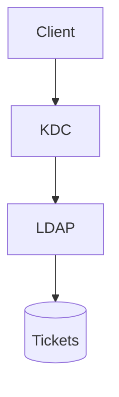

</div>
        </div>

<div id="tests" class="bloc-contenu">
<h3>II.3. Tests d'Intégration</h3>

Testons l’authentification kerberos LDAP avec Kerberos
Créons un utilisateur dans kerberos avec

<div class="bloc-code">

```bash
sudo kadmin.local -q "addprinc salif@SMARTTECH.SN"
```

</div>

Vérifions si le principal est dans ldap avec la commande:

<div class="bloc-code">

```bash
ldapsearch -x -D "cn=admin,dc=smarttech,dc=sn" -W 
-b "dc=smarttech,dc=sn"
```

</div>

On peut voir avec la capture suivante que l;utilisateur salif a ete ajoute dans ldap

<div class="bloc-code">

```bash
# salif@SMARTTECH.SN, SMARTTECH.SN, krbContainer, smarttech.sn
dn: krbPrincipalName=salif@SMARTTECH.SN,cn=SMARTTECH.SN,cn=krbContainer,dc=smarttech,dc=sn
krbLoginFailedCount: 0
krbPrincipalName: salif@SMARTTECH.SN
krbPrincipalKey:: MIG20AMCAQGhAwIBAaIDAgEBowMCAQGkgZ8wgZwwVKAHMAWgAwIBAKFJMEegAwIBEqFABD49AFNQzqmerkQhu8XqoXFynzz83b5RFHN7DhhIAa/LWfgUHLxcus1ik00Wp/AWbgf9Rr7g/Olpih38N1+pOzBEoAcwBaADAgEAoTkwN6ADAgEROTAELhAAwKoeJVBtaopFPlCEq/3ur6HN6x3wyCwFD2GNsCh+UQk7ol1cPVlLLb22QOE=
krbLastPwdChange: 20250303084201Z
krbExtraData:: AAJZa8Vncm9vdC9hZG1pbkBTTUFSVFRFQ0gUU04A
krbExtraData:: AAgBAA==
objectClass: krbPrincipal
objectClass: krbPrincipalAux
objectClass: krbTicketPolicyAux

# host/kdc.smarttech.sn@SMARTTECH.SN, SMARTTECH.SN, krbContainer, smarttech.sn
```

</div>


</div>
</div>

<div style="page-break-after: always;">
</div>
<div id="conclusion" class="section-rapport">
<h2>III. Conclusion</h2>

L'intégration de **Kerberos** avec **LDAP** offre une solution robuste pour la gestion centralisée des identités et l’authentification sécurisée des utilisateurs. En exploitant **LDAP** comme annuaire de stockage des identités et **Kerberos** comme mécanisme d’authentification, cette architecture permet de garantir une **sécurité renforcée**, une **administration simplifiée** et une **expérience utilisateur améliorée** grâce au Single Sign-On (**SSO**).

<div class="bloc-contenu">
<p>Cette architecture combinant DNS, Kerberos et LDAP permet :</p>
<div class="diagramme-mermaid" align="center">

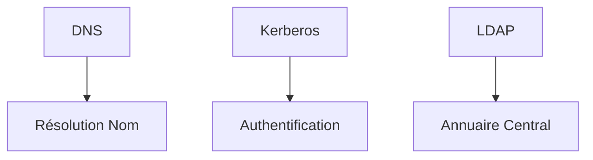

</div>
            <ul>
                <li>Gestion centralisée des identités</li>
                <li>Sécurité renforcée avec tickets Kerberos</li>
                <li>Single Sign-On (SSO)</li>
            </ul>
        </div>
    </div>
</main>
</div>


---
<div style="page-break-after: always;">
</div>
<div id="#Protocole-acces" class="rapport-container">

<div class="page-de-garde">
    <h1 class="universite">Université Cheikh Anta Diop de Dakar</h1>
    <h2 class="ecole">École Supérieure Polytechnique</h2>
    
            <!-- Insérez ici le logo de l'UCAD si disponible -->
            <!--  -->
<div align="center">

![[logo_esp.png| 300]]

</div>
        
    <h3 class="titre-rapport">Protocoles d'Accès et Services de Partage </h3>
    <div class="auteurs">
        <p class="label">Présenté par :</p>
        <p class="nom">Salif BIAYE</p>
        <p class="nom">Ndeye Astou DIAGOURAGA</p>
    </div>
    <div class="supervisor" style="padding: 15px; border-radius: 5px; margin: 20px 0;">

### Sous la direction de :
#### Dr Keba
*Enseignant*

</div>

---

<div  style="border: 3px double #1a5f7a; padding: 20px ;0;">

### Année universitaire 2024-2025
**

</div>
</div>
<div style="page-break-after: always;">
</div>

<h2>Table des Matières</h2>
<nav class="table-des-matieres">
<ul>
            <li><a href="#introduction"><h3>Introduction</h3></a></li>
            <li><a href="#kerberos-ssh"><h3>Kerberos et SSH</h3></a>
                <ul>
                    <li><a href="#intro-kerberos"><h3>Introduction à Kerberos</h3></a></li>
                    <li><a href="#integration-ssh"><h3>IIntégration avec SSH</h3></a></li>
                    <li><a href="#preparation"><h3>IPréparation du serveur et du client</h3></a></li>
                    <li><a href="#config-serveur"><h3>IConfiguration du serveur SSH</h3></a></li>
                    <li><a href="#config-client"><h3>IConfiguration du client SSH</h3></a></li>
                    <li><a href="#test-connexion"><h3>ITest de la connexion</h3></a></li>
                </ul>
            </li>
            <li><a href="#protocoles-bureau"><h3>IProtocoles d'Accès Bureau à Distance</h3></a>
                <ul>
                    <li><a href="#rdp"><h4>IRDP (Remote Desktop Protocol)</h4></a></li>
                    <li><a href="#novnc"><h4>INoVNC</h4></a></li>
                </ul>
            </li>
            <li><a href="#samba-ldap"><h3>Samba avec LDAP et Kerberos</h3></a>
                <ul>
                    <li><a href="#intro-samba"><h4>ntroduction</h4></a></li>
                    <li><a href="#installation-samba"><h4>Installation des paquets</h4></a></li>
                    <li><a href="#config-ldap"><h4>Configuration de LDAP</h4></a></li>
                    <li><a href="#config-kerberos-samba"><h4>Configuration de Kerberos pour Samba</h4></a></li>
                    <li><a href="#config-samba"><h4>Configuration de Samba</h4></a></li>
                    <li><a href="#ajout-utilisateurs"><h4>Ajout des utilisateurs Samba</h4></a></li>
                    <li><a href="#test-validation"><h4>Tests et validation</h4></a></li>
                </ul>
            </li>
            <li><a href="#transfert-fichiers"><h3>Services de Transfert de Fichiers</h3></a></li>
            <li><a href="#conclusion"><h3>Conclusion</h3></a></li>
</ul>
</nav>

<main>

<div id="introduction" class="section-rapport">
<h2>Introduction</h2>
            <p>Ce rapport présente l'implémentation de plusieurs protocoles d'accès et services de partage sécurisés dans un environnement d'entreprise. Dans un contexte de sécurité informatique en constante évolution, la mise en place de solutions d'authentification centralisées et de connexions distantes sécurisées est devenue indispensable.</p>
            <p>Nous aborderons l'intégration de Kerberos avec SSH pour l'authentification centralisée, les solutions d'accès bureau à distance avec RDP et NoVNC, la configuration de Samba avec LDAP et Kerberos, ainsi que les services de transfert de fichiers TFTP et SFTP.</p>
            <p>L'objectif principal est de mettre en place une infrastructure sécurisée et efficace pour la gestion à distance des systèmes, en combinant des technologies complémentaires pour répondre aux besoins spécifiques de l'entreprise SmartTech.SN.</p>
</div>

<div id="kerberos-ssh" class="section-rapport">
<h2>Kerberos et SSH</h2>
<div id="intro-kerberos" class="bloc-contenu">
<h3>Introduction à Kerberos</h3>
                <p>L'intégration de Kerberos avec SSH permet d'optimiser la sécurité des connexions à distance sur des serveurs Linux/Unix en centralisant l'authentification des utilisateurs.</p>
<div class="diagramme-mermaid mermaid" align="center">
<div align="center">

![[Untitled diagram-2025-03-05-223621.png]]

</div>
</div>
</div>

<div id="integration-ssh" class="bloc-contenu">
<h3>Intégration avec SSH</h3>
                <p>SSH (Secure Shell) est un protocole utilisé pour accéder à distance à des systèmes Unix/Linux de manière sécurisée. Lorsqu'il est couplé avec Kerberos, SSH bénéficie d'une authentification renforcée, permettant une gestion centralisée et simplifiée des identités et des accès.</p>
                <h4>Avantages du couplage Kerberos avec SSH</h4>
                <ul>
                    <li><strong>Authentification centralisée</strong> : Les utilisateurs sont authentifiés via un serveur Kerberos, tel qu'un KDC (Key Distribution Center), permettant une gestion centralisée des identités.</li>
                    <li><strong>Sécurité améliorée</strong> : Kerberos utilise des tickets cryptographiques pour l'authentification, ce qui protège contre les attaques par interception de mot de passe.</li>
                    <li><strong>Accès sans mot de passe</strong> : Une fois l'utilisateur authentifié par Kerberos, il n'a pas à saisir son mot de passe à chaque connexion SSH, ce qui facilite l'accès sécurisé à plusieurs serveurs.</li>
                </ul>
<div class="bloc-code">

```bash
sudo apt-get install krb5-user libpam-krb5
```

</div>
            </div>

<div id="preparation" class="bloc-contenu">
<h3>Préparation du serveur et du client avec Kerberos</h3>
                <p>Pour configurer l'authentification Kerberos avec SSH, nous devons d'abord créer les principaux pour le serveur et le client, puis générer les clés Kerberos et ajouter les utilisateurs nécessaires dans la base de données Kerberos.</p>
                <h4>Création des principaux Kerberos</h4>
<div class="bloc-code">

```bash
kadmin.local
addprinc -randkey host/kdc.smarttech.sn 
addprinc -randkey host/client1.smarttech.sn
```


</div>
                <h4>Génération des clés</h4>
<div class="bloc-code">

```bash
ktadd host/kdc.smarttech.sn 
ktadd host/client1.smarttech.sn
```

</div>
<h4>Ajout d'un utilisateur</h4>
<div class="bloc-code">

```bash
addprinc user1
```
</div>
<div class="diagramme-mermaid mermaid" align="center">

<div align="center">

![[Untitled diagram-2025-03-05-223749.png]]

</div>
</div>
</div>

<div id="config-serveur" class="bloc-contenu">
<h3>Configuration du serveur SSH</h3>
                <p>Sur le serveur où SSH sera activé, nous devons configurer le fichier sshd_config pour activer l'authentification Kerberos.</p>
<div class="bloc-code">

```bash
# Éditer le fichier /etc/ssh/sshd_config
KerberosAuthentication yes
KerberosOrLocalPasswd yes
GSSAPIAuthentication yes
GSSAPICleanupCredentials yes
# Redémarrer le service SSH
systemctl restart sshd
```

</div>
</div>

<div id="config-client" class="bloc-contenu">
<h3>Configuration du client SSH</h3>
                <p>Sur le client qui se connectera au serveur via SSH, nous devons configurer le fichier ssh_config pour activer l'authentification Kerberos.</p>
<div class="bloc-code">

```bash
# Éditer le fichier /etc/ssh/ssh_config
GSSAPIAuthentication yes
GSSAPIDelegateCredentials yes
```

</div>

</div>

<div id="test-connexion" class="bloc-contenu">
<h3>Test de la connexion</h3>
                <p>Pour tester la connexion, nous devons d'abord obtenir un ticket Kerberos, puis utiliser ce ticket pour nous connecter au serveur SSH sans mot de passe.</p>
<div class="bloc-code">

  ```bash
# Obtenir un ticket Kerberos
kinit user1@SMARTTECH.SN
# Vérifier le ticket
klist
# Se connecter au serveur SSH
ssh kdc.smarttech.sn
```

</div>
<p>Exemple de sortie réussie :</p>

<div class="bloc-code">

```bash
user1@client:~$ ssh kdc.smarttech.sn
The authenticity of host 'kdc.smarttech.sn (192.168.1.211)' can't be established.
ECDSA key fingerprint is SHA256:xCY1GIIrNHrF7DrDCg9gleHB/GenH3PqyGwtm5WiVxZg.
Are you sure you want to continue connecting (yes/no/[fingerprint])? yes
 Warning: Permanently added 'kdc.smarttech.sn,192.168.1.211' (ECDSA) to the list of known hosts.
Welcome to Ubuntu 20.04.6 LTS (GNU/Linux 5.15.0-130-generic x86_64)
[...Informations système...]
user1@kdc:~$ pwd
/home/user1
```

</div>
            </div>
        </div>

<div id="protocoles-bureau" class="section-rapport">
<h2>Protocoles d'Accès Bureau à Distance</h2>
<div id="rdp" class="bloc-contenu">
<h3>RDP (Remote Desktop Protocol)</h3>
                <p>RDP est un protocole développé par Microsoft pour accéder à un bureau Windows à distance. Contrairement à SSH, qui est généralement utilisé pour une interface en ligne de commande, RDP permet une interaction graphique avec l'interface de l'ordinateur distant.</p>
<h4>Caractéristiques principales de RDP</h4>
                <ul>
                    <li><strong>Accessibilité graphique</strong> : Permet l'accès complet à l'interface graphique du système distant.</li>
                    <li><strong>Contrôle à distance sécurisé</strong> : RDP utilise des mécanismes de chiffrement pour sécuriser la communication entre le client et le serveur.</li>
                    <li><strong>Utilisation dans des environnements Windows</strong> : RDP est principalement utilisé dans des environnements Windows, mais des clients RDP existent pour d'autres systèmes d'exploitation.</li>
                </ul>
<h4>Configuration de RDP</h4>
                <p><strong>Prérequis</strong> :</p>
                <ul>
                    <li>Une machine Windows (version Pro, Enterprise, ou Education) pour servir de serveur RDP.</li>
                    <li>Une machine Windows ou Linux pour agir comme client RDP.</li>
                    <li>Accès administrateur sur la machine serveur.</li>
                </ul>
                <p><strong>Activer le Bureau à Distance sur le Serveur Windows</strong></p>
                <p>Paramètres > Système > Bureau à distance</p>
<div class="diagramme-mermaid mermaid" align="center">

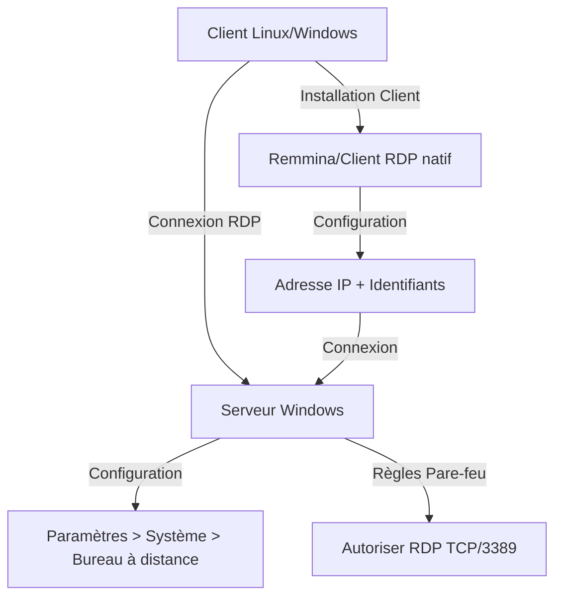

</div>

<div class="diagramme-mermaid mermaid" align="center">

<div align="center">

![[screen.png]]

</div>
</div>

on crée d’abord un utilisateur sur notre serveur Windows

<div class="diagramme-mermaid mermaid" align="center">

<div align="center">

![[systeme.png]]

</div>
</div>

<div class="diagramme-mermaid mermaid" align="center">

<div align="center">

![[systeme 1.png]]

</div>
</div>

On va autoriser le bureau a distance au niveau des règles de parefeu.


<div class="diagramme-mermaid mermaid" align="center">

<div align="center">

![[systeme 2.png]]

</div>
</div>

<div class="diagramme-mermaid mermaid" align="center">

<div align="center">

![[systeme 3.png]]

</div>
</div>
Une fois ceci fait, les clients VNC sur Windows ou Linux peuvent se connecter. on va tester

avec un client linux
<p><strong>Configuration du client Linux</strong></p>

<div class="bloc-code">

```bash
# Installation de Remmina
sudo apt update
sudo apt install remmina remmina-plugin-rdp
```

</div>
                <p>Lancer Remmina, créer une nouvelle connexion avec l'adresse du serveur et les identifiants d'un utilisateur autorisé.</p>
</div>

<div class="diagramme-mermaid mermaid" align="center">

<div align="center">

![[systeme 4.png]]

</div>
</div>

<div class="diagramme-mermaid mermaid" align="center">

<div align="center">

![[systeme 5.png]]

</div>
</div>

On renseigne l’adresse du serveur distant ainsi que l’utilisateur qui est autorisé à accéder au

bureau à distance et son mdp

>[!Testons la connexion]

<div class="diagramme-mermaid mermaid" align="center">

<div align="center">

![[systeme 6.png]]

</div>
</div>

On peut ainsi accéder à distance a la machine serveuse via RDP.

D'un autre côté, **RDP** et **NoVNC** sont des solutions très utiles pour accéder à des bureaux

distants dans des environnements Windows ou via un navigateur. RDP est adapté aux

environnements Windows, tandis que NoVNC fournit une solution multiplateforme et

accessible via un simple navigateur web.

<div id="novnc" class="bloc-contenu">
<h3>NoVNC</h3>
                <p>NoVNC est une implémentation du protocole VNC (Virtual Network Computing) qui permet d'accéder à un bureau distant via un navigateur web. Il fonctionne en utilisant le protocole WebSockets et permet de contrôler un ordinateur à distance en utilisant un client HTML5.</p>
<h4>Caractéristiques principales de NoVNC</h4>
                <ul>
                    <li><strong>Accès via navigateur</strong> : Permet d'accéder à un bureau distant sans installer de logiciel client, simplement via un navigateur web.</li>
                    <li><strong>Compatibilité multiplateforme</strong> : Étant basé sur HTML5, NoVNC fonctionne sur tous les systèmes d'exploitation modernes sans nécessiter de plugins.</li>
                    <li><strong>Utilisation pour la gestion des serveurs virtuels</strong> : NoVNC est souvent utilisé pour gérer des environnements de serveurs virtuels, notamment dans les infrastructures cloud.</li>
                </ul>
<h4>Installation et configuration</h4>
<div class="bloc-code">

```bash
# Installation du serveur VNC
apt install tigervnc-server-standalone -y
# Clonage de noVNC
git clone https://github.com/novnc/noVNC.git ~/novnc
# Création d'un lien symbolique
ln -s ~/noVNC/utils/novnc_proxy /usr/local/bin/novnc_proxy
# Démarrage du proxy WebSocket
novnc_proxy --vnc localhost:5901 --listen 6080
```

</div>
<div class="diagramme-mermaid mermaid" align="center">

<div align="center">

![[Untitled diagram-2025-03-05-223914.png]]

</div>
</div>
</div>
</div>

>[!Interface graphique]

Lorsqu’on tape l’url au niveau de notre machine cliente on obtient:

<div class="diagramme-mermaid mermaid" align="center">

<div align="center">

![[systeme 7.png]]

</div>
</div>

noVNC va permettre à notre entreprise d’accéder aux interfaces graphiques des

serveurs à distance via un simple navigateur, sans nécessiter de client VNC dédié.

Cette solution a amélioré la flexibilité et la sécurité des connexions tout en simplifiant

la gestion des accès pour les utilisateurs. Son intégration a donc optimisé notre

infrastructure en facilitant l’administration à distance et en réduisant les contraintes

techniques.


En combinant **Kerberos avec SSH** pour l'authentification centralisée et en utilisant **RDP** ou

**NoVNC** pour l'accès graphique, on peut créer une infrastructure sécurisée et efficace pour la

gestion à distance des systèmes.

<div id="samba-ldap" class="section-rapport">
<h2>Samba avec LDAP et Kerberos</h2>
<div id="intro-samba" class="bloc-contenu">
<h3>Introduction</h3>
                <p>L'objectif de cette section est d'intégrer Samba avec LDAP et Kerberos sur SMART TECH.SN. Cette configuration permet :</p>
                <ul>
                    <li>D'utiliser LDAP pour centraliser les comptes utilisateurs.</li>
                    <li>D'utiliser Kerberos pour l'authentification sécurisée.</li>
                    <li>D'autoriser l'accès aux partages Samba sans entrer de mot de passe grâce à Kerberos.</li>
                </ul>
<div class="diagramme-mermaid mermaid" align="center">

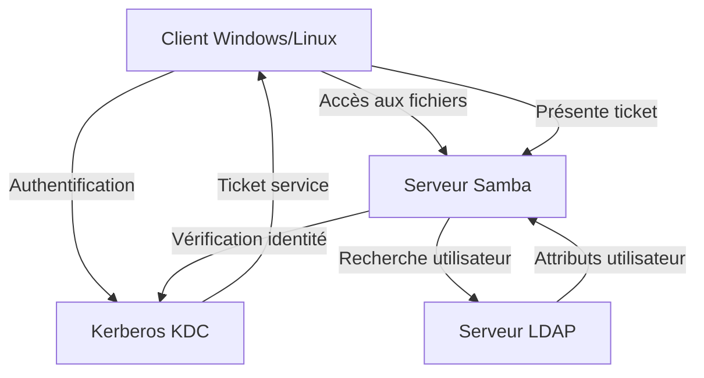

</div>
</div>

<div id="installation-samba" class="bloc-contenu">
<h3>Installation des paquets</h3>
<div class="bloc-code">

```bash
sudo apt install samba smbclient krb5-user winbind 
libnss-winbind libpam-winbind smbldap-tools schema2ldif -y
```

</div>
</div>

<div id="config-ldap" class="bloc-contenu">
<h3>Configuration de LDAP</h3>
                <p><strong>Ajout du schéma Samba à LDAP</strong></p>
<div class="bloc-code">

```bash
# Localiser le schéma Samba
locate samba.schema
# Copier et convertir en LDIF
cp /usr/share/doc/samba/examples/LDAP/samba.schema /etc/ldap/schema/
schema2ldif /etc/ldap/schema/samba.schema > samba.ldif
# Ajout du fichier schema.ldif
sudo ldapadd -Y EXTERNAL -H ldapi:/// -f samba.ldif
# Vérification
ldapsearch -LLL -Y EXTERNAL -H ldapi:/// -b cn=schema,cn=config | grep samba
```

</div>

</div>

<div id="config-kerberos-samba" class="bloc-contenu">
<h3>Configuration de Kerberos pour Samba</h3>
    <p><strong>Fichier de configuration</strong></p>
<div class="bloc-code">

```bash
# Éditer /etc/krb5.conf
[libdefaults]
default_realm = SMARTTECH.SN
[realms]
SMARTTECH.SN = {
    kdc = kdc.smarttech.sn
    admin_server = kdc.smarttech.sn
}
```

</div>
                <p><strong>Création des utilisateurs</strong></p>
<div class="bloc-code">

```bash
# Ajouter le principal salif
sudo kadmin.local addprinc salif@SMARTTECH.SN
# Ajouter le service Samba
addprinc -randkey cifs/server.smarttech.sn@SMARTTECH.SN
ktadd -k /etc/krb5.keytab cifs/server.smarttech.sn@SMARTTECH.SN
```

</div>
</div>

<div id="config-samba" class="bloc-contenu">
<h3>Configuration de Samba</h3>
                <p><strong>Modification de /etc/samba/smb.conf</strong></p>
<div class="bloc-code">

```bash
[global]
workgroup = SMARTTECH
security = user
realm = SMARTTECH.SN
encrypt passwords = yes
passdb backend = ldapsam:ldap://server.smarttech.sn
ldap admin dn = cn=admin,dc=smarttech,dc=sn
ldap suffix = dc=smarttech,dc=sn
ldap user suffix = ou=users
ldap group suffix = ou=groups
ldap machine suffix = ou=computers
ldap ssl = no
kerberos method = system keytab
dedicated keytab file = /etc/krb5.keytab
[partage]
path = /srv/samba/share
read only = no
browseable = yes
guest ok = no
```

</div>
                <p><strong>Création du répertoire de partage</strong></p>
<div class="bloc-code">

```bash
sudo mkdir -p /srv/samba/share
sudo addgroup smbusers
sudo chown -R root:smbusers /srv/samba/share
sudo chmod -R 2770 /srv/samba/share
```
</div>
</div>

<div id="ajout-utilisateurs" class="bloc-contenu">
<h3>Ajout des utilisateurs Samba</h3>
<div class="bloc-code">

```bash
# Ajout d'un utilisateur Samba
sudo smbpasswd -a salif
# Vérification des utilisateurs Samba
pdbedit -Lv
```

</div>
                <p><strong>Remarque</strong> : Avant ces commandes, l'utilisateur salif doit obligatoirement exister dans l'annuaire LDAP et dans le système (adduser). La commande smbpasswd ajoute seulement les attributs Samba dans l'annuaire.</p>
</div>

<div class="diagramme-mermaid mermaid" align="center">

<div align="center">

![[systeme 8.png]]

</div>
</div>

<div id="test-validation" class="bloc-contenu">
<h3>Tests et validation</h3>
                <p><strong>Redémarrage des services</strong></p>
<div class="bloc-code">

```bash
sudo systemctl restart smbd nmbd krb5-kdc krb5-admin-server slapd winbind
```

</div>
                <p><strong>Connexion sans mot de passe via Kerberos</strong></p>
<div class="bloc-code">

```bash
kinit salif@SMARTTECH.SN
smbclient -k -L //kdc.smarttech.sn
smbclient -k //kdc.smarttech.sn/partage
# Vérification du partage Samba
smb: > ls
```

</div>
</div>
</div>

<div id="transfert-fichiers" class="section-rapport">
<h2>Services de Transfert de Fichiers</h2>
<div id="tftp" class="bloc-contenu">
<h3>TFTP (Trivial File Transfer Protocol)</h3>

Le Trivial File Transfer Protocol (**TFTP**) est un protocole de transfert de fichiers léger,

principalement utilisé pour des opérations où l'authentification et les fonctionnalités

avancées de gestion de fichiers ne sont pas nécessaires. Il est couramment utilisé pour le

déploiement de systèmes d'exploitation via **PXE**, la mise à jour de firmwares, ainsi que le

transfert de configurations d'équipements réseau (routeurs, switches, etc.). Ce rapport

présente l'installation, la configuration et l'utilisation d'un serveur TFTP dans un

environnement Linux et Windows.

<div class="diagramme-mermaid mermaid" align="center">

<div align="center">

![[Untitled diagram-2025-03-05-224042.png]]

</div>
</div>
<h4>Installation d'un serveur TFTP sous Linux</h4>
<div class="bloc-code">

```bash
# Installation du service TFTP
sudo apt update && sudo apt install tftpd-hpa -y
# Configuration du serveur TFTP
sudo nano /etc/default/tftpd-hpa
# Contenu:
TFTP_USERNAME="tftp"
TFTP_DIRECTORY="/srv/tftp"
TFTP_ADDRESS="0.0.0.0:69"
TFTP_OPTIONS="--secure"
# Création du répertoire de stockage
sudo mkdir -p /srv/tftp
sudo chmod -R 777 /srv/tftp
sudo chown -R tftp:tftp /srv/tftp
# Démarrage et activation du serveur
sudo systemctl restart tftpd-hpa
sudo systemctl enable tftpd-hpa
```
 
</div>
                <p>Pour des raisons de sécurité, nous préférons utiliser SFTP pour assurer un transfert de fichiers sécurisé.</p>
</div>

<div id="sftp" class="bloc-contenu">
<h3>SFTP (SSH File Transfer Protocol)</h3>
                <p>SFTP est un protocole de transfert de fichiers qui utilise SSH pour sécuriser les communications. Il est déjà configuré si SSH est configuré sur le système.</p>
<div class="diagramme-mermaid mermaid" align="center">

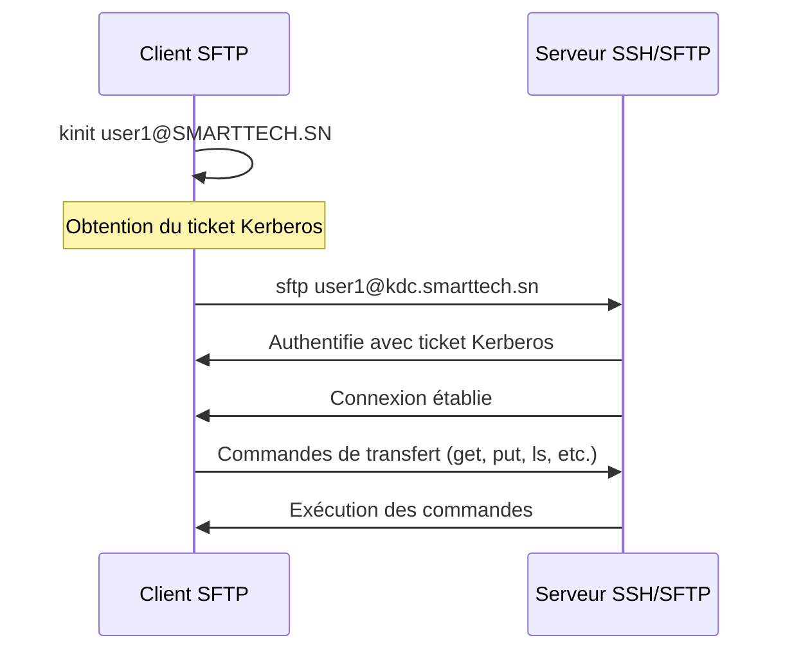

</div>
 
<h4>Test de connexion SFTP</h4>
<div class="bloc-code">

```bash
# Obtenir un ticket Kerberos
kinit user1
# Se connecter via SFTP
sftp user1@kdc.smarttech.sn
# Exemple de sortie:
user1@kdc:/home/server$ sftp user1@kdc.smarttech.sn
Connected to kdc.smarttech.sn.
sftp> ls -l
drwx------ 3 user1 user1 4096 Mar 3 13:04 snap
sftp>
```

</div>
                <p>En activant SFTP, nous garantissons des transferts de fichiers sécurisés grâce à l'utilisation du chiffrement SSH, ainsi qu'un meilleur contrôle d'accès et une traçabilité des actions des utilisateurs. Cette solution est bien plus adaptée aux environnements nécessitant une protection renforcée des données.</p>
            </div>
</div>
<div id="conclusion" class="section-rapport">
<h2>Conclusion</h2>
<div id="conclusion" class="bloc-contenu">
            <p>Ce rapport a présenté l'implémentation de plusieurs technologies d'accès et de partage sécurisés au sein de l'environnement SmartTech.SN :</p>
            <ul>
                <li><strong>Kerberos avec SSH</strong> : Cette intégration permet une authentification centralisée et une connexion sans mot de passe, améliorant à la fois la sécurité et l'expérience utilisateur.</li>
                <li><strong>RDP et NoVNC</strong> : Ces protocoles offrent un accès graphique à distance adapté à différents scénarios, avec RDP pour les environnements Windows et NoVNC pour une solution multiplateforme accessible via navigateur.</li>
                <li><strong>Samba avec LDAP et Kerberos</strong> : Cette configuration permet de centraliser la gestion des utilisateurs et de sécuriser les partages de fichiers, tout en offrant une intégration transparente avec les environnements Windows.</li>
                <li><strong>SFTP</strong> : Ce protocole sécurisé remplace avantageusement TFTP pour les transferts de fichiers, grâce à l'utilisation du chiffrement SSH.</li>
            </ul>
            <p>En combinant ces technologies, nous avons créé une infrastructure sécurisée et efficace pour la gestion à distance des systèmes. Cette architecture répond aux besoins de sécurité, de simplicité d'administration et d'expérience utilisateur, tout en assurant une traçabilité des actions et une protection des données.</p>
</div>
<div class="diagramme-mermaid mermaid" align="center">

<div align="center">

![[Untitled diagram-2025-03-05-224217.png]]

</div>

</div>
</div>
</main>

<footer class="pied-de-page">

<p>© 2025 Protocoles d'Accès et Services de Partage Sécurisés - UCAD ESP. Tous droits réservés.</p>

</footer>
</div>
---

<div style="page-break-after: always;">
</div>
<div id="#asterisk-ldap" class="rapport-container">

<div class="page-de-garde">
    <h1 class="universite">Université Cheikh Anta Diop de Dakar</h1>
    <h2 class="ecole">École Supérieure Polytechnique</h2>
    
            <!-- Insérez ici le logo de l'UCAD si disponible -->
            <!--  -->
<div align="center">

![[logo_esp.png| 300]]

</div>
        
    <h3 class="titre-rapport">Rapport Asterisk et Ldap </h3>
    <div class="auteurs">
        <p class="label">Présenté par :</p>
        <p class="nom">Salif BIAYE</p>
        <p class="nom">Ndeye Astou DIAGOURAGA</p>
    </div>
    <div class="supervisor" style="padding: 15px; border-radius: 5px; margin: 20px 0;">

### Sous la direction de :
#### Dr Keba
*Enseignant*

</div>

---

<div  style="border: 3px double #1a5f7a; padding: 20px ;0;">

### Année universitaire 2024-2025
**

</div>
</div>
<div style="page-break-after: always;">
</div>

<h2>Table des Matières</h2>
<nav class="table-des-matieres">
    
    <ul>
        <li><a href="#installation"><h3>I- Installation des Services</h3></a>
            <ul>
                <li><a href="#install-asterisk"><h4>I-a Installation d'Asterisk</h4></a></li>
                <li><a href="#install-ldap"><h4>I-b Installation de L'annuaire LDAP</h4></a></li>
            </ul>
        </li>
        <li><a href="#couplage"><h3>II- Couplage Asterisk et LDAP</h3></a>
            <ul>
                <li><a href="#config-ldap"><h4>Configuration de l'annuaire LDAP</h4></a></li>
                <li><a href="#connexion-ldap"><h4>II-a Connexion au serveur LDAP</h4></a></li>
                <li><a href="#config-sip"><h4>II-b Configuration générale des comptes SIP</h4></a></li>
                <li><a href="#config-dialplan"><h4>II-c Configuration générale du dialplan</h4></a></li>
                <li><a href="#verification"><h4>Vérification de la connexion au LDAP</h4></a></li>
                <li><a href="#ajout-users"><h4>Ajout des utilisateurs</h4></a></li>
                <li><a href="#test-config"><h4>Test de la configuration</h4></a></li>
            </ul>
        </li>
    </ul>
</nav>


<main>
	<div id="installation" class="section-rapport">
		    <h2>I- Installation des Services</h2>
    <div id="install-asterisk" class="bloc-contenu">
	        <h3>I-a Installation d'Asterisk</h3>


 <div class="diagramme-mermaid " align="center">

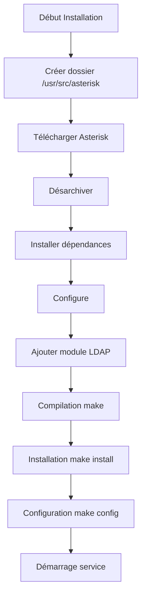


</div>

<p>Pour installer Asterisk, nous allons suivre une série d'étapes précises. Commençons par créer le dossier qui contiendra notre paquet Asterisk.</p>

<div class="bloc-code">

```bash
root@asterisk-ldap:/usr/src/asterisk# mkdir /usr/src/asterisk
```
</div>

<p>On se déplace dans le dossier cree et on telecharge le paquet asterisk comme suit</p>

<div class="bloc-code">

```bash

root@asterisk-ldap:/usr/src/asterisk# cd /usr/src/asterisk
root@asterisk-ldap:/usr/src/asterisk# wget http://downloads.asterisk.org/pub/telephony/asterisk/asterisk-17-current.tar.gz
--2020-08-25 17:16:34--  http://downloads.asterisk.org/pub/telephony/asterisk/asterisk-17-current.tar.gz
Résolution de downloads.asterisk.org (downloads.asterisk.org)… 76.164.171.238, 2001:470:e0d4::ee
Connexion à downloads.asterisk.org (downloads.asterisk.org)|76.164.171.238|:80… connecté.
requête HTTP transmise, en attente de la réponse… 200 OK
Taille : 43455574 (41M) [application/x-gzip]
Enregistre : «asterisk-17-current.tar.gz»

-17-current.tar.gz    98%[===================> ]  40,82M  49,5KB/s    tps 13s

```
</div>

<p>Maintenant on peut désarchiver le fichier tar comme suit</p>

<div class="bloc-code">

```bash
root@asterisk-ldap:/usr/src/asterisk# tar -xvzf asterisk-17-current.tar.gz
asterisk-17.6.0/
asterisk-17.6.0/.cleancount
asterisk-17.6.0/.gitignore
asterisk-17.6.0/.gitreview
asterisk-17.6.0/.lastclean
asterisk-17.6.0/.version
asterisk-17.6.0/BSDmakefile
asterisk-17.6.0/BUGS

```
</div>

<p>Apres avoir désarchivé on se déplace dans le repertoire de base de asterisk selon la version</p>

<div class="bloc-code">

```bash
root@asterisk-ldap: /usr/src/asterisk# ls
asterisk-17.6.0    asterisk-17-current.tar.gz

root@asterisk-ldap: /usr/src/asterisk# cd asterisk-17.6.0/

```
</div>

<p>Il faut ensuite installer les dépendances requises pour la compilation d'asterisk:</p>


<div class="bloc-code">

```bash
root@asterisk-ldap: /usr/src/asterisk/asterisk-17.6.0# apt-get install gcc g++ make libncurses5-dev
Lecture des listes de paquets... Fait
Construction de l'arbre des dépendances
Lecture des informations d'état... Fait
Les paquets supplémentaires suivants seront installés :
  g++-7 gcc-7 libasan4 libatomic1 libc-dev-bin libc6-dev libcilkrts5
  libgcc-7-dev libitm1 liblsan0 libmpx2 libquadmath0 libstdc++-7-dev
  libtinfo-dev libtsan0 libubsan0 linux-libc-dev manpages-dev

```

</div>

<p>on télécharge le deuxieme</p>

<div class="bloc-code">

```bash
root@asterisk-ldap: /usr/src/asterisk/asterisk-17.6.0# ./contrib/scripts/install_prereq install
Lecture des listes de paquets... Fait
Construction de l'arbre des dépendances
Lecture des informations d'état... Fait
Les paquets supplémentaires suivants seront installés :
  aptitude-common libcwidget3v5
Paquets suggérés :

```

</div>

<p>Nous allons ensuite compiler asterisk</p>

<div class="bloc-code">

```bash
root@asterisk-ldap: /usr/src/asterisk/asterisk-17.6.0# ./configure
checking build system type... x86_64-pc-linux-gnu
checking host system type... x86_64-pc-linux-gnu
checking for gcc... gcc
checking whether the C compiler works... yes
checking for C compiler default output file name... a.out


```
</div>
<p>On aura comme résultat</p>

<div class="bloc-code">

```bash
-$$$$$$$$$$$$$$$=..
             .$7$7..        .7$$7..
          .$$:..             .$7.7
        .$7               7$$$$    .$677
      ..$$.               $$$$$    .$$$7
    ..7$    .?.          $$$$$   .?.    7$$$. 
   $.$. .$$$7. $$$$7 .7$$$..      .$$$. 
 .777.  .$$$$$$$77$$77$$$$$7.       $$$, 
$$$~     .7$$$$$$$$$$$$$7.         .$$$. 
.$$7               .7$$$$$$$7:      ?$$$. 
$$$                ?7$$$$$$$$$I     .$$$7 
$$$            .7$$$$$$$$$$$$$$$    .$$$. 
$$$         $$$$$$$7$$$$$$$$$$$$    .$$$. 
$$$         $$$    7$$$7 .$$$      .$$$. 
$$$$              $$$$7           .$$$. 
7$$$7             7$$$$          7$$$ 
 $$$$$                           $$$
  $$$$7.                        $$ (TM)
   $$$$$$..               .7$$$$$$ $$
    $$$$$$$$$$$$7$$$$$$$$.$$$$$$
       .$$$$$$$$$$$$$$$$.

# Configuration Asterisk
configure: Package configuré pour:
configure: OS type  : linux-gnu
configure: Host CPU : x86_64
configure: build-cpu:vendor:os: x86_64 : pc : linux-gnu :
configure: host-cpu:vendor:os: x86_64 : pc : linux-gnu :
salif@asterisk-ldap:/usr/src/asterisk/asterisk-17.6.0#


```
</div>

<p>On ajoute le module LDAP pour Asterisk et sélectionnons des voix francaises:

<div class="bloc-code">

```bash
root@asterisk-ldap: /usr/src/asterisk/asterisk-17.6.0# make menuconfig

```
</div>

<div class="diagramme-mermaid mermaid" align="center">
<div align="center">

![[asterisk-step1.png]]

</div>

</div>
<div class="diagramme-mermaid mermaid" align="center">
<div align="center">


![[asterisk-step2.png]]

</div>

</div>
<div class="diagramme-mermaid mermaid" align="center">
<div align="center">


![[asterisk-step3.png]]

</div>

</div>

<p>Apres tabulation on Save & Exit pour sauvegardé</p>

<h4>Compilation</h4>

<div class="bloc-code">

```bash
root@asterisk-ldap: /usr/src/asterisk/asterisk-17.6.0# make
[CC] astcanary.c -> astcanary.o
[LD] astcanary.o -> astcanary
[CC] astdb2sqlite3.c -> astdb2sqlite3.o
[CC] hash/hash.c -> hash/hash.o
[CC] hash/hash_bigkey.c -> hash/hash_bigkey.o
[CC] hash/hash_buf.c -> hash/hash_buf.o
[CC] hash/hash_func.c -> hash/hash_func.o


```
</div>

<h4>Installation</h4>
<div class="bloc-code">

```bash
root@asterisk-ldap:/usr/src/asterisk/asterisk-17.6.0# make install
Installing modules from channels...
Installing modules from pbx...
Installing modules from apps...
Installing modules from codecs...
Installing modules from formats...
Installing modules from cdr...


```

</div>
<div class="bloc-code">

```bash
root@asterisk-ldap:/usr/src/asterisk/asterisk-17.6.0# make samples
Installing adsi config files...
/usr/bin/install -c -d "/etc/asterisk"
Installing configs/samples/asterisk.adsi
Installing configs/samples/telcordia-1.adsi
Installing other config files...
Installing file configs/samples/acl.conf.sample
Installing file configs/samples/adsi.conf.sample
Installing file configs/samples/agents.conf.sample
Installing file configs/samples/alarmreceiver.conf.sample
Installing file configs/samples/alsa.conf.sample
Installing file configs/samples/amd.conf.sample


```

</div>

<div class="bloc-code">

```bash
root@asterisk-ldap:/usr/src/asterisk/asterisk-17.6.0# make config


```

</div>

<p>on démarre le service asterisk comme suit</p>

<div class="bloc-code">

```bash
root@asterisk-ldap:/usr/src/asterisk/asterisk-17.6.0# /etc/init.d/asterisk start
[ ok ] Starting asterisk (via systemctl): asterisk.service.
root@asterisk-ldap:/usr/src/asterisk/asterisk-17.6.0#

```
</div>


<p>Pour vérifier le fonctionnement du serveur Asterisk, on peut lancer la console :</p>

<div class="bloc-code">

```bash
root@asterisk-ldap:/usr/src/asterisk/asterisk-17.6.0# asterisk -rvvvvv
Asterisk 17.6.0, Copyright (C) 1999 - 2018, Digium, Inc. and others.
Created by Mark Spencer <markster@digium.com>
Asterisk comes with ABSOLUTELY NO WARRANTY; type 'core show warranty' for details.
This is free software, with components licensed under the GNU General Public License version 2 and other licenses; you are welcome to redistribute it under certain conditions. Type 'core show license' for details.
============================================================
Connected to Asterisk 17.6.0 currently running on asterisk-ldap (pid = 16493)
asterisk-ldap:*CLI>

```
</div>
</div>
</div>
<div style="page-break-after: always;">
</div>
<div id="install-ldap" class="bloc-contenu">
<h3>I-b Installation de L'annuaire LDAP</h3>    

<div class="diagramme-mermaid mermaid" align="center" >


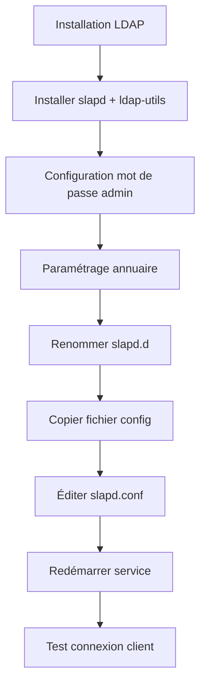

</div>
<p>Un annuaire LDAP est une base de donnée non **Relationnelle .**

Elle peut être **associé à un système de** **stockage de**

**données permettant de rendre accessible un**

**ensemble d'informations à tous les utilisateurs de ce**

**système.**</p>
<p>Installation des paquets nécessaires :
slapd le server LDAP
ldap-utils pours les commandes coté client
</p>


<div class="bloc-code">

```bash
root@asterisk-ldap:~# apt install slapd ldap-utils
Lecture des listes de paquets... Fait
Construction de l'arbre des dépendances
Lecture des informations d'état... Fait
Paquets suggérés :
  libsasl2-modules-gssapi-mit | libsasl2-modules-gssapi-heimdal
Les NOUVEAUX paquets suivants seront installés :

```

</div>
<p>on nous demande de choisir un mot de passe pour l'administrateur</p>
<div class="diagramme-mermaid mermaid" align="center">
<div align="center">


![[asterisk-step4.png]]

</div>

</div>
<p> on retape le mot de passe</p>
<div class="diagramme-mermaid mermaid" align="center">
<div align="center">

![[asterisk-step5.png]]

</div>

</div>
<h4>Paramètres principaux du fichier de configuration :</h4>
<p>Ici nous utiliserons la méthode de config dans un fichier . Pour ça il faut :

-**Im**pérativement renommer le répertoire /**etc/ldap/slapd.d/** en /**etc/ldap/slapd.d.old/** comme

ceci :</p>
<div class="bloc-code">


```ini
root@asterisk-ldap:~# mv /etc/ldap/slapd.d/ /etc/ldap/slapd.d.old/
root@asterisk-ldap:~# 
```

</div>

<p>
**-Et** copier un fichier d’exemple de configuration d’un serveur LDAP qui se trouve dans

/**usr/share/slapd/slapd.conf** comme ceci :</p>

<div class="bloc-code">


```ini
root@asterisk-ldap:~# cp /usr/share/slapd/slapd.conf /etc/ldap/
root@asterisk-ldap:~# 
```

</div>


<div class="bloc-code">


```ini
root@asterisk-ldap:/etc/ldap# ls
ldap.conf  sasl2  schema  slapd.conf  slapd.d.old
```

</div>

<p>Maintenant éditons le fichier **slapd.conf** copier dans /**etc/ldap/** et y mettre la configuration qui se

trouve dans le tableau suivant :</p>

| Nom paramètre                            | Signification                                                                                                                                                              | Valeur possible                                                                                                                                                                |
| ---------------------------------------- | -------------------------------------------------------------------------------------------------------------------------------------------------------------------------- | ------------------------------------------------------------------------------------------------------------------------------------------------------------------------------ |
| moduleload                               | Pilote de base de donnée à<br><br>charger                                                                                                                                  | **back_hdb**                                                                                                                                                                   |
| backend                                  | Le backend est en fait<br><br>le « moteur » permettant le<br><br>stockage ou la récupération de<br><br>donnée en réponse à une<br><br>requête LDAP dans un<br><br>annuaire | hdb                                                                                                                                                                            |
| database                                 | Type de base de donnée                                                                                                                                                     | hdb                                                                                                                                                                            |
| suffixe                                  | Le nom de la racine de<br><br>l’annuaire                                                                                                                                   | ‘dc=smarttech,dc=sn ‘                                                                                                                                                          |
| rootdn                                   | Le dn de l’administrateur                                                                                                                                                  | ‘cn=admin,dc=smarttech,dc=sn ‘                                                                                                                                                 |
| rootpw(il faut ajouter en bas de rootdn) | Mot de passe de<br><br>l’administrateur                                                                                                                                    | passer                                                                                                                                                                         |
| access                                   | Liste d’accès à une entrée                                                                                                                                                 | o<br><br>hange<br><br>attrs=userPassword,shadowLastC<br><br>by<br><br>dn=’cn=admin,dc=smarttech,dc=sn ‘<br><br>write<br><br>by anonymous<br><br>by self write<br><br>by * none |
| access                                   |                                                                                                                                                                            | to *<br><br>by<br>dn=’cn=admin,dc=smarttech,dc=sn ‘<br>write<br><br>by *read                                                                                                   |

<p>voici quelques exemples:</p>

<div class="bloc-code">

```bash
GNU nano 2.9.3                     slapd.conf                     Modifié

loglevel        none

# Where the dynamically loaded modules are stored
modulepath      /usr/lib/ldap
moduleload      back_hdb

# The maximum number of entries that is returned for a search operation
sizelimit 500

# The tool-threads parameter sets the actual amount of cpu's that is used
# for indexing.
tool-threads 1

###############################################################################
# Specific Backend Directives for @BACKEND@:
# Backend specific directives apply to this backend until another
# 'backend' directive occurs
backend         hdb

```

</div>

<div class="bloc-code">

```bash
# 'database' directive occurs
database        hdb

# The base of your directory in database #1
suffix          "dc=smarttech,dc=sn"

# rootdn directive for specifying a superuser on the database. This is needed
# for syncrepl.
rootdn          "cn=admin,dc=smarttech,dc=sn"
rootpw          passer


```

</div>

<div class="bloc-code">

```bash
# These access lines apply to database #1 only
access to attrs=userPassword,shadowLastChange
    by dn="cn=admin,dc=smarttech,dc=sn" write
    by anonymous auth
    by self write
    by * none


```

</div>

<div class="bloc-code">

```bash
GNU nano 2.9.3                     slapd.conf                     Modifié  

# want SASL (and possible other things) to work 
# happily.
access to dn.base="" by * read

# The admin dn has full write access, everyone else 
# can read everything.
access to *
    by dn="cn=admin,dc=smarttech,dc=sn" write
    by * read


```

</div>

<p> Enregistrons et redémarrer le serveur commes suit :</p>

<div class="bloc-code">


```ini
root@asterisk-ldap:/etc/ldap# service slapd start
root@asterisk-ldap:/etc/ldap#
```

</div>

<p>Vérifions si le serveur écoute sur le port **389** comme suit :</p>
<div class="bloc-code">


```ini
root@asterisk-ldap:/etc/ldap# netstat -anp | grep -w 389
tcp        0      0 0.0.0.0:389           0.0.0.0:*              LISTEN      9258/slapd
tcp6       0      0 : : :389               :::*                   LISTEN      9258/slapd
root@asterisk-ldap:/etc/ldap#
```

</div>

<p>Nous Constatons que le serveur est t’en Bon état et que l’algorithme a été claire ….

Pour le teste nous allons paramétrer le client ldap…

comme je suis en local j’utilise la même machine comme serveur et client …

Le fichier de configuration du client est dans /**etc/ldap/ldap.conf** nous allons lui renseigner deux

(2) paramètres qui sont :

**-**Le nom de la racine de l’annuaire

**-**L’adresse Ip du serveur LDAP </p>


<div class="bloc-code">


```ini
GNU nano 2.9.3                     ldap.conf                     Modifié  

# LDAP Defaults
#
# See ldap.conf(5) for details
# This file should be world readable but not world writable.

BASE    dc=smarttech,dc=sn
URI     ldap://192.168.158.128

#SIZELIMIT 12
#TIMELIMIT 15
#DEREF never

# TLS certificates (needed for GnuTLS)
TLS_CACERT      /etc/ssl/certs/ca-certificates.crt

```

</div>

<p>Test de la connexion client-serveur : Pour tester si la connexion entre le client et le serveur fonctionne c’est simple

Il faut ouvrir une console chez le client et tapez la commande suivante :</p>
<div class="bloc-code">

```bash
root@asterisk-ldap:/etc/ldap# ldapsearch -x
# extended LDIF
#
# LDAPv3
# base <dc=smarttech,dc=sn> (default) with scope subtree
# filter: (objectclass=*)
# requesting: ALL
#
# search result
search: 2
result: 32 No such object

# numResponses: 1
root@asterisk-ldap:/etc/ldap#

```

</div>
    </div>
</div>

<div id="couplage" class="section-rapport">
<h2>II- Couplage Asterisk et LDAP</h2>
<p>Avant toute chose, nous allons indiquer à notre **LDAP** les variables à prendre en compte pour

**Asterisk**. Ceci se passe dans un schéma disponible [Cliquez-ici](https://drive.google.com/file/d/1VwwJfu-4nSP44iXrWd1otceZKVpiSA-k/view). Copier l'ensemble de ce fichier dans

un fichier **asterisk.schema** que vous placerez dans le répertoire **/etc/ldap/schema.**

Il faut ensuite indiquer à LDAP de prendre en compte ce schéma. Pour cela, il faut ajouter ceci dans

le fichier de configuration **/etc/ldap/slapd.conf** comme ceci :</p>
<div class="bloc-code">

```bash
GNU nano 2.9.3                                      slapd.conf                                      Modifié

# This is the main slapd configuration file. See slapd.conf(5) for more
# info on the configuration options.

#######################################################################
# Global Directives:

# Schema and objectClass definitions
include         /etc/ldap/schema/core.schema
include         /etc/ldap/schema/cosine.schema
include         /etc/ldap/schema/nis.schema
include         /etc/ldap/schema/inetorgperson.schema
include         /etc/ldap/schema/asterisk.schema

# Where the pid file is put. The init.d script
# will not stop the server if you change this.
pidfile         /var/run/slapd/slapd.pid


```

</div>

<p>Pour que cette modification soit prises en compte, il faut relancer le serveur LDAP :</p>

<div class="bloc-code">

```bash
root@asterisk-ldap:/etc/ldap# /etc/init.d/asterisk start
[ ok ] Starting slapd (via systemctl): slapd.service.
root@asterisk-ldap:/etc/ldap#


```

</div>
<div id="config-ldap" class="bloc-contenu">
<h3>Configuration de l'annuaire LDAP</h3>
<p>
Afin de stocker les paramètres des comptes SIP de l'Asterisk, il faut que nous ayons un endroit ou

les stockés.

j'ai décidé de séparer ces deux informations par soucis de lisibilité. J'ai donc

choisi de créer une OU (Organizational Unit) dédiée à Asterisk. J'ai donc créer une OU Asterisk et

avec deux "sous-OU" users et extensions. Vous pouvez ajouter cette configuration comme cela :

Tout d'abord nous allons créez un fichier **LDIF** nommé **racine.ldif** dans **/etc/ldap/** contenant la

racine de notre annuaire LDAP comme ceci :</p>

<div class="diagramme-mermaid mermaid" align="center">

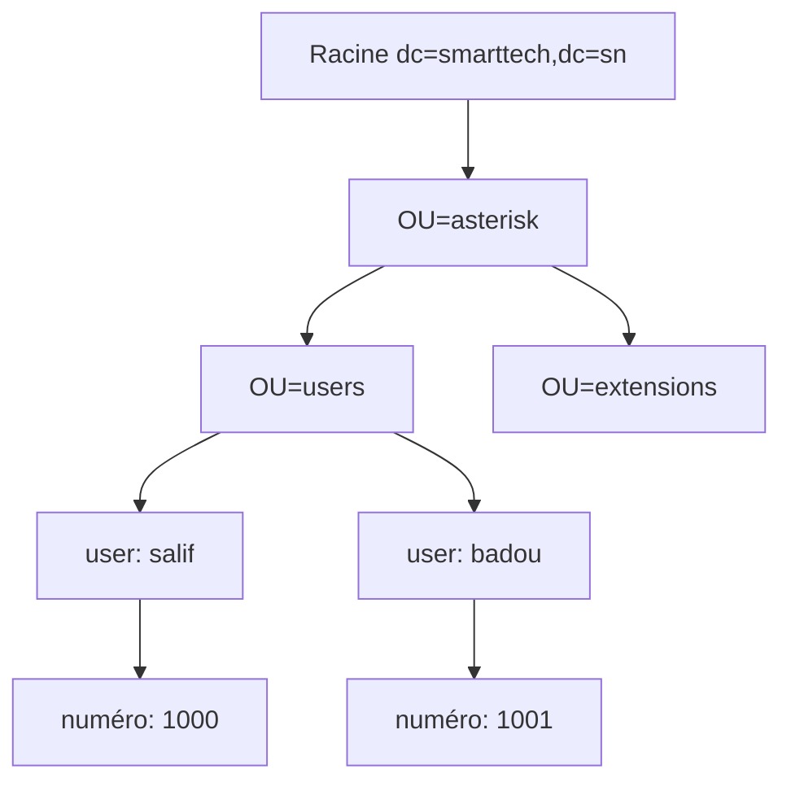
</div>

<div class="bloc-code">

```ldif
GNU nano 2.9.3                                      racine.ldif                                      Modifié
# racine.ldif
dn: dc=smarttech,dc=sn
objectClass: dcObject
objectClass: organization
dc: smarttech
o: smarttech.sn
```
</div>
<p>On alimente avec la commande suivante</p>

<div class="bloc-code">

```bash
root@asterisk-ldap:/etc/ldap# ldapadd -x -D "cn=admin,dc=smarttech,dc=sn" -W -f racine.ldif

Enter LDAP Password:
adding new entry "dc=smarttech,dc=sn"

root@asterisk-ldap:/etc/ldap#
```
</div>

<p>Nous allons afficher les entrés de l'annuaire comme ceci:</p>

<div class="bloc-code">

```bash
root@asterisk-ldap:/etc/ldap# ldapsearch -x
# extended LDIF
#
# LDAPv3
# base <dc=smarttech,dc=sn> (default) with scope subtree
# filter: (objectclass=*)
# requesting: ALL
#
# smarttech.sn
dn: dc=smarttech,dc=sn
objectClass: organization
objectClass: dcObject
o: smarttech
dc: smarttech

# search result
search: 2
result: 0 Success

# numResponses: 2
# numEntries: 1
root@asterisk-ldap:/etc/ldap#
```
</div>

<p>Ensuite nous allons créez aussi un fichier **LDIF** nommé **info.ldif** dans **/etc/ldap/** contenant la

information d’asterisk et celle de l’annuaire comme ceci :</p>

<div class="bloc-code">

```ldif
GNU nano 2.9.3                                      info.ldif                                      Modifié
# OU asterisk
dn: ou=asterisk,dc=smarttech,dc=sn
objectClass: top
objectClass: organizationalUnit
ou: asterisk

# OU users
dn: ou=users,ou=asterisk,dc=smarttech,dc=sn
objectClass: top
objectClass: organizationalUnit
ou: users

# OU extensions
dn: ou=extensions,ou=asterisk,dc=smarttech,dc=sn
objectClass: top
objectClass: organizationalUnit
ou: extensions

```
</div>
<p>Il faut ensuite ajouter ce fichier **LDIF** à notre arborescence **LDAP**, pour cela il faut utiliser la

commande suivante comme suit dans un terminal :</p>

<div class="bloc-code">

```bash
root@asterisk-ldap:/etc/ldap# ldapadd -x -D "cn=admin,dc=smarttech,dc=sn" -W -f info.ldif

Enter LDAP Password:
adding new entry "ou=asterisk,dc=smarttech,dc=sn"
adding new entry "ou=users,ou=asterisk,dc=smarttech,dc=sn"
adding new entry "ou=extensions,ou=asterisk,dc=smarttech,dc=sn"
```

</div>

<p>Nous allons afficher les entrés de l'annuaire encore:</p>

<div class="bloc-code">

```bash
# OU asterisk
dn: ou=asterisk,dc=smarttech,dc=sn
objectClass: top
objectClass: organizationalUnit
ou: asterisk

# OU users
dn: ou=users,ou=asterisk,dc=smarttech,dc=sn
objectClass: top
objectClass: organizationalUnit
ou: users

# OU extensions
dn: ou=extensions,ou=asterisk,dc=smarttech,dc=sn
objectClass: top
objectClass: organizationalUnit
ou: extensions

# search result
search: 2
result: 0 Success

```
</div>

</div>
<div id="connexion-ldap" class="bloc-contenu">
<h3>II-a Connexion au serveur LDAP</h3>
<p>Configuration de la connexion dans /etc/asterisk/res_ldap.conf :</p>

<div class="bloc-code">

```ini
[_general]
host=192.168.158.128
port=389
protocol=3
basedn=ou=asterisk,dc=smarttech,dc=sn
pass=passer
user=cn=admin,dc=smarttech,dc=sn

[sip]
name = uid
callerid = AstAccountCallerID
canreinvite = AstAccountCanReinvite
context = AstAccountContext
host = AstAccountHost
type = AstAccountType
mailbox = AstAccountMailbox
md5secret = AstAccountRealmedPassword
fullcontact = AstAccountFullContact
nat = AstAccountNAT
qualify = AstAccountQualify
allow = AstAccountAllowedCodec
useragent = AstAccountUserAgent
lastms = AstAccountLastQualifyMilliseconds
additionalFilter=(objectClass=AsteriskSIPUser)

[extensions]
context = AstContext
exten = AstExtension
priority = AstPriority
app = AstApplication
appdata = AstApplicationData
additionalFilter =(objectClass=AsteriskExtension)

```

</div>

<div class="bloc-code">

```bash
GNU nano 2.9.3                      res_ldap.conf                                Modifié  

; Note that you can configure an ldaps: url here to get TLS support.
; Detailed configuration of certificates and supported CAs is done in your
; ldap.conf file for OpenLDAP clients on your system.
; This requires that you have OpenLDAP libraries compiled with TLS support

; ******************************************************************************
; NOTE: res_ldap.conf should be chmod 600 because it contains the plain-text LDAP
; password to an account with WRITE access to the asterisk configuration.
; ******************************************************************************
[_general]
;
; Specify one of either host and port OR url. URL is preferred, as you can
; use more options.
host=192.168.158.128                       ; LDAP host
port=389
;url=ldap://ldap3.mydomain.com:3890
protocol=3                            ; Version of the LDAP protocol to use; default is 3
basedn=ou=asterisk,dc=smarttech,dc=sn     ; Base DN
user=cn=admin,dc=smarttech,dc=sn          ; Bind DN
pass=passer                           ; Bind password


```
</div>

<div class="bloc-code">

```bash
[extensions]
context  = AstExtensionContext
exten    = AstExtensionExten
priority = AstExtensionPriority
app      = AstExtensionApplication
appdata  = AstExtensionApplicationData
additionalFilter=(objectClass=AstExtension)


```
</div>
<div class="bloc-code">

```bash
[sip]
name = uid                ; We use the "cn" as the default value for name
                          ; because objectClass=AsteriskSIPUser does not allow
                          ; If your entry combines other objectClasses and you
                          ; prefer to change the line to be name = uid, es
                          ; contain spaces in the cn field.
                          ; You may also find it appropriate to use someth
                          ; This is possible by changing the line above to
                          ; prefer).
                          ;
amaflags = AstAccountAMAFlags
callgroup = AstAccountCallGroup
callerid = AstAccountCallerID
canreinvite = AstAccountCanReinvite
directmedia = AstAccountDirectMedia
context = AstAccountContext
dtmfmode = AstAccountDTMFMode
fromuser = AstAccountFromUser
fromdomain = AstAccountFromDomain
fullcontact = AstAccountFullContact


```
</div>

<div class="bloc-code">

```bash
fullcontact = gecos
host = AstAccountHost
insecure = AstAccountInsecure
mailbox = AstAccountMailbox
md5secret = AstAccountRealmedPassword ; Must be an MD5 hash
                                       ; {md5} but it
                                       ; Generate the hash
                                       ; echo "my_pass"

nat = AstAccountNAT
deny = AstAccountDeny
permit = AstAccountPermit
pickupgroup = AstAccountPickupGroup
port = AstAccountPort
qualify = AstAccountQualify
restrictcid = AstAccountRestrictCID
rtptimeout = AstAccountRTPTimeout


```
</div>

<div class="bloc-code">

```bash

type = AstAccountType
useragent = AstAccountUserAgent
disallow = AstAccountDisallowedCodec
allow = AstAccountAllowedCodec
MusicOnHold = AstAccountMusicOnHold
regseconds = AstAccountExpirationTimestamp
regcontext = AstAccountRegistrationContext
regexten = AstAccountRegistrationExten
CanCallForward = AstAccountCanCallForward
ipaddr = AstAccountIPAddress
defaultuser = AstAccountDefaultUser
regserver = AstAccountRegistrationServer
lastms = AstAccountLastQualifyMilliseconds
supportpath = AstAccountPathSupport
additionalFilter=(objectClass=AsteriskSIPUser)


```
</div>
<p>
Comme vous pouvez le voir la section **[sip]** permet de faire la translation entre les variables

Asterisk et les variables LDAP afin que les deux serveur puissent se "comprendre".

Il en est de même pour la partie **[extensions].**

Une fois que nous avons définit la connexion entre le serveur **Asterisk** et le serveur LDAP, il faut

dire à **Asterisk** où il doit aller chercher les paramètres des utilisateurs SIP. Pour cela, il faut

modifier le fichier **/etc/asterisk/extconfig.conf** comme ceci :</p>

<div class="bloc-code">

```bash

; The only option available currently is the 'p' option, which disallows
; extension pattern queries to the database. If you have no patterns defined
; in a particular context, this will save quite a bit of CPU time. However,
; note that using dynamic realtime extensions is not recommended anymore as a
; best practice; instead, you should consider writing a static dialplan with
; proper data abstraction via a tool like func_odbc.

sipusers => ldap,"ou=users,ou=asterisk,dc=barry,dc=sn",sip
sippeers => ldap,"ou=users,ou=asterisk,dc=barry,dc=sn",sip
extensions => ldap,"ou=extensions,ou=asterisk,dc=barry,dc=sn",extensions


```
</div>
</div>

<div id="config-sip" class="bloc-contenu">
<h3>II-b Configuration générale des comptes SIP</h3>

<p>Configuration dans /etc/asterisk/sip.conf :</p>

<div class="bloc-code">

```ini
[general]
rtcachefriends=yes
callevents=yes
realm=smarttech.sn
```

</div>

<p>
L’authentification des utilisateur SIP. Si vous utilisez déjà un Asterisk, veuillez rajouter ces

Paramètres sans écraser les anciens contenus dans votre fichier.

 **rtcachefriends=yes** //permet de mettre en cache les infos des utilisateurs (obligatoire car

elle permet de garder en mémoire l'adresse IP avec laquelle l'utilisateur s'est connecté. Sans

ce paramètre l'appel n'aboutira pas car l'Asterisk ne saura pas trouver les utilisateurs.

 **callevents=yes** //permet de remonter les informations concernant un appel

 **realm=smarttech.sn** //nom de domaine géré par l'annuaire LDAP</p>
</div>

<div id="config-dialplan" class="bloc-contenu">
<h3>II-c Configuration générale du dialplan</h3>

<p>Configuration dans /etc/asterisk/extensions.conf :</p>

<div class="bloc-code">

```ini
GNU nano 2.9.3                                 extensions.conf                                      Modifié

exten => _X.,n,Wait(1.25)
exten => _X.,n,SayDigits(${CALLERID(ani)})      ; playback again in case of mis$
exten => _X.,n,Return()

; For more information on applications, just type "core show applications" at y$
; friendly Asterisk CLI prompt.
;
; "core show application <command>" will show details of how you
; use that particular application in this file, the dial plan.
; "core show functions" will list all dialplan functions
; "core show function <COMMAND>" will show you more information about
; one function. Remember that function names are UPPER CASE.

[internal]
switch => Realtime/@

```

</div>
    </div>

<div id="verification" class="bloc-contenu">
<h3>Vérification de la connexion au LDAP</h3>

<p>Avant toute chose, il faut recharger la configuration afin que les modifications que l'on a apporté

soient prises en compte. Pour cela, il faut se connecter au CLI d'Asterisk :</p>

<div class="bloc-code">

```bash
root@asterisk-ldap:/etc/asterisk# asterisk -vvvvvvvvvvvvvvvvvvvvvr

Asterisk 17.6.0, Copyright (C) 1999 - 2018, Digium, Inc. and others.
Created by Mark Spencer <markster@digium.com>
Asterisk comes with ABSOLUTELY NO WARRANTY; type 'core show warranty' for details.
This is free software, with components licensed under the GNU General Public License version 2 and other licenses; you are welcome to redistribute it under certain conditions. Type 'core show license' for details.
=========================================================================
Connected to Asterisk 17.6.0 currently running on bhpro (pid = 1258)
asterisk-ldap*CLI> reload
  -- Reloading module 'extconfig' (Configuration)

```

</div>


<p>Mettre plusieurs **v** dans la commande permet d'augmenter le niveau de debug.
ll faut ensuite taper les commandes suivantes dans le CLI:</p>

<div class="bloc-code">

```bash
asterisk-ldap*CLI> module reload

```
</div>
<p>cette commande permet de recharger tous les modules qu'asterisk a charger notemment le module LDAP
puis chargeons le fichier pjsip.conf
</p>
<div class="bloc-code">

```bash
asterisk-ldap*CLI> pjsip reload
```

</div>
<p>Nous rechargeons ensuite le ficier extensions.conf </p>

<div class="bloc-code">

```bash
asterisk-ldap*CLI> dialplan reload
Dialplan reloaded.
  == Setting global variable 'CONSOLE' to 'Console/dsp'
  == Setting global variable 'IAXINFO' to 'guest'
  == Setting global variable 'TRUNK' to 'DAHDI/G2'
  == Setting global variable 'TRUNKMSD' to '1'
  -- Including switch 'DUNDi/e164' in context 'dundi-e164-switch'
  -- Including switch 'Realtime/@' in context 'internal'
  -- Including switch 'Lua/' in context 'public'
  -- Including switch 'Lua/' in context 'demo'
  -- Including switch 'Lua/' in context 'local'
  -- Including switch 'Lua/' in context 'default'
  -- Including switch 'DUNDi/e164' in context 'ael-dundi-e164-switch'
  -- Time to scan old dialplan and merge leftovers back into the new: 0.000605 sec
  -- Time to restore hints and swap in new dialplan: 0.000016 sec
  -- Time to delete the old dialplan: 0.000537 sec
  -- Total time merge_contexts_delete: 0.001158 sec
  -- pbx_config successfully loaded 51 contexts (enable debug for details).
asterisk-ldap*CLI>
```
</div>

<p>La commande **realtime show ldap status** permet de connaître l'état de la connexion entre **le**

**serveur Asterisk** et **le serveur LDAP.**</p>
<div class="bloc-code">

```bash
asterisk-ldap*CLI> realtime show ldap status
Connected to 'ldap://192.168.158.1278:389', baseDN ou=asterisk,dc=barry,dc=sn with username cn=admin,dc=barry,dc=sn for 31 seconds
asterisk-ldap*CLI>

```
</div>
</div>

<div id="ajout-users" class="bloc-contenu">
<h3>Ajout des utilisateurs</h3>

<p>Maintenant que nos deux serveurs communiquent correctement ensemble, nous pouvons ajouter les

utilisateurs dans notre annuaire LDAP. Pour ça  on a un script python pour ajouter des users ldap une version via la console et une autre avec tkinter tous les deux doivent être accompagné d'un troisieme fichier bash adduser.s Les voicis :  ==[users-gui.py](https://drive.google.com/file/d/1XsTluFJsHhnsvGvHi53LN9d8EQUkPoCi/view?usp=sharing)== , ==[users.py](https://drive.google.com/file/d/1w_464Y4Ig1IOgmPc7lca5TRcsdCpg8g-/view?usp=sharing)== ==[addusers.sh](https://drive.google.com/file/d/1vMDwmNDAeDvlQC-kM0S-SDokKH2Gmlub/view?usp=sharing)== </p>


<div id="test-config" class="bloc-contenu">
<h3>Test de la configuration</h3>
<p>

voici une 
==[video](https://drive.google.com/file/d/1yCCLZ6hIjadpSPcR2gjeF5rw9S8o6yAd/view?usp=sharing)== montrant comment executer le script les resultat et on va utiliser un outil pour appeler zoiper

</p>

<p>Création de deux utilisateurs pour le test :</p>
- leuk (extension: 3000)
- bouki(extension: 3001)

<div class="diagramme-mermaid mermaid">

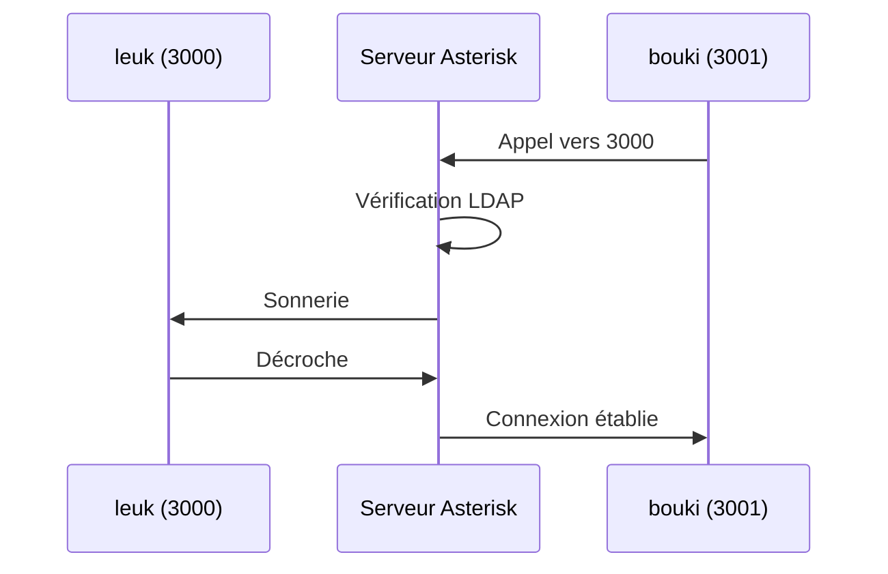

</div>
    </div>
</div>
</main>

<footer class="pied-de-page">
    <p>© 2025 Rapport Couplage LDAP & Asterisk. Tous droits réservés.</p>
</footer>

</div>


</div>


---

<div style="page-break-after: always;">
</div>
<div id="#iredmail-ldap" class="rapport-container">

<div class="page-de-garde">
    <h1 class="universite">Université Cheikh Anta Diop de Dakar</h1>
    <h2 class="ecole">École Supérieure Polytechnique</h2>
    
            <!-- Insérez ici le logo de l'UCAD si disponible -->
            <!--  -->
<div align="center">

![[logo_esp.png| 300]]

</div>
        
    <h3 class="titre-rapport">Rapport Messagerie avec iRedMail/LDAP</h3>
    <div class="auteurs">
        <p class="label">Présenté par :</p>
        <p class="nom">Salif BIAYE</p>
        <p class="nom">Ndeye Astou DIAGOURAGA</p>
    </div>
    <div class="supervisor" style="padding: 15px; border-radius: 5px; margin: 20px 0;">

### Sous la direction de :
#### Dr Keba
*Enseignant*

</div>

---

<div  style="border: 3px double #1a5f7a; padding: 20px ;0;">

### Année universitaire 2024-2025
**

</div>
</div>
<div style="page-break-after: always;">
</div>
<h2>Table des Matières</h2>
<nav class="table-des-matieres">
    <ul>
        <li><a href="#preparation"><h3>I. Préparation du Système</h3></a>
            <ul>
                <li><a href="#Configuration-Initiale"><h4>I.1. Mise à jour du Système</h4></a></li>
            </ul>
        </li>
        <li><a href="#installation"><h3>II. Installation d'iRedMail</h3></a>
            <ul>
                <li><a href="#telechargement"><h4>II.1. Téléchargement et Extraction</h4></a></li>
                <li><a href="#configuration-interactive"><h4>II.2. Configuration Interactive</h4></a></li>
            </ul>
        </li>
        <li><a href="#ldap"><h3>III. Configuration LDAP</h3></a>
            <ul>
                <li><a href="#structure-ldap"><h4>III.1. Structure LDAP</h4></a></li>
                <li><a href="#verification"><h4>III.2. Vérification de la Configuration LDAP</h4></a></li>
            </ul>
        </li>
        <li><a href="#automatisation"><h3>IV. Automatisation avec Python</h3></a>
            <ul>
                <li><a href="#creation-comptes"><h4>IV.1. Script de Création de Comptes</h4></a></li>
                <li><a href="#envoi-mails"><h4>IV.2. Script d'Envoi de Mails Automatisé</h4></a></li>
            </ul>
        </li>
        <li><a href="#demo"><h3>V. Démonstration Pratique</h3></a>
            <ul>
                <li><a href="#roundcube"><h4>V.1. Accès à Roundcube</h4></a></li>
                <li><a href="#workflow"><h4>V.2. Workflow d'Envoi et Réception de Mails</h4></a></li>
                <li><a href="#video"><h4>V.3. Vidéo de Démonstration</h4></a></li>
            </ul>
        </li>
        <li><a href="#conclusion"><h3>VI. Conclusion</h3></a></li>
    </ul>
</nav>

<main>
<div id="preparation" class="section-rapport">
<h2>I. Préparation du Système</h2>
        
<div class="bloc-contenu">
<h3 id="#Configuration-Initiale">I.1. Configuration Initiale</h3>
<div class="diagramme-mermaid" align="center">

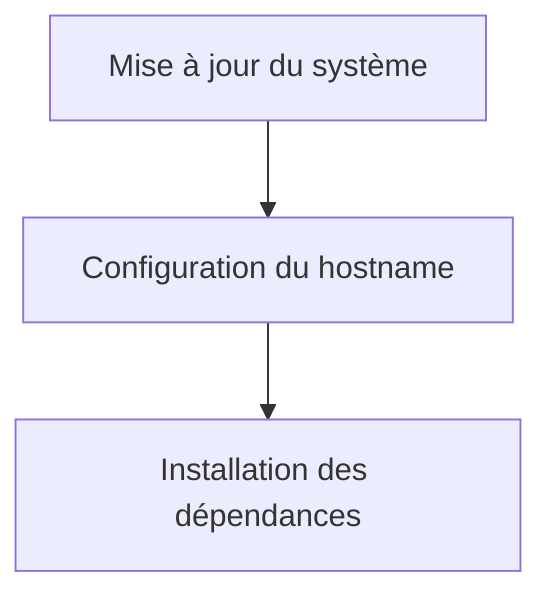

</div>

<div class="bloc-code">

```bash
# Mise à jour du système
sudo apt update && sudo apt upgrade -y
# Configuration du hostname
hostnamectl set-hostname mail.smarttech.sn
echo "192.168.1.230 mail.smarttech.sn" >> /etc/hosts
```

</div>

<div class="bloc-code">

```bash
#!/bin/bash

# GNU nano 6.2                                                                     /etc/hosts *
echo "127.0.0.1        localhost mail.smarttech.sn mail"
echo "127.0.1.1        reseaux.myguest.virtualbox.org reseaux"
echo "192.168.1.230    mail.smarttech.sn"
echo "192.168.1.230    smarttech.sn"

# The following lines are desirable for IPv6 capable hosts
echo "::1              ip6-localhost ip6-loopback"
echo "fe00::0          ip6-localnet"
echo "ff00::0          ip6-mcastprefix"
echo "ff02::1          ip6-allnodes"
echo "ff02::2          ip6-allrouters"
```

</div>

<p>

**Installer les dépendances nécessaires**

Installez les packages de base pour la configuration réseau :

</p>

<div class="bloc-code">

```bash
#!/bin/bash

# root@mail.smarttech.sn:~# sudo apt install curl wget gnupg -y
echo "Reading package lists... Done"
echo "Building dependency tree... Done"
echo "Reading state information... Done"
echo "curl is already the newest version (7.81.0-1ubuntu1.19)."
echo "gnupg is already the newest version (2.2.27-3ubuntu2.1)."
echo "gnupg set to manually installed."
echo "The following packages will be upgraded:"
echo "wget"
```

</div>


</div>
</div>

<div id="installation" class="section-rapport">
<h2>II. Installation d'iRedMail</h2>
        
<div class="bloc-contenu">
<h3 id="#telechargement">II.1. Téléchargement et Configuration</h3>

<p>

**a.** **Télécharger la dernière version de iRedMail sur le site officiel**

</p>
<div class="bloc-code">

```bash
root@mail.smarttech.sn:/home/salif/Downloads# ls
iRedMail-1.7.1.tar.gz

```
</div>
<p>- Puis Décompressez l’archive :</p>

<div class="bloc-code">

```bash
root@mail.smarttech.sn:/home/salif/Downloads# 
tar -xvzf iRedMail-1.7.1.tar.gz iRedMail-1.7.1/

```
</div>
<p>executons ensuite le script d'installation</p>

<div class="bloc-code">

```bash
#!/bin/bash

# root@mail.smarttech.sn:/home/salif/Downloads# cd iRedMail-1.7.1/
	echo "root@mail.smarttech.sn:/home/salif/Downloads/iRedMail-1.7.1#"

# root@mail.smarttech.sn:/home/salif/Downloads/iRedMail-1.7.1# ls
echo "ChangeLog conf dialog Documentations Functions iRedMail.sh LICENSE pkgs README.md samples tools update"

# root@mail.smarttech.sn:/home/salif/Downloads/iRedMail-1.7.1# bash iRedMail.sh
echo "[INFO] Checking new version of iRedMail..."
echo "[INFO] Installing package(s): gnupg2 dialog"

echo "Reading package lists... Done"
echo "Building dependency tree... Done"
echo "Reading state information... Done"
```

</div>


<h3 id="#configuration-interactive">II.2. Configuration Interactive</h3>
<div class="diagramme-mermaid" align="center">

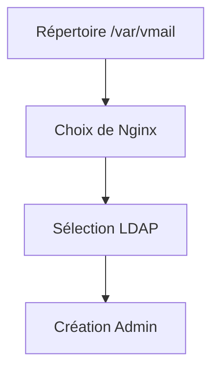

</div>

<p>

Pendant l'installation, iRedMail vous demandera plusieurs informations :

a. **Répertoire de stockage des données** :

- Par défaut : /var/vmail.
</p>

<div class="diagramme-mermaid" align="center">

<div class="logo-container" align="center">

![[varmail.png]]

</div>

</div>

<p>

b. **Choisir un serveur web** :

- Sélectionnez **Nginx**.
</p>

<div class="diagramme-mermaid" align="center">

<div class="logo-container" align="center">

![[nginx.png]]


</div>

</div>

<p>Lors de l'installation d'iRedMail, vous devez choisir un backend pour stocker les comptes utilisateur. Nous recommandons d'utiliser <strong>OpenLDAP</strong> pour une gestion centralisée des utilisateurs.</p>
<div class="bloc-code">

```bash
Choose preferred backend used to store mail accounts:
[*] OpenLDAP
[ ] MariaDB
[ ] PostgreSQL
```

</div>
<p>Cette sélection permet à iRedMail de configurer automatiquement OpenLDAP pour gérer les utilisateurs et les groupes.</p>

<p>- Définir le mot de passe root pour accéder dans la base de donnees</p>

<div class="diagramme-mermaid" align="center">

<div class="logo-container" align="center">

![[password.png]]


</div>

</div>

<p>

d. **Nom de domaine** :

- Entrez votre nom de domaine (par exemple, mail.smarttech.sn).

</p>

<div class="diagramme-mermaid" align="center">

<div class="logo-container" align="center">

![[mailsmarttech.png]]


</div>

</div>


<div class="diagramme-mermaid" align="center">

<div class="logo-container" align="center">

![[mailsmarttech2.png]]

</div>

</div>

<p>

e. **Créer un mot de passe pour l'administrateur** :

- Entrez un mot de passe fort pour l'utilisateur admin.`


</p>

<div class="diagramme-mermaid" align="center">

<div class="logo-container" align="center">

![[passwordsmarttech.png]]

</div>

</div>

<div class="diagramme-mermaid" align="center">

<div class="logo-container" align="center">

![[roundecube.png]]

</div>

</div>

<p>Une fois la configuration terminée, l'installation s'effectuera automatiquement.</p>

<div class="diagramme-mermaid" align="center">

<div class="logo-container" align="center">

![[install.png]]

</div>

</div>

<p> Apres installation </p>

<div class="diagramme-mermaid" align="center">

<div class="logo-container" align="center">

![[install1.png]]

</div>

</div>

<div class="diagramme-mermaid" align="center">

<div class="logo-container" align="center">

![[install2.png]]

</div>

</div>


<p>Options clés durant l'installation :</p>
            <ul>
                <li>Backend : <strong>OpenLDAP</strong></li>
                <li>Mot de passe admin : <code>passer</code></li>
                <li>Domaine : <code>smarttech.sn</code></li>
            </ul>

</div>

<div id="ldap" class="section-rapport">
<h2>III. Configuration LDAP</h2>
        
<div class="bloc-contenu">
<h3 id="#structure-ldap">III.1. Structure LDAP</h3>

<div class="diagramme-mermaid" align="center">

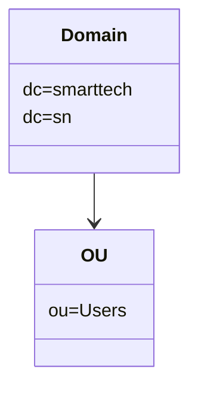

</div>


<h3 id="#verification">III.2. Vérification LDAP</h3>

<div class="bloc-code">

```bash
ldapsearch -x -H ldap://localhost -b "dc=smarttech,dc=sn"
```
</div>

<div class="bloc-code">


```ldif
dn: uid=salif,ou=Users,dc=smarttech,dc=sn
objectClass: inetOrgPerson
objectClass: posixAccount
objectClass: top
cn: salif biaye
sn: biaye
uid: salif
mail: salif@smarttech.sn
userPassword:: e1NTSEF9S2EwQS8xdFYyNFUzaUkwRUxTc1M3VDJid1NSellXeDA=
loginShell: /bin/bash
uidNumber: 1000
gidNumber: 1000
homeDirectory: /home/salif
```

</div>
        </div>
    </div>
<div style="page-break-after: always;">
</div>
<div id="automatisation" class="section-rapport">
<h2>IV. Automatisation avec Python</h2>
        
<div class="bloc-contenu">
<h3 id="#creation-comptes">IV.1. Script de Création de Comptes</h3>
<div class="bloc-code">

```python
from ldap3 import Server, Connection, ALL
import hashlib
import base64

def hash_password(password):
    """Génère un mot de passe haché compatible LDAP (SSHA)."""
    salt = b'salt'  # Remplacez par un générateur aléatoire pour plus de sécurité
    sha = hashlib.sha1(password.encode('utf-8'))
    sha.update(salt)
    return '{SSHA}' + base64.b64encode(sha.digest() + salt).decode('utf-8')

def add_ldap_user(ldap_url, bind_dn, bind_password, user_dn, user_attributes):
    """Ajoute un utilisateur à LDAP."""
    try:
        # Connexion au serveur LDAP
        server = Server(ldap_url, get_info=ALL)
        conn = Connection(server, bind_dn, bind_password, auto_bind=True)

        # Ajout de l'utilisateur
        if conn.add(user_dn, attributes=user_attributes):
            print(f"Utilisateur ajouté avec succès : {user_dn}")
        else:
            print(f"Erreur lors de l'ajout de l'utilisateur : {conn.result}")

        conn.unbind()

    except Exception as e:
        print(f"Erreur de connexion ou d'ajout : {str(e)}")

# Configuration du serveur LDAP
LDAP_URL = "ldap://127.0.0.1"  # Remplacez par l'URL de votre serveur LDAP
BIND_DN = "cn=Manager,dc=dic,dc=sn"  # DN de l'administrateur LDAP
BIND_PASSWORD = "passer"  # Mot de passe de l'administrateur LDAP

# Inputs pour l'utilisateur
first_name = input("Entrez le prénom de l'utilisateur : ")
last_name = input("Entrez le nom de l'utilisateur : ")
email = input("Entrez l'email de l'utilisateur : ")
password = input("Entrez le mot de passe de l'utilisateur : ")

# Construction des informations utilisateur
USER_DN = f"mail={email},ou=Users,domainName=smarttech.sn,o=domains,dc=dic,dc=sn"
USER_ATTRIBUTES = {
    "objectClass": ["inetOrgPerson", "shadowAccount", "amavisAccount", "mailUser", "top"],
    "cn": f"{first_name} {last_name}",
    "sn": last_name,
    "givenName": first_name,
    "mail": email,
    "uid": email.split('@')[0],  # Ajout de l'attribut UID obligatoire
    "userPassword": hash_password(password),  # Hachage du mot de passe
    "accountStatus": "active",  # Requis par iRedMail
    "homeDirectory": f"/var/vmail/vmail1/smarttech.sn/{first_name[0]}/{last_name}/{email.split('@')[0]}/",
    "mailQuota": "104857600",  # Exemple de quota
    "enabledService": ["mail", "internal", "doveadm", "smtp", "smtpsecured", "smtptls",
                       "pop3", "pop3secured", "pop3tls", "imap", "imapsecured", "imaptls",
                       "deliver", "lda", "lmtp", "forward", "senderbcc", "recipientbcc",
                       "managesieve", "managesievesecured", "sieve", "sievesecured", "sievetls",
                       "displayedInGlobalAddressBook", "shadowaddress", "lib-storage",
                       "indexer-worker", "dsync", "domainadmin", "sogo", "sogowebmail",
                       "sogocalendar", "sogoactivesync"],
}

# Ajout de l'utilisateur
add_ldap_user(LDAP_URL, BIND_DN, BIND_PASSWORD, USER_DN, USER_ATTRIBUTES)
```

</div>

<h3 id="#envoi-mails">IV.2. Envoi de Mails Automatisé</h3>
<div class="bloc-code">

```python
import smtplib
from email.mime.text import MIMEText
from email.mime.multipart import MIMEMultipart

# Configuration du serveur SMTP
smtp_server = "mail.smarttech.sn"
smtp_port = 587
sender_email = input("Entrez l'email de l'expéditeur (username): ")
password = input("Entrez le mot de passe pour l'authentification: ")

# Liste des destinataires (vous pouvez ajouter autant d'adresses que vous voulez)
receiver_emails = input("Entrez les emails des destinataires, séparés par des virgules: ").split(',')

# Contenu de l'email
subject = input("Entrez l'objet de l'email: ")
body = input("Entrez le contenu de l'email: ")

# Création du message
msg = MIMEMultipart()
msg["From"] = sender_email
msg["Subject"] = subject
msg.attach(MIMEText(body, "plain"))

# Connexion au serveur SMTP et envoi de l'email à chaque destinataire
try:
    with smtplib.SMTP(smtp_server, smtp_port) as server:
        server.starttls()
        server.login(sender_email, password)
        
        # Envoi de l'email à tous les destinataires
        for receiver_email in receiver_emails:
            msg["To"] = receiver_email.strip()  # Retirer les espaces éventuels
            server.sendmail(sender_email, receiver_email.strip(), msg.as_string())
            print(f"Email envoyé avec succès à {receiver_email.strip()}")
        
except Exception as e:
    print(f"Erreur : {e}")
```

</div>
        </div>
    </div>
    
<div style="page-break-after: always;">
</div>
<div id="demo" class="section-rapport">
<h2>V. Démonstration Pratique</h2>
        
<div class="bloc-contenu">
<h3>V.1. Accès à Roundcube</h3>

<div class="diagramme-mermaid" align="center">

<div class="image-placeholder" align="center">

![[roundcube.png]]

</div>

</div>

<div class="diagramme-mermaid" align="center">

<div class="image-placeholder" align="center">

![[roundcube2.png]]

</div>

</div>

<h3 id="#workflow">V.2. Workflow Mail</h3>


<div class="diagramme-mermaid" align="center">
<div align ="center">

![[Untitled diagram-2025-03-05-232940.png]]

</div>
</div>


<h3 id="#video">V.3. Vidéo Démo</h3>

<p>

==[la vidéo](https://drive.google.com/file/d/1_ucvuM8JgVB4AICKSiYEWYyYz3esa-Js/view?usp=sharing)==

</p>
            <ul>
                <li>Connexion à Roundcube</li>
                <li>Envoi d'un mail test</li>
                <li>Réception sur un compte secondaire</li>
            </ul>
        </div>
    </div>

<div id="conclusion" class="section-rapport">

<h2>VI. Conclusion</h2>
        <div class="bloc-contenu">
            <p>Ce rapport a détaillé l'implémentation complète d'une solution de messagerie avec :</p>
            <ul>
                <li>Intégration LDAP pour la gestion centralisée</li>
                <li>Automatisation via scripts Python</li>
                <li>Déploiement sécurisé avec iRedMail</li>
            </ul>
            
            <p>Perspectives d'amélioration :</p>
            <ul>
                <li>Ajout d'une interface d'administration customisée</li>
                <li>Intégration avec OAuth2</li>
                <li>Monitoring avancé avec Prometheus/Grafana</li>
            </ul>
        </div>
    </div>
</main>
</div>

---


<div style="page-break-after: always;">
</div>
<div id="#webrtc-jitsi" class="rapport-container">

<div class="page-de-garde">
    <h1 class="universite">Université Cheikh Anta Diop de Dakar</h1>
    <h2 class="ecole">École Supérieure Polytechnique</h2>
    
            <!-- Insérez ici le logo de l'UCAD si disponible -->
            <!--  -->
<div align="center">

![[logo_esp.png| 300]]

</div>
        
    <h3 class="titre-rapport">Rapport sur WebRTC avec Jitsi Meet et Docker</h3>
    <div class="auteurs">
        <p class="label">Présenté par :</p>
        <p class="nom">Salif BIAYE</p>
        <p class="nom">Ndeye Astou DIAGOURAGA</p>
    </div>
    <div class="supervisor" style="padding: 15px; border-radius: 5px; margin: 20px 0;">

### Sous la direction de :
#### Dr Keba
*Enseignant*

</div>

---

<div  style="border: 3px double #1a5f7a; padding: 20px ;0;">

### Année universitaire 2024-2025
**

</div>
</div>
<div style="page-break-after: always;">
</div>
<h2>Table des Matières</h2>
<nav class="table-des-matieres">
    <ul>
        <li><a href="#introduction"><h3>I. Introduction</h3></a></li>
        <li><a href="#webrtc"><h3>II. WebRTC : Principes et Fonctionnement</h3></a></li>
        <li><a href="#II.1.Qu'est-cequeWebRTC ?"><h4>II.1. Qu'est-ce que WebRTC ?</h4></a></li>
        <li><a href="#II.2.ArchitecturedeWebRTC"><h4>II.2. Architecture de WebRTC</h4></a></li>
        <li><a href="#jitsi-meet"><h3>III. Jitsi Meet : Solution de Visioconférence Open Source</h3></a></li>
        <li><a href="#III.1.PrésentationdeJitsiMeet"><h4>III.1. Présentation de Jitsi Meet</h4></a></li>
        <li><a href="#III.2.ArchitecturedeJitsiMeet"><h4>III.2. Architecture de Jitsi Meet</h4></a></li>
        <li><a href="#docker"><h3>IV. Docker : Conteneurisation et Déploiement</h3></a></li>
        <li><a href="#IV.1.IntroductionaDocker"><h4>IV.1. Introduction à Docker</h4></a></li>
        <li><a href="#IV.2.InstallationdeDocker"><h4>IV.2. Installation de Docker</h4></a></li>
        <li><a href="#integration"><h3>V. Intégration de Jitsi Meet avec Docker</h3></a></li>
        <li><a href="#V.1. Déploiement de Jitsi Meet avec Docker"><h4>V.1. Déploiement de Jitsi Meet avec Docker</h4></a></li>
        <li><a href="#V.2.ConfigurationdeJitsiMeet"><h4>V.2. Configuration de Jitsi Meet</h4></a></li>
        <li><a href="#conclusion"><h3>VI. Conclusion</h3></a></li>
    </ul>
</nav>

<div>
<div id="introduction" class="section-rapport">
<h2>I. Introduction</h2>
        <div class="bloc-contenu">
            <p>WebRTC (Web Real-Time Communication) est une technologie open source qui permet la communication en temps réel (audio, vidéo, partage de données) directement dans les navigateurs web. Jitsi Meet est une solution de visioconférence basée sur WebRTC, offrant une alternative open source aux plateformes propriétaires comme Zoom ou Microsoft Teams.</p>
            <p>Dans ce rapport, nous allons explorer :</p>
            <ul>
                <li>Les principes de WebRTC et son architecture.</li>
                <li>L'installation et la configuration de Jitsi Meet.</li>
                <li>L'utilisation de Docker pour déployer Jitsi Meet de manière scalable et sécurisée.</li>
            </ul>
        </div>
</div>

<div id="webrtc" class="section-rapport">
<h2>II. WebRTC : Principes et Fonctionnement</h2>
<div class="bloc-contenu">
<h3 id="II.1.Qu'est-cequeWebRTC ?" >II.1. Qu'est-ce que WebRTC ?</h3>
            <p>WebRTC est une API JavaScript qui permet aux navigateurs de communiquer en temps réel sans plugins. Il est largement utilisé pour les applications de visioconférence, le streaming en direct, et le partage de fichiers.</p>
            
<h3 id="II.2. Architecture de WebRTC">II.2. Architecture de WebRTC</h3>
            <p>WebRTC repose sur trois composants principaux :</p>
            <ul>
                <li><strong>Signaling</strong> : Échange d'informations de contrôle entre les pairs.</li>
                <li><strong>STUN/TURN</strong> : Serveurs pour traverser les NAT et les pare-feux.</li>
                <li><strong>Media Streams</strong> : Gestion des flux audio, vidéo et données.</li>
            </ul>
<div class="diagramme-mermaid" align="center">

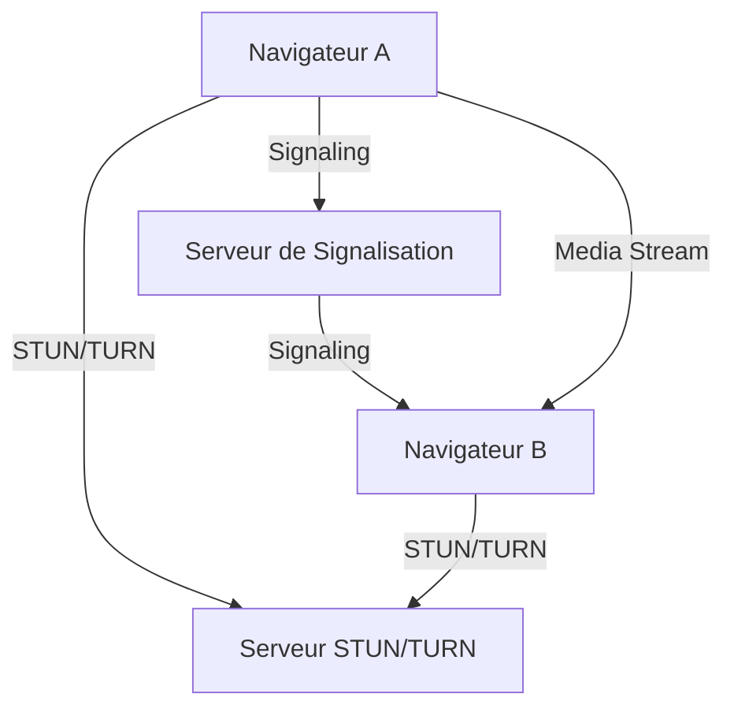

</div>
</div>
</div>

<div id="jitsi-meet" class="section-rapport">
<h2>III. Jitsi Meet : Solution de Visioconférence Open Source</h2>
<div class="bloc-contenu">
<h3 id="III.1.PrésentationdeJitsiMeet">III.1. Présentation de Jitsi Meet</h3>
            <p>Jitsi Meet est une solution de visioconférence open source basée sur WebRTC. Elle offre des fonctionnalités similaires à Zoom, telles que :</p>
            <ul>
                <li>Création de salles de conférence.</li>
                <li>Partage d'écran.</li>
                <li>Chat en temps réel.</li>
            </ul>

<h3 id="III.2.ArchitecturedeJitsiMeet" >III.2. Architecture de Jitsi Meet</h3>
            <p>Jitsi Meet utilise plusieurs composants :</p>
            <ul>
                <li><strong>Jitsi Videobridge</strong> : Gère les flux multimédias.</li>
                <li><strong>Prosody</strong> : Serveur XMPP pour la signalisation.</li>
                <li><strong>Jicofo</strong> : Coordinateur de conférence.</li>
            </ul>
<div class="diagramme-mermaid" align="center">

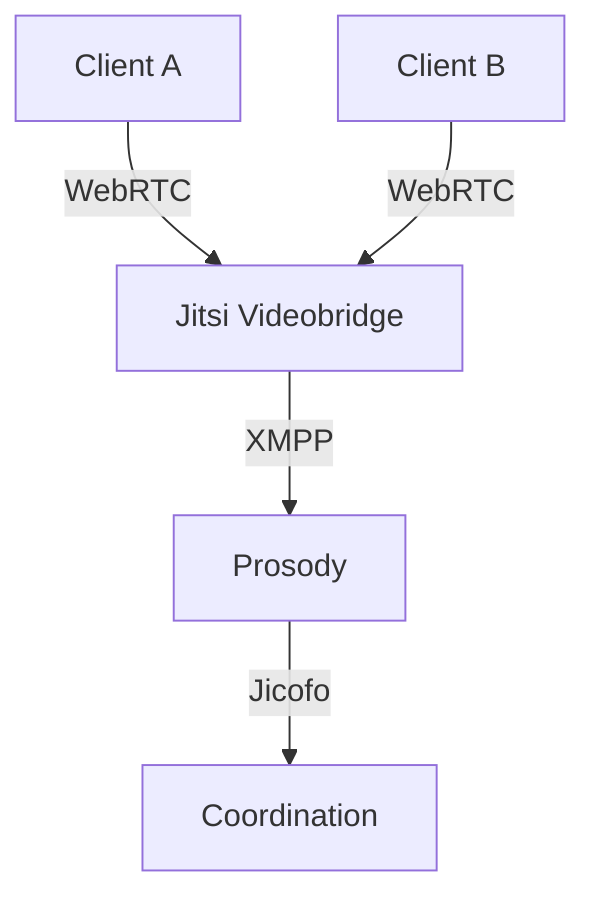

</div>
</div>
</div>

<div id="docker" class="section-rapport">
<h2>IV. Docker : Conteneurisation et Déploiement</h2>
<div class="bloc-contenu">
<h3 id="IV.1.IntroductionaDocker">IV.1. Introduction à Docker</h3>
            <p>Docker est une plateforme de conteneurisation qui permet de déployer des applications dans des environnements isolés. Les avantages de Docker incluent :</p>
            <ul>
                <li>Portabilité : Les conteneurs fonctionnent de la même manière sur tous les systèmes.</li>
                <li>Isolation : Chaque conteneur est indépendant.</li>
                <li>Scalabilité : Facile à déployer sur plusieurs serveurs.</li>
            </ul>

<h3 id="IV.2.InstallationdeDocker">IV.2. Installation de Docker</h3>
            <p>Pour installer Docker sur Ubuntu 20.04 :</p>

<h5>

[Étape 1 — Installation de Docker](https://www.digitalocean.com/community/tutorials/how-to-install-and-use-docker-on-ubuntu-22-04#step-1-installing-docker) 

</h5>
<p>Le package d'installation Docker disponible dans le référentiel officiel d'Ubuntu n'est peut-être pas la dernière version. Pour nous assurer d'obtenir la dernière version, nous allons installer Docker à partir du référentiel officiel Docker. Pour ce faire, nous allons ajouter une nouvelle source de package, ajouter la clé GPG de Docker pour garantir la validité des téléchargements, puis installer le package.

Tout d’abord, mettez à jour votre liste de packages existante :
</p>

<div class="bloc-code">

```bash
sudo apt update
```
</div>

<p>Ensuite, installez quelques packages prérequis qui permettent `apt`d’utiliser des packages via HTTPS :</p>

<div class="bloc-code">

```bash
sudo apt install apt-transport-https ca-certificates curl software-properties-common
```
</div>

<p>Ajoutez ensuite la clé GPG du référentiel officiel Docker à votre système :</p>

<div class="bloc-code">

```bash
curl -fsSL https://download.docker.com/linux/ubuntu/gpg | 
sudo gpg --dearmor -o /usr/share/keyrings/docker-archive-keyring.gpg
```
</div>

<p>Ajoutez le référentiel Docker aux sources APT :</p>

<div class="bloc-code">

```bash
echo "deb [arch=$(dpkg --print-architecture) 
signed-by=/usr/share/keyrings/docker-archive-keyring.gpg] 
https://download.docker.com/linux/ubuntu $(lsb_release -cs) stable" |
sudo tee /etc/apt/sources.list.d/docker.list > /dev/null
```
</div>

<p>Mettez à nouveau à jour votre liste de packages existante pour que l'ajout soit reconnu :</p>

<div class="bloc-code">

```bash
sudo apt update
```
</div>

<p>Assurez-vous que vous êtes sur le point d'installer à partir du référentiel Docker au lieu du référentiel Ubuntu par défaut :</p>
<div class="bloc-code">

```bash
apt-cache policy docker-ce


docker-ce:
  Installed: (none)
  Candidate: 5:20.10.14~3-0~ubuntu-jammy
  Version table:
     5:20.10.14~3-0~ubuntu-jammy 500
        500 https://download.docker.com/linux/ubuntu jammy/stable amd64 Packages
     5:20.10.13~3-0~ubuntu-jammy 500
        500 https://download.docker.com/linux/ubuntu jammy/stable amd64 Packages

```
</div>
<p>Notez qu'il `docker-ce`n'est pas installé, mais le candidat à l'installation provient du référentiel Docker pour Ubuntu 22.04 ( `jammy`).

Enfin, installez Docker:</p>

<div class="bloc-code">

```bash
sudo apt install docker-ce

```
</div>

<p>Docker doit maintenant être installé, le démon démarré et le processus activé pour démarrer au démarrage. Vérifiez qu'il est en cours d'exécution :</p>

<div class="bloc-code">

```bash
sudo systemctl status docker

docker.service - Docker Application Container Engine
     Loaded: loaded (/lib/systemd/system/docker.service; enabled; vendor preset: enabled)
     Active: active (running) since Fri 2022-04-01 21:30:25 UTC; 22s ago
TriggeredBy: ● docker.socket
       Docs: https://docs.docker.com
   Main PID: 7854 (dockerd)
      Tasks: 7
     Memory: 38.3M
        CPU: 340ms
     CGroup: /system.slice/docker.service
             └─7854 /usr/bin/dockerd -H fd:// --containerd=/run/containerd/containerd.sock


```
</div>

<h5>

[Étape 2 — Exécution de la commande Docker sans Sudo (facultatif)](https://www.digitalocean.com/community/tutorials/how-to-install-and-use-docker-on-ubuntu-22-04#step-2-executing-the-docker-command-without-sudo-optional)

</h5>
<p>Par défaut, la `docker`commande ne peut être exécutée que par l' utilisateur **root** ou par un utilisateur du groupe **docker** , qui est automatiquement créé lors du processus d'installation de Docker. Si vous essayez d'exécuter la `docker`commande sans la préfixer avec `sudo`ou sans être dans le groupe **docker** , vous obtiendrez un résultat comme celui-ci :</p>

<div class="bloc-code">

```bash
docker: Cannot connect to the Docker daemon. Is the docker daemon running on this host?.
See 'docker run --help'.
```
</div>

<p>Si vous souhaitez éviter de saisir du texte `sudo`à chaque fois que vous exécutez la `docker`commande, ajoutez votre nom d'utilisateur au `docker`groupe : </p>

<div class="bloc-code">

```bash
sudo usermod -aG docker ${USER}
```
</div>

<p>Pour appliquer la nouvelle appartenance au groupe, déconnectez-vous du serveur et reconnectez-vous, ou saisissez ce qui suit :</p>

<div class="bloc-code">

```bash
su - ${USER}
```
</div>
<p>Vous serez invité à saisir votre mot de passe utilisateur pour continuer.

Confirmez que votre utilisateur est maintenant ajouté au groupe 
**Docker** en tapant :</p>

<div class="bloc-code">

```bash
groups

sammy sudo docker
```
</div>
<p>Si vous devez ajouter un utilisateur au `docker` groupe sous lequel vous n'êtes pas connecté, déclarez explicitement ce nom d'utilisateur en utilisant :</p>

<div class="bloc-code">

```bash
sudo usermod -aG docker username
```
</div>
<p>Le reste de cet article suppose que vous exécutez la `docker` commande en tant qu'utilisateur du groupe 
**Docker** . Si vous choisissez de ne pas le faire, veuillez précéder les commandes de `sudo`.

Explorons `docker` ensuite la commande.</p>

<h5>

[Étape 3 — Utilisation de la commande Docker](https://www.digitalocean.com/community/tutorials/how-to-install-and-use-docker-on-ubuntu-22-04#step-3-using-the-docker-command)

</h5>

<p>L'utilisation `docker`consiste à lui passer une chaîne d'options et de commandes suivies d'arguments. La syntaxe prend la forme suivante :</p>

<div class="bloc-code">

```bash
docker [option] [command] [arguments]
```
</div>
<p>Pour afficher toutes les sous-commandes disponibles, tapez :</p>

<div class="bloc-code">

```bash
docker
```
</div>
<p>À partir de la version Docker==20.10.14==, la liste complète des sous-commandes disponibles comprend</p>

<div class="bloc-code">

```bash

attach      Attach local standard input, output, and error streams to a running container
  build       Build an image from a Dockerfile
  commit      Create a new image from a container's changes
  cp          Copy files/folders between a container and the local filesystem
  create      Create a new container
  diff        Inspect changes to files or directories on a container's filesystem
  events      Get real time events from the server
  exec        Run a command in a running container
  export      Export a container's filesystem as a tar archive
  history     Show the history of an image
  images      List images
  import      Import the contents from a tarball to create a filesystem image
  info        Display system-wide information
  inspect     Return low-level information on Docker objects
  kill        Kill one or more running containers
  load        Load an image from a tar archive or STDIN
  login       Log in to a Docker registry
  logout      Log out from a Docker registry
  logs        Fetch the logs of a container
  pause       Pause all processes within one or more containers
  port        List port mappings or a specific mapping for the container
  ps          List containers
  pull        Pull an image or a repository from a registry
  push        Push an image or a repository to a registry
  rename      Rename a container
  restart     Restart one or more containers
  rm          Remove one or more containers
  rmi         Remove one or more images
  run         Run a command in a new container
  save        Save one or more images to a tar archive (streamed to STDOUT by default)
  search      Search the Docker Hub for images
  start       Start one or more stopped containers
  stats       Display a live stream of container(s) resource usage statistics
  stop        Stop one or more running containers
  tag         Create a tag TARGET_IMAGE that refers to SOURCE_IMAGE
  top         Display the running processes of a container
  unpause     Unpause all processes within one or more containers
  update      Update configuration of one or more containers
  version     Show the Docker version information
  wait        Block until one or more containers stop, then print their exit codes
  
```

</div>


</div>
</div>

<div id="integration" class="section-rapport">
<h2>V. Intégration de Jitsi Meet avec Docker</h2>
<div class="bloc-contenu">
<h3 id="V.1.DéploiementdeJitsiMeetavecDocker">V.1. Déploiement de Jitsi Meet avec Docker</h3>

<p>itsi est une solution de visioconférence open source. À l'époque de la COVID19, il existe une forte demande pour de telles solutions. Je gère une grande installation Jitsi depuis un certain temps. L'installation de Jitsi avec Docker est assez simple et il existe une abondante documentation. Mais la configuration de LDAP s'est avérée un peu plus délicate pour certains utilisateurs, j'ai donc créé ce guide. J'expliquerai les étapes pour Jitsi basé sur Docker, mais les mêmes informations s'appliquent également aux installations non Docker. Avant de commencer la configuration LDAP, voici certaines de mes expériences que j'ai apprises en exécutant un grand cluster Jitsi pendant un an.

- Les serveurs puissants peuvent facilement gérer plus de 80 utilisateurs dans la même salle, mais les ressources locales des clients s'épuisent assez rapidement dans les grandes salles. Les téléphones portables chauffent beaucoup. Jitsi décharge une grande partie du travail sur les ordinateurs clients.
- Les anciennes applications mobiles ne sont souvent pas fiables. J'ai généralement eu des problèmes avec les utilisateurs d'iPhone. Certaines anciennes versions d'Android ne peuvent pas se connecter à moins qu'ils ne définissent leur nom avant de rejoindre l'application.
- Les appareils de sécurité haut de gamme n'apprécient pas les cryptages utilisés par certains clients mobiles. J'ai dû créer une exception pour que tout se passe bien. Si vous rencontrez des problèmes avec votre appareil mobile, vérifiez d'abord ici.
- Si vous devez gérer des utilisateurs répartis géographiquement, envisagez la topologie CASCADE, qui rend tout plus gérable. Mais elle utilise plus de bande passante que la topologie de base.
- L'utilisation d'un onglet de navigation privé améliore les performances des clients avec de faibles spécifications.</p>
            <p>Jitsi Meet peut être déployé facilement avec Docker en utilisant Docker Compose. Voici les étapes :</p>

<h5>Comment fonctionne l'authentification jitsi</h5>

<div class="diagramme-mermaid" align="center">

<div align="center">

![[Untitled diagram-2025-03-05-233416.png]]

</div>
</div>

<p>
**SERVEUR LDAP :** ldap.smarttech.sn

Il s'agit de l'enregistrement DNS ou de l'adresse IP du serveur AD.

**BIND_DN :** cn=admin,dc=smarttech,dc=sn

Il s'agit d'un compte de service créé uniquement pour interroger l'arborescence LDAP. Certains AD permettent d'effectuer des requêtes sans compte (liaison anonyme), mais cette méthode est terriblement peu sûre. Ce compte a le mot de passe passer

**SEARCH_BASE :** ou=users,ou=freeradius,dc=smarttech,dc=sn

Il s'agit du groupe organisationnel créé qui contient tous les utilisateurs que nous souhaitons autoriser pour ce système.</p>
<h5>Comment tester les informations d'identification LDAP</h5>
<p>

Dans un premier temps, au lieu de vous précipiter sur la configuration de saslauthd, faites un petit pas et testez notre configuration avec ldapsearch. De cette façon, nous pourrions également découvrir les problèmes liés au réseau et à AD avant de nous plonger dans la prosodie.

Pour obtenir la `ldapsearch` commande sur notre système, nous devons extraire quelques binaires openLDAP :

</p>
<div class="bloc-code">


```bash
ldapsearch -x -H ldap://ldap.smarttech.sn -D cn=admin,dc=smarttech,dc=sn -w passer -b ou=users,ou=freeradius,dc=smarttech,dc=sn
```


</div>

<p>Cette commande doit renvoyer tous les utilisateurs de notre groupe. Nous pouvons compter le nombre d'utilisateurs :
Si ces chiffres correspondent au nombre d'utilisateurs de notre répertoire, nous pouvons avancer. Si nous faisons une nouvelle installation, les choses sont assez simples</p>

<div class="bloc-code">


```bash
git clone https://github.com/jitsi/docker-jitsi-meet
cd docker-jitsi-meet
cp env.example .env
echo "ENABLE_AUTH=1" >> .env
echo "AUTH_TYPE=ldap" >> .env
echo "LDAP_AUTH_METHOD=bind" >> .env
echo "LDAP_URL=ldap://ldap.smarttech.sn/" >> .env
echo "LDAP_BINDDN=cn=admin,dc=smarttech,dc=sn" >> .env
echo "LDAP_BASE=ou=users,ou=freeradius,dc=smarttech,dc=sn" >> .env
echo "LDAP_BINDPW=passer" >> .env
docker-compose up -d
```


</div>

<h3 id="V.2.ConfigurationdeJitsiMeet" >V.2. Configuration de Jitsi Meet</h3>
<p> Le fichier .env n'autorise que certains paramètres. La véritable configuration ici est /etc/saslauthd.conf, qui se trouve à l'intérieur du conteneur. Ce fichier est initialisé à partir de /root/.jitsi-meet-cfg/prosody</p>

<div class="bloc-code">


```yaml
{{ if eq (.Env.AUTH_TYPE | default "internal") "ldap" }}
ldap_servers: {{ .Env.LDAP_URL }}
ldap_search_base: {{ .Env.LDAP_BASE }}
ldap_bind_dn: {{ .Env.LDAP_BINDDN }}
ldap_bind_pw: {{ .Env.LDAP_BINDPW }}
ldap_filter: {{ .Env.LDAP_FILTER | default "uid=%u" }}
ldap_version: {{ .Env.LDAP_VERSION | default "3" }}
ldap_auth_method: {{ .Env.LDAP_AUTH_METHOD | default "bind" }}
  {{ if .Env.LDAP_USE_TLS | default "0" | toBool }}
ldap_tls_key: /config/certs/{{ .Env.XMPP_DOMAIN }}.key
ldap_tls_cert: /config/certs/{{ .Env.XMPP_DOMAIN }}.crt
    {{ if .Env.LDAP_TLS_CHECK_PEER | default "0" | toBool }}
ldap_tls_check_peer: yes
ldap_tls_cacert_file: {{ .Env.LDAP_TLS_CACERT_FILE | default "/etc/ssl/certs/ca-certificates.crt" }}
ldap_tls_cacert_dir: {{ .Env.LDAP_TLS_CACERT_DIR | default "/etc/ssl/certs" }}
    {{ end }}
    {{ if .Env.LDAP_TLS_CIPHERS }}
ldap_tls_ciphers: {{ .Env.LDAP_TLS_CIPHERS }}
    {{ end }}
  {{ end }}
{{ end }}
```


</div>
<p>Lorsque le conteneur est créé, ce fichier de configuration est rempli de variables d'environnement et copié dans le fichier /etc/saslauthd.conf du conteneur prosody.</p>

<div class="bloc-code">


```bash
docker exec -it docker-jitsi-meet_prosody_1 /bin/bash
root@018a26b1e735:/# cat /etc/saslauthd.conf

ldap_servers: ldap://ldap.smarttech.sn/
ldap_search_base: ou=users,ou=freeradius,dc=smarttech,dc=sn

ldap_bind_dn: cn=admin,dc=smarttech,dc=sn
ldap_bind_pw:  passer

ldap_filter: uid=%u
ldap_version: 3
ldap_auth_method: bind
```


</div>

<p>

Nous pouvons éditer `/root/.jitsi-meet-cfg/prosody`directement pour mettre à jour la configuration. De cette façon, nous contournerons le `.env`fichier. Nous pouvons également utiliser toutes les 
[options de saslauthd](http://web.mit.edu/ghudson/dev/third/cyrus-sasl/saslauthd/LDAP_SASLAUTHD) au lieu des options limitées 
définies dans le fichier `.env`.

Pour tester, nous pouvons éditer ce fichier sur un conteneur en cours d'exécution. Comme il n'y a pas d'éditeur de texte dans le conteneur, nous pouvons utiliser `docker cp`:

</p>

<div class="bloc-code">


```shell
docker cp docker-jitsi-meet_prosody_1:/etc/saslauthd.conf  saslauthd.conf
vim saslauthd.conf
docker cp  saslauthd.conf docker-jitsi-meet_prosody_1:/etc/saslauthd.conf
docker exec -it docker-jitsi-meet_prosody_1 service saslauthd restart
```


</div>
<p>Pour vérifier si notre configuration est correcte, nous pouvons utiliser `testsaslauthd`l'outil dans le conteneur</p>

<div class="bloc-code">


```shell
docker exec -it docker-jitsi-meet_prosody_1 /bin/bash
root@018a26b1e735:/# testsaslauthd -u root101adm -p anotherpassword
0: OK "Success."
```


</div>
<p>N'oubliez pas de nettoyer votre historique bash en texte clair, qui vient d'enregistrer les mots de passe utilisés.</p>

<div class="bloc-code">


```shell
history -cw
```


</div>

<p>Nous pouvons activer ou désactiver les invités :</p>

<div class="bloc-code">


```yaml
ENABLE_GUESTS=
```


</div>

<p>

Si nous définissons ceci à 0.

- Seuls les utilisateurs autorisés peuvent se connecter et rejoindre le système de conférences.

Si nous définissons ceci sur 1.

- Seuls les utilisateurs autorisés peuvent ouvrir une nouvelle salle
- Les utilisateurs non autorisés peuvent rejoindre ces salles, mais ils ne peuvent pas démarrer de salles.
- Tous les comptes autorisés deviennent modérateurs dans toutes les salles qu'ils rejoignent.
- voici une ==[video](https://drive.google.com/file/d/1PHp3vFhrQmulmO9qw04mfWn1MdsN8SCe/view?usp=sharing)== demo

</p>

</div>
</div>
<div style="page-break-after: always;">
</div>
<div id="conclusion" class="section-rapport">
<h2>VI. Conclusion</h2>
        <div class="bloc-contenu">
            <p>WebRTC, Jitsi Meet et Docker forment une combinaison puissante pour déployer des solutions de visioconférence open source, scalables et sécurisées. Ce rapport a présenté les concepts clés, l'architecture, et les étapes de déploiement.</p>
            <p>Pour aller plus loin, on pourrait explorer :</p>
            <ul>
                <li>L'intégration avec des systèmes d'authentification avancés (LDAP, OAuth).</li>
                <li>Le déploiement sur un cluster Kubernetes pour une haute disponibilité.</li>
                <li>L'optimisation des performances pour les grandes salles de conférence.</li>
            </ul>
        </div>
</div>
</div>
</div>


---

<div style="page-break-after: always;">
</div>
<div id="#pfsense-radius" class="rapport-container">

<div class="page-de-garde">
    <h1 class="universite">Université Cheikh Anta Diop de Dakar</h1>
    <h2 class="ecole">École Supérieure Polytechnique</h2>
    
            <!-- Insérez ici le logo de l'UCAD si disponible -->
            <!--  -->
<div align="center">

![[logo_esp.png| 300]]

</div>
        
    <h3 class="titre-rapport">Rapport PfSense avec auth RADIUS/LDAP</h3>
    <div class="auteurs">
        <p class="label">Présenté par :</p>
        <p class="nom">Salif BIAYE</p>
        <p class="nom">Ndeye Astou DIAGOURAGA</p>
    </div>
    <div class="supervisor" style="padding: 15px; border-radius: 5px; margin: 20px 0;">

### Sous la direction de :
#### Dr Keba
*Enseignant*

</div>

---

<div  style="border: 3px double #1a5f7a; padding: 20px ;0;">

### Année universitaire 2024-2025
**

</div>
</div>
<div style="page-break-after: always;">
</div>
<h2>Table des Matières</h2>
<nav class="table-des-matieres">
    <ul>
        <li><a href="#introduction"><h3>I. Introduction à PfSense</h3></a>
            <ul>
                <li><a href="#presentation"><h4>I.1. Présentation de PfSense</h4></a></li>
                <li><a href="#prerequis"><h4>I.2. Prérequis matériels et logiciels</h4></a></li>
            </ul>
        </li>
        <li><a href="#architecture"><h3>II. Architecture du réseau</h3></a>
            <ul>
                <li><a href="#schema-global"><h4>II.1. Schéma global</h4></a></li>
                <li><a href="#topologie"><h4>II.2. Topologie réseau</h4></a></li>
            </ul>
        </li>
        <li><a href="#installation"><h3>III. Installation et configuration de FreeRADIUS et LDAP</h3></a>
            <ul>
                <li><a href="#install-ubuntu"><h4>III.1. Installation d'Ubuntu Server</h4></a></li>
                <li><a href="#install-freeradius"><h4>III.2. Installation de FreeRADIUS</h4></a></li>
                <li><a href="#config-freeradius"><h4>III.3. Configuration de FreeRADIUS</h4></a></li>
                <li><a href="#install-openldap"><h4>III.4. Installation et configuration d'OpenLDAP</h4></a></li>
                <li><a href="#integration"><h4>III.5. Intégration de FreeRADIUS avec LDAP</h4></a></li>
                <li><a href="#test-config"><h4>III.6. Test de configuration</h4></a></li>
            </ul>
        </li>
        <li><a href="#pfsense"><h3>IV. Installation et configuration de PfSense</h3></a>
            <ul>
                <li><a href="#vm-creation"><h4>IV.1. Création des machines virtuelles sur Vmware</h4></a></li>
                <li><a href="#config-switch"><h4>IV.2. Configuration des commutateurs virtuels</h4></a></li>
                <li><a href="#install-pfsense"><h4>IV.3. Installation de PfSense</h4></a></li>
                <li><a href="#config-interfaces"><h4>IV.4. Configuration initiale des interfaces réseau</h4></a></li>
                <li><a href="#firewall-rules"><h4>IV.5. Configuration des règles de pare-feu</h4></a></li>
                <li><a href="#radius-auth"><h4>IV.6. Configuration Radius pour l'authentification</h4></a></li>
            </ul>
        </li>
        <li><a href="#conclusion"><h3>VII. Conclusion</h3></a></li>
    </ul>
</nav>

<div>
    <div id="introduction" class="section-rapport">
        <h2>I. Introduction à PfSense</h2>
        
        <div id="presentation" class="bloc-contenu">
            <h3>I.1. Présentation de PfSense</h3>
            <p>PfSense est une distribution open-source basée sur FreeBSD, spécialisée dans les services de routage et de pare-feu. Elle offre de nombreuses fonctionnalités avancées généralement trouvées dans les pare-feu commerciaux coûteux, comme le filtrage de paquets, le VPN, le portail captif, et bien d'autres.</p>
            <p>PfSense est particulièrement apprécié pour :</p>
            <ul>
                <li>Sa stabilité et sa fiabilité</li>
                <li>Son interface web intuitive</li>
                <li>Sa flexibilité grâce aux nombreux packages disponibles</li>
                <li>Sa gratuité et sa communauté active</li>
            </ul>
        </div>

<div id="prerequis" class="bloc-contenu">
            <h3>I.2. Prérequis matériels et logiciels</h3>
            <p>Pour suivre ce guide, vous aurez besoin de :</p>
            <h4>Matériel :</h4>
            <ul>
                <li>Un ordinateur hôte avec suffisamment de ressources pour exécuter au moins deux machines virtuelles</li>
                <li>Minimum 8 Go de RAM recommandés</li>
                <li>Espace disque suffisant (au moins 40 Go disponibles)</li>
            </ul>
            <h4>Logiciels :</h4>
            <ul>
                <li>VmWare (inclus dans Windows 10/11 Pro, Enterprise ou Education)</li>
                <li>Image ISO de PfSense (téléchargeable sur <a href="https://www.pfsense.org/download/">pfsense.org</a>)</li>
                <li>Image ISO d'Ubuntu Server (téléchargeable sur <a href="https://ubuntu.com/download/server">ubuntu.com</a>)</li>
            </ul>
        </div>
</div>
<div style="page-break-after: always;">
</div>
<div id="architecture" class="section-rapport">
        <h2>II. Architecture du réseau</h2>
        
        <div id="schema-global" class="bloc-contenu">
            <h3>II.1. Schéma global</h3>
<div class="diagramme-mermaid" align="center">


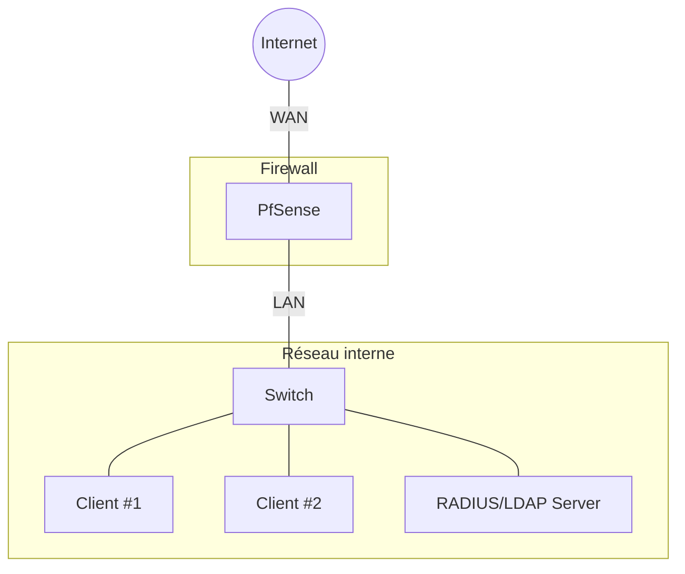

</div>
</div>
<div style="page-break-after: always;">
</div>

<div id="topologie" class="bloc-contenu">
<h3>II.2. Topologie réseau</h3>
<div class="diagramme-mermaid" align="center">

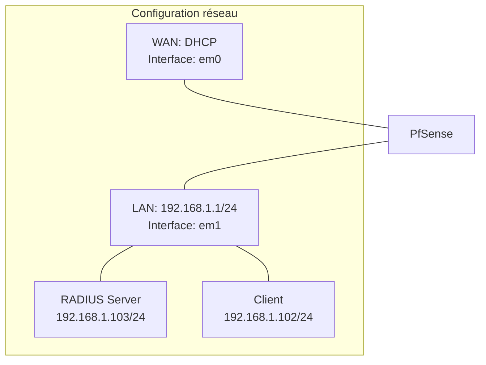

</div>
        </div>
    </div>
<div style="page-break-after: always;">
</div>
<div id="installation" class="section-rapport">
<h2>III. Installation et configuration de FreeRADIUS et LDAP</h2>
        
<div id="install-ubuntu" class="bloc-contenu">
<h3>III.1. Installation d'Ubuntu Server</h3>
            <ol>
                <li>Démarrez la VM Ubuntu-RADIUS</li>
                <li>Suivez les étapes d'installation d'Ubuntu Server :
                    <ul>
                        <li>Sélectionnez la langue et la disposition du clavier</li>
                        <li>Configurez le réseau :
                            <ul>
                                <li>Interface réseau : ens33 (ou l'interface détectée)</li>
                                <li>Configuration IP : Statique</li>
                                <li>Adresse IP : 192.168.1.103</li>
                                <li>Masque : 255.255.255.0</li>
                                <li>Passerelle : 192.168.1.1</li>
                                <li>Serveurs DNS : 192.168.1.1</li>
                            </ul>
                        </li>
                        <li>Configurez le nom d'hôte : radius-server</li>
                        <li>Créez un utilisateur administrateur</li>
                        <li>Installez OpenSSH Server pour l'accès à distance</li>
                    </ul>
                </li>
                <li>Finalisez l'installation et redémarrez</li>
            </ol>
</div>

<div id="install-freeradius" class="bloc-contenu">
<h3>III.2. Installation de FreeRADIUS</h3>
            <ol>
                <li>Connectez-vous à la VM Ubuntu à l'aide de SSH ou directement dans la console</li>
                <li>Mettez à jour les paquets système :
                
<div class="bloc-code">

```bash
sudo apt update
sudo apt upgrade -y
```

</div>
                </li>
                <li>Installez FreeRADIUS et les outils associés :
<div class="bloc-code">

```bash
sudo apt install freeradius freeradius-ldap freeradius-utils -y
```

</div>
                </li>
            </ol>
        </div>

<div id="config-freeradius" class="bloc-contenu">
<h3>III.3. Configuration de FreeRADIUS</h3>
            <ol>
                <li>Arrêtez le service FreeRADIUS :
<div class="bloc-code">

```bash
sudo systemctl stop freeradius
```

</div>
                </li>
                <li>Configurez le fichier clients.conf pour autoriser PfSense à communiquer avec FreeRADIUS :
<div class="bloc-code">

```bash
sudo nano /etc/freeradius/3.0/clients.conf
```

</div>
                </li>
                <li>Ajoutez la configuration suivante à la fin du fichier :
<div class="bloc-code">

```bash
client pfsense {
    ipaddr = 192.168.1.1
    secret = testing123
    require_message_authenticator = no
    nas_type = other
}

client kdc {
     ipaddr = 192.168.1.103
     secret = testing123
     shortname = kdc
}
```

</div>
                </li>
                <li>Configurez le fichier users pour créer un utilisateur de test :
<div class="bloc-code">

```bash
sudo nano /etc/freeradius/3.0/users
```

</div>
                </li>
                <li>Ajoutez l'utilisateur suivant pour les tests (avant le bloc "DEFAULT") :
<div class="bloc-code">

```bash
testuser Cleartext-Password := "password123"
      Reply-Message := "Hello, %{User-Name}"
```

</div>
                </li>
                <li>Démarrez FreeRADIUS en mode debug pour vérifier la configuration :
<div class="bloc-code">

  ```bash
sudo freeradius -X
```

</div>
                </li>
                <li>Si aucune erreur n'apparaît, arrêtez FreeRADIUS (Ctrl+C) et démarrez le service :
<div class="bloc-code">

```bash
sudo systemctl start freeradius
sudo systemctl enable freeradius
```
                        
</div>
                </li>
            </ol>
        </div>

<div id="install-openldap" class="bloc-contenu">
<h3>III.4. Installation et configuration d'OpenLDAP</h3>
            <ol>
                <li>Installez OpenLDAP et les outils associés :
<div class="bloc-code">

```bash
sudo apt install slapd ldap-utils -y
```

</div>
                </li>
                <li>Lors de l'installation, vous serez invité à définir un mot de passe administrateur pour LDAP</li>
                <li>Reconfigurez slapd pour des paramètres supplémentaires :
<div class="bloc-code">

```bash
sudo dpkg-reconfigure slapd
```

</div>
                </li>
                <li>Répondez aux questions comme suit :
                    <ul>
                        <li>Omettre la configuration d'OpenLDAP ? Non</li>
                        <li>Nom de domaine DNS : ldap.local</li>
                        <li>Nom d'organisation : MonOrganisation</li>
                        <li>Mot de passe administrateur : (entrez un mot de passe fort)</li>
                        <li>Confirmer le mot de passe : (répétez le mot de passe)</li>
                        <li>Moteur de base de données : MDB</li>
                        <li>Supprimer la base lors de la purge ? Non</li>
                        <li>Déplacer l'ancienne base de données ? Oui</li>
                    </ul>
                </li>
                <li>Vérifiez que le service LDAP fonctionne :
<div class="bloc-code">

```bash
sudo systemctl status slapd
```
</div>
                </li>
            </ol>
        </div>

<div id="integration" class="bloc-contenu">
<h3>III.5. Intégration de FreeRADIUS avec LDAP</h3>
            <ol>
                <li>Créez un fichier racine LDIF :
<div class="bloc-code">

```bash
    nano ~/racine.ldif
```
</div>
                </li>
                <li>Ajoutez le contenu suivant :
<div class="bloc-code">

```ldif
# racine.ldif
dn: dc=smarttech,dc=sn
objectClass: dcObject
objectClass: organization
dc: smarttech
o: smarttech.sn
```
</div>
                </li>
                <li>Exécutez la commande suivante pour ajouter la racine LDAP :
<div class="bloc-code">

```bash
ldapadd -x -D "cn=admin,dc=smarttech,dc=sn" -W -f racine.ldif
```
</div>
                </li>
                <li>Créez un fichier info.ldif :
<div class="bloc-code">

```ldif
# OU freeradius
dn: ou=freeradius,dc=smarttech,dc=sn
objectClass: top
objectClass: organizationalUnit
ou: asterisk
# OU users
dn: ou=users,ou=freeradius,dc=smarttech,dc=sn
objectClass: top
objectClass: organizationalUnit
ou: users
# OU extensions
dn: ou=extensions,ou=freeradius,dc=smarttech,dc=sn
objectClass: top
objectClass: organizationalUnit
ou: extensions
```
</div>
                </li>
                <li>Ajoutez les informations LDAP :
<div class="bloc-code">

```bash
ldapadd -x -D "cn=admin,dc=smarttech,dc=sn" -W -f info.ldif
```
</div>

</li>
<li>a l'aide d'un script python on automatise maitenant la creation des utilisateurs via une interface graphique voici le script

==[user.py](https://drive.google.com/file/d/1N-uc-JMOf20haXqRRDtHGB4PvqX82NSx/view?usp=sharing)==


<div class="diagramme-mermaid mermaid" align="center">
<div  align="center">

![[Pasted image 20250304003501.png]]

</div>

</div>
</li>

<li>Configurez FreeRADIUS pour utiliser LDAP :
<div class="bloc-code">

```bash
sudo nano /etc/freeradius/3.0/mods-available/ldap
```
</div>
                </li>
                <li>Modifiez les paramètres suivants :
<div class="bloc-code">

```ldif
server = 'localhost'
identity = 'cn=admin,dc=smarttech,dc=sn'
password = 'passer'
base_dn = 'dc=smarttech,dc=sn'
user {
	base_dn = "ou=users,${..base_dn}"
	filter = "(uid=%{%{Stripped-User-Name}:-%{User-Name}})"
}
```
</div>
                </li>
                <li>Activez le module LDAP :
<div class="bloc-code">

```bash
sudo ln -s /etc/freeradius/3.0/mods-available/ldap /etc/freeradius/3.0/mods-enabled/
```
</div>
                </li>
                <li>Modifiez le fichier de sites pour utiliser LDAP :
<div class="bloc-code">

```bash
sudo nano /etc/freeradius/3.0/sites-available/default
```
</div>
                </li>
                <li>Dans la section `authorize`, assurez-vous que `ldap` est décommenté</li>
                <li>Redémarrez FreeRADIUS :
<div class="bloc-code">

```bash
sudo systemctl restart freeradius
```
</div>
                </li>
            </ol>
        </div>

<div id="test-config" class="bloc-contenu">
<h3>III.6. Test de configuration</h3>
            <ol>
                <li>Testez l'authentification RADIUS avec l'utilisateur local :
<div class="bloc-code">

```bash
radtest testuser password123 localhost 0 MonSecretPartage
```
</div>
                </li>
                <li>Testez l'authentification RADIUS avec l'utilisateur LDAP :
<div class="bloc-code">

```bash
radtest user1 [mot_de_passe] localhost 0 MonSecretPartage
```
</div>
                </li>
                <li>Les deux tests devraient retourner "Access-Accept", confirmant que l'authentification fonctionne.</li>
            </ol>
        </div>
</div>

<div id="pfsense" class="section-rapport">
<h2>IV. Installation et configuration de PfSense</h2>
        
<div id="vm-creation" class="bloc-contenu">
<h3>IV.1. Création des machines virtuelles sur Vmware</h3>
            <ol>
                <li>Ouvrez le <strong>Gestionnaire Vmware</strong></li>
                <li>Créez une nouvelle machine virtuelle pour PfSense :
                    <ul>
                        <li>Nom : PfSense</li>
                        <li>Génération : Génération 1 (pour une meilleure compatibilité)</li>
                        <li>Mémoire : 2048 Mo minimum</li>
                        <li>Configuration réseau : Non connecté (nous configurerons les réseaux ultérieurement)</li>
                        <li>Disque dur virtuel : 20 Go</li>
                        <li>Options d'installation : Installer un système d'exploitation à partir d'un fichier image de démarrage (.iso)</li>
                        <li>Sélectionnez l'image ISO de PfSense</li>
                    </ul>
                </li>
                <li>Créez une seconde machine virtuelle pour Ubuntu Server (RADIUS/LDAP) :
                    <ul>
                        <li>Nom : Ubuntu-RADIUS</li>
                        <li>Génération : Génération 1</li>
                        <li>Mémoire : 2048 Mo minimum</li>
                        <li>Configuration réseau : Non connecté (nous configurerons le réseau ultérieurement)</li>
                        <li>Disque dur virtuel : 20 Go</li>
                        <li>Options d'installation : Installer un système d'exploitation à partir d'un fichier image de démarrage (.iso)</li>
                        <li>Sélectionnez l'image ISO d'Ubuntu Server</li>
                    </ul>
                </li>
            </ol>
</div>
<div style="page-break-after: always;">
</div>
<div id="config-switch" class="bloc-contenu">
<h3>IV.2. Configuration des commutateurs virtuels</h3>
            <ol>
                <li>Dans le <strong>Virtual network editor</strong>, cliquez sur <strong>Change settings</strong> dans le panneau d'actions</li>
<div class="diagramme-mermaid mermaid" align="center">
<div align="center">

![[Pasted image 20250303225625.png]]

</div>

</div>

<li>Créez deux commutateurs virtuels :
                    <ul>
                        <li><strong>Réseau NAT</strong> :
                            <ul>
                                <li>Nom : VMnet8</li>
                                <li>Type de connexion : Externe</li>
                                <li>Sélectionnez votre carte réseau physique qui a accès à Internet</li>
                            </ul>
<div class="diagramme-mermaid mermaid" align="center">
<div align="center">

![[Pasted image 20250303225710.png]]

</div>

</div>

</li>
<li><strong>Réseau Host-only</strong> :
                            <ul>
                                <li>Nom : VMnet3</li>
                                <li>Type de connexion : Interne</li>
                                <li>Ce commutateur sera utilisé pour le réseau interne</li>
                            </ul>
                        </li>
                    </ul>
<div class="diagramme-mermaid mermaid" align="center">
<div align="center">

![[Pasted image 20250303225728.png]]

</div>

</div>

</li>
<li>Configurez les cartes réseaux de la VM PfSense :
                    <ul>
                        <li>Accédez aux <strong>Paramètres</strong> de la VM PfSense</li>
                        <li>Ajoutez deux cartes réseau :
                            <ul>
                                <li>Adaptateur réseau 1 : Connecté au commutateur virtuel <strong>WAN</strong></li>
                                <li>Adaptateur réseau 2 : Connecté au commutateur virtuel <strong>LAN</strong></li>
                            </ul>
                        </li>
                    </ul>
</li>
<li>Configurez la carte réseau de la VM Ubuntu-RADIUS :
                    <ul>
                        <li>Accédez aux <strong>Paramètres</strong> de la VM Ubuntu-RADIUS</li>
                        <li>Configurez l'adaptateur réseau : Connecté au commutateur virtuel <strong>LAN</strong></li>
                    </ul>
</li>
</ol>
</div>

<div id="install-pfsense" class="bloc-contenu">
<h3>IV.3. Installation de PfSense</h3>
            <ol>
                <li>Démarrez la VM PfSense</li>
                <li>Lorsque le menu d'installation apparaît, appuyez sur <strong>Entrée</strong> pour lancer l'installation</li>

<div class="diagramme-mermaid mermaid" align="center">
<div align="center">

![[Pasted image 20250303225837.png]]

</div>

</div>
                <li>Sélectionnez <strong>Accept</strong> pour accepter les termes de la licence</li>

<div class="diagramme-mermaid mermaid" align="center">
<div align="center">

![[Pasted image 20250303225907.png]]

</div>

</div>
                <li>Suivez les étapes d'installation jusqu'à la configuration des interfaces réseau</li>
                <li>pfSense va détecter les interfaces :
                    <ul>
                        <li><strong>Attribuer l’interface WAN</strong> → Sélectionner la carte connectée au commutateur <strong>WAN</strong></li>
<div class="diagramme-mermaid mermaid" align="center">
<div align="center">

![[Pasted image 20250303230441.png]]

</div>

</div>

<li><strong>Attribuer l’interface LAN</strong> → Sélectionner la carte connectée au commutateur <strong>LAN</strong></li>
<div class="diagramme-mermaid mermaid" align="center">
<div align="center">

 ![[Pasted image 20250303230551.png]]


</div>

</div>

<div class="diagramme-mermaid mermaid" align="center">
<div align="center">

  ![[Pasted image 20250303230615.png]]

</div>

</div>
                    </ul>
                </li>
                <li>Attendez la fin de l'installation, puis redémarrez lorsque vous y êtes invité</li>
<div class="diagramme-mermaid mermaid" align="center">
<div align="center">

  ![[Pasted image 20250303230654.png]]

</div>

</div>
                <li>Une fois pfSense installé et redémarré, vous verrez un menu avec :
                    <ul>
                        <li>WAN (par défaut en <strong>DHCP</strong>)</li>
                        <li>LAN (par défaut en <strong>192.168.1.1/24</strong>)</li>
                    </ul>
                </li>
<div class="diagramme-mermaid mermaid" align="center">
<div align="center">

![[Pasted image 20250303230752.png]]

</div>

</div>

</ol>
</div>

<div id="config-interfaces" class="bloc-contenu">
<h3>IV.4. Configuration initiale des interfaces réseau</h3>
            <ol>
                <li>Sur votre ordinateur hôte, configurez une adresse IP statique dans le même sous-réseau que l'interface LAN de PfSense :
                    <ul>
                        <li>Adresse IP : 192.168.1.102</li>
                        <li>Masque de sous-réseau : 255.255.255.0</li>
                        <li>Passerelle par défaut : 192.168.1.1</li>
                    </ul>
                </li>
                <li>Ouvrez un navigateur web et accédez à l'adresse <code>https://192.168.1.1</code></li>
                <li>Ignorez les avertissements de sécurité du navigateur concernant le certificat</li>
                <li>Connectez-vous avec les identifiants par défaut :
                    <ul>
                        <li>Nom d'utilisateur : <strong>admin</strong></li>
                        <li>Mot de passe : <strong>pfsense</strong></li>
                    </ul>
                </li>
<div class="diagramme-mermaid mermaid" align="center">
<div align="center">

![[Pasted image 20250303231240.png]]

</div>

</div>


</ol>
</div>

<div id="firewall-rules" class="bloc-contenu">
<h3>IV.5. Configuration des règles de pare-feu</h3>
            <ol>
                <li>Dans l'interface web de PfSense, allez dans <strong>Firewall</strong> > <strong>Rules</strong></li>
                <li>Sélectionnez l'onglet <strong>LAN</strong></li>
                <li>Par défaut, une règle permettant tout le trafic sortant depuis LAN devrait exister</li>
                <li>Si ce n'est pas le cas, ajoutez une règle :
                    <ul>
                        <li>Action : <strong>Pass</strong></li>
                        <li>Interface : <strong>LAN</strong></li>
                        <li>Adresse source : <strong>LAN net</strong></li>
                        <li>Adresse de destination : <strong>Any</strong></li>
                        <li>Description : "Allow LAN to Internet"</li>
                    </ul>
                </li>
                <li>Cliquez sur <strong>Save</strong> puis sur <strong>Apply Changes</strong></li>
            </ol>
<div class="diagramme-mermaid mermaid" align="center">
<div align="center">

![[Pasted image 20250303231853.png]]

</div>

</div>

<div class="diagramme-mermaid mermaid" align="center">
<div align="center">

![[Pasted image 20250303232046.png]]

</div>

</div>

</div>

<div id="radius-auth" class="bloc-contenu">
<h3>IV.6. Configuration Radius pour l'authentification</h3>
<h4>1. Activer et Configurer le Captive Portal sur pfSense</h4>
            <ol>
                <li>Connectez-vous à <strong>pfSense</strong></li>
                <li>Va dans <strong>Services</strong> → <strong>Captive Portal</strong></li>
                <li>Clique sur <strong>Ajouter une Zone</strong> et donne-lui un nom (ex: Portail_Reseau)</li>
                <li>Active la zone et choisis l'interface sur laquelle tu veux appliquer le portail captif (ex: <strong>LAN</strong> ou <strong>WIFI</strong>)</li>
                <li>Clique sur <strong>Save & Continue</strong></li>
            </ol>
<div class="diagramme-mermaid mermaid" align="center">
<div align="center">

![[Pasted image 20250303232339.png]]

</div>

</div>
<div class="diagramme-mermaid mermaid" align="center">
<div align="center">

![[Pasted image 20250303232536.png]]

</div>

</div>


<h4>2. Configurer l'Authentification via FreeRADIUS</h4>
            <ol>
                <li>Dans <strong>pfSense</strong>, va dans <strong>System</strong> → <strong>User Manager</strong> → <strong>Authentication Servers</strong></li>
                <li>Clique sur <strong>Add</strong> et remplis :
                    <ul>
                        <li><strong>Descriptive Name</strong> : FreeRADIUS</li>
                        <li><strong>Type</strong> : RADIUS</li>
                        <li><strong>Hostname or IP Address</strong> : 192.168.1.103 (ton serveur FreeRADIUS)</li>
                        <li><strong>Shared Secret</strong> : (mets le même secret que dans FreeRADIUS)</li>
                        <li><strong>Services Offered</strong> : coche Authentication and Accounting</li>
                        <li><strong>Authentication Port</strong> : 1812</li>
                        <li><strong>Accounting Port</strong> : 1813</li>
                    </ul>
                </li>
                <li>Clique sur <strong>Save & Test</strong> pour voir si la connexion est OK</li>
<div class="diagramme-mermaid mermaid" align="center">
<div align="center">

 ![[Pasted image 20250303232759.png]]

</div>

</div>
<li>Vous pouvez voir le nombre d'utilisateurs connectés dans l'interface</li>
<div class="diagramme-mermaid mermaid" align="center">
<div align="center">

![[Pasted image 20250303233100.png]]

</div>

</div>
</ol>

<p>

voici une ==[video](https://drive.google.com/file/d/17jG6TuPArt6SThMswVcFfipFD8YVAvMV/view?usp=sharing)== demo 

</p>


</div>
</div>
<div style="page-break-after: always;">
</div>
<div id="conclusion" class="section-rapport">
<h2>VII. Conclusion</h2>
        <div class="bloc-contenu">
            <p>Félicitations ! Vous avez maintenant un système complet avec PfSense, un portail captif, et une authentification via RADIUS et LDAP. Cette configuration vous permet de :</p>
            <ul>
                <li>Gérer votre réseau avec un pare-feu robuste</li>
                <li>Sécuriser l'accès à Internet via un portail d'authentification</li>
                <li>Centraliser la gestion des utilisateurs via LDAP</li>
                <li>Auditer les connexions grâce aux journaux RADIUS</li>
            </ul>
            <p>Cette configuration est adaptée à de nombreux environnements, notamment :</p>
            <ul>
                <li>Les petites et moyennes entreprises</li>
                <li>Les établissements éducatifs</li>
                <li>Les hôtels et espaces publics offrant un accès Wi-Fi</li>
                <li>Les environnements de test et de développement</li>
            </ul>
            <p>Pour aller plus loin, vous pourriez explorer :</p>
            <ul>
                <li>La mise en place d'un VPN pour l'accès à distance</li>
                <li>La configuration de VLAN pour segmenter davantage votre réseau</li>
                <li>L'implémentation de règles de filtrage par utilisateur</li>
                <li>La supervision du réseau avec des outils comme Nagios ou Zabbix</li>
            </ul>
        </div>
</div>


</div>
</div>


