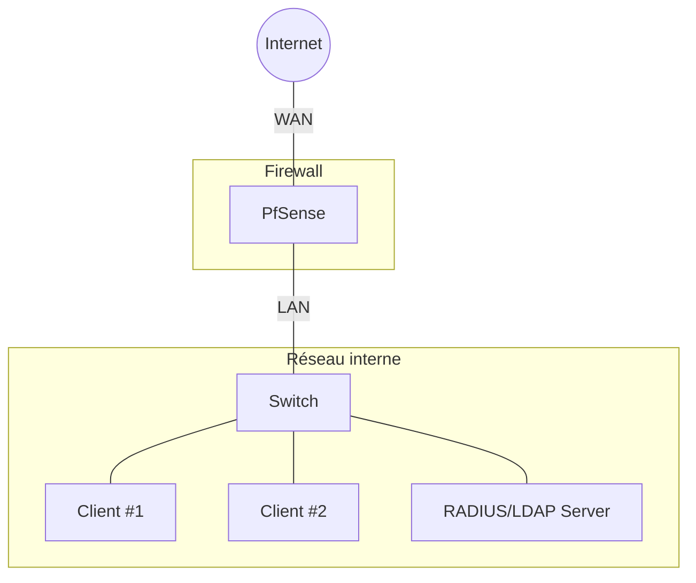
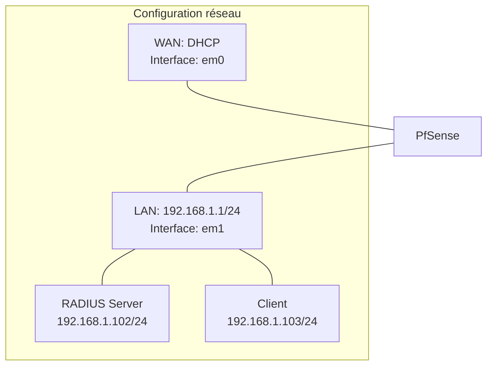

---

<div class="rapport-container">

<div class="page-de-garde">
    <h1 class="universite">Université Cheikh Anta Diop de Dakar</h1>
    <h2 class="ecole">École Supérieure Polytechnique</h2>
    
<div class="logo-container" align="center">

![[logo_esp.png| 300]]

</div>

<h3 class="titre-rapport">Rapport PfSense avec authentification RADIUS/LDAP</h3>

<div class="auteurs">
        <p class="label">Présenté par :</p>
        <p class="nom">Salif BIAYE</p>
        <p class="nom">Ndeye Astou DIAGOURAGA</p>
</div>

<div class="supervisor">
        <h3>Sous la direction de :</h3>
        <h4>Dr Keba</h4>
        <p><em>Enseignant</em></p>
</div>

<div class="annee-univ">

<h3>Année universitaire 2024-2025</h3>

</div>
</div>

<h2>Table des Matières</h2>
<nav class="table-des-matieres">
    <ul>
        <li><a href="#introduction"><h3>I. Introduction à PfSense</h3></a>
            <ul>
                <li><a href="#presentation"><h4>I.1. Présentation de PfSense</h4></a></li>
                <li><a href="#prerequis"><h4>I.2. Prérequis matériels et logiciels</h4></a></li>
            </ul>
        </li>
        <li><a href="#architecture"><h3>II. Architecture du réseau</h3></a>
            <ul>
                <li><a href="#schema-global"><h4>II.1. Schéma global</h4></a></li>
                <li><a href="#topologie"><h4>II.2. Topologie réseau</h4></a></li>
            </ul>
        </li>
        <li><a href="#installation"><h3>III. Installation et configuration de FreeRADIUS et LDAP</h3></a>
            <ul>
                <li><a href="#install-ubuntu"><h4>III.1. Installation d'Ubuntu Server</h4></a></li>
                <li><a href="#install-freeradius"><h4>III.2. Installation de FreeRADIUS</h4></a></li>
                <li><a href="#config-freeradius"><h4>III.3. Configuration de FreeRADIUS</h4></a></li>
                <li><a href="#install-openldap"><h4>III.4. Installation et configuration d'OpenLDAP</h4></a></li>
                <li><a href="#integration"><h4>III.5. Intégration de FreeRADIUS avec LDAP</h4></a></li>
                <li><a href="#test-config"><h4>III.6. Test de configuration</h4></a></li>
            </ul>
        </li>
        <li><a href="#pfsense"><h3>IV. Installation et configuration de PfSense</h3></a>
            <ul>
                <li><a href="#vm-creation"><h4>IV.1. Création des machines virtuelles sur Vmware</h4></a></li>
                <li><a href="#config-switch"><h4>IV.2. Configuration des commutateurs virtuels</h4></a></li>
                <li><a href="#install-pfsense"><h4>IV.3. Installation de PfSense</h4></a></li>
                <li><a href="#config-interfaces"><h4>IV.4. Configuration initiale des interfaces réseau</h4></a></li>
                <li><a href="#web-interface"><h4>IV.5. Accès à l'interface web</h4></a></li>
                <li><a href="#firewall-rules"><h4>IV.6. Configuration des règles de pare-feu</h4></a></li>
                <li><a href="#radius-auth"><h4>IV.7. Configuration Radius pour l'authentification</h4></a></li>
            </ul>
        </li>
        <li><a href="#conclusion"><h3>VII. Conclusion</h3></a></li>
    </ul>
</nav>

<div>
    <div id="introduction" class="section-rapport">
        <h2>I. Introduction à PfSense</h2>
        
        <div id="presentation" class="bloc-contenu">
            <h3>I.1. Présentation de PfSense</h3>
            <p>PfSense est une distribution open-source basée sur FreeBSD, spécialisée dans les services de routage et de pare-feu. Elle offre de nombreuses fonctionnalités avancées généralement trouvées dans les pare-feu commerciaux coûteux, comme le filtrage de paquets, le VPN, le portail captif, et bien d'autres.</p>
            <p>PfSense est particulièrement apprécié pour :</p>
            <ul>
                <li>Sa stabilité et sa fiabilité</li>
                <li>Son interface web intuitive</li>
                <li>Sa flexibilité grâce aux nombreux packages disponibles</li>
                <li>Sa gratuité et sa communauté active</li>
            </ul>
        </div>

<div id="prerequis" class="bloc-contenu">
            <h3>I.2. Prérequis matériels et logiciels</h3>
            <p>Pour suivre ce guide, vous aurez besoin de :</p>
            <h4>Matériel :</h4>
            <ul>
                <li>Un ordinateur hôte avec suffisamment de ressources pour exécuter au moins deux machines virtuelles</li>
                <li>Minimum 8 Go de RAM recommandés</li>
                <li>Espace disque suffisant (au moins 40 Go disponibles)</li>
            </ul>
            <h4>Logiciels :</h4>
            <ul>
                <li>VmWare (inclus dans Windows 10/11 Pro, Enterprise ou Education)</li>
                <li>Image ISO de PfSense (téléchargeable sur <a href="https://www.pfsense.org/download/">pfsense.org</a>)</li>
                <li>Image ISO d'Ubuntu Server (téléchargeable sur <a href="https://ubuntu.com/download/server">ubuntu.com</a>)</li>
            </ul>
        </div>
</div>

<div id="architecture" class="section-rapport">
        <h2>II. Architecture du réseau</h2>
        
        <div id="schema-global" class="bloc-contenu">
            <h3>II.1. Schéma global</h3>
<div class="diagramme-mermaid" align="center">




</div>
</div>

<div id="topologie" class="bloc-contenu">
<h3>II.2. Topologie réseau</h3>
<div class="diagramme-mermaid" align="center">



</div>
        </div>
    </div>

<div id="installation" class="section-rapport">
<h2>III. Installation et configuration de FreeRADIUS et LDAP</h2>
        
<div id="install-ubuntu" class="bloc-contenu">
<h3>III.1. Installation d'Ubuntu Server</h3>
            <ol>
                <li>Démarrez la VM Ubuntu-RADIUS</li>
                <li>Suivez les étapes d'installation d'Ubuntu Server :
                    <ul>
                        <li>Sélectionnez la langue et la disposition du clavier</li>
                        <li>Configurez le réseau :
                            <ul>
                                <li>Interface réseau : ens33 (ou l'interface détectée)</li>
                                <li>Configuration IP : Statique</li>
                                <li>Adresse IP : 192.168.1.103</li>
                                <li>Masque : 255.255.255.0</li>
                                <li>Passerelle : 192.168.1.1</li>
                                <li>Serveurs DNS : 192.168.1.1</li>
                            </ul>
                        </li>
                        <li>Configurez le nom d'hôte : radius-server</li>
                        <li>Créez un utilisateur administrateur</li>
                        <li>Installez OpenSSH Server pour l'accès à distance</li>
                    </ul>
                </li>
                <li>Finalisez l'installation et redémarrez</li>
            </ol>
</div>

<div id="install-freeradius" class="bloc-contenu">
<h3>III.2. Installation de FreeRADIUS</h3>
            <ol>
                <li>Connectez-vous à la VM Ubuntu à l'aide de SSH ou directement dans la console</li>
                <li>Mettez à jour les paquets système :
                
<div class="bloc-code">

```bash
sudo apt update
sudo apt upgrade -y
```

</div>
                </li>
                <li>Installez FreeRADIUS et les outils associés :
<div class="bloc-code">

```bash
sudo apt install freeradius freeradius-ldap freeradius-utils -y
```

</div>
                </li>
            </ol>
        </div>

<div id="config-freeradius" class="bloc-contenu">
<h3>III.3. Configuration de FreeRADIUS</h3>
            <ol>
                <li>Arrêtez le service FreeRADIUS :
<div class="bloc-code">

```bash
sudo systemctl stop freeradius
```

</div>
                </li>
                <li>Configurez le fichier clients.conf pour autoriser PfSense à communiquer avec FreeRADIUS :
<div class="bloc-code">

```bash
sudo nano /etc/freeradius/3.0/clients.conf
```

</div>
                </li>
                <li>Ajoutez la configuration suivante à la fin du fichier :
<div class="bloc-code">

```bash
client pfsense {
    ipaddr = 192.168.1.1
    secret = testing123
    require_message_authenticator = no
    nas_type = other
}

client kdc {
     ipaddr = 192.168.1.103
     secret = testing123
     shortname = kdc
}
```

</div>
                </li>
                <li>Configurez le fichier users pour créer un utilisateur de test :
<div class="bloc-code">

```bash
sudo nano /etc/freeradius/3.0/users
```

</div>
                </li>
                <li>Ajoutez l'utilisateur suivant pour les tests (avant le bloc "DEFAULT") :
<div class="bloc-code">

```bash
testuser Cleartext-Password := "password123"
      Reply-Message := "Hello, %{User-Name}"
```

</div>
                </li>
                <li>Démarrez FreeRADIUS en mode debug pour vérifier la configuration :
<div class="bloc-code">

  ```bash
sudo freeradius -X
```

</div>
                </li>
                <li>Si aucune erreur n'apparaît, arrêtez FreeRADIUS (Ctrl+C) et démarrez le service :
<div class="bloc-code">

```bash
sudo systemctl start freeradius
sudo systemctl enable freeradius
```
                        
</div>
                </li>
            </ol>
        </div>

<div id="install-openldap" class="bloc-contenu">
<h3>III.4. Installation et configuration d'OpenLDAP</h3>
            <ol>
                <li>Installez OpenLDAP et les outils associés :
<div class="bloc-code">

```bash
sudo apt install slapd ldap-utils -y
```

</div>
                </li>
                <li>Lors de l'installation, vous serez invité à définir un mot de passe administrateur pour LDAP</li>
                <li>Reconfigurez slapd pour des paramètres supplémentaires :
<div class="bloc-code">

```bash
sudo dpkg-reconfigure slapd
```

</div>
                </li>
                <li>Répondez aux questions comme suit :
                    <ul>
                        <li>Omettre la configuration d'OpenLDAP ? Non</li>
                        <li>Nom de domaine DNS : ldap.local</li>
                        <li>Nom d'organisation : MonOrganisation</li>
                        <li>Mot de passe administrateur : (entrez un mot de passe fort)</li>
                        <li>Confirmer le mot de passe : (répétez le mot de passe)</li>
                        <li>Moteur de base de données : MDB</li>
                        <li>Supprimer la base lors de la purge ? Non</li>
                        <li>Déplacer l'ancienne base de données ? Oui</li>
                    </ul>
                </li>
                <li>Vérifiez que le service LDAP fonctionne :
<div class="bloc-code">

```bash
sudo systemctl status slapd
```
</div>
                </li>
            </ol>
        </div>

<div id="integration" class="bloc-contenu">
<h3>III.5. Intégration de FreeRADIUS avec LDAP</h3>
            <ol>
                <li>Créez un fichier racine LDIF :
<div class="bloc-code">

```bash
    nano ~/racine.ldif
```
</div>
                </li>
                <li>Ajoutez le contenu suivant :
<div class="bloc-code">

```ldif
# racine.ldif
dn: dc=smarttech,dc=sn
objectClass: dcObject
objectClass: organization
dc: smarttech
o: smarttech.sn
```
</div>
                </li>
                <li>Exécutez la commande suivante pour ajouter la racine LDAP :
<div class="bloc-code">

```bash
ldapadd -x -D "cn=admin,dc=smarttech,dc=sn" -W -f racine.ldif
```
</div>
                </li>
                <li>Créez un fichier info.ldif :
<div class="bloc-code">

```ldif
# OU freeradius
dn: ou=freeradius,dc=smarttech,dc=sn
objectClass: top
objectClass: organizationalUnit
ou: asterisk
# OU users
dn: ou=users,ou=freeradius,dc=smarttech,dc=sn
objectClass: top
objectClass: organizationalUnit
ou: users
# OU extensions
dn: ou=extensions,ou=freeradius,dc=smarttech,dc=sn
objectClass: top
objectClass: organizationalUnit
ou: extensions
```
</div>
                </li>
                <li>Ajoutez les informations LDAP :
<div class="bloc-code">

```bash
ldapadd -x -D "cn=admin,dc=smarttech,dc=sn" -W -f info.ldif
```
</div>
                </li>
                <li>Configurez FreeRADIUS pour utiliser LDAP :
<div class="bloc-code">

```bash
sudo nano /etc/freeradius/3.0/mods-available/ldap
```
</div>
                </li>
                <li>Modifiez les paramètres suivants :
<div class="bloc-code">

```ldif
server = 'localhost'
identity = 'cn=admin,dc=smarttech,dc=sn'
password = 'passer'
base_dn = 'dc=smarttech,dc=sn'
user {
	base_dn = "ou=users,${..base_dn}"
	filter = "(uid=%{%{Stripped-User-Name}:-%{User-Name}})"
}
```
</div>
                </li>
                <li>Activez le module LDAP :
<div class="bloc-code">

```bash
sudo ln -s /etc/freeradius/3.0/mods-available/ldap /etc/freeradius/3.0/mods-enabled/
```
</div>
                </li>
                <li>Modifiez le fichier de sites pour utiliser LDAP :
<div class="bloc-code">

```bash
sudo nano /etc/freeradius/3.0/sites-available/default
```
</div>
                </li>
                <li>Dans la section `authorize`, assurez-vous que `ldap` est décommenté</li>
                <li>Redémarrez FreeRADIUS :
<div class="bloc-code">

```bash
sudo systemctl restart freeradius
```
</div>
                </li>
            </ol>
        </div>

<div id="test-config" class="bloc-contenu">
<h3>III.6. Test de configuration</h3>
            <ol>
                <li>Testez l'authentification RADIUS avec l'utilisateur local :
<div class="bloc-code">

```bash
radtest testuser password123 localhost 0 MonSecretPartage
```
</div>
                </li>
                <li>Testez l'authentification RADIUS avec l'utilisateur LDAP :
<div class="bloc-code">

```bash
radtest user1 [mot_de_passe] localhost 0 MonSecretPartage
```
</div>
                </li>
                <li>Les deux tests devraient retourner "Access-Accept", confirmant que l'authentification fonctionne.</li>
            </ol>
        </div>
</div>
<div id="pfsense" class="section-rapport">
<h2>IV. Installation et configuration de PfSense</h2>
        
<div id="vm-creation" class="bloc-contenu">
<h3>IV.1. Création des machines virtuelles sur Vmware</h3>
            <ol>
                <li>Ouvrez le <strong>Gestionnaire Vmware</strong></li>
                <li>Créez une nouvelle machine virtuelle pour PfSense :
                    <ul>
                        <li>Nom : PfSense</li>
                        <li>Génération : Génération 1 (pour une meilleure compatibilité)</li>
                        <li>Mémoire : 2048 Mo minimum</li>
                        <li>Configuration réseau : Non connecté (nous configurerons les réseaux ultérieurement)</li>
                        <li>Disque dur virtuel : 20 Go</li>
                        <li>Options d'installation : Installer un système d'exploitation à partir d'un fichier image de démarrage (.iso)</li>
                        <li>Sélectionnez l'image ISO de PfSense</li>
                    </ul>
                </li>
                <li>Créez une seconde machine virtuelle pour Ubuntu Server (RADIUS/LDAP) :
                    <ul>
                        <li>Nom : Ubuntu-RADIUS</li>
                        <li>Génération : Génération 1</li>
                        <li>Mémoire : 2048 Mo minimum</li>
                        <li>Configuration réseau : Non connecté (nous configurerons le réseau ultérieurement)</li>
                        <li>Disque dur virtuel : 20 Go</li>
                        <li>Options d'installation : Installer un système d'exploitation à partir d'un fichier image de démarrage (.iso)</li>
                        <li>Sélectionnez l'image ISO d'Ubuntu Server</li>
                    </ul>
                </li>
            </ol>
</div>

<div id="config-switch" class="bloc-contenu">
<h3>IV.2. Configuration des commutateurs virtuels</h3>
            <ol>
                <li>Dans le <strong>Virtual network editor</strong>, cliquez sur <strong>Change settings</strong> dans le panneau d'actions</li>
                <li>Créez deux commutateurs virtuels :
                    <ul>
                        <li><strong>Réseau NAT</strong> :
                            <ul>
                                <li>Nom : VMnet8</li>
                                <li>Type de connexion : Externe</li>
                                <li>Sélectionnez votre carte réseau physique qui a accès à Internet</li>
                            </ul>
                        </li>
                        <li><strong>Réseau Host-only</strong> :
                            <ul>
                                <li>Nom : VMnet3</li>
                                <li>Type de connexion : Interne</li>
                                <li>Ce commutateur sera utilisé pour le réseau interne</li>
                            </ul>
                        </li>
                    </ul>
                </li>
                <li>Configurez les cartes réseaux de la VM PfSense :
                    <ul>
                        <li>Accédez aux <strong>Paramètres</strong> de la VM PfSense</li>
                        <li>Ajoutez deux cartes réseau :
                            <ul>
                                <li>Adaptateur réseau 1 : Connecté au commutateur virtuel <strong>WAN</strong></li>
                                <li>Adaptateur réseau 2 : Connecté au commutateur virtuel <strong>LAN</strong></li>
                            </ul>
                        </li>
                    </ul>
                </li>
                <li>Configurez la carte réseau de la VM Ubuntu-RADIUS :
                    <ul>
                        <li>Accédez aux <strong>Paramètres</strong> de la VM Ubuntu-RADIUS</li>
                        <li>Configurez l'adaptateur réseau : Connecté au commutateur virtuel <strong>LAN</strong></li>
                    </ul>
                </li>
            </ol>
</div>

<div id="install-pfsense" class="bloc-contenu">
<h3>IV.3. Installation de PfSense</h3>
            <ol>
                <li>Démarrez la VM PfSense</li>
                <li>Lorsque le menu d'installation apparaît, appuyez sur <strong>Entrée</strong> pour lancer l'installation</li>

<div class="diagramme-mermaid mermaid" align="center">
<div align="center">

![[Pasted image 20250303225837.png]]

</div>

</div>
                <li>Sélectionnez <strong>Accept</strong> pour accepter les termes de la licence</li>

<div class="diagramme-mermaid mermaid" align="center">
<div align="center">

![[Pasted image 20250303225907.png]]

</div>

</div>
                <li>Suivez les étapes d'installation jusqu'à la configuration des interfaces réseau</li>
                <li>pfSense va détecter les interfaces :
                    <ul>
                        <li><strong>Attribuer l’interface WAN</strong> → Sélectionner la carte connectée au commutateur <strong>WAN</strong></li>
<div class="diagramme-mermaid mermaid" align="center">
<div align="center">

![[Pasted image 20250303230441.png]]

</div>

</div>

                        <li><strong>Attribuer l’interface LAN</strong> → Sélectionner la carte connectée au commutateur <strong>LAN</strong></li>
<div class="diagramme-mermaid mermaid" align="center">
<div align="center">

 ![[Pasted image 20250303230551.png]]


</div>

</div>

<div class="diagramme-mermaid mermaid" align="center">
<div align="center">

  ![[Pasted image 20250303230615.png]]

</div>

</div>
                    </ul>
                </li>
                <li>Attendez la fin de l'installation, puis redémarrez lorsque vous y êtes invité</li>
<div class="diagramme-mermaid mermaid" align="center">
<div align="center">

  ![[Pasted image 20250303230654.png]]

</div>

</div>
                <li>Une fois pfSense installé et redémarré, vous verrez un menu avec :
                    <ul>
                        <li>WAN (par défaut en <strong>DHCP</strong>)</li>
                        <li>LAN (par défaut en <strong>192.168.1.1/24</strong>)</li>
                    </ul>
                </li>
<div class="diagramme-mermaid mermaid" align="center">
<div align="center">

![[Pasted image 20250303230752.png]]

</div>

</div>

            </ol>
</div>

<div id="config-interfaces" class="bloc-contenu">
<h3>IV.4. Configuration initiale des interfaces réseau</h3>
            <ol>
                <li>Sur votre ordinateur hôte, configurez une adresse IP statique dans le même sous-réseau que l'interface LAN de PfSense :
                    <ul>
                        <li>Adresse IP : 192.168.1.102</li>
                        <li>Masque de sous-réseau : 255.255.255.0</li>
                        <li>Passerelle par défaut : 192.168.1.1</li>
                    </ul>
                </li>
                <li>Ouvrez un navigateur web et accédez à l'adresse <code>https://192.168.1.1</code></li>
                <li>Ignorez les avertissements de sécurité du navigateur concernant le certificat</li>
                <li>Connectez-vous avec les identifiants par défaut :
                    <ul>
                        <li>Nom d'utilisateur : <strong>admin</strong></li>
                        <li>Mot de passe : <strong>pfsense</strong></li>
                    </ul>
                </li>
<div class="diagramme-mermaid mermaid" align="center">
<div align="center">

![[Pasted image 20250303231240.png]]

</div>

</div>


            </ol>
</div>

<div id="firewall-rules" class="bloc-contenu">
<h3>IV.6. Configuration des règles de pare-feu</h3>
            <ol>
                <li>Dans l'interface web de PfSense, allez dans <strong>Firewall</strong> > <strong>Rules</strong></li>
                <li>Sélectionnez l'onglet <strong>LAN</strong></li>
                <li>Par défaut, une règle permettant tout le trafic sortant depuis LAN devrait exister</li>
                <li>Si ce n'est pas le cas, ajoutez une règle :
                    <ul>
                        <li>Action : <strong>Pass</strong></li>
                        <li>Interface : <strong>LAN</strong></li>
                        <li>Adresse source : <strong>LAN net</strong></li>
                        <li>Adresse de destination : <strong>Any</strong></li>
                        <li>Description : "Allow LAN to Internet"</li>
                    </ul>
                </li>
                <li>Cliquez sur <strong>Save</strong> puis sur <strong>Apply Changes</strong></li>
            </ol>
<div class="diagramme-mermaid mermaid" align="center">
<div align="center">

![[Pasted image 20250303231853.png]]

</div>

</div>

<div class="diagramme-mermaid mermaid" align="center">
<div align="center">

![[Pasted image 20250303232046.png]]

</div>

</div>

</div>

<div id="radius-auth" class="bloc-contenu">
<h3>IV.7. Configuration Radius pour l'authentification</h3>
<h4>1. Activer et Configurer le Captive Portal sur pfSense</h4>
            <ol>
                <li>Connectez-vous à <strong>pfSense</strong></li>
                <li>Va dans <strong>Services</strong> → <strong>Captive Portal</strong></li>
                <li>Clique sur <strong>Ajouter une Zone</strong> et donne-lui un nom (ex: Portail_Reseau)</li>
                <li>Active la zone et choisis l'interface sur laquelle tu veux appliquer le portail captif (ex: <strong>LAN</strong> ou <strong>WIFI</strong>)</li>
                <li>Clique sur <strong>Save & Continue</strong></li>
            </ol>
<div class="diagramme-mermaid mermaid" align="center">
<div align="center">

![[Pasted image 20250303232339.png]]

</div>

</div>
<div class="diagramme-mermaid mermaid" align="center">
<div align="center">

![[Pasted image 20250303232536.png]]

</div>

</div>


<h4>2. Configurer l'Authentification via FreeRADIUS</h4>
            <ol>
                <li>Dans <strong>pfSense</strong>, va dans <strong>System</strong> → <strong>User Manager</strong> → <strong>Authentication Servers</strong></li>
                <li>Clique sur <strong>Add</strong> et remplis :
                    <ul>
                        <li><strong>Descriptive Name</strong> : FreeRADIUS</li>
                        <li><strong>Type</strong> : RADIUS</li>
                        <li><strong>Hostname or IP Address</strong> : 192.168.1.103 (ton serveur FreeRADIUS)</li>
                        <li><strong>Shared Secret</strong> : (mets le même secret que dans FreeRADIUS)</li>
                        <li><strong>Services Offered</strong> : coche Authentication and Accounting</li>
                        <li><strong>Authentication Port</strong> : 1812</li>
                        <li><strong>Accounting Port</strong> : 1813</li>
                    </ul>
                </li>
                <li>Clique sur <strong>Save & Test</strong> pour voir si la connexion est OK</li>
<div class="diagramme-mermaid mermaid" align="center">
<div align="center">

 ![[Pasted image 20250303232759.png]]

</div>

</div>
                <li>Vous pouvez voir le nombre d'utilisateurs connectés dans l'interface</li>
<div class="diagramme-mermaid mermaid" align="center">
<div align="center">

![[Pasted image 20250303233100.png]]

</div>

</div>
            </ol>


        </div>
</div>

<div id="conclusion" class="section-rapport">
<h2>VII. Conclusion</h2>
        <div class="bloc-contenu">
            <p>Félicitations ! Vous avez maintenant un système complet avec PfSense, un portail captif, et une authentification via RADIUS et LDAP. Cette configuration vous permet de :</p>
            <ul>
                <li>Gérer votre réseau avec un pare-feu robuste</li>
                <li>Sécuriser l'accès à Internet via un portail d'authentification</li>
                <li>Centraliser la gestion des utilisateurs via LDAP</li>
                <li>Auditer les connexions grâce aux journaux RADIUS</li>
            </ul>
            <p>Cette configuration est adaptée à de nombreux environnements, notamment :</p>
            <ul>
                <li>Les petites et moyennes entreprises</li>
                <li>Les établissements éducatifs</li>
                <li>Les hôtels et espaces publics offrant un accès Wi-Fi</li>
                <li>Les environnements de test et de développement</li>
            </ul>
            <p>Pour aller plus loin, vous pourriez explorer :</p>
            <ul>
                <li>La mise en place d'un VPN pour l'accès à distance</li>
                <li>La configuration de VLAN pour segmenter davantage votre réseau</li>
                <li>L'implémentation de règles de filtrage par utilisateur</li>
                <li>La supervision du réseau avec des outils comme Nagios ou Zabbix</li>
            </ul>
        </div>
</div>


</div>
</div>