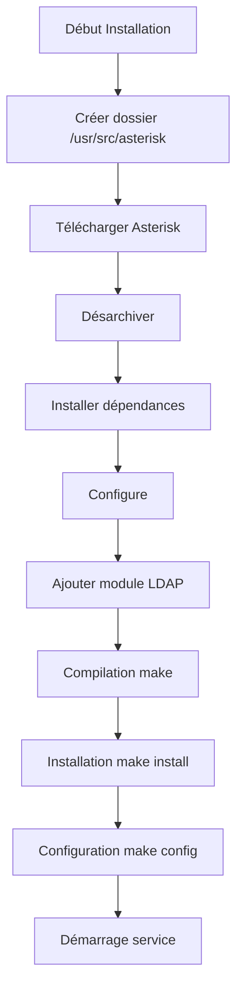
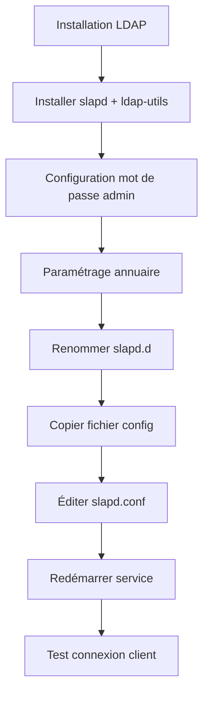
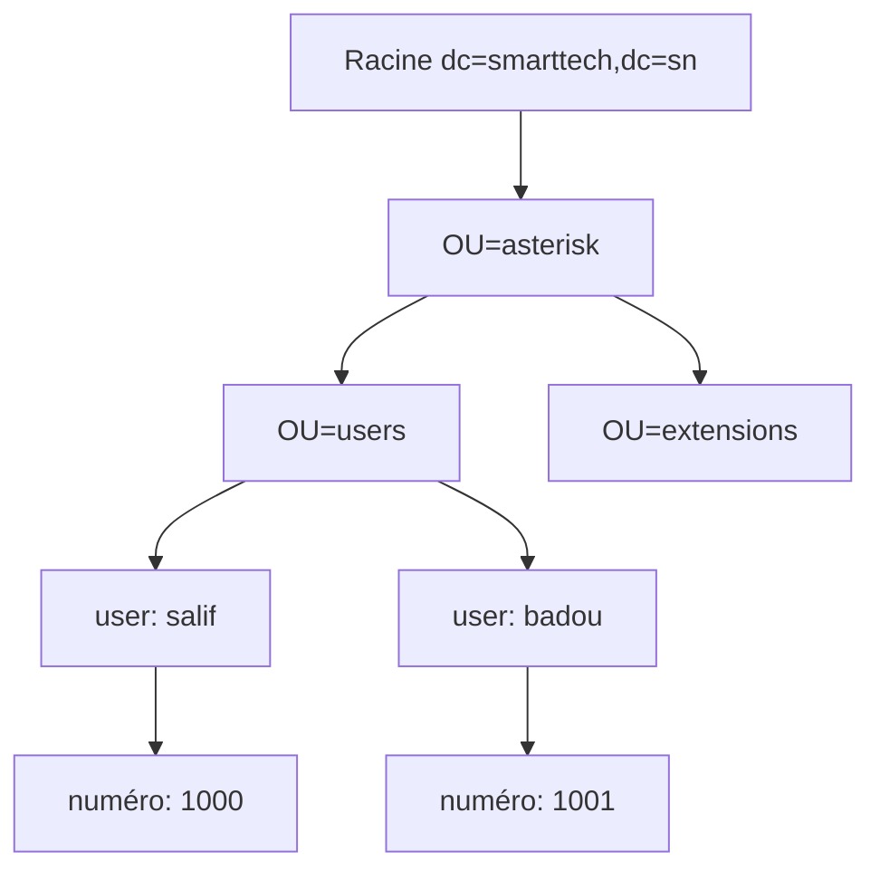
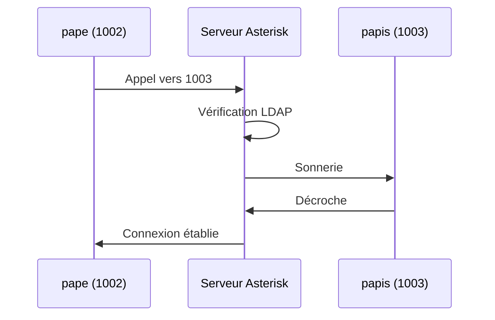

---
<div class="rapport-container">

<div class="page-de-garde">
    <h1 class="universite">Université Cheikh Anta Diop de Dakar</h1>
    <h2 class="ecole">École Supérieure Polytechnique</h2>
    
            <!-- Insérez ici le logo de l'UCAD si disponible -->
            <!--  -->
<div align="center">

![[logo_esp.png| 300]]

</div>
        
    <h3 class="titre-rapport">Rapport Asterisk et Ldap </h3>
    <div class="auteurs">
        <p class="label">Présenté par :</p>
        <p class="nom">Salif BIAYE</p>
        <p class="nom">Ndeye Astou DIAGOURAGA</p>
    </div>
    <div class="supervisor" style="padding: 15px; border-radius: 5px; margin: 20px 0;">

### Sous la direction de :
#### Dr Keba
*Enseignant*

</div>

---

<div  style="border: 3px double #1a5f7a; padding: 20px ;0;">

### Année universitaire 2024-2025
**

</div>
    
</div>


<h2>Table des Matières</h2>
<nav class="table-des-matieres">
    
    <ul>
        <li><a href="#installation"><h3>I- Installation des Services</h3></a>
            <ul>
                <li><a href="#install-asterisk"><h4>I-a Installation d'Asterisk</h4></a></li>
                <li><a href="#install-ldap"><h4>I-b Installation de L'annuaire LDAP</h4></a></li>
            </ul>
        </li>
        <li><a href="#couplage"><h3>II- Couplage Asterisk et LDAP</h3></a>
            <ul>
                <li><a href="#config-ldap"><h4>Configuration de l'annuaire LDAP</h4></a></li>
                <li><a href="#connexion-ldap"><h4>II-a Connexion au serveur LDAP</h4></a></li>
                <li><a href="#config-sip"><h4>II-b Configuration générale des comptes SIP</h4></a></li>
                <li><a href="#config-dialplan"><h4>II-c Configuration générale du dialplan</h4></a></li>
                <li><a href="#verification"><h4>Vérification de la connexion au LDAP</h4></a></li>
                <li><a href="#ajout-users"><h4>Ajout des utilisateurs</h4></a></li>
                <li><a href="#test-config"><h4>Test de la configuration</h4></a></li>
            </ul>
        </li>
    </ul>
</nav>


<main>
	<div id="installation" class="section-rapport">
		    <h2>I- Installation des Services</h2>
    <div id="install-asterisk" class="bloc-contenu">
	        <h3>I-a Installation d'Asterisk</h3>


 <div class="diagramme-mermaid " align="center">




</div>

<p>Pour installer Asterisk, nous allons suivre une série d'étapes précises. Commençons par créer le dossier qui contiendra notre paquet Asterisk.</p>

<div class="bloc-code">

```bash
root@asterisk-ldap:/usr/src/asterisk# mkdir /usr/src/asterisk
```
</div>

<p>On se déplace dans le dossier cree et on telecharge le paquet asterisk comme suit</p>

<div class="bloc-code">

```bash

root@asterisk-ldap:/usr/src/asterisk# cd /usr/src/asterisk
root@asterisk-ldap:/usr/src/asterisk# wget http://downloads.asterisk.org/pub/telephony/asterisk/asterisk-17-current.tar.gz
--2020-08-25 17:16:34--  http://downloads.asterisk.org/pub/telephony/asterisk/asterisk-17-current.tar.gz
Résolution de downloads.asterisk.org (downloads.asterisk.org)… 76.164.171.238, 2001:470:e0d4::ee
Connexion à downloads.asterisk.org (downloads.asterisk.org)|76.164.171.238|:80… connecté.
requête HTTP transmise, en attente de la réponse… 200 OK
Taille : 43455574 (41M) [application/x-gzip]
Enregistre : «asterisk-17-current.tar.gz»

-17-current.tar.gz    98%[===================> ]  40,82M  49,5KB/s    tps 13s

```
</div>

<p>Maintenant on peut désarchiver le fichier tar comme suit</p>

<div class="bloc-code">

```bash
root@asterisk-ldap:/usr/src/asterisk# tar -xvzf asterisk-17-current.tar.gz
asterisk-17.6.0/
asterisk-17.6.0/.cleancount
asterisk-17.6.0/.gitignore
asterisk-17.6.0/.gitreview
asterisk-17.6.0/.lastclean
asterisk-17.6.0/.version
asterisk-17.6.0/BSDmakefile
asterisk-17.6.0/BUGS

```
</div>

<p>Apres avoir désarchivé on se déplace dans le repertoire de base de asterisk selon la version</p>

<div class="bloc-code">

```bash
root@asterisk-ldap: /usr/src/asterisk# ls
asterisk-17.6.0    asterisk-17-current.tar.gz

root@asterisk-ldap: /usr/src/asterisk# cd asterisk-17.6.0/

```
</div>

<p>Il faut ensuite installer les dépendances requises pour la compilation d'asterisk:</p>


<div class="bloc-code">

```bash
root@asterisk-ldap: /usr/src/asterisk/asterisk-17.6.0# apt-get install gcc g++ make libncurses5-dev
Lecture des listes de paquets... Fait
Construction de l'arbre des dépendances
Lecture des informations d'état... Fait
Les paquets supplémentaires suivants seront installés :
  g++-7 gcc-7 libasan4 libatomic1 libc-dev-bin libc6-dev libcilkrts5
  libgcc-7-dev libitm1 liblsan0 libmpx2 libquadmath0 libstdc++-7-dev
  libtinfo-dev libtsan0 libubsan0 linux-libc-dev manpages-dev

```

</div>

<p>on télécharge le deuxieme</p>

<div class="bloc-code">

```bash
root@asterisk-ldap: /usr/src/asterisk/asterisk-17.6.0# ./contrib/scripts/install_prereq install
Lecture des listes de paquets... Fait
Construction de l'arbre des dépendances
Lecture des informations d'état... Fait
Les paquets supplémentaires suivants seront installés :
  aptitude-common libcwidget3v5
Paquets suggérés :

```

</div>

<p>Nous allons ensuite compiler asterisk</p>

<div class="bloc-code">

```bash
root@asterisk-ldap: /usr/src/asterisk/asterisk-17.6.0# ./configure
checking build system type... x86_64-pc-linux-gnu
checking host system type... x86_64-pc-linux-gnu
checking for gcc... gcc
checking whether the C compiler works... yes
checking for C compiler default output file name... a.out


```
</div>
<p>On aura comme résultat</p>

<div class="bloc-code">

```bash
-$$$$$$$$$$$$$$$=..
             .$7$7..        .7$$7..
          .$$:..             .$7.7
        .$7               7$$$$    .$677
      ..$$.               $$$$$    .$$$7
    ..7$    .?.          $$$$$   .?.    7$$$. 
   $.$. .$$$7. $$$$7 .7$$$..      .$$$. 
 .777.  .$$$$$$$77$$77$$$$$7.       $$$, 
$$$~     .7$$$$$$$$$$$$$7.         .$$$. 
.$$7               .7$$$$$$$7:      ?$$$. 
$$$                ?7$$$$$$$$$I     .$$$7 
$$$            .7$$$$$$$$$$$$$$$    .$$$. 
$$$         $$$$$$$7$$$$$$$$$$$$    .$$$. 
$$$         $$$    7$$$7 .$$$      .$$$. 
$$$$              $$$$7           .$$$. 
7$$$7             7$$$$          7$$$ 
 $$$$$                           $$$
  $$$$7.                        $$ (TM)
   $$$$$$..               .7$$$$$$ $$
    $$$$$$$$$$$$7$$$$$$$$.$$$$$$
       .$$$$$$$$$$$$$$$$.

# Configuration Asterisk
configure: Package configuré pour:
configure: OS type  : linux-gnu
configure: Host CPU : x86_64
configure: build-cpu:vendor:os: x86_64 : pc : linux-gnu :
configure: host-cpu:vendor:os: x86_64 : pc : linux-gnu :
salif@asterisk-ldap:/usr/src/asterisk/asterisk-17.6.0#


```
</div>

<p>On ajoute le module LDAP pour Asterisk et sélectionnons des voix francaises:

<div class="bloc-code">

```bash
root@asterisk-ldap: /usr/src/asterisk/asterisk-17.6.0# make menuconfig

```
</div>

<div class="diagramme-mermaid mermaid" align="center">
<div align="center">

![[asterisk-step1.png]]

</div>

</div>
<div class="diagramme-mermaid mermaid" align="center">
<div align="center">


![[asterisk-step2.png]]

</div>

</div>
<div class="diagramme-mermaid mermaid" align="center">
<div align="center">


![[asterisk-step3.png]]

</div>

</div>

<p>Apres tabulation on Save & Exit pour sauvegardé</p>

<h4>Compilation</h4>

<div class="bloc-code">

```bash
root@asterisk-ldap: /usr/src/asterisk/asterisk-17.6.0# make
[CC] astcanary.c -> astcanary.o
[LD] astcanary.o -> astcanary
[CC] astdb2sqlite3.c -> astdb2sqlite3.o
[CC] hash/hash.c -> hash/hash.o
[CC] hash/hash_bigkey.c -> hash/hash_bigkey.o
[CC] hash/hash_buf.c -> hash/hash_buf.o
[CC] hash/hash_func.c -> hash/hash_func.o


```
</div>

<h4>Installation</h4>
<div class="bloc-code">

```bash
root@asterisk-ldap:/usr/src/asterisk/asterisk-17.6.0# make install
Installing modules from channels...
Installing modules from pbx...
Installing modules from apps...
Installing modules from codecs...
Installing modules from formats...
Installing modules from cdr...


```

</div>
<div class="bloc-code">

```bash
root@asterisk-ldap:/usr/src/asterisk/asterisk-17.6.0# make samples
Installing adsi config files...
/usr/bin/install -c -d "/etc/asterisk"
Installing configs/samples/asterisk.adsi
Installing configs/samples/telcordia-1.adsi
Installing other config files...
Installing file configs/samples/acl.conf.sample
Installing file configs/samples/adsi.conf.sample
Installing file configs/samples/agents.conf.sample
Installing file configs/samples/alarmreceiver.conf.sample
Installing file configs/samples/alsa.conf.sample
Installing file configs/samples/amd.conf.sample


```

</div>

<div class="bloc-code">

```bash
root@asterisk-ldap:/usr/src/asterisk/asterisk-17.6.0# make config


```

</div>

<p>on démarre le service asterisk comme suit</p>

<div class="bloc-code">

```bash
root@asterisk-ldap:/usr/src/asterisk/asterisk-17.6.0# /etc/init.d/asterisk start
[ ok ] Starting asterisk (via systemctl): asterisk.service.
root@asterisk-ldap:/usr/src/asterisk/asterisk-17.6.0#

```
</div>


<p>Pour vérifier le fonctionnement du serveur Asterisk, on peut lancer la console :</p>

<div class="bloc-code">

```bash
root@asterisk-ldap:/usr/src/asterisk/asterisk-17.6.0# asterisk -rvvvvv
Asterisk 17.6.0, Copyright (C) 1999 - 2018, Digium, Inc. and others.
Created by Mark Spencer <markster@digium.com>
Asterisk comes with ABSOLUTELY NO WARRANTY; type 'core show warranty' for details.
This is free software, with components licensed under the GNU General Public License version 2 and other licenses; you are welcome to redistribute it under certain conditions. Type 'core show license' for details.
============================================================
Connected to Asterisk 17.6.0 currently running on asterisk-ldap (pid = 16493)
asterisk-ldap:*CLI>

```
</div>
</div>
</div>

<div id="install-ldap" class="bloc-contenu">
<h3>I-b Installation de L'annuaire LDAP</h3>    

<div class="diagramme-mermaid mermaid" align="center" >




</div>
<p>Un annuaire LDAP est une base de donnée non **Relationnelle .**

Elle peut être **associé à un système de** **stockage de**

**données permettant de rendre accessible un**

**ensemble d'informations à tous les utilisateurs de ce**

**système.**</p>
<p>Installation des paquets nécessaires :
slapd le server LDAP
ldap-utils pours les commandes coté client
</p>


<div class="bloc-code">

```bash
root@asterisk-ldap:~# apt install slapd ldap-utils
Lecture des listes de paquets... Fait
Construction de l'arbre des dépendances
Lecture des informations d'état... Fait
Paquets suggérés :
  libsasl2-modules-gssapi-mit | libsasl2-modules-gssapi-heimdal
Les NOUVEAUX paquets suivants seront installés :

```

</div>
<p>on nous demande de choisir un mot de passe pour l'administrateur</p>
<div class="diagramme-mermaid mermaid" align="center">
<div align="center">


![[asterisk-step4.png]]

</div>

</div>
<p> on retape le mot de passe</p>
<div class="diagramme-mermaid mermaid" align="center">
<div align="center">

![[asterisk-step5.png]]

</div>

</div>
<h4>Paramètres principaux du fichier de configuration :</h4>
<p>Ici nous utiliserons la méthode de config dans un fichier . Pour ça il faut :

-**Im**pérativement renommer le répertoire /**etc/ldap/slapd.d/** en /**etc/ldap/slapd.d.old/** comme

ceci :</p>
<div class="bloc-code">


```ini
root@asterisk-ldap:~# mv /etc/ldap/slapd.d/ /etc/ldap/slapd.d.old/
root@asterisk-ldap:~# 
```

</div>

<p>
**-Et** copier un fichier d’exemple de configuration d’un serveur LDAP qui se trouve dans

/**usr/share/slapd/slapd.conf** comme ceci :</p>

<div class="bloc-code">


```ini
root@asterisk-ldap:~# cp /usr/share/slapd/slapd.conf /etc/ldap/
root@asterisk-ldap:~# 
```

</div>


<div class="bloc-code">


```ini
root@asterisk-ldap:/etc/ldap# ls
ldap.conf  sasl2  schema  slapd.conf  slapd.d.old
```

</div>

<p>Maintenant éditons le fichier **slapd.conf** copier dans /**etc/ldap/** et y mettre la configuration qui se

trouve dans le tableau suivant :</p>

| Nom paramètre                            | Signification                                                                                                                                                              | Valeur possible                                                                                                                                                                |
| ---------------------------------------- | -------------------------------------------------------------------------------------------------------------------------------------------------------------------------- | ------------------------------------------------------------------------------------------------------------------------------------------------------------------------------ |
| moduleload                               | Pilote de base de donnée à<br><br>charger                                                                                                                                  | **back_hdb**                                                                                                                                                                   |
| backend                                  | Le backend est en fait<br><br>le « moteur » permettant le<br><br>stockage ou la récupération de<br><br>donnée en réponse à une<br><br>requête LDAP dans un<br><br>annuaire | hdb                                                                                                                                                                            |
| database                                 | Type de base de donnée                                                                                                                                                     | hdb                                                                                                                                                                            |
| suffixe                                  | Le nom de la racine de<br><br>l’annuaire                                                                                                                                   | ‘dc=smarttech,dc=sn ‘                                                                                                                                                          |
| rootdn                                   | Le dn de l’administrateur                                                                                                                                                  | ‘cn=admin,dc=smarttech,dc=sn ‘                                                                                                                                                 |
| rootpw(il faut ajouter en bas de rootdn) | Mot de passe de<br><br>l’administrateur                                                                                                                                    | passer                                                                                                                                                                         |
| access                                   | Liste d’accès à une entrée                                                                                                                                                 | o<br><br>hange<br><br>attrs=userPassword,shadowLastC<br><br>by<br><br>dn=’cn=admin,dc=smarttech,dc=sn ‘<br><br>write<br><br>by anonymous<br><br>by self write<br><br>by * none |
| access                                   |                                                                                                                                                                            | to *<br><br>by<br>dn=’cn=admin,dc=smarttech,dc=sn ‘<br>write<br><br>by *read                                                                                                   |

<p>voici quelques exemples:</p>

<div class="bloc-code">

```bash
GNU nano 2.9.3                     slapd.conf                     Modifié

loglevel        none

# Where the dynamically loaded modules are stored
modulepath      /usr/lib/ldap
moduleload      back_hdb

# The maximum number of entries that is returned for a search operation
sizelimit 500

# The tool-threads parameter sets the actual amount of cpu's that is used
# for indexing.
tool-threads 1

###############################################################################
# Specific Backend Directives for @BACKEND@:
# Backend specific directives apply to this backend until another
# 'backend' directive occurs
backend         hdb

```

</div>

<div class="bloc-code">

```bash
# 'database' directive occurs
database        hdb

# The base of your directory in database #1
suffix          "dc=smarttech,dc=sn"

# rootdn directive for specifying a superuser on the database. This is needed
# for syncrepl.
rootdn          "cn=admin,dc=smarttech,dc=sn"
rootpw          passer


```

</div>

<div class="bloc-code">

```bash
# These access lines apply to database #1 only
access to attrs=userPassword,shadowLastChange
    by dn="cn=admin,dc=smarttech,dc=sn" write
    by anonymous auth
    by self write
    by * none


```

</div>

<div class="bloc-code">

```bash
GNU nano 2.9.3                     slapd.conf                     Modifié  

# want SASL (and possible other things) to work 
# happily.
access to dn.base="" by * read

# The admin dn has full write access, everyone else 
# can read everything.
access to *
    by dn="cn=admin,dc=smarttech,dc=sn" write
    by * read


```

</div>

<p> Enregistrons et redémarrer le serveur commes suit :</p>

<div class="bloc-code">


```ini
root@asterisk-ldap:/etc/ldap# service slapd start
root@asterisk-ldap:/etc/ldap#
```

</div>

<p>Vérifions si le serveur écoute sur le port **389** comme suit :</p>
<div class="bloc-code">


```ini
root@asterisk-ldap:/etc/ldap# netstat -anp | grep -w 389
tcp        0      0 0.0.0.0:389           0.0.0.0:*              LISTEN      9258/slapd
tcp6       0      0 : : :389               :::*                   LISTEN      9258/slapd
root@asterisk-ldap:/etc/ldap#
```

</div>

<p>Nous Constatons que le serveur est t’en Bon état et que l’algorithme a été claire ….

Pour le teste nous allons paramétrer le client ldap…

comme je suis en local j’utilise la même machine comme serveur et client …

Le fichier de configuration du client est dans /**etc/ldap/ldap.conf** nous allons lui renseigner deux

(2) paramètres qui sont :

**-**Le nom de la racine de l’annuaire

**-**L’adresse Ip du serveur LDAP </p>


<div class="bloc-code">


```ini
GNU nano 2.9.3                     ldap.conf                     Modifié  

# LDAP Defaults
#
# See ldap.conf(5) for details
# This file should be world readable but not world writable.

BASE    dc=smarttech,dc=sn
URI     ldap://192.168.158.128

#SIZELIMIT 12
#TIMELIMIT 15
#DEREF never

# TLS certificates (needed for GnuTLS)
TLS_CACERT      /etc/ssl/certs/ca-certificates.crt

```

</div>

<p>Test de la connexion client-serveur : Pour tester si la connexion entre le client et le serveur fonctionne c’est simple

Il faut ouvrir une console chez le client et tapez la commande suivante :</p>
<div class="bloc-code">

```bash
root@asterisk-ldap:/etc/ldap# ldapsearch -x
# extended LDIF
#
# LDAPv3
# base <dc=smarttech,dc=sn> (default) with scope subtree
# filter: (objectclass=*)
# requesting: ALL
#
# search result
search: 2
result: 32 No such object

# numResponses: 1
root@asterisk-ldap:/etc/ldap#

```

</div>
    </div>
</div>

<div id="couplage" class="section-rapport">
<h2>II- Couplage Asterisk et LDAP</h2>
<p>Avant toute chose, nous allons indiquer à notre **LDAP** les variables à prendre en compte pour

**Asterisk**. Ceci se passe dans un schéma disponible [Cliquez-ici](https://drive.google.com/file/d/1VwwJfu-4nSP44iXrWd1otceZKVpiSA-k/view). Copier l'ensemble de ce fichier dans

un fichier **asterisk.schema** que vous placerez dans le répertoire **/etc/ldap/schema.**

Il faut ensuite indiquer à LDAP de prendre en compte ce schéma. Pour cela, il faut ajouter ceci dans

le fichier de configuration **/etc/ldap/slapd.conf** comme ceci :</p>
<div class="bloc-code">

```bash
GNU nano 2.9.3                                      slapd.conf                                      Modifié

# This is the main slapd configuration file. See slapd.conf(5) for more
# info on the configuration options.

#######################################################################
# Global Directives:

# Schema and objectClass definitions
include         /etc/ldap/schema/core.schema
include         /etc/ldap/schema/cosine.schema
include         /etc/ldap/schema/nis.schema
include         /etc/ldap/schema/inetorgperson.schema
include         /etc/ldap/schema/asterisk.schema

# Where the pid file is put. The init.d script
# will not stop the server if you change this.
pidfile         /var/run/slapd/slapd.pid


```

</div>

<p>Pour que cette modification soit prises en compte, il faut relancer le serveur LDAP :</p>

<div class="bloc-code">

```bash
root@asterisk-ldap:/etc/ldap# /etc/init.d/asterisk start
[ ok ] Starting slapd (via systemctl): slapd.service.
root@asterisk-ldap:/etc/ldap#


```

</div>
<div id="config-ldap" class="bloc-contenu">
<h3>Configuration de l'annuaire LDAP</h3>
<p>
Afin de stocker les paramètres des comptes SIP de l'Asterisk, il faut que nous ayons un endroit ou

les stockés.

j'ai décidé de séparer ces deux informations par soucis de lisibilité. J'ai donc

choisi de créer une OU (Organizational Unit) dédiée à Asterisk. J'ai donc créer une OU Asterisk et

avec deux "sous-OU" users et extensions. Vous pouvez ajouter cette configuration comme cela :

Tout d'abord nous allons créez un fichier **LDIF** nommé **racine.ldif** dans **/etc/ldap/** contenant la

racine de notre annuaire LDAP comme ceci :</p>

<div class="diagramme-mermaid mermaid" align="center">


</div>

<div class="bloc-code">

```ldif
GNU nano 2.9.3                                      racine.ldif                                      Modifié
# racine.ldif
dn: dc=smarttech,dc=sn
objectClass: dcObject
objectClass: organization
dc: smarttech
o: smarttech.sn
```
</div>
<p>On alimente avec la commande suivante</p>

<div class="bloc-code">

```bash
root@asterisk-ldap:/etc/ldap# ldapadd -x -D "cn=admin,dc=smarttech,dc=sn" -W -f racine.ldif

Enter LDAP Password:
adding new entry "dc=smarttech,dc=sn"

root@asterisk-ldap:/etc/ldap#
```
</div>

<p>Nous allons afficher les entrés de l'annuaire comme ceci:</p>

<div class="bloc-code">

```bash
root@asterisk-ldap:/etc/ldap# ldapsearch -x
# extended LDIF
#
# LDAPv3
# base <dc=smarttech,dc=sn> (default) with scope subtree
# filter: (objectclass=*)
# requesting: ALL
#
# smarttech.sn
dn: dc=smarttech,dc=sn
objectClass: organization
objectClass: dcObject
o: smarttech
dc: smarttech

# search result
search: 2
result: 0 Success

# numResponses: 2
# numEntries: 1
root@asterisk-ldap:/etc/ldap#
```
</div>

<p>Ensuite nous allons créez aussi un fichier **LDIF** nommé **info.ldif** dans **/etc/ldap/** contenant la

information d’asterisk et celle de l’annuaire comme ceci :</p>

<div class="bloc-code">

```ldif
GNU nano 2.9.3                                      info.ldif                                      Modifié
# OU asterisk
dn: ou=asterisk,dc=smarttech,dc=sn
objectClass: top
objectClass: organizationalUnit
ou: asterisk

# OU users
dn: ou=users,ou=asterisk,dc=smarttech,dc=sn
objectClass: top
objectClass: organizationalUnit
ou: users

# OU extensions
dn: ou=extensions,ou=asterisk,dc=smarttech,dc=sn
objectClass: top
objectClass: organizationalUnit
ou: extensions

```
</div>
<p>Il faut ensuite ajouter ce fichier **LDIF** à notre arborescence **LDAP**, pour cela il faut utiliser la

commande suivante comme suit dans un terminal :</p>

<div class="bloc-code">

```bash
root@asterisk-ldap:/etc/ldap# ldapadd -x -D "cn=admin,dc=smarttech,dc=sn" -W -f info.ldif

Enter LDAP Password:
adding new entry "ou=asterisk,dc=smarttech,dc=sn"
adding new entry "ou=users,ou=asterisk,dc=smarttech,dc=sn"
adding new entry "ou=extensions,ou=asterisk,dc=smarttech,dc=sn"
```

</div>

<p>Nous allons afficher les entrés de l'annuaire encore:</p>

<div class="bloc-code">

```bash
# OU asterisk
dn: ou=asterisk,dc=smarttech,dc=sn
objectClass: top
objectClass: organizationalUnit
ou: asterisk

# OU users
dn: ou=users,ou=asterisk,dc=smarttech,dc=sn
objectClass: top
objectClass: organizationalUnit
ou: users

# OU extensions
dn: ou=extensions,ou=asterisk,dc=smarttech,dc=sn
objectClass: top
objectClass: organizationalUnit
ou: extensions

# search result
search: 2
result: 0 Success

```
</div>

</div>
<div id="connexion-ldap" class="bloc-contenu">
<h3>II-a Connexion au serveur LDAP</h3>
<p>Configuration de la connexion dans /etc/asterisk/res_ldap.conf :</p>

<div class="bloc-code">

```ini
[_general]
host=192.168.158.128
port=389
protocol=3
basedn=ou=asterisk,dc=smarttech,dc=sn
pass=passer
user=cn=admin,dc=smarttech,dc=sn

[sip]
name = uid
callerid = AstAccountCallerID
canreinvite = AstAccountCanReinvite
context = AstAccountContext
host = AstAccountHost
type = AstAccountType
mailbox = AstAccountMailbox
md5secret = AstAccountRealmedPassword
fullcontact = AstAccountFullContact
nat = AstAccountNAT
qualify = AstAccountQualify
allow = AstAccountAllowedCodec
useragent = AstAccountUserAgent
lastms = AstAccountLastQualifyMilliseconds
additionalFilter=(objectClass=AsteriskSIPUser)

[extensions]
context = AstContext
exten = AstExtension
priority = AstPriority
app = AstApplication
appdata = AstApplicationData
additionalFilter =(objectClass=AsteriskExtension)

```

</div>

<div class="bloc-code">

```bash
GNU nano 2.9.3                      res_ldap.conf                                Modifié  

; Note that you can configure an ldaps: url here to get TLS support.
; Detailed configuration of certificates and supported CAs is done in your
; ldap.conf file for OpenLDAP clients on your system.
; This requires that you have OpenLDAP libraries compiled with TLS support

; ******************************************************************************
; NOTE: res_ldap.conf should be chmod 600 because it contains the plain-text LDAP
; password to an account with WRITE access to the asterisk configuration.
; ******************************************************************************
[_general]
;
; Specify one of either host and port OR url. URL is preferred, as you can
; use more options.
host=192.168.158.128                       ; LDAP host
port=389
;url=ldap://ldap3.mydomain.com:3890
protocol=3                            ; Version of the LDAP protocol to use; default is 3
basedn=ou=asterisk,dc=smarttech,dc=sn     ; Base DN
user=cn=admin,dc=smarttech,dc=sn          ; Bind DN
pass=passer                           ; Bind password


```
</div>

<div class="bloc-code">

```bash
[extensions]
context  = AstExtensionContext
exten    = AstExtensionExten
priority = AstExtensionPriority
app      = AstExtensionApplication
appdata  = AstExtensionApplicationData
additionalFilter=(objectClass=AstExtension)


```
</div>
<div class="bloc-code">

```bash
[sip]
name = uid                ; We use the "cn" as the default value for name
                          ; because objectClass=AsteriskSIPUser does not allow
                          ; If your entry combines other objectClasses and you
                          ; prefer to change the line to be name = uid, es
                          ; contain spaces in the cn field.
                          ; You may also find it appropriate to use someth
                          ; This is possible by changing the line above to
                          ; prefer).
                          ;
amaflags = AstAccountAMAFlags
callgroup = AstAccountCallGroup
callerid = AstAccountCallerID
canreinvite = AstAccountCanReinvite
directmedia = AstAccountDirectMedia
context = AstAccountContext
dtmfmode = AstAccountDTMFMode
fromuser = AstAccountFromUser
fromdomain = AstAccountFromDomain
fullcontact = AstAccountFullContact


```
</div>

<div class="bloc-code">

```bash
fullcontact = gecos
host = AstAccountHost
insecure = AstAccountInsecure
mailbox = AstAccountMailbox
md5secret = AstAccountRealmedPassword ; Must be an MD5 hash
                                       ; {md5} but it
                                       ; Generate the hash
                                       ; echo "my_pass"

nat = AstAccountNAT
deny = AstAccountDeny
permit = AstAccountPermit
pickupgroup = AstAccountPickupGroup
port = AstAccountPort
qualify = AstAccountQualify
restrictcid = AstAccountRestrictCID
rtptimeout = AstAccountRTPTimeout


```
</div>

<div class="bloc-code">

```bash

type = AstAccountType
useragent = AstAccountUserAgent
disallow = AstAccountDisallowedCodec
allow = AstAccountAllowedCodec
MusicOnHold = AstAccountMusicOnHold
regseconds = AstAccountExpirationTimestamp
regcontext = AstAccountRegistrationContext
regexten = AstAccountRegistrationExten
CanCallForward = AstAccountCanCallForward
ipaddr = AstAccountIPAddress
defaultuser = AstAccountDefaultUser
regserver = AstAccountRegistrationServer
lastms = AstAccountLastQualifyMilliseconds
supportpath = AstAccountPathSupport
additionalFilter=(objectClass=AsteriskSIPUser)


```
</div>
<p>
Comme vous pouvez le voir la section **[sip]** permet de faire la translation entre les variables

Asterisk et les variables LDAP afin que les deux serveur puissent se "comprendre".

Il en est de même pour la partie **[extensions].**

Une fois que nous avons définit la connexion entre le serveur **Asterisk** et le serveur LDAP, il faut

dire à **Asterisk** où il doit aller chercher les paramètres des utilisateurs SIP. Pour cela, il faut

modifier le fichier **/etc/asterisk/extconfig.conf** comme ceci :</p>

<div class="bloc-code">

```bash

; The only option available currently is the 'p' option, which disallows
; extension pattern queries to the database. If you have no patterns defined
; in a particular context, this will save quite a bit of CPU time. However,
; note that using dynamic realtime extensions is not recommended anymore as a
; best practice; instead, you should consider writing a static dialplan with
; proper data abstraction via a tool like func_odbc.

sipusers => ldap,"ou=users,ou=asterisk,dc=barry,dc=sn",sip
sippeers => ldap,"ou=users,ou=asterisk,dc=barry,dc=sn",sip
extensions => ldap,"ou=extensions,ou=asterisk,dc=barry,dc=sn",extensions


```
</div>
</div>

<div id="config-sip" class="bloc-contenu">
<h3>II-b Configuration générale des comptes SIP</h3>

<p>Configuration dans /etc/asterisk/sip.conf :</p>

<div class="bloc-code">

```ini
[general]
rtcachefriends=yes
callevents=yes
realm=smarttech.sn
```

</div>

<p>
L’authentification des utilisateur SIP. Si vous utilisez déjà un Asterisk, veuillez rajouter ces

Paramètres sans écraser les anciens contenus dans votre fichier.

 **rtcachefriends=yes** //permet de mettre en cache les infos des utilisateurs (obligatoire car

elle permet de garder en mémoire l'adresse IP avec laquelle l'utilisateur s'est connecté. Sans

ce paramètre l'appel n'aboutira pas car l'Asterisk ne saura pas trouver les utilisateurs.

 **callevents=yes** //permet de remonter les informations concernant un appel

 **realm=smarttech.sn** //nom de domaine géré par l'annuaire LDAP</p>
</div>

<div id="config-dialplan" class="bloc-contenu">
<h3>II-c Configuration générale du dialplan</h3>

<p>Configuration dans /etc/asterisk/extensions.conf :</p>

<div class="bloc-code">

```ini
GNU nano 2.9.3                                 extensions.conf                                      Modifié

exten => _X.,n,Wait(1.25)
exten => _X.,n,SayDigits(${CALLERID(ani)})      ; playback again in case of mis$
exten => _X.,n,Return()

; For more information on applications, just type "core show applications" at y$
; friendly Asterisk CLI prompt.
;
; "core show application <command>" will show details of how you
; use that particular application in this file, the dial plan.
; "core show functions" will list all dialplan functions
; "core show function <COMMAND>" will show you more information about
; one function. Remember that function names are UPPER CASE.

[internal]
switch => Realtime/@

```

</div>
    </div>

<div id="verification" class="bloc-contenu">
<h3>Vérification de la connexion au LDAP</h3>

<p>Avant toute chose, il faut recharger la configuration afin que les modifications que l'on a apporté

soient prises en compte. Pour cela, il faut se connecter au CLI d'Asterisk :</p>

<div class="bloc-code">

```bash
root@asterisk-ldap:/etc/asterisk# asterisk -vvvvvvvvvvvvvvvvvvvvvr

Asterisk 17.6.0, Copyright (C) 1999 - 2018, Digium, Inc. and others.
Created by Mark Spencer <markster@digium.com>
Asterisk comes with ABSOLUTELY NO WARRANTY; type 'core show warranty' for details.
This is free software, with components licensed under the GNU General Public License version 2 and other licenses; you are welcome to redistribute it under certain conditions. Type 'core show license' for details.
=========================================================================
Connected to Asterisk 17.6.0 currently running on bhpro (pid = 1258)
asterisk-ldap*CLI> reload
  -- Reloading module 'extconfig' (Configuration)

```

</div>


<p>Mettre plusieurs **v** dans la commande permet d'augmenter le niveau de debug.
ll faut ensuite taper les commandes suivantes dans le CLI:</p>

<div class="bloc-code">

```bash
asterisk-ldap*CLI> module reload

```
</div>
<p>cette commande permet de recharger tous les modules qu'asterisk a charger notemment le module LDAP
puis chargeons le fichier pjsip.conf
</p>
<div class="bloc-code">

```bash
asterisk-ldap*CLI> pjsip reload
```

</div>
<p>Nous rechargeons ensuite le ficier extensions.conf </p>

<div class="bloc-code">

```bash
asterisk-ldap*CLI> dialplan reload
Dialplan reloaded.
  == Setting global variable 'CONSOLE' to 'Console/dsp'
  == Setting global variable 'IAXINFO' to 'guest'
  == Setting global variable 'TRUNK' to 'DAHDI/G2'
  == Setting global variable 'TRUNKMSD' to '1'
  -- Including switch 'DUNDi/e164' in context 'dundi-e164-switch'
  -- Including switch 'Realtime/@' in context 'internal'
  -- Including switch 'Lua/' in context 'public'
  -- Including switch 'Lua/' in context 'demo'
  -- Including switch 'Lua/' in context 'local'
  -- Including switch 'Lua/' in context 'default'
  -- Including switch 'DUNDi/e164' in context 'ael-dundi-e164-switch'
  -- Time to scan old dialplan and merge leftovers back into the new: 0.000605 sec
  -- Time to restore hints and swap in new dialplan: 0.000016 sec
  -- Time to delete the old dialplan: 0.000537 sec
  -- Total time merge_contexts_delete: 0.001158 sec
  -- pbx_config successfully loaded 51 contexts (enable debug for details).
asterisk-ldap*CLI>
```
</div>

<p>La commande **realtime show ldap status** permet de connaître l'état de la connexion entre **le**

**serveur Asterisk** et **le serveur LDAP.**</p>
<div class="bloc-code">

```bash
asterisk-ldap*CLI> realtime show ldap status
Connected to 'ldap://192.168.158.1278:389', baseDN ou=asterisk,dc=barry,dc=sn with username cn=admin,dc=barry,dc=sn for 31 seconds
asterisk-ldap*CLI>

```
</div>
</div>

<div id="ajout-users" class="bloc-contenu">
<h3>Ajout des utilisateurs</h3>

<p>Maintenant que nos deux serveurs communiquent correctement ensemble, nous pouvons ajouter les

utilisateurs dans notre annuaire LDAP. Pour ça  on a un script python pour ajouter des users ldap une version via la console et une autre avec tkinter tous les deux doivent être accompagné d'un troisieme fichier bash adduser.sh Les voicis :  [users-gui.py](https://drive.google.com/file/d/1XsTluFJsHhnsvGvHi53LN9d8EQUkPoCi/view?usp=sharing) , [users.py](https://drive.google.com/file/d/1w_464Y4Ig1IOgmPc7lca5TRcsdCpg8g-/view?usp=sharing) [addusers.sh](https://drive.google.com/file/d/1vMDwmNDAeDvlQC-kM0S-SDokKH2Gmlub/view?usp=sharing) </p>


<div id="test-config" class="bloc-contenu">
<h3>Test de la configuration</h3>
<p>voici une video montrant comment executer le script les resultat et on va utiliser un outil pour appeler zoiper</p>

<p>Création de deux utilisateurs pour le test :</p>
- pape (extension: 1002)
- papis (extension: 1003)

<div class="diagramme-mermaid mermaid">



</div>
    </div>
</div>
</main>

<footer class="pied-de-page">
    <p>© 2025 Rapport Couplage LDAP & Asterisk. Tous droits réservés.</p>
</footer>

</div>

