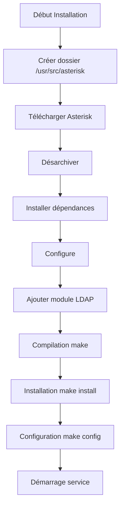
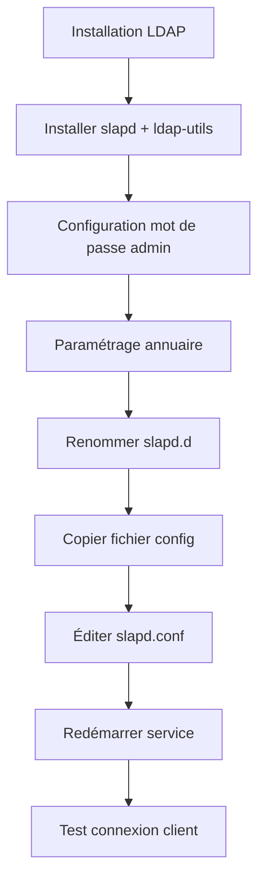
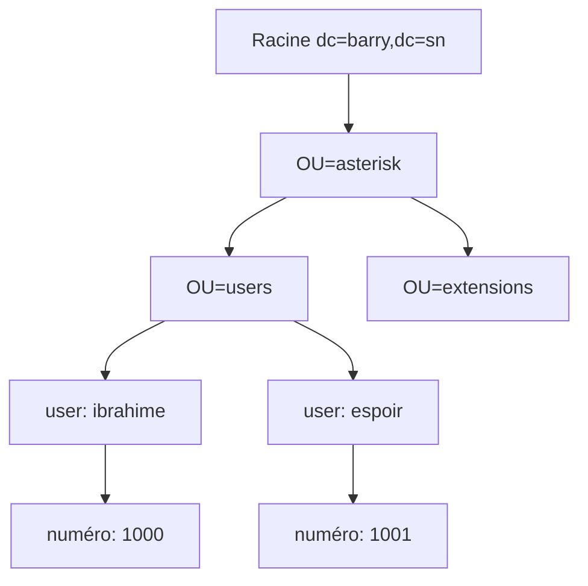
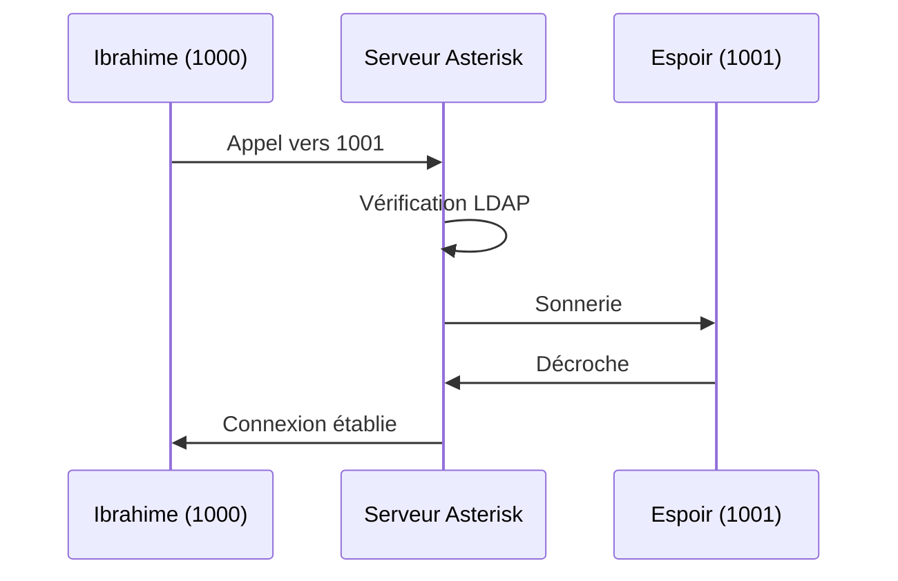

---
<div class="rapport-container">

<div class="page-de-garde">
    <h1 class="universite">Université Cheikh Anta Diop de Dakar</h1>
    <h2 class="ecole">École Supérieure Polytechnique</h2>
    
            <!-- Insérez ici le logo de l'UCAD si disponible -->
            <!--  -->
<div align="center">

![[logo_esp.png| 300]]

</div>
        
    <h3 class="titre-rapport">Rapport d'Analyse Réseau</h3>
    <div class="auteurs">
        <p class="label">Présenté par :</p>
        <p class="nom">Salif BIAYE</p>
        <p class="nom">Ndeye Astou DIAGOURAGA</p>
    </div>
    <div class="superviseur">
        <p class="label">Sous la direction de :</p>
        <p class="nom">Dr. KEBA</p>
    </div>
    <p class="annee">Année Académique 2024-2025</p>
</div>

<nav class="table-des-matieres">
    <h2>Table des Matières</h2>
    <ul>
        <li><a href="#installation">I- Installation des Services</a>
            <ul>
                <li><a href="#install-asterisk">I-a Installation d'Asterisk</a></li>
                <li><a href="#install-ldap">I-b Installation de L'annuaire LDAP</a></li>
            </ul>
        </li>
        <li><a href="#couplage">II- Couplage Asterisk et LDAP</a>
            <ul>
                <li><a href="#config-ldap">Configuration de l'annuaire LDAP</a></li>
                <li><a href="#connexion-ldap">II-a Connexion au serveur LDAP</a></li>
                <li><a href="#config-sip">II-b Configuration générale des comptes SIP</a></li>
                <li><a href="#config-dialplan">II-c Configuration générale du dialplan</a></li>
                <li><a href="#verification">Vérification de la connexion au LDAP</a></li>
                <li><a href="#ajout-users">Ajout des utilisateurs</a></li>
                <li><a href="#test-config">Test de la configuration</a></li>
            </ul>
        </li>
    </ul>
</nav>

<main>
	<div id="installation" class="section-rapport">
		    <h2>I- Installation des Services</h2>
    <div id="install-asterisk" class="bloc-contenu">
	        <h3>I-a Installation d'Asterisk</h3>


 <div class="diagramme-mermaid mermaid " align="center">




</div>

<p>Pour installer Asterisk, nous allons suivre une série d'étapes précises. Commençons par créer le dossier qui contiendra notre paquet Asterisk.</p>

<div class="bloc-code">

```bash
mkdir /usr/src/asterisk
cd /usr/src/asterisk
wget http://downloads.asterisk.org/pub/telephony/asterisk/asterisk-17-current.tar.gz
tar -xvzf asterisk-17-current.tar.gz
cd asterisk-17*
apt-get install gcc g++ make libncurses5-dev
./contrib/scripts/install_prereq install
./configure
make menuconfig
make
make install
make samples
make config
/etc/init.d/asterisk start
```
</div>

<p>Pour vérifier le fonctionnement du serveur Asterisk, on peut lancer la console :</p>

<div class="bloc-code">

```bash
sudo asterisk -rvvvvvv
```

</div>
</div>

<div id="install-ldap" class="bloc-contenu">
<h3>I-b Installation de L'annuaire LDAP</h3>    

<div class="diagramme-mermaid mermaid" align="center" >




</div>

<p>Installation des paquets nécessaires :</p>

<div class="bloc-code">

```bash
apt install slapd ldap-utils
```

</div>

<p>Paramètres principaux du fichier de configuration :</p>

<div class="bloc-code">


```ini
# /etc/ldap/slapd.conf
moduleload back_hdb
backend hdb
database hdb
suffix 'dc=barry,dc=sn'
rootdn 'cn=admin,dc=barry,dc=sn'
rootpw passer
```


</div>

<p>Test de la connexion client-serveur :</p>

<div class="bloc-code">

```bash
ldapsearch -x
```

</div>
    </div>
</div>

<div id="couplage" class="section-rapport">
<h2>II- Couplage Asterisk et LDAP</h2>

<div id="config-ldap" class="bloc-contenu">
<h3>Configuration de l'annuaire LDAP</h3>

<div class="diagramme-mermaid mermaid" align="center">


</div>

<div class="bloc-code">

```ldif
# racine.ldif
dn: dc=barry,dc=sn
objectClass: dcObject
objectClass: organization
dc: barry
o: barry.sn

# info.ldif
dn: ou=asterisk,dc=barry,dc=sn
objectClass: organizationalUnit
ou: asterisk

dn: ou=users,ou=asterisk,dc=barry,dc=sn
objectClass: organizationalUnit
ou: users

dn: ou=extensions,ou=asterisk,dc=barry,dc=sn
objectClass: organizationalUnit
ou: extensions
```

</div>
</div>
<div id="connexion-ldap" class="bloc-contenu">
<h3>II-a Connexion au serveur LDAP</h3>
<p>Configuration de la connexion dans /etc/asterisk/res_ldap.conf :</p>

<div class="bloc-code">

```ini
[_general]
host=127.0.0.1
port=389
protocol=3
basedn=ou=asterisk,dc=barry,dc=sn
pass=passer
user=cn=admin,dc=barry,dc=sn

[sip]
name = uid
callerid = AstAccountCallerID
canreinvite = AstAccountCanReinvite
context = AstAccountContext
host = AstAccountHost
type = AstAccountType
mailbox = AstAccountMailbox
md5secret = AstAccountRealmedPassword
```

</div>
</div>

<div id="config-sip" class="bloc-contenu">
<h3>II-b Configuration générale des comptes SIP</h3>

<p>Configuration dans /etc/asterisk/sip.conf :</p>

<div class="bloc-code">

```ini
rtcachefriends=yes
callevents=yes
realm=barry.sn
```

</div>
</div>

<div id="config-dialplan" class="bloc-contenu">
<h3>II-c Configuration générale du dialplan</h3>

<p>Configuration dans /etc/asterisk/extensions.conf :</p>

<div class="bloc-code">

```ini
[internal]
include => realtime/extensions@internal
```

</div>
    </div>

<div id="verification" class="bloc-contenu">
<h3>Vérification de la connexion au LDAP</h3>

<p>Commandes de vérification dans la console Asterisk :</p>

<div class="bloc-code">

```bash
asterisk -vvvvvvvvvvvvvvvvvvvvvr
module reload
sip reload
dialplan reload
realtime show ldap status
```

</div>
</div>

<div id="ajout-users" class="bloc-contenu">
<h3>Ajout des utilisateurs</h3>

<p>Script d'ajout d'utilisateurs (adduser.sh) :</p>

<div class="bloc-code">

```bash
#!/bin/bash
echo "Nom d'utilisateur:"
read username
echo "Numéro de téléphone:"
read extension
echo "Mot de passe:"
read password

cat << EOF > user.ldif
dn: uid=$username,ou=users,ou=asterisk,dc=barry,dc=sn
objectClass: top
objectClass: AsteriskSIPUser
uid: $username
AstAccountCallerID: $username
AstAccountContext: internal
AstAccountHost: dynamic
AstAccountType: friend
AstAccountRealmedPassword: $password
EOF

ldapadd -x -D "cn=admin,dc=barry,dc=sn" -W -f user.ldif
```

</div>
    </div>

<div id="test-config" class="bloc-contenu">
<h3>Test de la configuration</h3>

<p>Création de deux utilisateurs pour le test :</p>
- ibrahime (extension: 1000)
- espoir (extension: 1001)

<div class="diagramme-mermaid mermaid">



</div>
    </div>
</div>
</main>

<footer class="pied-de-page">
    <p>© 2020 Rapport Couplage LDAP & Asterisk. Tous droits réservés.</p>
</footer>

</div>
