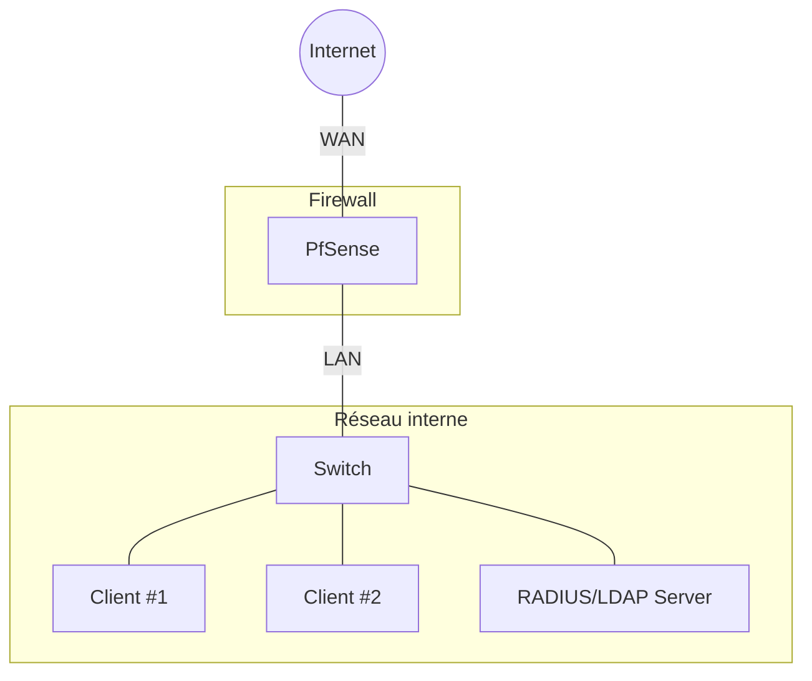
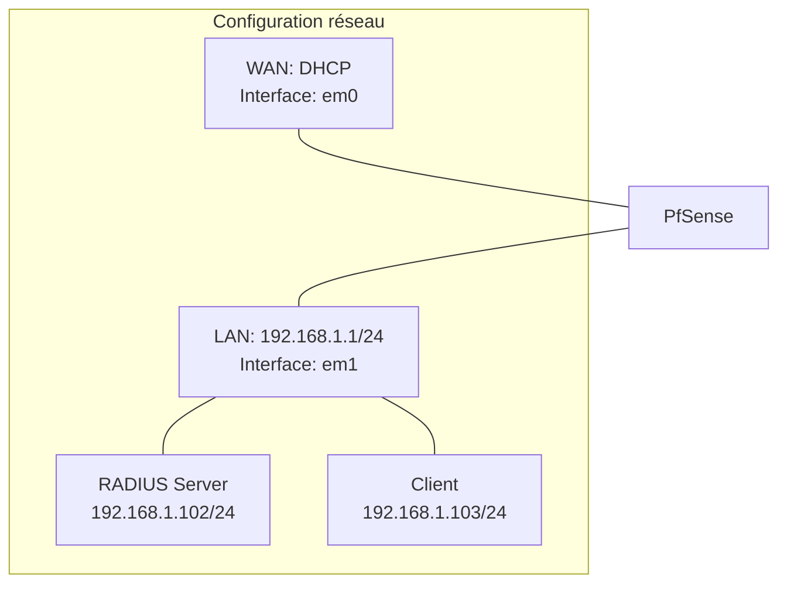

# Guide complet de configuration PfSense avec authentification RADIUS/LDAP

## Sommaire

- [I. Introduction à PfSense](https://claude.ai/chat/b9a48371-f099-41c0-9838-58b41bb7d389#i-introduction-%C3%A0-pfsense)
    - [I.1. Présentation de PfSense](https://claude.ai/chat/b9a48371-f099-41c0-9838-58b41bb7d389#i1-pr%C3%A9sentation-de-pfsense)
    - [I.2. Prérequis matériels et logiciels](https://claude.ai/chat/b9a48371-f099-41c0-9838-58b41bb7d389#i2-pr%C3%A9requis-mat%C3%A9riels-et-logiciels)
- [II. Architecture du réseau](https://claude.ai/chat/b9a48371-f099-41c0-9838-58b41bb7d389#ii-architecture-du-r%C3%A9seau)
    - [II.1. Schéma global](https://claude.ai/chat/b9a48371-f099-41c0-9838-58b41bb7d389#ii1-sch%C3%A9ma-global)
    - [II.2. Topologie réseau](https://claude.ai/chat/b9a48371-f099-41c0-9838-58b41bb7d389#ii2-topologie-r%C3%A9seau)
- [III. Installation et configuration de FreeRADIUS et LDAP](https://claude.ai/chat/b9a48371-f099-41c0-9838-58b41bb7d389#iv-installation-et-configuration-de-freeradius-et-ldap)
    - [III.1. Installation d'Ubuntu Server](https://claude.ai/chat/b9a48371-f099-41c0-9838-58b41bb7d389#iv1-installation-dubuntu-server)
    - [III.2. Installation de FreeRADIUS](https://claude.ai/chat/b9a48371-f099-41c0-9838-58b41bb7d389#iv2-installation-de-freeradius)
    - [III.3. Configuration de FreeRADIUS](https://claude.ai/chat/b9a48371-f099-41c0-9838-58b41bb7d389#iv3-configuration-de-freeradius)
    - [III.4. Installation et configuration d'OpenLDAP](https://claude.ai/chat/b9a48371-f099-41c0-9838-58b41bb7d389#iv4-installation-et-configuration-dopenldap)
    - [III.5. Intégration de FreeRADIUS avec LDAP](https://claude.ai/chat/b9a48371-f099-41c0-9838-58b41bb7d389#iv5-int%C3%A9gration-de-freeradius-avec-ldap)
    - [III.6. Test de configuration](https://claude.ai/chat/b9a48371-f099-41c0-9838-58b41bb7d389#iv6-test-de-configuration)
 - [IV. Installation et configuration de PfSense](https://claude.ai/chat/b9a48371-f099-41c0-9838-58b41bb7d389#iii-installation-et-configuration-de-pfsense)
    - [IV.1. Création des machines virtuelles sur Vmware](https://claude.ai/chat/b9a48371-f099-41c0-9838-58b41bb7d389#iii1-cr%C3%A9ation-des-machines-virtuelles-sur-hyper-v)
    - [IV.2. Configuration des commutateurs virtuels](https://claude.ai/chat/b9a48371-f099-41c0-9838-58b41bb7d389#iii2-configuration-des-commutateurs-virtuels)
    - [IV.3. Installation de PfSense](https://claude.ai/chat/b9a48371-f099-41c0-9838-58b41bb7d389#iii3-installation-de-pfsense)
    - [IV.4. Configuration initiale des interfaces réseau](https://claude.ai/chat/b9a48371-f099-41c0-9838-58b41bb7d389#iii4-configuration-initiale-des-interfaces-r%C3%A9seau)
    - [IV.5. Accès à l'interface web](https://claude.ai/chat/b9a48371-f099-41c0-9838-58b41bb7d389#iii5-acc%C3%A8s-%C3%A0-linterface-web)
    - [IV.6. Configuration des règles de pare-feu](https://claude.ai/chat/b9a48371-f099-41c0-9838-58b41bb7d389#iii6-configuration-des-r%C3%A8gles-de-pare-feu)
    - [IV.7. Configuration Configuration Radius pour l'authentification](https://claude.ai/chat/b9a48371-f099-41c0-9838-58b41bb7d389#iii7-configuration-du-dns)
- [VII. Conclusion](https://claude.ai/chat/b9a48371-f099-41c0-9838-58b41bb7d389#vii-conclusion)

## I. Introduction à PfSense

### I.1. Présentation de PfSense

PfSense est une distribution open-source basée sur FreeBSD, spécialisée dans les services de routage et de pare-feu. Elle offre de nombreuses fonctionnalités avancées généralement trouvées dans les pare-feu commerciaux coûteux, comme le filtrage de paquets, le VPN, le portail captif, et bien d'autres.

PfSense est particulièrement apprécié pour :

- Sa stabilité et sa fiabilité
- Son interface web intuitive
- Sa flexibilité grâce aux nombreux packages disponibles
- Sa gratuité et sa communauté active

### I.2. Prérequis matériels et logiciels

Pour suivre ce guide, vous aurez besoin de :

**Matériel** :

- Un ordinateur hôte avec suffisamment de ressources pour exécuter au moins deux machines virtuelles
- Minimum 8 Go de RAM recommandés
- Espace disque suffisant (au moins 40 Go disponibles)

**Logiciels** :

- Hyper-V (inclus dans Windows 10/11 Pro, Enterprise ou Education)
- Image ISO de PfSense (téléchargeable sur [pfsense.org](https://www.pfsense.org/download/))
- Image ISO d'Ubuntu Server (téléchargeable sur [ubuntu.com](https://ubuntu.com/download/server))

## II. Architecture du réseau

### II.1. Schéma global



### II.2. Topologie réseau




## III. Installation et configuration de FreeRADIUS et LDAP

### III.1. Installation d'Ubuntu Server

1. Démarrez la VM Ubuntu-RADIUS
2. Suivez les étapes d'installation d'Ubuntu Server :
    - Sélectionnez la langue et la disposition du clavier
    - Configurez le réseau :
        - Interface réseau : ens33 (ou l'interface détectée)
        - Configuration IP : Statique
        - Adresse IP : 192.168.1.103
        - Masque : 255.255.255.0
        - Passerelle : 192.168.1.1
        - Serveurs DNS : 192.168.1.1
    - Configurez le nom d'hôte : radius-server
    - Créez un utilisateur administrateur
    - Installez OpenSSH Server pour l'accès à distance
3. Finalisez l'installation et redémarrez

### III.2. Installation de FreeRADIUS

1. Connectez-vous à la VM Ubuntu à l'aide de SSH ou directement dans la console
    
2. Mettez à jour les paquets système :
    
    ```bash
    sudo apt update
    sudo apt upgrade -y
    ```
    
3. Installez FreeRADIUS et les outils associés :
    
    ```bash
    sudo apt install freeradius freeradius-ldap freeradius-utils -y
    ```
    

### III.3. Configuration de FreeRADIUS

1. Arrêtez le service FreeRADIUS :
    
    ```bash
    sudo systemctl stop freeradius
    ```
    
2. Configurez le fichier clients.conf pour autoriser PfSense à communiquer avec FreeRADIUS :
    
    ```bash
    sudo nano /etc/freeradius/3.0/clients.conf
    ```
    
3. Ajoutez la configuration suivante à la fin du fichier :
    
    ```
	client pfsense {
	ipaddr = 192.168.1.1
	secret = testing123
	require_message_authenticator = no
	nas_type = other
	}

	client kdc {
	ipaddr = 192.168.1.103
	secret = testing123
	shortname = kdc
	}
    
    ```
    
4. Configurez le fichier users pour créer un utilisateur de test :
    
    ```bash
    sudo nano /etc/freeradius/3.0/users
    ```
    
5. Ajoutez l'utilisateur suivant pour les tests (avant le bloc "DEFAULT") :
    
    ```
    testuser Cleartext-Password := "password123"
        Reply-Message := "Hello, %{User-Name}"
    ```
    
6. Démarrez FreeRADIUS en mode debug pour vérifier la configuration :
    
    ```bash
    sudo freeradius -X
    ```
    
7. Si aucune erreur n'apparaît, arrêtez FreeRADIUS (Ctrl+C) et démarrez le service :
    
    ```bash
    sudo systemctl start freeradius
    sudo systemctl enable freeradius
    ```
    

### III.4. Installation et configuration d'OpenLDAP

1. Installez OpenLDAP et les outils associés :
    
    ```bash
    sudo apt install slapd ldap-utils -y
    ```
    
2. Lors de l'installation, vous serez invité à définir un mot de passe administrateur pour LDAP
    
3. Reconfigurez slapd pour des paramètres supplémentaires :
    
    ```bash
    sudo dpkg-reconfigure slapd
    ```
    
4. Répondez aux questions comme suit :
    
    - Omettre la configuration d'OpenLDAP ? Non
    - Nom de domaine DNS : ldap.local
    - Nom d'organisation : MonOrganisation
    - Mot de passe administrateur : (entrez un mot de passe fort)
    - Confirmer le mot de passe : (répétez le mot de passe)
    - Moteur de base de données : MDB
    - Supprimer la base lors de la purge : Non
    - Déplacer l'ancienne base de données ? Oui
5. Vérifiez que le service LDAP fonctionne :
    
    ```bash
    sudo systemctl status slapd
    ```
    

### III.5. Intégration de FreeRADIUS avec LDAP

1. Créez un fichier racine LDIF :
    
    ```bash
    nano ~/racine.ldif
    ```
    
2. Ajoutez le contenu suivant :
    
```ldif
GNU nano 2.9.3                                      racine.ldif                                      Modifié
# racine.ldif
dn: dc=smarttech,dc=sn
objectClass: dcObject
objectClass: organization
dc: smarttech
o: smarttech.sn
```

```bash
root@asterisk-ldap:/etc/ldap# ldapadd -x -D "cn=admin,dc=smarttech,dc=sn" -W -f racine.ldif

Enter LDAP Password:
adding new entry "dc=smarttech,dc=sn"

root@asterisk-ldap:/etc/ldap#
```

3. Créez un fichier info.ldif

```ldif
GNU nano 2.9.3                                      info.ldif                                      Modifié
# OU freeradius
dn: ou=freeradius,dc=smarttech,dc=sn
objectClass: top
objectClass: organizationalUnit
ou: asterisk

# OU users
dn: ou=users,ou=freeradius,dc=smarttech,dc=sn
objectClass: top
objectClass: organizationalUnit
ou: users

# OU extensions
dn: ou=extensions,ou=freeradius,dc=smarttech,dc=sn
objectClass: top
objectClass: organizationalUnit
ou: extensions
```

```bash
root@asterisk-ldap:/etc/ldap# ldapadd -x -D "cn=admin,dc=smarttech,dc=sn" -W -f info.ldif

Enter LDAP Password:
adding new entry "ou=freeradius,dc=smarttech,dc=sn"
adding new entry "ou=users,ou=freeradius,dc=smarttech,dc=sn"
adding new entry "ou=extensions,ou=freeradius,dc=smarttech,dc=sn"
```

1. a l'aide d'un script python on automatise maitenant la creation des utilisateurs via une interface graphique voici le script [user.py](https://drive.google.com/file/d/1N-uc-JMOf20haXqRRDtHGB4PvqX82NSx/view?usp=sharing)
![[Pasted image 20250304003501.png]]


    
5. Configurez FreeRADIUS pour utiliser LDAP :
    
    ```bash
    sudo nano /etc/freeradius/3.0/mods-available/ldap
    ```
    
6. Modifiez les paramètres suivants :
    
    ```
    server = 'localhost'
    identity = 'cn=admin,dc=smarttech,dc=sn'
    password = 'passer'
    base_dn = 'dc=smarttech,dc=sn'
    user {
        base_dn = "ou=users,${..base_dn}"
        filter = "(uid=%{%{Stripped-User-Name}:-%{User-Name}})"
    }
    ```
    
7. Activez le module LDAP :
    
    ```bash
    sudo ln -s /etc/freeradius/3.0/mods-available/ldap /etc/freeradius/3.0/mods-enabled/
    ```
    
8. Modifiez le fichier de sites pour utiliser LDAP :
    
    ```bash
    sudo nano /etc/freeradius/3.0/sites-available/default
    ```
    
9. Dans la section `authorize`, assurez-vous que `ldap` est décommenté
    
10. Redémarrez FreeRADIUS :
    
    ```bash
    sudo systemctl restart freeradius
    ```
    

### III.6. Test de configuration

1. Testez l'authentification RADIUS avec l'utilisateur local :
    
    ```bash
    radtest testuser password123 localhost 0 MonSecretPartage
    ```
    
2. Testez l'authentification RADIUS avec l'utilisateur LDAP :
    
    ```bash
    radtest user1 [mot_de_passe] localhost 0 MonSecretPartage
    ```
    

Les deux tests devraient retourner "Access-Accept", confirmant que l'authentification fonctionne.

## IV. Installation et configuration de PfSense

### IV.1. Création des machines virtuelles sur Vmware

1. Ouvrez le **Gestionnaire Vmware**
    
2. Créez une nouvelle machine virtuelle pour PfSense :
    
    - Nom : PfSense
    - Génération : Génération 1 (pour une meilleure compatibilité)
    - Mémoire : 2048 Mo minimum
    - Configuration réseau : Non connecté (nous configurerons les réseaux ultérieurement)
    - Disque dur virtuel : 20 Go
    - Options d'installation : Installer un système d'exploitation à partir d'un fichier image de démarrage (.iso)
    - Sélectionnez l'image ISO de PfSense
3. Créez une seconde machine virtuelle pour Ubuntu Server (RADIUS/LDAP) :
    
    - Nom : Ubuntu-RADIUS
    - Génération : Génération 1
    - Mémoire : 2048 Mo minimum
    - Configuration réseau : Non connecté (nous configurerons le réseau ultérieurement)
    - Disque dur virtuel : 20 Go
    - Options d'installation : Installer un système d'exploitation à partir d'un fichier image de démarrage (.iso)
    - Sélectionnez l'image ISO d'Ubuntu Server

### IV.2. Configuration des commutateurs virtuels

1. Dans le **Virtual network editor**, cliquez sur **Change settings** dans le panneau d'actions
    ![[Pasted image 20250303225625.png]]
2. Créez deux commutateurs virtuels :
    
    **réseau NAT** :
    
    - Nom : VMnet8
    - Type de connexion : Externe
    - Sélectionnez votre carte réseau physique qui a accès à Internet
    ![[Pasted image 20250303225710.png]]
    **réseau Host-only** :
    
    - Nom : VMnet3
    - Type de connexion : Interne
    - Ce commutateur sera utilisé pour le réseau interne
    - ![[Pasted image 20250303225728.png]]
3. Configurez les cartes réseaux de la VM PfSense :
    - Accédez aux **Paramètres** de la VM PfSense
    
    - Ajoutez deux cartes réseau :
        - Adaptateur réseau 1 : Connecté au commutateur virtuel **WAN**
        - Adaptateur réseau 2 : Connecté au commutateur virtuel **LAN**
4. Configurez la carte réseau de la VM Ubuntu-RADIUS :
    
    - Accédez aux **Paramètres** de la VM Ubuntu-RADIUS
    - Configurez l'adaptateur réseau : Connecté au commutateur virtuel **LAN**

### IV.3. Installation de PfSense

1. Démarrez la VM PfSense
2. Lorsque le menu d'installation apparaît, appuyez sur **Entrée** pour lancer l'installation
![[Pasted image 20250303225837.png]]
1. selectionner accept
![[Pasted image 20250303225907.png]]
### IV.4. Configuration initiale des interfaces réseau

Après le redémarrage, PfSense vous demandera de configurer les interfaces réseau :

1. Suivre les étapes jusqu'à la configuration des interfaces réseau
2. pfSense va détecter les interfaces :

3. **Attribuer l’interface WAN** → Sélectionner la carte connectée au commutateur **WAN**
![[Pasted image 20250303230441.png]]
1. **Attribuer l’interface LAN** → Sélectionner la carte connectée au commutateur **LAN**
 ![[Pasted image 20250303230551.png]]
 ![[Pasted image 20250303230615.png]]
5. Attendez la fin de l'installation, puis redémarrez lorsque vous y êtes invité
![[Pasted image 20250303230654.png]]
6.Une fois pfSense installé et redémarré, tu vas voir un menu avec :

- WAN (par défaut en **DHCP**)
- LAN (par défaut en **192.168.1.1/24**)
 ![[Pasted image 20250303230752.png]]

### IV.5. Accès à l'interface web

1. Sur votre ordinateur hôte, configurez une adresse IP statique dans le même sous-réseau que l'interface LAN de PfSense :
    
    - Adresse IP : 192.168.1.102
    - Masque de sous-réseau : 255.255.255.0
    - Passerelle par défaut : 192.168.1.1
2. Ouvrez un navigateur web et accédez à l'adresse `https://192.168.1.1`
    
    - Ignorez les avertissements de sécurité du navigateur concernant le certificat
    - Connectez-vous avec les identifiants par défaut :
        - Nom d'utilisateur : **admin**
        - Mot de passe : **pfsense**
        - ![[Pasted image 20250303231240.png]]
	

### IV.6. Configuration des règles de pare-feu

1. Dans l'interface web de PfSense, allez dans **Firewall** > **Rules**
2. Sélectionnez l'onglet **LAN**
3. Par défaut, une règle permettant tout le trafic sortant depuis LAN devrait exister
4. Si ce n'est pas le cas, ajoutez une règle :
    - Action : **Pass**
    - Interface : **LAN**
    - Adresse source : **LAN net**
    - Adresse de destination : **Any**
    - Description : "Allow LAN to Internet"
5. Cliquez sur **Save** puis sur **Apply Changes**

![[Pasted image 20250303231853.png]]

![[Pasted image 20250303232046.png]]
### IV.7. Configuration Radius pour l'authentification
**🔹 1. Activer et Configurer le Captive Portal sur pfSense**

**➤ Activer le Captive Portal**

1. Connecte-toi à **pfSense**.
2. Va dans **Services** → **Captive Portal**.
3. Clique sur **Ajouter une Zone** et donne-lui un nom (ex: Portail_Reseau).
4. Active la zone et choisis l'interface sur laquelle tu veux appliquer le portail captif (ex: **LAN** ou **WIFI**).
5. Clique sur **Save & Continue**.
	
	![[Pasted image 20250303232339.png]]
![[Pasted image 20250303232536.png]]
**🔹 2. Configurer l'Authentification via FreeRADIUS**

**➤ Ajouter FreeRADIUS comme Serveur d’Auth**

1. **Dans pfSense**, va dans **System** → **User Manager** → **Authentication Servers**.
2. Clique sur **Add** et remplis :

- **Descriptive Name** : FreeRADIUS
- **Type** : RADIUS
- **Hostname or IP Address** : 192.168.1.103 (ton serveur FreeRADIUS)
- **Shared Secret** : (mets le même secret que dans FreeRADIUS)
- **Services Offered** : coche Authentication and Accounting
- **Authentication Port** : 1812
- **Accounting Port** : 1813

1. Clique sur **Save & Test** pour voir si la connexion est OK.
 ![[Pasted image 20250303232759.png]]
 1. on peut voir le nombre d'utilisateurs connectés
![[Pasted image 20250303233100.png]]
## VII. Conclusion

Félicitations ! Vous avez maintenant un système complet avec PfSense, un portail captif, et une authentification via RADIUS et LDAP. Cette configuration vous permet de :

- Gérer votre réseau avec un pare-feu robuste
- Sécuriser l'accès à Internet via un portail d'authentification
- Centraliser la gestion des utilisateurs via LDAP
- Auditer les connexions grâce aux journaux RADIUS

Cette configuration est adaptée à de nombreux environnements, notamment :

- Les petites et moyennes entreprises
- Les établissements éducatifs
- Les hôtels et espaces publics offrant un accès Wi-Fi
- Les environnements de test et de développement

Pour aller plus loin, vous pourriez explorer :

- La mise en place d'un VPN pour l'accès à distance
- La configuration de VLAN pour segmenter davantage votre réseau
- L'implémentation de règles de filtrage par utilisateur
- La supervision du réseau avec des outils comme Nagios ou Zabbix