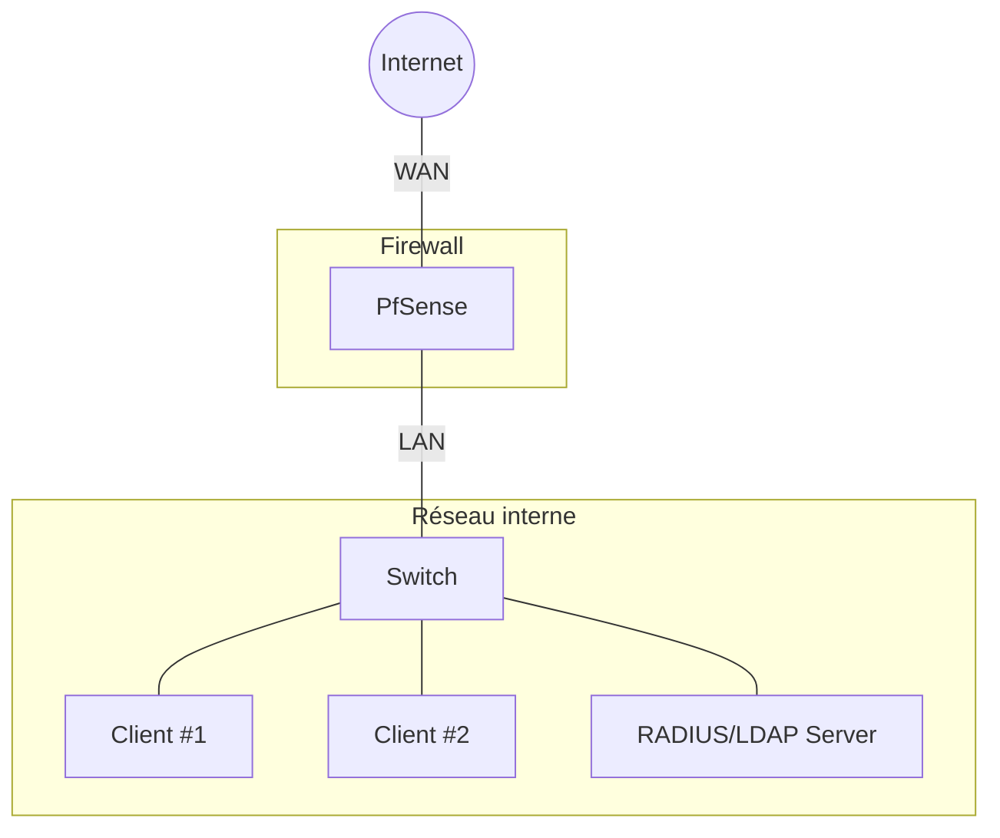
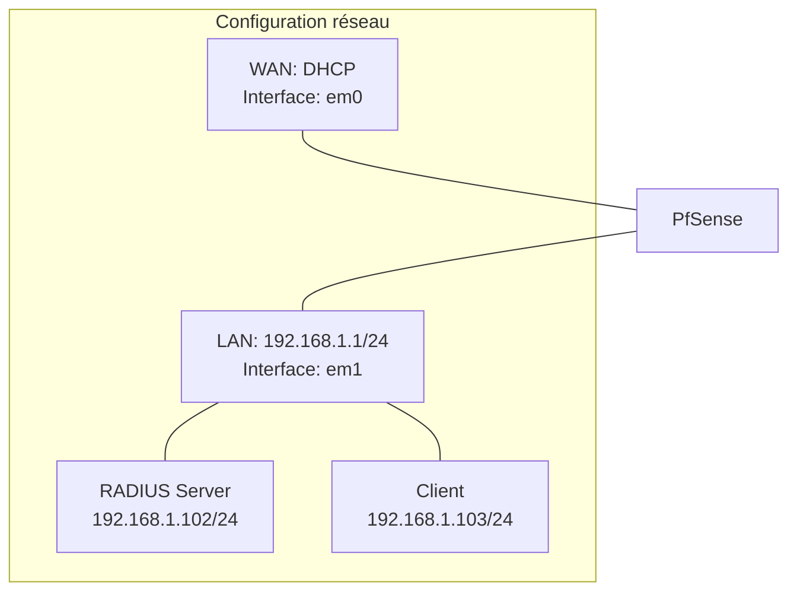

# Guide complet de configuration PfSense avec authentification RADIUS/LDAP

## Sommaire

- [I. Introduction à PfSense](https://claude.ai/chat/b9a48371-f099-41c0-9838-58b41bb7d389#i-introduction-%C3%A0-pfsense)
    - [I.1. Présentation de PfSense](https://claude.ai/chat/b9a48371-f099-41c0-9838-58b41bb7d389#i1-pr%C3%A9sentation-de-pfsense)
    - [I.2. Prérequis matériels et logiciels](https://claude.ai/chat/b9a48371-f099-41c0-9838-58b41bb7d389#i2-pr%C3%A9requis-mat%C3%A9riels-et-logiciels)
- [II. Architecture du réseau](https://claude.ai/chat/b9a48371-f099-41c0-9838-58b41bb7d389#ii-architecture-du-r%C3%A9seau)
    - [II.1. Schéma global](https://claude.ai/chat/b9a48371-f099-41c0-9838-58b41bb7d389#ii1-sch%C3%A9ma-global)
    - [II.2. Topologie réseau](https://claude.ai/chat/b9a48371-f099-41c0-9838-58b41bb7d389#ii2-topologie-r%C3%A9seau)
- [III. Installation et configuration de PfSense](https://claude.ai/chat/b9a48371-f099-41c0-9838-58b41bb7d389#iii-installation-et-configuration-de-pfsense)
    - [III.1. Création des machines virtuelles sur Hyper-V](https://claude.ai/chat/b9a48371-f099-41c0-9838-58b41bb7d389#iii1-cr%C3%A9ation-des-machines-virtuelles-sur-hyper-v)
    - [III.2. Configuration des commutateurs virtuels](https://claude.ai/chat/b9a48371-f099-41c0-9838-58b41bb7d389#iii2-configuration-des-commutateurs-virtuels)
    - [III.3. Installation de PfSense](https://claude.ai/chat/b9a48371-f099-41c0-9838-58b41bb7d389#iii3-installation-de-pfsense)
    - [III.4. Configuration initiale des interfaces réseau](https://claude.ai/chat/b9a48371-f099-41c0-9838-58b41bb7d389#iii4-configuration-initiale-des-interfaces-r%C3%A9seau)
    - [III.5. Accès à l'interface web](https://claude.ai/chat/b9a48371-f099-41c0-9838-58b41bb7d389#iii5-acc%C3%A8s-%C3%A0-linterface-web)
    - [III.6. Configuration des règles de pare-feu](https://claude.ai/chat/b9a48371-f099-41c0-9838-58b41bb7d389#iii6-configuration-des-r%C3%A8gles-de-pare-feu)
    - [III.7. Configuration du DNS](https://claude.ai/chat/b9a48371-f099-41c0-9838-58b41bb7d389#iii7-configuration-du-dns)
- [IV. Installation et configuration de FreeRADIUS et LDAP](https://claude.ai/chat/b9a48371-f099-41c0-9838-58b41bb7d389#iv-installation-et-configuration-de-freeradius-et-ldap)
    - [IV.1. Installation d'Ubuntu Server](https://claude.ai/chat/b9a48371-f099-41c0-9838-58b41bb7d389#iv1-installation-dubuntu-server)
    - [IV.2. Installation de FreeRADIUS](https://claude.ai/chat/b9a48371-f099-41c0-9838-58b41bb7d389#iv2-installation-de-freeradius)
    - [IV.3. Configuration de FreeRADIUS](https://claude.ai/chat/b9a48371-f099-41c0-9838-58b41bb7d389#iv3-configuration-de-freeradius)
    - [IV.4. Installation et configuration d'OpenLDAP](https://claude.ai/chat/b9a48371-f099-41c0-9838-58b41bb7d389#iv4-installation-et-configuration-dopenldap)
    - [IV.5. Intégration de FreeRADIUS avec LDAP](https://claude.ai/chat/b9a48371-f099-41c0-9838-58b41bb7d389#iv5-int%C3%A9gration-de-freeradius-avec-ldap)
    - [IV.6. Test de configuration](https://claude.ai/chat/b9a48371-f099-41c0-9838-58b41bb7d389#iv6-test-de-configuration)
- [V. Configuration du portail captif avec authentification RADIUS](https://claude.ai/chat/b9a48371-f099-41c0-9838-58b41bb7d389#v-configuration-du-portail-captif-avec-authentification-radius)
    - [V.1. Activation du portail captif](https://claude.ai/chat/b9a48371-f099-41c0-9838-58b41bb7d389#v1-activation-du-portail-captif)
    - [V.2. Configuration de l'authentification RADIUS](https://claude.ai/chat/b9a48371-f099-41c0-9838-58b41bb7d389#v2-configuration-de-lauthentification-radius)
    - [V.3. Personnalisation du portail](https://claude.ai/chat/b9a48371-f099-41c0-9838-58b41bb7d389#v3-personnalisation-du-portail)
    - [V.4. Test de fonctionnement](https://claude.ai/chat/b9a48371-f099-41c0-9838-58b41bb7d389#v4-test-de-fonctionnement)
- [VI. Dépannage et monitoring](https://claude.ai/chat/b9a48371-f099-41c0-9838-58b41bb7d389#vi-d%C3%A9pannage-et-monitoring)
    - [VI.1. Journaux système](https://claude.ai/chat/b9a48371-f099-41c0-9838-58b41bb7d389#vi1-journaux-syst%C3%A8me)
    - [VI.2. Outils de diagnostic](https://claude.ai/chat/b9a48371-f099-41c0-9838-58b41bb7d389#vi2-outils-de-diagnostic)
    - [VI.3. Résolution des problèmes courants](https://claude.ai/chat/b9a48371-f099-41c0-9838-58b41bb7d389#vi3-r%C3%A9solution-des-probl%C3%A8mes-courants)
- [VII. Conclusion](https://claude.ai/chat/b9a48371-f099-41c0-9838-58b41bb7d389#vii-conclusion)

## I. Introduction à PfSense

### I.1. Présentation de PfSense

PfSense est une distribution open-source basée sur FreeBSD, spécialisée dans les services de routage et de pare-feu. Elle offre de nombreuses fonctionnalités avancées généralement trouvées dans les pare-feu commerciaux coûteux, comme le filtrage de paquets, le VPN, le portail captif, et bien d'autres.

PfSense est particulièrement apprécié pour :

- Sa stabilité et sa fiabilité
- Son interface web intuitive
- Sa flexibilité grâce aux nombreux packages disponibles
- Sa gratuité et sa communauté active

### I.2. Prérequis matériels et logiciels

Pour suivre ce guide, vous aurez besoin de :

**Matériel** :

- Un ordinateur hôte avec suffisamment de ressources pour exécuter au moins deux machines virtuelles
- Minimum 8 Go de RAM recommandés
- Espace disque suffisant (au moins 40 Go disponibles)

**Logiciels** :

- Hyper-V (inclus dans Windows 10/11 Pro, Enterprise ou Education)
- Image ISO de PfSense (téléchargeable sur [pfsense.org](https://www.pfsense.org/download/))
- Image ISO d'Ubuntu Server (téléchargeable sur [ubuntu.com](https://ubuntu.com/download/server))

## II. Architecture du réseau

### II.1. Schéma global



### II.2. Topologie réseau



## III. Installation et configuration de PfSense

### III.1. Création des machines virtuelles sur Vmware

1. Ouvrez le **Gestionnaire Vmware**
    
2. Créez une nouvelle machine virtuelle pour PfSense :
    
    - Nom : PfSense
    - Génération : Génération 1 (pour une meilleure compatibilité)
    - Mémoire : 2048 Mo minimum
    - Configuration réseau : Non connecté (nous configurerons les réseaux ultérieurement)
    - Disque dur virtuel : 20 Go
    - Options d'installation : Installer un système d'exploitation à partir d'un fichier image de démarrage (.iso)
    - Sélectionnez l'image ISO de PfSense
3. Créez une seconde machine virtuelle pour Ubuntu Server (RADIUS/LDAP) :
    
    - Nom : Ubuntu-RADIUS
    - Génération : Génération 1
    - Mémoire : 2048 Mo minimum
    - Configuration réseau : Non connecté (nous configurerons le réseau ultérieurement)
    - Disque dur virtuel : 20 Go
    - Options d'installation : Installer un système d'exploitation à partir d'un fichier image de démarrage (.iso)
    - Sélectionnez l'image ISO d'Ubuntu Server

### III.2. Configuration des commutateurs virtuels

1. Dans le **Virtual network editor**, cliquez sur **Change settings** dans le panneau d'actions
    
2. Créez deux commutateurs virtuels :
    
    **réseau NAT** :
    
    - Nom : VMnet8
    - Type de connexion : Externe
    - Sélectionnez votre carte réseau physique qui a accès à Internet
    
    **réseau Host-only** :
    
    - Nom : VMnet3
    - Type de connexion : Interne
    - Ce commutateur sera utilisé pour le réseau interne
3. Configurez les cartes réseaux de la VM PfSense :
    
    - Accédez aux **Paramètres** de la VM PfSense
    - Ajoutez deux cartes réseau :
        - Adaptateur réseau 1 : Connecté au commutateur virtuel **WAN**
        - Adaptateur réseau 2 : Connecté au commutateur virtuel **LAN**
4. Configurez la carte réseau de la VM Ubuntu-RADIUS :
    
    - Accédez aux **Paramètres** de la VM Ubuntu-RADIUS
    - Configurez l'adaptateur réseau : Connecté au commutateur virtuel **LAN**

### III.3. Installation de PfSense

1. Démarrez la VM PfSense
2. Lorsque le menu d'installation apparaît, appuyez sur **Entrée** pour lancer l'installation
3. Sélectionnez la disposition de clavier appropriée
4. Choisissez **Install PfSense**
5. Sélectionnez les options par défaut pour le partitionnement du disque
6. Attendez la fin de l'installation, puis redémarrez lorsque vous y êtes invité

### III.4. Configuration initiale des interfaces réseau

Après le redémarrage, PfSense vous demandera de configurer les interfaces réseau :

1. Lorsque vous êtes invité à configurer les VLANs, tapez **n** pour "non"
2. Lorsqu'on vous demande de nommer les interfaces :
    - Assignez **em0** (généralement la première interface détectée) comme interface **WAN**
    - Assignez **em1** (généralement la seconde interface détectée) comme interface **LAN**
3. Confirmez vos choix en tapant **y** pour "oui"
4. PfSense va configurer les interfaces avec les paramètres par défaut :
    - WAN : Configuration via DHCP
    - LAN : IP statique 192.168.1.1/24

Une fois le système démarré, vous verrez le menu principal de PfSense en ligne de commande.

### III.5. Accès à l'interface web

1. Sur votre ordinateur hôte, configurez une adresse IP statique dans le même sous-réseau que l'interface LAN de PfSense :
    
    - Adresse IP : 192.168.1.103
    - Masque de sous-réseau : 255.255.255.0
    - Passerelle par défaut : 192.168.1.1
    - Serveurs DNS : 192.168.1.1
2. Ouvrez un navigateur web et accédez à l'adresse `https://192.168.1.1`
    
    - Ignorez les avertissements de sécurité du navigateur concernant le certificat
    - Connectez-vous avec les identifiants par défaut :
        - Nom d'utilisateur : **admin**
        - Mot de passe : **pfsense**
3. Suivez l'assistant de configuration initiale :
    
    - Configurez le nom d'hôte et le domaine (ex : pfsense.local)
    - Configurez le serveur NTP
    - Conservez les paramètres par défaut des interfaces WAN et LAN
    - Définissez un nouveau mot de passe administrateur

### III.6. Configuration des règles de pare-feu

1. Dans l'interface web de PfSense, allez dans **Firewall** > **Rules**
2. Sélectionnez l'onglet **LAN**
3. Par défaut, une règle permettant tout le trafic sortant depuis LAN devrait exister
4. Si ce n'est pas le cas, ajoutez une règle :
    - Action : **Pass**
    - Interface : **LAN**
    - Adresse source : **LAN net**
    - Adresse de destination : **Any**
    - Description : "Allow LAN to Internet"
5. Cliquez sur **Save** puis sur **Apply Changes**

### III.7. Configuration du DNS

1. Allez dans **Services** > **DNS Resolver**
2. Assurez-vous que le service est activé
3. Configurez les options suivantes :
    - Activez "DNSSEC Support"
    - Activez "DNS Query Forwarding"
    - Dans la section "Network Interfaces", assurez-vous que LAN est sélectionné
4. Dans "Host Overrides", ajoutez une entrée pour le serveur RADIUS :
    - Host : radius
    - Domain : local
    - IP Address : 192.168.1.102
    - Description : "RADIUS Server"
5. Cliquez sur **Save** puis sur **Apply Changes**

## IV. Installation et configuration de FreeRADIUS et LDAP

### IV.1. Installation d'Ubuntu Server

1. Démarrez la VM Ubuntu-RADIUS
2. Suivez les étapes d'installation d'Ubuntu Server :
    - Sélectionnez la langue et la disposition du clavier
    - Configurez le réseau :
        - Interface réseau : ens33 (ou l'interface détectée)
        - Configuration IP : Statique
        - Adresse IP : 192.168.1.102
        - Masque : 255.255.255.0
        - Passerelle : 192.168.1.1
        - Serveurs DNS : 192.168.1.1
    - Configurez le nom d'hôte : radius-server
    - Créez un utilisateur administrateur
    - Installez OpenSSH Server pour l'accès à distance
3. Finalisez l'installation et redémarrez

### IV.2. Installation de FreeRADIUS

1. Connectez-vous à la VM Ubuntu à l'aide de SSH ou directement dans la console
    
2. Mettez à jour les paquets système :
    
    ```bash
    sudo apt update
    sudo apt upgrade -y
    ```
    
3. Installez FreeRADIUS et les outils associés :
    
    ```bash
    sudo apt install freeradius freeradius-ldap freeradius-utils -y
    ```
    

### IV.3. Configuration de FreeRADIUS

1. Arrêtez le service FreeRADIUS :
    
    ```bash
    sudo systemctl stop freeradius
    ```
    
2. Configurez le fichier clients.conf pour autoriser PfSense à communiquer avec FreeRADIUS :
    
    ```bash
    sudo nano /etc/freeradius/3.0/clients.conf
    ```
    
3. Ajoutez la configuration suivante à la fin du fichier :
    
    ```
    client pfsense {
        ipaddr = 192.168.1.1
        secret = MonSecretPartage
        shortname = pfsense
        nas_type = other
    }
    ```
    
4. Configurez le fichier users pour créer un utilisateur de test :
    
    ```bash
    sudo nano /etc/freeradius/3.0/users
    ```
    
5. Ajoutez l'utilisateur suivant pour les tests (avant le bloc "DEFAULT") :
    
    ```
    testuser Cleartext-Password := "password123"
        Reply-Message := "Hello, %{User-Name}"
    ```
    
6. Démarrez FreeRADIUS en mode debug pour vérifier la configuration :
    
    ```bash
    sudo freeradius -X
    ```
    
7. Si aucune erreur n'apparaît, arrêtez FreeRADIUS (Ctrl+C) et démarrez le service :
    
    ```bash
    sudo systemctl start freeradius
    sudo systemctl enable freeradius
    ```
    

### IV.4. Installation et configuration d'OpenLDAP

1. Installez OpenLDAP et les outils associés :
    
    ```bash
    sudo apt install slapd ldap-utils -y
    ```
    
2. Lors de l'installation, vous serez invité à définir un mot de passe administrateur pour LDAP
    
3. Reconfigurez slapd pour des paramètres supplémentaires :
    
    ```bash
    sudo dpkg-reconfigure slapd
    ```
    
4. Répondez aux questions comme suit :
    
    - Omettre la configuration d'OpenLDAP ? Non
    - Nom de domaine DNS : ldap.local
    - Nom d'organisation : MonOrganisation
    - Mot de passe administrateur : (entrez un mot de passe fort)
    - Confirmer le mot de passe : (répétez le mot de passe)
    - Moteur de base de données : MDB
    - Supprimer la base lors de la purge : Non
    - Déplacer l'ancienne base de données ? Oui
5. Vérifiez que le service LDAP fonctionne :
    
    ```bash
    sudo systemctl status slapd
    ```
    

### IV.5. Intégration de FreeRADIUS avec LDAP

1. Créez un fichier LDIF pour ajouter la structure organisationnelle :
    
    ```bash
    nano ~/users.ldif
    ```
    
2. Ajoutez le contenu suivant :
    
    ```ldif
    dn: ou=users,dc=ldap,dc=local
    objectClass: organizationalUnit
    ou: users
    
    dn: ou=groups,dc=ldap,dc=local
    objectClass: organizationalUnit
    ou: groups
    
    dn: cn=radiususers,ou=groups,dc=ldap,dc=local
    objectClass: posixGroup
    cn: radiususers
    gidNumber: 2000
    
    dn: uid=user1,ou=users,dc=ldap,dc=local
    objectClass: inetOrgPerson
    objectClass: posixAccount
    objectClass: shadowAccount
    uid: user1
    sn: User
    givenName: Test
    cn: Test User
    displayName: Test User
    uidNumber: 2000
    gidNumber: 2000
    userPassword: {CRYPT}x
    gecos: Test User
    loginShell: /bin/bash
    homeDirectory: /home/user1
    ```
    
3. Importez cette structure dans LDAP :
    
    ```bash
    ldapadd -x -D cn=admin,dc=ldap,dc=local -W -f ~/users.ldif
    ```
    
    (Entrez le mot de passe administrateur LDAP)
    
4. Définissez le mot de passe pour l'utilisateur user1 :
    
    ```bash
    ldappasswd -x -D cn=admin,dc=ldap,dc=local -W -S uid=user1,ou=users,dc=ldap,dc=local
    ```
    
    (Entrez le mot de passe administrateur LDAP, puis définissez et confirmez le mot de passe pour user1)
    
5. Configurez FreeRADIUS pour utiliser LDAP :
    
    ```bash
    sudo nano /etc/freeradius/3.0/mods-available/ldap
    ```
    
6. Modifiez les paramètres suivants :
    
    ```
    server = 'localhost'
    identity = 'cn=admin,dc=ldap,dc=local'
    password = 'MotDePasseAdmin'
    base_dn = 'dc=ldap,dc=local'
    user {
        base_dn = "ou=users,${..base_dn}"
        filter = "(uid=%{%{Stripped-User-Name}:-%{User-Name}})"
    }
    ```
    
7. Activez le module LDAP :
    
    ```bash
    sudo ln -s /etc/freeradius/3.0/mods-available/ldap /etc/freeradius/3.0/mods-enabled/
    ```
    
8. Modifiez le fichier de sites pour utiliser LDAP :
    
    ```bash
    sudo nano /etc/freeradius/3.0/sites-available/default
    ```
    
9. Dans la section `authorize`, assurez-vous que `ldap` est décommenté
    
10. Redémarrez FreeRADIUS :
    
    ```bash
    sudo systemctl restart freeradius
    ```
    

### IV.6. Test de configuration

1. Testez l'authentification RADIUS avec l'utilisateur local :
    
    ```bash
    radtest testuser password123 localhost 0 MonSecretPartage
    ```
    
2. Testez l'authentification RADIUS avec l'utilisateur LDAP :
    
    ```bash
    radtest user1 [mot_de_passe] localhost 0 MonSecretPartage
    ```
    

Les deux tests devraient retourner "Access-Accept", confirmant que l'authentification fonctionne.

## V. Configuration du portail captif avec authentification RADIUS

### V.1. Activation du portail captif

1. Dans l'interface web de PfSense, allez dans **Services** > **Captive Portal**
2. Cliquez sur **Add Zone** pour créer une nouvelle zone
3. Configurez les paramètres de base :
    - Zone name : PortailReseau
    - Description : Portail d'authentification
    - Interfaces : LAN (sélectionnez l'interface sur laquelle appliquer le portail captif)
    - Cochez "Enable Captive Portal"
4. Cliquez sur **Save & Continue**

### V.2. Configuration de l'authentification RADIUS

1. Dans PfSense, allez dans **System** > **User Manager** > **Authentication Servers**
    
2. Cliquez sur **Add** pour configurer un nouveau serveur RADIUS
    
3. Remplissez les champs suivants :
    
    - Descriptive name : FreeRADIUS
    - Type : RADIUS
    - Hostname or IP address : 192.168.1.102
    - Shared Secret : MonSecretPartage (le même que dans clients.conf)
    - Services offered : Authentication and Accounting
    - Authentication port : 1812
    - Accounting port : 1813
4. Cliquez sur **Save & Test** pour vérifier la connexion
    
5. Retournez à **Services** > **Captive Portal** > **PortailReseau**
    
6. Dans l'onglet **Authentication**, configurez :
    
    - Authentication method : sélectionnez "Use RADIUS authentication"
    - Primary RADIUS server : sélectionnez "FreeRADIUS" dans la liste
    - Cochez "Send RADIUS accounting packets"
    - Cochez "Use RADIUS attributes for access control"
7. Cliquez sur **Save**
    

### V.3. Personnalisation du portail

1. Dans la configuration de la zone Captive Portal, allez à l'onglet **Portal Pages**
    
2. Vous pouvez :
    
    - Télécharger une image de logo personnalisée
    - Personnaliser les textes d'authentification
    - Modifier les couleurs et l'apparence
3. Pour une personnalisation avancée, cochez "Use custom captive portal page" et éditez le HTML
    
4. Exemple de HTML personnalisé :
    
    ```html
    <!DOCTYPE html>
    <html>
    <head>
        <title>Portail d'authentification</title>
        <meta charset="UTF-8">
        <meta name="viewport" content="width=device-width, initial-scale=1.0">
        <style>
            body {
                font-family: Arial, sans-serif;
                background-color: #f5f5f5;
                margin: 0;
                padding: 0;
            }
            .container {
                max-width: 400px;
                margin: 100px auto;
                padding: 20px;
                background-color: white;
                border-radius: 5px;
                box-shadow: 0 2px 10px rgba(0, 0, 0, 0.1);
            }
            h1 {
                text-align: center;
                color: #333;
            }
            input[type="text"], input[type="password"] {
                width: 100%;
                padding: 10px;
                margin: 10px 0;
                border: 1px solid #ddd;
                border-radius: 3px;
                box-sizing: border-box;
            }
            input[type="submit"] {
                width: 100%;
                padding: 10px;
                background-color: #4CAF50;
                color: white;
                border: none;
                border-radius: 3px;
                cursor: pointer;
            }
            input[type="submit"]:hover {
                background-color: #45a049;
            }
            .error {
                color: red;
                text-align: center;
            }
        </style>
    </head>
    <body>
        <div class="container">
            <h1>Bienvenue sur notre réseau</h1>
            <p>Veuillez vous authentifier pour accéder à Internet.</p>
            
            <?php if (!empty($error_message)): ?>
            <p class="error"><?=$error_message;?></p>
            <?php endif; ?>
            
            <form method="post" action="$PORTAL_ACTION$">
                <input name="auth_user" type="text" placeholder="Nom d'utilisateur">
                <input name="auth_pass" type="password" placeholder="Mot de passe">
                <input name="accept" type="submit" value="Se connecter">
                <input name="redirurl" type="hidden" value="$PORTAL_REDIRURL$">
            </form>
        </div>
    </body>
    </html>
    ```
    
5. Cliquez sur **Save**
    

### V.4. Test de fonctionnement

1. Connectez un ordinateur client au réseau LAN
    
2. L'ordinateur devrait être automatiquement redirigé vers le portail captif
    
3. Connectez-vous avec un compte utilisateur RADIUS/LDAP :
    
    - Nom d'utilisateur : user1
    - Mot de passe : (le mot de passe défini précédemment)
4. Après une authentification réussie, vous devriez avoir accès à Internet
    
5. Pour vérifier les utilisateurs connectés, allez dans **Status** > **Captive Portal** et cliquez sur l'onglet **Active Users**
    

## VI. Dépannage et monitoring

### VI.1. Journaux système

Pour consulter les journaux pertinents :

1. **Journaux PfSense** :
    
    - Dans l'interface web de PfSense, allez dans **Status** > **System Logs**
    - Consultez les onglets **General**, **Firewall**, et **Portal Auth**
2. **Journaux FreeRADIUS sur Ubuntu** :
    
    ```bash
    sudo tail -f /var/log/freeradius/radius.log
    ```
    
3. **Journaux LDAP sur Ubuntu** :
    
    ```bash
    sudo tail -f /var/log/slapd.log
    ```
    

### VI.2. Outils de diagnostic

1. **Test de connexion RADIUS depuis PfSense** :
    
    - Allez dans **Diagnostics** > **Authentication**
    - Sélectionnez le serveur RADIUS
    - Entrez un nom d'utilisateur et un mot de passe
    - Cliquez sur **Test**
2. **Test de connexion depuis la ligne de commande Ubuntu** :
    
    ```bash
    radtest user1 password 192.168.1.102 0 MonSecretPartage
    ```
    
3. **Vérification des ports ouverts** :
    
    ```bash
    sudo netstat -tuln | grep -E '1812|1813|389'
    ```
    
    (Doit montrer que RADIUS écoute sur les ports 1812 et 1813, et LDAP sur 389)
    

### VI.3. Résolution des problèmes courants

1. **Problème de connexion au serveur RADIUS** :
    
    - Vérifiez que le secret partagé est identique dans PfSense et dans `/etc/freeradius/3.0/clients.conf`
    - Assurez-vous que le pare-feu Ubuntu autorise les ports 1812 et 1813 :
        
        ```bash
        sudo ufw allow 1812/udpsudo ufw allow 1813/udp
        ```
        
2. **Problème d'authentification LDAP** :
    
    - Vérifiez la configuration du module LDAP dans `/etc/freeradius/3.0/mods-enabled/ldap`
    - Testez manuellement la connexion LDAP :
        
        ```bash
        ldapsearch -x -D "cn=admin,dc=ldap,dc=local" -W -b "dc=ldap,dc=local"
        ```
        
3. **Problème de redirection du portail captif** :
    
    - Assurez-vous que le DNS est correctement configuré sur PfSense
    - Vérifiez les règles de pare-feu pour l'interface LAN
4. **Problème d'accès Internet après authentification** :
    
    - Vérifiez les règles de pare-feu pour l'interface WAN
    - Assurez-vous que l'interface WAN obtient une adresse IP via DHCP

## VII. Conclusion

Félicitations ! Vous avez maintenant un système complet avec PfSense, un portail captif, et une authentification via RADIUS et LDAP. Cette configuration vous permet de :

- Gérer votre réseau avec un pare-feu robuste
- Sécuriser l'accès à Internet via un portail d'authentification
- Centraliser la gestion des utilisateurs via LDAP
- Auditer les connexions grâce aux journaux RADIUS

Cette configuration est adaptée à de nombreux environnements, notamment :

- Les petites et moyennes entreprises
- Les établissements éducatifs
- Les hôtels et espaces publics offrant un accès Wi-Fi
- Les environnements de test et de développement

Pour aller plus loin, vous pourriez explorer :

- La mise en place d'un VPN pour l'accès à distance
- La configuration de VLAN pour segmenter davantage votre réseau
- L'implémentation de règles de filtrage par utilisateur
- La supervision du réseau avec des outils comme Nagios ou Zabbix