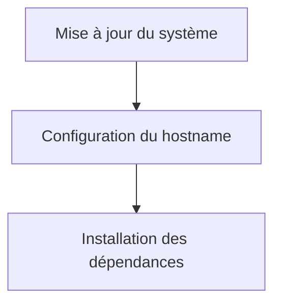
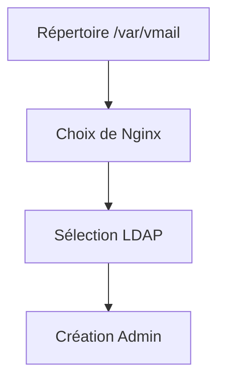
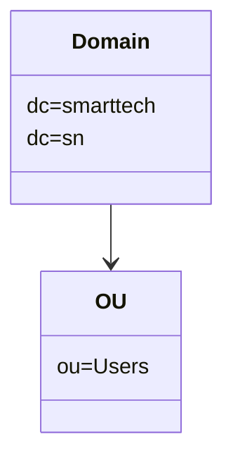

---

<div class="rapport-container">

<div class="page-de-garde">
    <h1 class="universite">Université Cheikh Anta Diop de Dakar</h1>
    <h2 class="ecole">École Supérieure Polytechnique</h2>
    
            <!-- Insérez ici le logo de l'UCAD si disponible -->
            <!--  -->
<div align="center">

![[logo_esp.png| 300]]

</div>
        
    <h3 class="titre-rapport">Rapport Messagerie avec iRedMail/LDAP</h3>
    <div class="auteurs">
        <p class="label">Présenté par :</p>
        <p class="nom">Salif BIAYE</p>
        <p class="nom">Ndeye Astou DIAGOURAGA</p>
    </div>
    <div class="supervisor" style="padding: 15px; border-radius: 5px; margin: 20px 0;">

### Sous la direction de :
#### Dr Keba
*Enseignant*

</div>

---

<div  style="border: 3px double #1a5f7a; padding: 20px ;0;">

### Année universitaire 2024-2025
**

</div>
</div>
<div style="page-break-after: always;">
</div>
<h2>Table des Matières</h2>
<nav class="table-des-matieres">
    <ul>
        <li><a href="#preparation"><h3>I. Préparation du Système</h3></a>
            <ul>
                <li><a href="#Configuration-Initiale"><h4>I.1. Mise à jour du Système</h4></a></li>
            </ul>
        </li>
        <li><a href="#installation"><h3>II. Installation d'iRedMail</h3></a>
            <ul>
                <li><a href="#telechargement"><h4>II.1. Téléchargement et Extraction</h4></a></li>
                <li><a href="#configuration-interactive"><h4>II.2. Configuration Interactive</h4></a></li>
            </ul>
        </li>
        <li><a href="#ldap"><h3>III. Configuration LDAP</h3></a>
            <ul>
                <li><a href="#structure-ldap"><h4>III.1. Structure LDAP</h4></a></li>
                <li><a href="#verification"><h4>III.2. Vérification de la Configuration LDAP</h4></a></li>
            </ul>
        </li>
        <li><a href="#automatisation"><h3>IV. Automatisation avec Python</h3></a>
            <ul>
                <li><a href="#creation-comptes"><h4>IV.1. Script de Création de Comptes</h4></a></li>
                <li><a href="#envoi-mails"><h4>IV.2. Script d'Envoi de Mails Automatisé</h4></a></li>
            </ul>
        </li>
        <li><a href="#demo"><h3>V. Démonstration Pratique</h3></a>
            <ul>
                <li><a href="#roundcube"><h4>V.1. Accès à Roundcube</h4></a></li>
                <li><a href="#workflow"><h4>V.2. Workflow d'Envoi et Réception de Mails</h4></a></li>
                <li><a href="#video"><h4>V.3. Vidéo de Démonstration (BONUS VIDEO)</h4></a></li>
            </ul>
        </li>
        <li><a href="#conclusion"><h3>VI. Conclusion</h3></a></li>
    </ul>
</nav>

<main>
<div id="preparation" class="section-rapport">
<h2>I. Préparation du Système</h2>
        
<div class="bloc-contenu">
<h3 id="#Configuration-Initiale">I.1. Configuration Initiale</h3>
<div class="diagramme-mermaid" align="center">



</div>

<div class="bloc-code">

```bash
# Mise à jour du système
sudo apt update && sudo apt upgrade -y
# Configuration du hostname
hostnamectl set-hostname mail.smarttech.sn
echo "192.168.1.230 mail.smarttech.sn" >> /etc/hosts
```

</div>

<div class="bloc-code">

```bash
#!/bin/bash

# GNU nano 6.2                                                                     /etc/hosts *
echo "127.0.0.1        localhost mail.smarttech.sn mail"
echo "127.0.1.1        reseaux.myguest.virtualbox.org reseaux"
echo "192.168.1.230    mail.smarttech.sn"
echo "192.168.1.230    smarttech.sn"

# The following lines are desirable for IPv6 capable hosts
echo "::1              ip6-localhost ip6-loopback"
echo "fe00::0          ip6-localnet"
echo "ff00::0          ip6-mcastprefix"
echo "ff02::1          ip6-allnodes"
echo "ff02::2          ip6-allrouters"
```

</div>

<p>

**Installer les dépendances nécessaires**

Installez les packages de base pour la configuration réseau :

</p>

<div class="bloc-code">

```bash
#!/bin/bash

# root@mail.smarttech.sn:~# sudo apt install curl wget gnupg -y
echo "Reading package lists... Done"
echo "Building dependency tree... Done"
echo "Reading state information... Done"
echo "curl is already the newest version (7.81.0-1ubuntu1.19)."
echo "gnupg is already the newest version (2.2.27-3ubuntu2.1)."
echo "gnupg set to manually installed."
echo "The following packages will be upgraded:"
echo "wget"
```

</div>


</div>
</div>

<div id="installation" class="section-rapport">
<h2>II. Installation d'iRedMail</h2>
        
<div class="bloc-contenu">
<h3 id="#telechargement">II.1. Téléchargement et Configuration</h3>

<p>

**a.** **Télécharger la dernière version de iRedMail sur le site officiel**

</p>
<div class="bloc-code">

```bash
root@mail.smarttech.sn:/home/salif/Downloads# ls
iRedMail-1.7.1.tar.gz

```
</div>
<p>- Puis Décompressez l’archive :</p>

<div class="bloc-code">

```bash
root@mail.smarttech.sn:/home/salif/Downloads# 
tar -xvzf iRedMail-1.7.1.tar.gz iRedMail-1.7.1/

```
</div>
<p>executons ensuite le script d'installation</p>

<div class="bloc-code">

```bash
#!/bin/bash

# root@mail.smarttech.sn:/home/salif/Downloads# cd iRedMail-1.7.1/
	echo "root@mail.smarttech.sn:/home/salif/Downloads/iRedMail-1.7.1#"

# root@mail.smarttech.sn:/home/salif/Downloads/iRedMail-1.7.1# ls
echo "ChangeLog conf dialog Documentations Functions iRedMail.sh LICENSE pkgs README.md samples tools update"

# root@mail.smarttech.sn:/home/salif/Downloads/iRedMail-1.7.1# bash iRedMail.sh
echo "[INFO] Checking new version of iRedMail..."
echo "[INFO] Installing package(s): gnupg2 dialog"

echo "Reading package lists... Done"
echo "Building dependency tree... Done"
echo "Reading state information... Done"
```

</div>


<h3 id="#configuration-interactive">II.2. Configuration Interactive</h3>
<div class="diagramme-mermaid" align="center">



</div>

<p>

Pendant l'installation, iRedMail vous demandera plusieurs informations :

a. **Répertoire de stockage des données** :

- Par défaut : /var/vmail.
</p>

<div class="diagramme-mermaid" align="center">

<div class="logo-container" align="center">

![[varmail.png]]

</div>

</div>

<p>

b. **Choisir un serveur web** :

- Sélectionnez **Nginx**.
</p>

<div class="diagramme-mermaid" align="center">

<div class="logo-container" align="center">

![[nginx.png]]


</div>

</div>

<p>Lors de l'installation d'iRedMail, vous devez choisir un backend pour stocker les comptes utilisateur. Nous recommandons d'utiliser <strong>OpenLDAP</strong> pour une gestion centralisée des utilisateurs.</p>
<div class="bloc-code">

```bash
Choose preferred backend used to store mail accounts:
[*] OpenLDAP
[ ] MariaDB
[ ] PostgreSQL
```

</div>
<p>Cette sélection permet à iRedMail de configurer automatiquement OpenLDAP pour gérer les utilisateurs et les groupes.</p>

<p>- Définir le mot de passe root pour accéder dans la base de donnees</p>

<div class="diagramme-mermaid" align="center">

<div class="logo-container" align="center">

![[password.png]]


</div>

</div>

<p>

d. **Nom de domaine** :

- Entrez votre nom de domaine (par exemple, mail.smarttech.sn).

</p>

<div class="diagramme-mermaid" align="center">

<div class="logo-container" align="center">

![[mailsmarttech.png]]


</div>

</div>


<div class="diagramme-mermaid" align="center">

<div class="logo-container" align="center">

![[mailsmarttech2.png]]

</div>

</div>

<p>

e. **Créer un mot de passe pour l'administrateur** :

- Entrez un mot de passe fort pour l'utilisateur admin.`


</p>

<div class="diagramme-mermaid" align="center">

<div class="logo-container" align="center">

![[passwordsmarttech.png]]

</div>

</div>

<div class="diagramme-mermaid" align="center">

<div class="logo-container" align="center">

![[roundecube.png]]

</div>

</div>

<p>Une fois la configuration terminée, l'installation s'effectuera automatiquement.</p>

<div class="diagramme-mermaid" align="center">

<div class="logo-container" align="center">

![[install.png]]

</div>

</div>

<p> Apres installation </p>

<div class="diagramme-mermaid" align="center">

<div class="logo-container" align="center">

![[install1.png]]

</div>

</div>

<div class="diagramme-mermaid" align="center">

<div class="logo-container" align="center">

![[install2.png]]

</div>

</div>


<p>Options clés durant l'installation :</p>
            <ul>
                <li>Backend : <strong>OpenLDAP</strong></li>
                <li>Mot de passe admin : <code>passer</code></li>
                <li>Domaine : <code>smarttech.sn</code></li>
            </ul>

</div>

<div id="ldap" class="section-rapport">
<h2>III. Configuration LDAP</h2>
        
<div class="bloc-contenu">
<h3 id="#structure-ldap">III.1. Structure LDAP</h3>

<div class="diagramme-mermaid" align="center">



</div>


<h3 id="#verification">III.2. Vérification LDAP</h3>

<div class="bloc-code">

```bash
ldapsearch -x -H ldap://localhost -b "dc=smarttech,dc=sn"
```
</div>

<div class="bloc-code">


```ldif
dn: uid=salif,ou=Users,dc=smarttech,dc=sn
objectClass: inetOrgPerson
objectClass: posixAccount
objectClass: top
cn: salif biaye
sn: biaye
uid: salif
mail: salif@smarttech.sn
userPassword:: e1NTSEF9S2EwQS8xdFYyNFUzaUkwRUxTc1M3VDJid1NSellXeDA=
loginShell: /bin/bash
uidNumber: 1000
gidNumber: 1000
homeDirectory: /home/salif
```

</div>
        </div>
    </div>
<div style="page-break-after: always;">
</div>
<div id="automatisation" class="section-rapport">
<h2>IV. Automatisation avec Python</h2>
        
<div class="bloc-contenu">
<h3 id="#creation-comptes">IV.1. Script de Création de Comptes</h3>
<div class="bloc-code">

```python
from ldap3 import Server, Connection, ALL
import hashlib
import base64

def hash_password(password):
    """Génère un mot de passe haché compatible LDAP (SSHA)."""
    salt = b'salt'  # Remplacez par un générateur aléatoire pour plus de sécurité
    sha = hashlib.sha1(password.encode('utf-8'))
    sha.update(salt)
    return '{SSHA}' + base64.b64encode(sha.digest() + salt).decode('utf-8')

def add_ldap_user(ldap_url, bind_dn, bind_password, user_dn, user_attributes):
    """Ajoute un utilisateur à LDAP."""
    try:
        # Connexion au serveur LDAP
        server = Server(ldap_url, get_info=ALL)
        conn = Connection(server, bind_dn, bind_password, auto_bind=True)

        # Ajout de l'utilisateur
        if conn.add(user_dn, attributes=user_attributes):
            print(f"Utilisateur ajouté avec succès : {user_dn}")
        else:
            print(f"Erreur lors de l'ajout de l'utilisateur : {conn.result}")

        conn.unbind()

    except Exception as e:
        print(f"Erreur de connexion ou d'ajout : {str(e)}")

# Configuration du serveur LDAP
LDAP_URL = "ldap://127.0.0.1"  # Remplacez par l'URL de votre serveur LDAP
BIND_DN = "cn=Manager,dc=dic,dc=sn"  # DN de l'administrateur LDAP
BIND_PASSWORD = "passer"  # Mot de passe de l'administrateur LDAP

# Inputs pour l'utilisateur
first_name = input("Entrez le prénom de l'utilisateur : ")
last_name = input("Entrez le nom de l'utilisateur : ")
email = input("Entrez l'email de l'utilisateur : ")
password = input("Entrez le mot de passe de l'utilisateur : ")

# Construction des informations utilisateur
USER_DN = f"mail={email},ou=Users,domainName=smarttech.sn,o=domains,dc=dic,dc=sn"
USER_ATTRIBUTES = {
    "objectClass": ["inetOrgPerson", "shadowAccount", "amavisAccount", "mailUser", "top"],
    "cn": f"{first_name} {last_name}",
    "sn": last_name,
    "givenName": first_name,
    "mail": email,
    "uid": email.split('@')[0],  # Ajout de l'attribut UID obligatoire
    "userPassword": hash_password(password),  # Hachage du mot de passe
    "accountStatus": "active",  # Requis par iRedMail
    "homeDirectory": f"/var/vmail/vmail1/smarttech.sn/{first_name[0]}/{last_name}/{email.split('@')[0]}/",
    "mailQuota": "104857600",  # Exemple de quota
    "enabledService": ["mail", "internal", "doveadm", "smtp", "smtpsecured", "smtptls",
                       "pop3", "pop3secured", "pop3tls", "imap", "imapsecured", "imaptls",
                       "deliver", "lda", "lmtp", "forward", "senderbcc", "recipientbcc",
                       "managesieve", "managesievesecured", "sieve", "sievesecured", "sievetls",
                       "displayedInGlobalAddressBook", "shadowaddress", "lib-storage",
                       "indexer-worker", "dsync", "domainadmin", "sogo", "sogowebmail",
                       "sogocalendar", "sogoactivesync"],
}

# Ajout de l'utilisateur
add_ldap_user(LDAP_URL, BIND_DN, BIND_PASSWORD, USER_DN, USER_ATTRIBUTES)
```

</div>

<h3 id="#envoi-mails">IV.2. Envoi de Mails Automatisé</h3>
<div class="bloc-code">

```python
import smtplib
from email.mime.text import MIMEText
from email.mime.multipart import MIMEMultipart

# Configuration du serveur SMTP
smtp_server = "mail.smarttech.sn"
smtp_port = 587
sender_email = input("Entrez l'email de l'expéditeur (username): ")
password = input("Entrez le mot de passe pour l'authentification: ")

# Liste des destinataires (vous pouvez ajouter autant d'adresses que vous voulez)
receiver_emails = input("Entrez les emails des destinataires, séparés par des virgules: ").split(',')

# Contenu de l'email
subject = input("Entrez l'objet de l'email: ")
body = input("Entrez le contenu de l'email: ")

# Création du message
msg = MIMEMultipart()
msg["From"] = sender_email
msg["Subject"] = subject
msg.attach(MIMEText(body, "plain"))

# Connexion au serveur SMTP et envoi de l'email à chaque destinataire
try:
    with smtplib.SMTP(smtp_server, smtp_port) as server:
        server.starttls()
        server.login(sender_email, password)
        
        # Envoi de l'email à tous les destinataires
        for receiver_email in receiver_emails:
            msg["To"] = receiver_email.strip()  # Retirer les espaces éventuels
            server.sendmail(sender_email, receiver_email.strip(), msg.as_string())
            print(f"Email envoyé avec succès à {receiver_email.strip()}")
        
except Exception as e:
    print(f"Erreur : {e}")
```

</div>
        </div>
    </div>
    
<div style="page-break-after: always;">
</div>
<div id="demo" class="section-rapport">
<h2>V. Démonstration Pratique</h2>
        
<div class="bloc-contenu">
<h3>V.1. Accès à Roundcube</h3>

<div class="diagramme-mermaid" align="center">

<div class="image-placeholder" align="center">

![[roundcube.png]]

</div>

</div>

<div class="diagramme-mermaid" align="center">

<div class="image-placeholder" align="center">

![[roundcube2.png]]

</div>

</div>

<h3 id="#workflow">V.2. Workflow Mail</h3>

<div class="diagramme-mermaid" align="center">
<div align ="center">

![[Untitled diagram-2025-03-05-232940.png]]

</div>
</div>

<h3 id="#video">V.3. Vidéo Démo</h3>

<p>

==[la vidéo](https://drive.google.com/file/d/1_ucvuM8JgVB4AICKSiYEWYyYz3esa-Js/view?usp=sharing)==

</p>
            <ul>
                <li>Connexion à Roundcube</li>
                <li>Envoi d'un mail test</li>
                <li>Réception sur un compte secondaire</li>
            </ul>
        </div>
    </div>

<div id="conclusion" class="section-rapport">

<h2>VI. Conclusion</h2>
        <div class="bloc-contenu">
            <p>Ce rapport a détaillé l'implémentation complète d'une solution de messagerie avec :</p>
            <ul>
                <li>Intégration LDAP pour la gestion centralisée</li>
                <li>Automatisation via scripts Python</li>
                <li>Déploiement sécurisé avec iRedMail</li>
            </ul>
            
            <p>Perspectives d'amélioration :</p>
            <ul>
                <li>Ajout d'une interface d'administration customisée</li>
                <li>Intégration avec OAuth2</li>
                <li>Monitoring avancé avec Prometheus/Grafana</li>
            </ul>
        </div>
    </div>
</main>
</div>