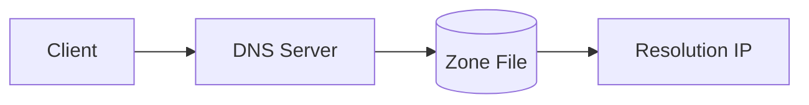
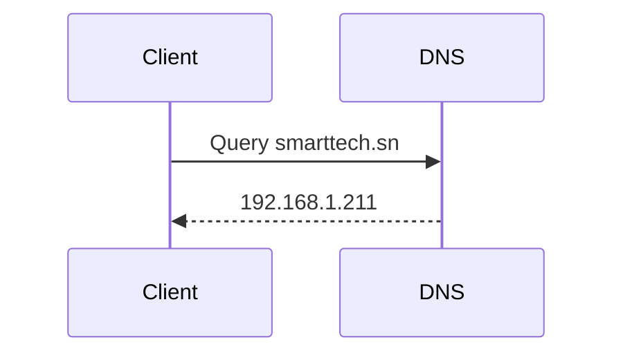
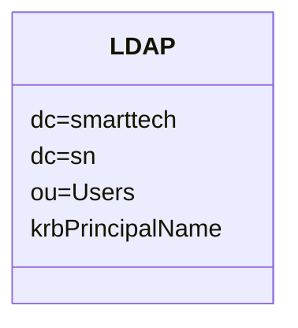
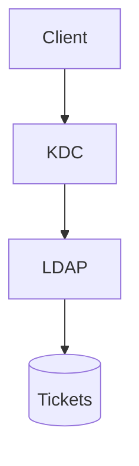
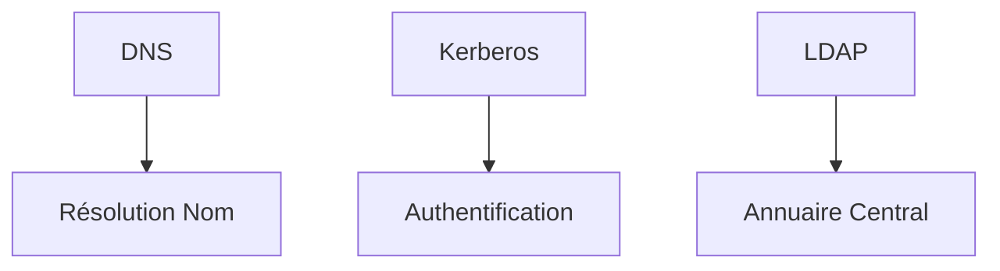

---

<div class="rapport-container">

<div class="page-de-garde">
    <h1 class="universite">Université Cheikh Anta Diop de Dakar</h1>
    <h2 class="ecole">École Supérieure Polytechnique</h2>
    
            <!-- Insérez ici le logo de l'UCAD si disponible -->
            <!--  -->
<div align="center">

![[logo_esp.png| 300]]

</div>
        
    <h3 class="titre-rapport">Configuration DNS et Couplage Kerberos/LDAP</h3>
    <div class="auteurs">
        <p class="label">Présenté par :</p>
        <p class="nom">Salif BIAYE</p>
        <p class="nom">Ndeye Astou DIAGOURAGA</p>
    </div>
    <div class="supervisor" style="padding: 15px; border-radius: 5px; margin: 20px 0;">

### Sous la direction de :
#### Dr Keba
*Enseignant*

</div>

---

<div  style="border: 3px double #1a5f7a; padding: 20px ;0;">

### Année universitaire 2024-2025
**

</div>
</div>
<div style="page-break-after: always;">
</div>
<h2>Table des Matières</h2>
<nav class="table-des-matieres">
    <ul>
        <li><a href="#dns"><h3>I. Configuration DNS</h3></a>
            <ul>
                <li><a href="#intro-dns"><h4>I.1. Introduction</h4></a></li>
                <li><a href="#config-dns"><h4>I.2. Configuration Serveur</h4></a></li>
                <li><a href="#test-dns"><h4>I.3. Tests et Validation</h4></a></li>
            </ul>
        </li>
        <li><a href="#kerberos"><h3>II. Couplage Kerberos/LDAP</h3></a>
            <ul>
                <li><a href="#config-ldap"><h4>II.1. Configuration LDAP</h4></a></li>
                <li><a href="#config-krb"><h4>II.2. Intégration Kerberos</h4></a></li>
                <li><a href="#tests"><h4>II.3. Tests d'Intégration</h4></a></li>
            </ul>
        </li>
        <li><a href="#conclusion"><h3>III. Conclusion</h3></a></li>
    </ul>
</nav>

<main>

<div id="dns" class="section-rapport">
<h2>I. Configuration du Serveur DNS</h2>
        
<div id="intro-dns" class="bloc-contenu">
<h3>I.1. Introduction</h3>

<p>

Ce rapport présente les étapes pour configurer un serveur DNS (Domain Name System) pour le domaine **smarttech.sn**. La configuration du DNS est cruciale pour permettre la résolution des noms de domaine vers les adresses IP, facilitant ainsi l’accès aux services associés à ce domaine.

</p>

<div class="diagramme-mermaid" align ="center">



</div>

<p>
Avant de commencer la configuration du serveur DNS, il est essentiel de remplir les pré-requis suivants :

●      Disposer d'un serveur DNS fonctionnel (par exemple, **BIND** sous Linux).

●      Un domaine enregistré (smarttech.sn).

●      Des droits administratifs sur le serveur DNS.

●      Un fichier de zone pour le domaine **smarttech.sn**.
</p>


</div>

<div id="config-dns" class="bloc-contenu">
<h3>I.2. Configuration du Serveur</h3>

>[! Pour installer BIND (le serveur DNS le plus couramment utilisé), on exécute les commandes suivantes sur un système Ubuntu :]


<div class="bloc-code">

```bash
sudo apt update  
sudo apt install bind9 bind9utils bind9-doc
```

</div>


Le fichier **named.conf** est utilisé pour configurer BIND et définir les zones de DNS. Ce fichier se trouve généralement dans le répertoire **/etc/bind/**. Ajoutez la configuration suivante pour inclure la zone **smarttech.sn** :

<div class="bloc-code">

```bash
zone "smarttech.sn" {  
    type master;  
    file "/etc/bind/db.smarttech.sn";  
};
```

</div>

Le fichier de zone contient les enregistrements DNS pour le domaine. On crée un fichier **/etc/bind/db.smarttech.sn** avec le contenu suivant :

<div class="bloc-code">

```bash
TTL    86400  
@       **IN**      **SOA**     kdc.smarttech.sn. admin.smarttech.sn. (  
                        20250303 ; Serial                        3600       ; Refresh                        1800       ; Retry                        1209600    ; Expire                        86400 )    ; Minimum TTL; Definition des serveurs DNS  
@        **IN**      **NS**      kdc.smarttech.sn.kdc     **IN**      **A**       192.168.1.211  
  
  
  
www     **IN**      **A**       192.168.1.200  
mail    **IN**      **A**       192.168.1.201 ; Enregistrement A pour mail

@       IN      MX      10 mail.smarttech.sn.  ; Enregistrement MX pour le serveur de messagerie
```

</div>
<p>

●      **SOA (Start of Authority)** : Indique les informations de base sur la zone.

●      **NS (Name Server)** : Définit les serveurs DNS autoritaires pour le domaine.

●      **A (Address)** : Associe des noms d'hôtes à des adresses IP.

●      **MX (Mail Exchanger)** : Pour la gestion des emails.

</p>


</div>

<div id="test-dns" class="bloc-contenu">
<h3>I.3. Validation DNS</h3>

<p>

Une fois les configurations effectuées, redémarrez le service BIND pour appliquer les modifications :

</p>

<div class="bloc-code">

```bash
sudo systemctl restart bind9
```

</div>

<p>

Vérifiez que le serveur DNS fonctionne correctement en utilisant des outils comme **dig** ou **nslookup** :

</p>


<div class="bloc-code">

```bash
dig @localhost smarttech.sn
nslookup mail.smarttech.sn
```

</div>

<div class="diagramme-mermaid" align="center">



</div>
<div style="page-break-after: always;">
</div>

>[! On obtient ce qui suit:]

<div class="bloc-code">

```bash
root@server:/home/server# dig @localhost smarttech.sn

; <<>> DiG 9.18.30-0ubuntu0.22.04.2-Ubuntu <<>> @localhost smarttech.sn
; (1 server found)

;; global options: +cmd
;; Got answer:

;; ->>HEADER<<- opcode: QUERY, status: NOERROR, id: 1894
;; flags: qr aa rd ra; QUERY: 1, ANSWER: 0, AUTHORITY: 1, ADDITIONAL: 1

;; OPT PSEUDOSECTION:
; EDNS: version: 0, flags: udp: 1232
; COOKIE: 2fcc35a089dbda540100000067c5b8ca05c24d5c69afd507 (good)

;; QUESTION SECTION:
;smarttech.sn.                  IN      A

;; AUTHORITY SECTION:
smarttech.sn.          604800  IN      SOA     kdc.smarttech.sn. admin.smarttech.sn. 20250303 604800 86400 2419200 604800

;; Query time: 274 msec
;; SERVER: 127.0.0.1#53(localhost) (UDP)
;; WHEN: Mon Mar 03 14:12:26 GMT 2025
```
</div>

>[! on peut aussi faire un nslookup pour verifier]

<div class="bloc-code">

```bash
root@server:/home/server# nslookup kdc.smarttech.sn
Server:         127.0.0.53
Address:        127.0.0.53#53

Name:   kdc.smarttech.sn
Address: 192.168.1.211

Name:   kdc.smarttech.sn
Address: fd00::ae77:529b:c27d:59db

Name:   kdc.smarttech.sn
Address: fd00::eb47:b1a2:2d20:e082

Name:   kdc.smarttech.sn
Address: fe80::989c:7743:7e28:7163

root@server:/home/server#
```
</div>

<div class="bloc-code">

```bash
root@server:/home/server# named-checkzone smarttech.sn /etc/bind/db.smarttech.sn
zone smarttech.sn/IN: loaded serial 20250303
OK
```

</div>

La configuration du serveur DNS pour le domaine **smarttech.sn** assure une résolution correcte des noms de domaine et une gestion efficace des services réseau. Cependant, pour renforcer la sécurité, il est essentiel d'intégrer **Kerberos**, un protocole d'authentification centralisée. Tandis que le DNS garantit l'accès aux ressources, **Kerberos** assure que seules les entités authentifiées peuvent y accéder. Cette transition permet de sécuriser les communications et d'assurer un contrôle d'accès solide au sein de notre réseau.

</div>
    </div>

<div id="kerberos" class="section-rapport">
<h2>II. Intégration Kerberos/LDAP</h2>

>[! Introduction]
Kerberos et LDAP sont deux technologies essentielles dans les environnements d'entreprise pour assurer une authentification centralisée et sécurisée. LDAP (Lightweight Directory Access Protocol) est un protocole utilisé pour accéder et gérer un annuaire d'utilisateurs, tandis que Kerberos est un protocole d'authentification sécurisé basé sur un système de tickets.

Le couplage de Kerberos et LDAP permet d'utiliser LDAP comme base d'annuaire centralisée et d'exploiter Kerberos pour authentifier nos utilisateurs de manière sécurisée.

>[!Objectif du couplage]

L'intégration de Kerberos avec LDAP vise à :

●      Centraliser la gestion des utilisateurs et des mots de passe.

●      Sécuriser l'authentification avec Kerberos.

●      Faciliter l'administration des accès réseau.

●      Permettre l'authentification unique (SSO - Single Sign-On).

>[!Prerequis]

Avant de procéder à l'installation et à la configuration, il est nécessaire de disposer :

●      D'un serveur Linux (Ubuntu dans notre cas).

●      Des paquets krb5-kdc, krb5-admin-server, krb5-user pour Kerberos.

●      D'un serveur LDAP fonctionnel (ex : OpenLDAP).

●      Des paquets libnss-ldap, libpam-krb5, krb5-config, krb5-user pour l'intégration LDAP-Kerberos.

>[!Remarque:]

- notre nom de domaine est smarttech.sn

- l’adresse IP de notre serveur est 192.168.1.211

- le hostname de notre machine kdc.smarttech.sn

<div id="config-ldap" class="bloc-contenu">
<h3>II.1. Configuration LDAP</h3>
<p>

Nous allons installer le serveur OpenLDAP sur le même hôte que le KDC, afin de simplifier la communication entre eux.

</p>

>[!Installation des paquets necessaires]

<div class="bloc-code">

```bash
sudo apt install krb5-kdc-ldap krb5-admin-server
```

</div>

>[!Extraction du fichier kerberos.schema.gz]

kerberos.schema.gz contient la définition des objets et attributs nécessaires pour stocker des informations Kerberos dans un annuaire LDAP.

<div class="bloc-code">

```bash
sudo cp /usr/share/doc/krb5-kdc-ldap/kerberos.schema.gz /etc/ldap/schema/  
sudo gunzip /etc/ldap/schema/kerberos.schema.gz
```

</div>

>[!Ajout du schema kerberos dans l’arborescence]
Le fichier schema doit etre converti au format ldif avant de pouvoir etre ajoute. Pour cela on installe:

<div class="bloc-code">

```bash
sudo apt install schema2ldif
```
</div>

>[!Pour importer le schéma Kerberos, on execute:]

<div class="bloc-code">

```bash
$ sudo ldap-schema-manager -i kerberos.schema  
SASL/EXTERNAL authentication started  
SASL username: gidNumber=0+uidNumber=0,cn=peercred,cn=external,cn=auth  
SASL SSF: 0executing 'ldapadd -Y EXTERNAL -H ldapi:/// -f /etc/ldap/schema/kerberos.ldif'  
SASL/EXTERNAL authentication started  
SASL username: gidNumber=0+uidNumber=0,cn=peercred,cn=external,cn=auth  
SASL SSF: 0**adding** new entry "cn=kerberos,cn=schema,cn=config"
```

</div>

>[!Indexons un attribut souvent utilisé dans les recherches]

<div class="bloc-code">

```bash
$ sudo ldapmodify -Q -Y EXTERNAL -H ldapi:/// <<EOF  
dn: olcDatabase={1}mdb,cn=config  
add: olcDbIndex  
olcDbIndex: krbPrincipalName eq,pres,sub  
EOF
modifying entry "olcDatabase={1}mdb,cn=config"
```
</div>

>[!Creation des entrees ldap pour les entrees administratives kerberos]

<div class="bloc-code">

```bash
**$ ldapadd -x -D cn=admin,dc=smarttech,dc=sn -W <<EOF  
dn: uid=kdc-service,dc=smarttech,dc=sn  
uid: kdc-service  
objectClass: account  
objectClass: simpleSecurityObject  
userPassword: {CRYPT}x  
description: Account used for the Kerberos KDC  
  
dn: uid=kadmin-service,dc=smarttech,dc=sn  
uid: kadmin-service  
objectClass: account  
objectClass: simpleSecurityObject  
userPassword: {CRYPT}x  
description: Account used for the Kerberos Admin server  
EOF  
Enter LDAP Password:  
adding new entry "uid=kdc-service,dc=smarttech,dc=sn"  
  
adding new entry "uid=kadmin-service,dc=smarttech,dc=sn"**
```

</div>

>[!On va ensuite devenir un mot de passe pour chaque entire: kdc-service et kadmin-service]

<div class="bloc-code">

```bash
$ ldappasswd -x -D cn=admin,dc=smarttech,dc=sn -W -S uid=kdc-service,dc=smarttech,dc=sn  
**New** password:******Re-enter **new** password:******  
Enter LDAP Password: ******
```

</div>

>[!mise a jour des listes de controle d’acces ACL]

<div class="bloc-code">

```bash
**$ sudo ldapmodify -Q -Y EXTERNAL -H ldapi:/// <<EOF  
dn: olcDatabase={1}mdb,cn=config  
add: olcAccess  
olcAccess: {2}to attrs=krbPrincipalKey  by anonymous auth  by dn.exact="uid=kdc-service,dc=smarttech,dc=sn" read  by dn.exact="uid=kadmin-service,dc=smarttech,dc=sn" write  by self write  by * none  
-  
add: olcAccess  
olcAccess: {3}to dn.subtree="cn=krbContainer,dc=smarttech,dc=sn"  
  by dn.exact="uid=kdc-service,dc=smarttech,dc=sn" read  by dn.exact="uid=kadmin-service,dc=smarttech,dc=sn" write  by * none  
EOF  
  
modifying entry "olcDatabase={1}mdb,cn=config"**
```

</div>
<p>
Notre annuaire LDAP est maintenant prêt à servir de base de données principale Kerberos.
</p>


<div class="diagramme-mermaid" align="center">



</div>
        </div>

<div id="config-krb" class="bloc-contenu">
<h3>II.2. Configuration Kerberos</h3>

>[!Editons le fichier /etc/krb5.conf]

<div class="bloc-code">

```bash
**[realms]       
    EXAMPLE.COM = {  
                kdc = kdc.smarttech.sn  
                admin_server = kdc.smarttech.sn  
                default_domain = smarttech.sn  
                database_module = openldap_ldapconf  
        }
```

</div>
<div style="page-break-after: always;">
</div>
<div class="bloc-code">

```bash
[dbdefaults]        
		ldap_kerberos_container_dn = cn=krbContainer,dc=smarttech,dc=sn
[dbmodules]        
		openldap_ldapconf = {  
	                db_library = kldap
	                disable_last_success = true                
	                disable_lockout  = true                
	                ldap_kdc_dn = "uid=kdc-service,dc=smarttech,dc=sn"               
	                ldap_kadmind_dn = "uid=kadmin-service,dc=smarttech,dc=sn"               
	                ldap_service_password_file = /etc/krb5kdc/service.keyfile                
	                ldap_servers = ldapi:///  
	                ldap_conns_per_server = 5  
	        }
```

</div>

>[!Creer le domaine avec  kdb5_ldap_util]


<div class="bloc-code">

```bash
$ sudo ldap-schema-manager -i kerberos.schema  
SASL/EXTERNAL authentication started  
SASL username: gidNumber=0+uidNumber=0,cn=peercred,cn=external,cn=auth  
SASL SSF: 0executing 'ldapadd -Y EXTERNAL -H ldapi:/// 
-f /etc/ldap/schema/kerberos.ldif'  
SASL/EXTERNAL authentication started  
SASL username: gidNumber=0+uidNumber=0,cn=peercred,cn=external,cn=auth  
SASL SSF: 0**adding** new entry "cn=kerberos,cn=schema,cn=config"
```

</div>

>[!Creons les mots de passe pour chacun]

<div class="bloc-code">

```bash
sudo kdb5_ldap_util -D cn=admin,dc=smarttech,dc=sn stashsrvpw
-f /etc/krb5kdc/service.keyfile uid=kdc-
service,dc=smarttech,dc=sn  
sudo kdb5_ldap_util -D cn=admin,dc=smarttech,dc=sn stashsrvpw 
-f /etc/krb5kdc/service.keyfile uid=kadmin-
service,dc=smarttech,dc=sn**
```

</div>

>[!Redémarrage des services]

<div class="bloc-code">

```bash
sudo systemctl start krb5-kdc.service
sudo systemctl krb5-admin-server.service
```

</div>


<div class="diagramme-mermaid" align="center">



</div>
        </div>

<div id="tests" class="bloc-contenu">
<h3>II.3. Tests d'Intégration</h3>

Testons l’authentification kerberos LDAP avec Kerberos
Créons un utilisateur dans kerberos avec

<div class="bloc-code">

```bash
sudo kadmin.local -q "addprinc salif@SMARTTECH.SN"
```

</div>

Vérifions si le principal est dans ldap avec la commande:

<div class="bloc-code">

```bash
ldapsearch -x -D "cn=admin,dc=smarttech,dc=sn" -W 
-b "dc=smarttech,dc=sn"
```

</div>

On peut voir avec la capture suivante que l;utilisateur salif a ete ajoute dans ldap

<div class="bloc-code">

```bash
# salif@SMARTTECH.SN, SMARTTECH.SN, krbContainer, smarttech.sn
dn: krbPrincipalName=salif@SMARTTECH.SN,cn=SMARTTECH.SN,cn=krbContainer,dc=smarttech,dc=sn
krbLoginFailedCount: 0
krbPrincipalName: salif@SMARTTECH.SN
krbPrincipalKey:: MIG20AMCAQGhAwIBAaIDAgEBowMCAQGkgZ8wgZwwVKAHMAWgAwIBAKFJMEegAwIBEqFABD49AFNQzqmerkQhu8XqoXFynzz83b5RFHN7DhhIAa/LWfgUHLxcus1ik00Wp/AWbgf9Rr7g/Olpih38N1+pOzBEoAcwBaADAgEAoTkwN6ADAgEROTAELhAAwKoeJVBtaopFPlCEq/3ur6HN6x3wyCwFD2GNsCh+UQk7ol1cPVlLLb22QOE=
krbLastPwdChange: 20250303084201Z
krbExtraData:: AAJZa8Vncm9vdC9hZG1pbkBTTUFSVFRFQ0gUU04A
krbExtraData:: AAgBAA==
objectClass: krbPrincipal
objectClass: krbPrincipalAux
objectClass: krbTicketPolicyAux

# host/kdc.smarttech.sn@SMARTTECH.SN, SMARTTECH.SN, krbContainer, smarttech.sn
```

</div>


</div>
</div>

<div style="page-break-after: always;">
</div>
<div id="conclusion" class="section-rapport">
<h2>III. Conclusion</h2>

L'intégration de **Kerberos** avec **LDAP** offre une solution robuste pour la gestion centralisée des identités et l’authentification sécurisée des utilisateurs. En exploitant **LDAP** comme annuaire de stockage des identités et **Kerberos** comme mécanisme d’authentification, cette architecture permet de garantir une **sécurité renforcée**, une **administration simplifiée** et une **expérience utilisateur améliorée** grâce au Single Sign-On (**SSO**).

<div class="bloc-contenu">
<p>Cette architecture combinant DNS, Kerberos et LDAP permet :</p>
<div class="diagramme-mermaid" align="center">



</div>
            <ul>
                <li>Gestion centralisée des identités</li>
                <li>Sécurité renforcée avec tickets Kerberos</li>
                <li>Single Sign-On (SSO)</li>
            </ul>
        </div>
    </div>
</main>
</div>


