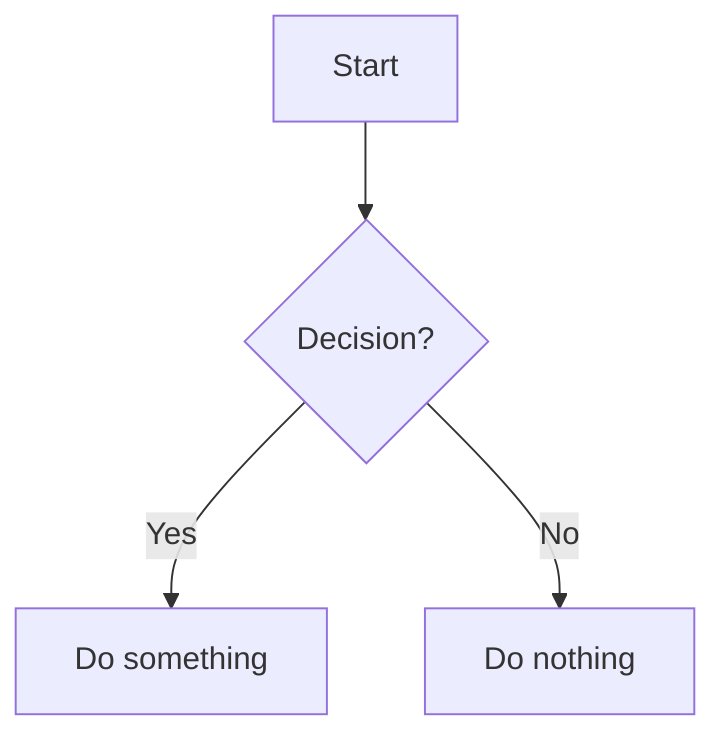

---

    <h1 class="universite">Université Cheikh Anta Diop de Dakar</h1>
    <h2 class="ecole">École Supérieure Polytechnique</h2>
    
            <!-- Insérez ici le logo de l'UCAD si disponible -->
            <!--  -->

![[logo_esp.png| 300]]

        
    <h3 class="titre-rapport">Rapport d'Analyse Réseau</h3>
    

        
Présenté par :

        
Salif BIAYE

        
Ndeye Astou DIAGOURAGA

    

    

        
Sous la direction de :

        
Dr. KEBA

    

    
Année Académique 2024-2025

<nav class="table-des-matieres">
    <h2>Table des Matières</h2>
    <ul>
        <li><a href="#introduction">Introduction</a></li>
        <li><a href="#commandes-reseau">Commandes Réseau de Base</a></li>
        <li><a href="#diagnostics-avances">Diagnostics Réseau Avancés</a></li>
        <li><a href="#depannage">Dépannage Réseau</a></li>
        <li><a href="#conclusion">Conclusion</a></li>
    </ul>
</nav>

<main>
    

        <h2>Introduction</h2>
        
Contenu de l'introduction...

    

	

        <h2>Introduc</h2>
        
Contenu de l'introduction...

    

    

        <h2>Commandes Réseau de Base</h2>
        

            <h3>ping</h3>
            
Description de la commande ping...

	

            

                ping example.com
            

        

    

</main>

<footer class="pied-de-page">
    
© 2025 Rapport d'Analyse Réseau - UCAD ESP. Tous droits réservés.

</footer>

