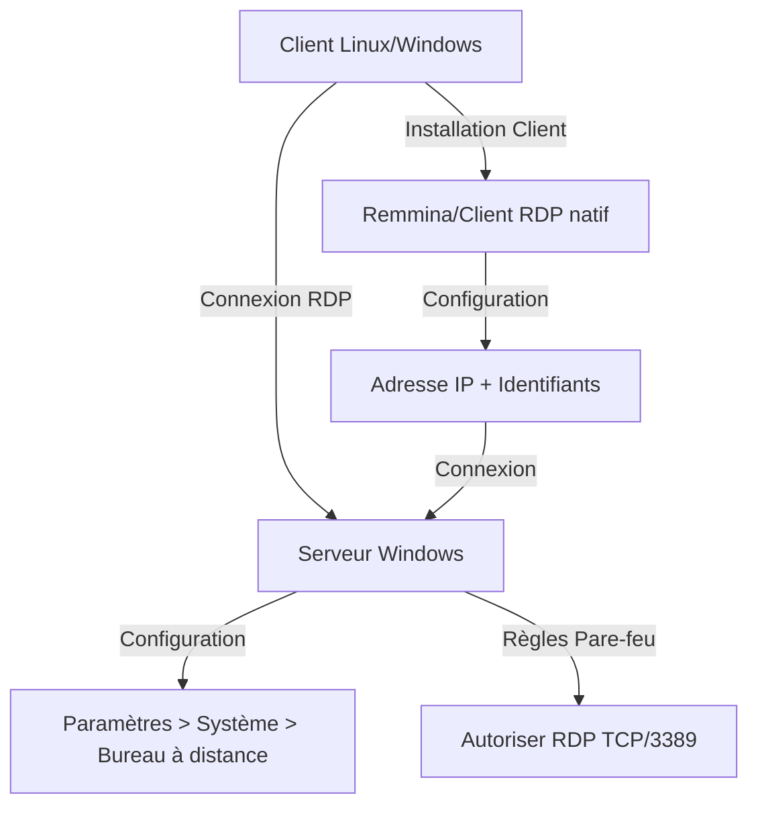
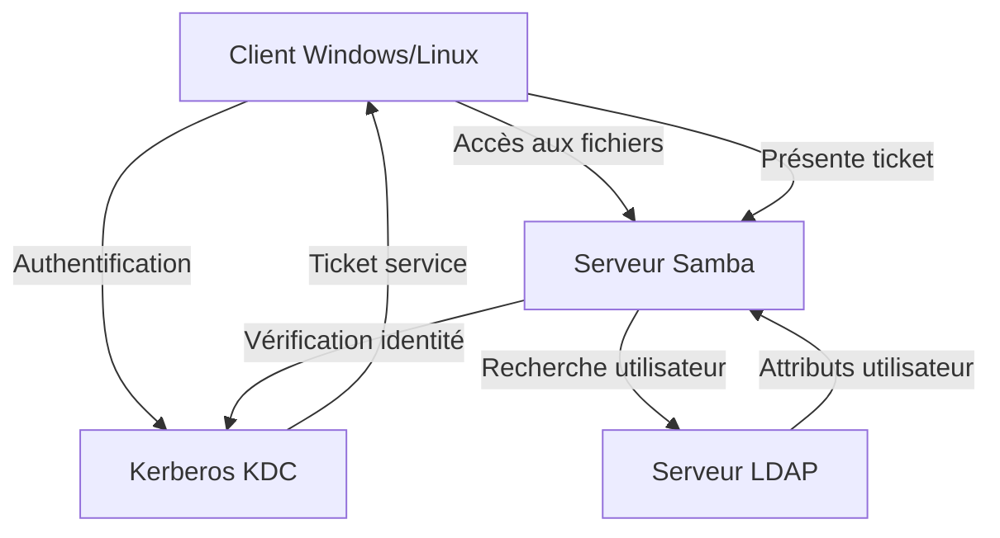
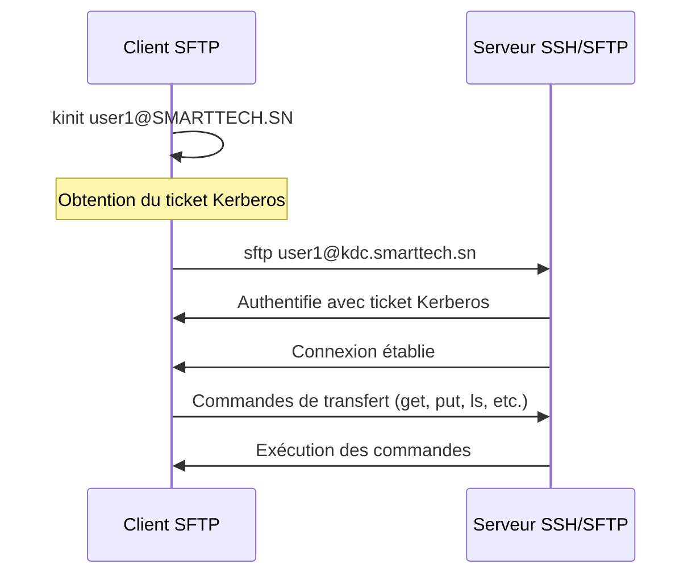

---

<div class="rapport-container">

<div class="page-de-garde">
    <h1 class="universite">Université Cheikh Anta Diop de Dakar</h1>
    <h2 class="ecole">École Supérieure Polytechnique</h2>
    
            <!-- Insérez ici le logo de l'UCAD si disponible -->
            <!--  -->
<div align="center">

![[logo_esp.png| 300]]

</div>
        
    <h3 class="titre-rapport">Protocoles d'Accès et Services de Partage </h3>
    <div class="auteurs">
        <p class="label">Présenté par :</p>
        <p class="nom">Salif BIAYE</p>
        <p class="nom">Ndeye Astou DIAGOURAGA</p>
    </div>
    <div class="supervisor" style="padding: 15px; border-radius: 5px; margin: 20px 0;">

### Sous la direction de :
#### Dr Keba
*Enseignant*

</div>

---

<div  style="border: 3px double #1a5f7a; padding: 20px ;0;">

### Année universitaire 2024-2025
**

</div>
</div>
<div style="page-break-after: always;">
</div>

<h2>Table des Matières</h2>
<nav class="table-des-matieres">
<ul>
            <li><a href="#introduction"><h3>Introduction</h3></a></li>
            <li><a href="#kerberos-ssh"><h3>Kerberos et SSH</h3></a>
                <ul>
                    <li><a href="#intro-kerberos"><h3>Introduction à Kerberos</h3></a></li>
                    <li><a href="#integration-ssh"><h3>IIntégration avec SSH</h3></a></li>
                    <li><a href="#preparation"><h3>IPréparation du serveur et du client</h3></a></li>
                    <li><a href="#config-serveur"><h3>IConfiguration du serveur SSH</h3></a></li>
                    <li><a href="#config-client"><h3>IConfiguration du client SSH</h3></a></li>
                    <li><a href="#test-connexion"><h3>ITest de la connexion</h3></a></li>
                </ul>
            </li>
            <li><a href="#protocoles-bureau"><h3>IProtocoles d'Accès Bureau à Distance</h3></a>
                <ul>
                    <li><a href="#rdp"><h4>IRDP (Remote Desktop Protocol)</h4></a></li>
                    <li><a href="#novnc"><h4>INoVNC</h4></a></li>
                </ul>
            </li>
            <li><a href="#samba-ldap"><h3>Samba avec LDAP et Kerberos</h3></a>
                <ul>
                    <li><a href="#intro-samba"><h4>ntroduction</h4></a></li>
                    <li><a href="#installation-samba"><h4>Installation des paquets</h4></a></li>
                    <li><a href="#config-ldap"><h4>Configuration de LDAP</h4></a></li>
                    <li><a href="#config-kerberos-samba"><h4>Configuration de Kerberos pour Samba</h4></a></li>
                    <li><a href="#config-samba"><h4>Configuration de Samba</h4></a></li>
                    <li><a href="#ajout-utilisateurs"><h4>Ajout des utilisateurs Samba</h4></a></li>
                    <li><a href="#test-validation"><h4>Tests et validation</h4></a></li>
                </ul>
            </li>
            <li><a href="#transfert-fichiers"><h3>Services de Transfert de Fichiers</h3></a></li>
            <li><a href="#conclusion"><h3>Conclusion</h3></a></li>
</ul>
</nav>

<main>

<div id="introduction" class="section-rapport">
<h2>Introduction</h2>
            <p>Ce rapport présente l'implémentation de plusieurs protocoles d'accès et services de partage sécurisés dans un environnement d'entreprise. Dans un contexte de sécurité informatique en constante évolution, la mise en place de solutions d'authentification centralisées et de connexions distantes sécurisées est devenue indispensable.</p>
            <p>Nous aborderons l'intégration de Kerberos avec SSH pour l'authentification centralisée, les solutions d'accès bureau à distance avec RDP et NoVNC, la configuration de Samba avec LDAP et Kerberos, ainsi que les services de transfert de fichiers TFTP et SFTP.</p>
            <p>L'objectif principal est de mettre en place une infrastructure sécurisée et efficace pour la gestion à distance des systèmes, en combinant des technologies complémentaires pour répondre aux besoins spécifiques de l'entreprise SmartTech.SN.</p>
</div>

<div id="kerberos-ssh" class="section-rapport">
<h2>Kerberos et SSH</h2>
<div id="intro-kerberos" class="bloc-contenu">
<h3>Introduction à Kerberos</h3>
                <p>L'intégration de Kerberos avec SSH permet d'optimiser la sécurité des connexions à distance sur des serveurs Linux/Unix en centralisant l'authentification des utilisateurs.</p>
<div class="diagramme-mermaid mermaid" align="center">
<div align="center">

![[Untitled diagram-2025-03-05-223621.png]]

</div>
</div>
</div>

<div id="integration-ssh" class="bloc-contenu">
<h3>Intégration avec SSH</h3>
                <p>SSH (Secure Shell) est un protocole utilisé pour accéder à distance à des systèmes Unix/Linux de manière sécurisée. Lorsqu'il est couplé avec Kerberos, SSH bénéficie d'une authentification renforcée, permettant une gestion centralisée et simplifiée des identités et des accès.</p>
                <h4>Avantages du couplage Kerberos avec SSH</h4>
                <ul>
                    <li><strong>Authentification centralisée</strong> : Les utilisateurs sont authentifiés via un serveur Kerberos, tel qu'un KDC (Key Distribution Center), permettant une gestion centralisée des identités.</li>
                    <li><strong>Sécurité améliorée</strong> : Kerberos utilise des tickets cryptographiques pour l'authentification, ce qui protège contre les attaques par interception de mot de passe.</li>
                    <li><strong>Accès sans mot de passe</strong> : Une fois l'utilisateur authentifié par Kerberos, il n'a pas à saisir son mot de passe à chaque connexion SSH, ce qui facilite l'accès sécurisé à plusieurs serveurs.</li>
                </ul>
<div class="bloc-code">

```bash
sudo apt-get install krb5-user libpam-krb5
```

</div>
            </div>

<div id="preparation" class="bloc-contenu">
<h3>Préparation du serveur et du client avec Kerberos</h3>
                <p>Pour configurer l'authentification Kerberos avec SSH, nous devons d'abord créer les principaux pour le serveur et le client, puis générer les clés Kerberos et ajouter les utilisateurs nécessaires dans la base de données Kerberos.</p>
                <h4>Création des principaux Kerberos</h4>
<div class="bloc-code">

```bash
kadmin.local
addprinc -randkey host/kdc.smarttech.sn 
addprinc -randkey host/client1.smarttech.sn
```


</div>
                <h4>Génération des clés</h4>
<div class="bloc-code">

```bash
ktadd host/kdc.smarttech.sn 
ktadd host/client1.smarttech.sn
```

</div>
<h4>Ajout d'un utilisateur</h4>
<div class="bloc-code">

```bash
addprinc user1
```
</div>
<div class="diagramme-mermaid mermaid" align="center">

<div align="center">

![[Untitled diagram-2025-03-05-223749.png]]

</div>
</div>
</div>

<div id="config-serveur" class="bloc-contenu">
<h3>Configuration du serveur SSH</h3>
                <p>Sur le serveur où SSH sera activé, nous devons configurer le fichier sshd_config pour activer l'authentification Kerberos.</p>
<div class="bloc-code">

```bash
# Éditer le fichier /etc/ssh/sshd_config
KerberosAuthentication yes
KerberosOrLocalPasswd yes
GSSAPIAuthentication yes
GSSAPICleanupCredentials yes
# Redémarrer le service SSH
systemctl restart sshd
```

</div>
</div>

<div id="config-client" class="bloc-contenu">
<h3>Configuration du client SSH</h3>
                <p>Sur le client qui se connectera au serveur via SSH, nous devons configurer le fichier ssh_config pour activer l'authentification Kerberos.</p>
<div class="bloc-code">

```bash
# Éditer le fichier /etc/ssh/ssh_config
GSSAPIAuthentication yes
GSSAPIDelegateCredentials yes
```

</div>

</div>

<div id="test-connexion" class="bloc-contenu">
<h3>Test de la connexion</h3>
                <p>Pour tester la connexion, nous devons d'abord obtenir un ticket Kerberos, puis utiliser ce ticket pour nous connecter au serveur SSH sans mot de passe.</p>
<div class="bloc-code">

  ```bash
# Obtenir un ticket Kerberos
kinit user1@SMARTTECH.SN
# Vérifier le ticket
klist
# Se connecter au serveur SSH
ssh kdc.smarttech.sn
```

</div>
<p>Exemple de sortie réussie :</p>

<div class="bloc-code">

```bash
user1@client:~$ ssh kdc.smarttech.sn
The authenticity of host 'kdc.smarttech.sn (192.168.1.211)' can't be established.
ECDSA key fingerprint is SHA256:xCY1GIIrNHrF7DrDCg9gleHB/GenH3PqyGwtm5WiVxZg.
Are you sure you want to continue connecting (yes/no/[fingerprint])? yes
 Warning: Permanently added 'kdc.smarttech.sn,192.168.1.211' (ECDSA) to the list of known hosts.
Welcome to Ubuntu 20.04.6 LTS (GNU/Linux 5.15.0-130-generic x86_64)
[...Informations système...]
user1@kdc:~$ pwd
/home/user1
```

</div>
            </div>
        </div>

<div id="protocoles-bureau" class="section-rapport">
<h2>Protocoles d'Accès Bureau à Distance</h2>
<div id="rdp" class="bloc-contenu">
<h3>RDP (Remote Desktop Protocol)</h3>
                <p>RDP est un protocole développé par Microsoft pour accéder à un bureau Windows à distance. Contrairement à SSH, qui est généralement utilisé pour une interface en ligne de commande, RDP permet une interaction graphique avec l'interface de l'ordinateur distant.</p>
<h4>Caractéristiques principales de RDP</h4>
                <ul>
                    <li><strong>Accessibilité graphique</strong> : Permet l'accès complet à l'interface graphique du système distant.</li>
                    <li><strong>Contrôle à distance sécurisé</strong> : RDP utilise des mécanismes de chiffrement pour sécuriser la communication entre le client et le serveur.</li>
                    <li><strong>Utilisation dans des environnements Windows</strong> : RDP est principalement utilisé dans des environnements Windows, mais des clients RDP existent pour d'autres systèmes d'exploitation.</li>
                </ul>
<h4>Configuration de RDP</h4>
                <p><strong>Prérequis</strong> :</p>
                <ul>
                    <li>Une machine Windows (version Pro, Enterprise, ou Education) pour servir de serveur RDP.</li>
                    <li>Une machine Windows ou Linux pour agir comme client RDP.</li>
                    <li>Accès administrateur sur la machine serveur.</li>
                </ul>
                <p><strong>Activer le Bureau à Distance sur le Serveur Windows</strong></p>
                <p>Paramètres > Système > Bureau à distance</p>
<div class="diagramme-mermaid mermaid" align="center">



</div>

<div class="diagramme-mermaid mermaid" align="center">

<div align="center">

![[screen.png]]

</div>
</div>

on crée d’abord un utilisateur sur notre serveur Windows

<div class="diagramme-mermaid mermaid" align="center">

<div align="center">

![[systeme.png]]

</div>
</div>

<div class="diagramme-mermaid mermaid" align="center">

<div align="center">

![[systeme 1.png]]

</div>
</div>

On va autoriser le bureau a distance au niveau des règles de parefeu.


<div class="diagramme-mermaid mermaid" align="center">

<div align="center">

![[systeme 2.png]]

</div>
</div>

<div class="diagramme-mermaid mermaid" align="center">

<div align="center">

![[systeme 3.png]]

</div>
</div>
Une fois ceci fait, les clients VNC sur Windows ou Linux peuvent se connecter. on va tester

avec un client linux
<p><strong>Configuration du client Linux</strong></p>

<div class="bloc-code">

```bash
# Installation de Remmina
sudo apt update
sudo apt install remmina remmina-plugin-rdp
```

</div>
                <p>Lancer Remmina, créer une nouvelle connexion avec l'adresse du serveur et les identifiants d'un utilisateur autorisé.</p>
</div>

<div class="diagramme-mermaid mermaid" align="center">

<div align="center">

![[systeme 4.png]]

</div>
</div>

<div class="diagramme-mermaid mermaid" align="center">

<div align="center">

![[systeme 5.png]]

</div>
</div>

On renseigne l’adresse du serveur distant ainsi que l’utilisateur qui est autorisé à accéder au

bureau à distance et son mdp

>[!Testons la connexion]

<div class="diagramme-mermaid mermaid" align="center">

<div align="center">

![[systeme 6.png]]

</div>
</div>

On peut ainsi accéder à distance a la machine serveuse via RDP.

D'un autre côté, **RDP** et **NoVNC** sont des solutions très utiles pour accéder à des bureaux

distants dans des environnements Windows ou via un navigateur. RDP est adapté aux

environnements Windows, tandis que NoVNC fournit une solution multiplateforme et

accessible via un simple navigateur web.

<div id="novnc" class="bloc-contenu">
<h3>NoVNC</h3>
                <p>NoVNC est une implémentation du protocole VNC (Virtual Network Computing) qui permet d'accéder à un bureau distant via un navigateur web. Il fonctionne en utilisant le protocole WebSockets et permet de contrôler un ordinateur à distance en utilisant un client HTML5.</p>
<h4>Caractéristiques principales de NoVNC</h4>
                <ul>
                    <li><strong>Accès via navigateur</strong> : Permet d'accéder à un bureau distant sans installer de logiciel client, simplement via un navigateur web.</li>
                    <li><strong>Compatibilité multiplateforme</strong> : Étant basé sur HTML5, NoVNC fonctionne sur tous les systèmes d'exploitation modernes sans nécessiter de plugins.</li>
                    <li><strong>Utilisation pour la gestion des serveurs virtuels</strong> : NoVNC est souvent utilisé pour gérer des environnements de serveurs virtuels, notamment dans les infrastructures cloud.</li>
                </ul>
<h4>Installation et configuration</h4>
<div class="bloc-code">

```bash
# Installation du serveur VNC
apt install tigervnc-server-standalone -y
# Clonage de noVNC
git clone https://github.com/novnc/noVNC.git ~/novnc
# Création d'un lien symbolique
ln -s ~/noVNC/utils/novnc_proxy /usr/local/bin/novnc_proxy
# Démarrage du proxy WebSocket
novnc_proxy --vnc localhost:5901 --listen 6080
```

</div>
<div class="diagramme-mermaid mermaid" align="center">

<div align="center">

![[Untitled diagram-2025-03-05-223914.png]]

</div>
</div>
</div>
</div>

>[!Interface graphique]

Lorsqu’on tape l’url au niveau de notre machine cliente on obtient:

<div class="diagramme-mermaid mermaid" align="center">

<div align="center">

![[systeme 7.png]]

</div>
</div>

noVNC va permettre à notre entreprise d’accéder aux interfaces graphiques des

serveurs à distance via un simple navigateur, sans nécessiter de client VNC dédié.

Cette solution a amélioré la flexibilité et la sécurité des connexions tout en simplifiant

la gestion des accès pour les utilisateurs. Son intégration a donc optimisé notre

infrastructure en facilitant l’administration à distance et en réduisant les contraintes

techniques.


En combinant **Kerberos avec SSH** pour l'authentification centralisée et en utilisant **RDP** ou

**NoVNC** pour l'accès graphique, on peut créer une infrastructure sécurisée et efficace pour la

gestion à distance des systèmes.

<div id="samba-ldap" class="section-rapport">
<h2>Samba avec LDAP et Kerberos</h2>
<div id="intro-samba" class="bloc-contenu">
<h3>Introduction</h3>
                <p>L'objectif de cette section est d'intégrer Samba avec LDAP et Kerberos sur SMART TECH.SN. Cette configuration permet :</p>
                <ul>
                    <li>D'utiliser LDAP pour centraliser les comptes utilisateurs.</li>
                    <li>D'utiliser Kerberos pour l'authentification sécurisée.</li>
                    <li>D'autoriser l'accès aux partages Samba sans entrer de mot de passe grâce à Kerberos.</li>
                </ul>
<div class="diagramme-mermaid mermaid" align="center">



</div>
</div>

<div id="installation-samba" class="bloc-contenu">
<h3>Installation des paquets</h3>
<div class="bloc-code">

```bash
sudo apt install samba smbclient krb5-user winbind 
libnss-winbind libpam-winbind smbldap-tools schema2ldif -y
```

</div>
</div>

<div id="config-ldap" class="bloc-contenu">
<h3>Configuration de LDAP</h3>
                <p><strong>Ajout du schéma Samba à LDAP</strong></p>
<div class="bloc-code">

```bash
# Localiser le schéma Samba
locate samba.schema
# Copier et convertir en LDIF
cp /usr/share/doc/samba/examples/LDAP/samba.schema /etc/ldap/schema/
schema2ldif /etc/ldap/schema/samba.schema > samba.ldif
# Ajout du fichier schema.ldif
sudo ldapadd -Y EXTERNAL -H ldapi:/// -f samba.ldif
# Vérification
ldapsearch -LLL -Y EXTERNAL -H ldapi:/// -b cn=schema,cn=config | grep samba
```

</div>

</div>

<div id="config-kerberos-samba" class="bloc-contenu">
<h3>Configuration de Kerberos pour Samba</h3>
    <p><strong>Fichier de configuration</strong></p>
<div class="bloc-code">

```bash
# Éditer /etc/krb5.conf
[libdefaults]
default_realm = SMARTTECH.SN
[realms]
SMARTTECH.SN = {
    kdc = kdc.smarttech.sn
    admin_server = kdc.smarttech.sn
}
```

</div>
                <p><strong>Création des utilisateurs</strong></p>
<div class="bloc-code">

```bash
# Ajouter le principal salif
sudo kadmin.local addprinc salif@SMARTTECH.SN
# Ajouter le service Samba
addprinc -randkey cifs/server.smarttech.sn@SMARTTECH.SN
ktadd -k /etc/krb5.keytab cifs/server.smarttech.sn@SMARTTECH.SN
```

</div>
</div>

<div id="config-samba" class="bloc-contenu">
<h3>Configuration de Samba</h3>
                <p><strong>Modification de /etc/samba/smb.conf</strong></p>
<div class="bloc-code">

```bash
[global]
workgroup = SMARTTECH
security = user
realm = SMARTTECH.SN
encrypt passwords = yes
passdb backend = ldapsam:ldap://server.smarttech.sn
ldap admin dn = cn=admin,dc=smarttech,dc=sn
ldap suffix = dc=smarttech,dc=sn
ldap user suffix = ou=users
ldap group suffix = ou=groups
ldap machine suffix = ou=computers
ldap ssl = no
kerberos method = system keytab
dedicated keytab file = /etc/krb5.keytab
[partage]
path = /srv/samba/share
read only = no
browseable = yes
guest ok = no
```

</div>
                <p><strong>Création du répertoire de partage</strong></p>
<div class="bloc-code">

```bash
sudo mkdir -p /srv/samba/share
sudo addgroup smbusers
sudo chown -R root:smbusers /srv/samba/share
sudo chmod -R 2770 /srv/samba/share
```
</div>
</div>

<div id="ajout-utilisateurs" class="bloc-contenu">
<h3>Ajout des utilisateurs Samba</h3>
<div class="bloc-code">

```bash
# Ajout d'un utilisateur Samba
sudo smbpasswd -a salif
# Vérification des utilisateurs Samba
pdbedit -Lv
```

</div>
                <p><strong>Remarque</strong> : Avant ces commandes, l'utilisateur salif doit obligatoirement exister dans l'annuaire LDAP et dans le système (adduser). La commande smbpasswd ajoute seulement les attributs Samba dans l'annuaire.</p>
</div>

<div class="diagramme-mermaid mermaid" align="center">

<div align="center">

![[systeme 8.png]]

</div>
</div>

<div id="test-validation" class="bloc-contenu">
<h3>Tests et validation</h3>
                <p><strong>Redémarrage des services</strong></p>
<div class="bloc-code">

```bash
sudo systemctl restart smbd nmbd krb5-kdc krb5-admin-server slapd winbind
```

</div>
                <p><strong>Connexion sans mot de passe via Kerberos</strong></p>
<div class="bloc-code">

```bash
kinit salif@SMARTTECH.SN
smbclient -k -L //kdc.smarttech.sn
smbclient -k //kdc.smarttech.sn/partage
# Vérification du partage Samba
smb: > ls
```

</div>
</div>
</div>

<div id="transfert-fichiers" class="section-rapport">
<h2>Services de Transfert de Fichiers</h2>
<div id="tftp" class="bloc-contenu">
<h3>TFTP (Trivial File Transfer Protocol)</h3>

Le Trivial File Transfer Protocol (**TFTP**) est un protocole de transfert de fichiers léger,

principalement utilisé pour des opérations où l'authentification et les fonctionnalités

avancées de gestion de fichiers ne sont pas nécessaires. Il est couramment utilisé pour le

déploiement de systèmes d'exploitation via **PXE**, la mise à jour de firmwares, ainsi que le

transfert de configurations d'équipements réseau (routeurs, switches, etc.). Ce rapport

présente l'installation, la configuration et l'utilisation d'un serveur TFTP dans un

environnement Linux et Windows.

<div class="diagramme-mermaid mermaid" align="center">

<div align="center">

![[Untitled diagram-2025-03-05-224042.png]]

</div>
</div>
<h4>Installation d'un serveur TFTP sous Linux</h4>
<div class="bloc-code">

```bash
# Installation du service TFTP
sudo apt update && sudo apt install tftpd-hpa -y
# Configuration du serveur TFTP
sudo nano /etc/default/tftpd-hpa
# Contenu:
TFTP_USERNAME="tftp"
TFTP_DIRECTORY="/srv/tftp"
TFTP_ADDRESS="0.0.0.0:69"
TFTP_OPTIONS="--secure"
# Création du répertoire de stockage
sudo mkdir -p /srv/tftp
sudo chmod -R 777 /srv/tftp
sudo chown -R tftp:tftp /srv/tftp
# Démarrage et activation du serveur
sudo systemctl restart tftpd-hpa
sudo systemctl enable tftpd-hpa
```
 
</div>
                <p>Pour des raisons de sécurité, nous préférons utiliser SFTP pour assurer un transfert de fichiers sécurisé.</p>
</div>

<div id="sftp" class="bloc-contenu">
<h3>SFTP (SSH File Transfer Protocol)</h3>
                <p>SFTP est un protocole de transfert de fichiers qui utilise SSH pour sécuriser les communications. Il est déjà configuré si SSH est configuré sur le système.</p>
<div class="diagramme-mermaid mermaid" align="center">



</div>
 
<h4>Test de connexion SFTP</h4>
<div class="bloc-code">

```bash
# Obtenir un ticket Kerberos
kinit user1
# Se connecter via SFTP
sftp user1@kdc.smarttech.sn
# Exemple de sortie:
user1@kdc:/home/server$ sftp user1@kdc.smarttech.sn
Connected to kdc.smarttech.sn.
sftp> ls -l
drwx------ 3 user1 user1 4096 Mar 3 13:04 snap
sftp>
```

</div>
                <p>En activant SFTP, nous garantissons des transferts de fichiers sécurisés grâce à l'utilisation du chiffrement SSH, ainsi qu'un meilleur contrôle d'accès et une traçabilité des actions des utilisateurs. Cette solution est bien plus adaptée aux environnements nécessitant une protection renforcée des données.</p>
            </div>
</div>
<div id="conclusion" class="section-rapport">
<h2>Conclusion</h2>
<div id="conclusion" class="bloc-contenu">
            <p>Ce rapport a présenté l'implémentation de plusieurs technologies d'accès et de partage sécurisés au sein de l'environnement SmartTech.SN :</p>
            <ul>
                <li><strong>Kerberos avec SSH</strong> : Cette intégration permet une authentification centralisée et une connexion sans mot de passe, améliorant à la fois la sécurité et l'expérience utilisateur.</li>
                <li><strong>RDP et NoVNC</strong> : Ces protocoles offrent un accès graphique à distance adapté à différents scénarios, avec RDP pour les environnements Windows et NoVNC pour une solution multiplateforme accessible via navigateur.</li>
                <li><strong>Samba avec LDAP et Kerberos</strong> : Cette configuration permet de centraliser la gestion des utilisateurs et de sécuriser les partages de fichiers, tout en offrant une intégration transparente avec les environnements Windows.</li>
                <li><strong>SFTP</strong> : Ce protocole sécurisé remplace avantageusement TFTP pour les transferts de fichiers, grâce à l'utilisation du chiffrement SSH.</li>
            </ul>
            <p>En combinant ces technologies, nous avons créé une infrastructure sécurisée et efficace pour la gestion à distance des systèmes. Cette architecture répond aux besoins de sécurité, de simplicité d'administration et d'expérience utilisateur, tout en assurant une traçabilité des actions et une protection des données.</p>
</div>
<div class="diagramme-mermaid mermaid" align="center">

<div align="center">

![[Untitled diagram-2025-03-05-224217.png]]

</div>

</div>
</div>
</main>

<footer class="pied-de-page">

<p>© 2025 Protocoles d'Accès et Services de Partage Sécurisés - UCAD ESP. Tous droits réservés.</p>

</footer>
</div>