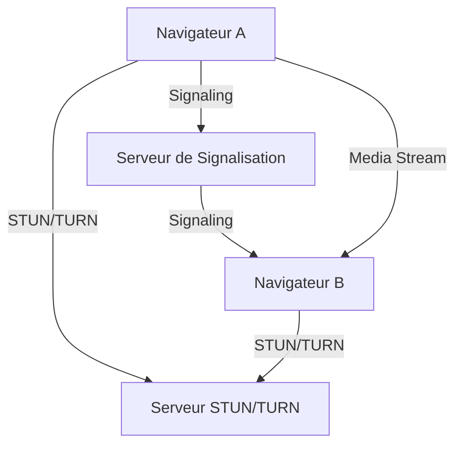
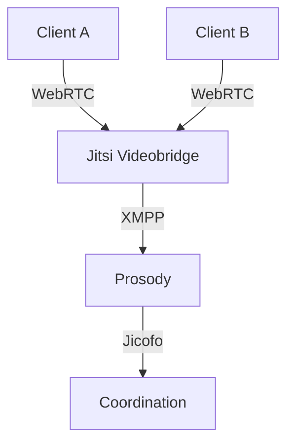

---

<div class="rapport-container">

<div class="page-de-garde">
    <h1 class="universite">Université Cheikh Anta Diop de Dakar</h1>
    <h2 class="ecole">École Supérieure Polytechnique</h2>
    
            <!-- Insérez ici le logo de l'UCAD si disponible -->
            <!--  -->
<div align="center">

![[logo_esp.png| 300]]

</div>
        
    <h3 class="titre-rapport">Rapport sur WebRTC avec Jitsi Meet et Docker</h3>
    <div class="auteurs">
        <p class="label">Présenté par :</p>
        <p class="nom">Salif BIAYE</p>
        <p class="nom">Ndeye Astou DIAGOURAGA</p>
    </div>
    <div class="supervisor" style="padding: 15px; border-radius: 5px; margin: 20px 0;">

### Sous la direction de :
#### Dr Keba
*Enseignant*

</div>

---

<div  style="border: 3px double #1a5f7a; padding: 20px ;0;">

### Année universitaire 2024-2025
**

</div>
</div>
<div style="page-break-after: always;">
</div>
<h2>Table des Matières</h2>
<nav class="table-des-matieres">
    <ul>
        <li><a href="#introduction"><h3>I. Introduction</h3></a></li>
        <li><a href="#webrtc"><h3>II. WebRTC : Principes et Fonctionnement</h3></a></li>
        <li><a href="#II.1.Qu'est-cequeWebRTC ?"><h4>II.1. Qu'est-ce que WebRTC ?</h4></a></li>
        <li><a href="#II.2.ArchitecturedeWebRTC"><h4>II.2. Architecture de WebRTC</h4></a></li>
        <li><a href="#jitsi-meet"><h3>III. Jitsi Meet : Solution de Visioconférence Open Source</h3></a></li>
        <li><a href="#III.1.PrésentationdeJitsiMeet"><h4>III.1. Présentation de Jitsi Meet</h4></a></li>
        <li><a href="#III.2.ArchitecturedeJitsiMeet"><h4>III.2. Architecture de Jitsi Meet</h4></a></li>
        <li><a href="#docker"><h3>IV. Docker : Conteneurisation et Déploiement</h3></a></li>
        <li><a href="#IV.1.IntroductionaDocker"><h4>IV.1. Introduction à Docker</h4></a></li>
        <li><a href="#IV.2.InstallationdeDocker"><h4>IV.2. Installation de Docker</h4></a></li>
        <li><a href="#integration"><h3>V. Intégration de Jitsi Meet avec Docker</h3></a></li>
        <li><a href="#V.1. Déploiement de Jitsi Meet avec Docker"><h4>V.1. Déploiement de Jitsi Meet avec Docker</h4></a></li>
        <li><a href="#V.2.ConfigurationdeJitsiMeet"><h4>V.2. Configuration de Jitsi Meet (BONUS VIDEO)</h4></a></li>
        <li><a href="#conclusion"><h3>VI. Conclusion</h3></a></li>
    </ul>
</nav>

<div>
<div id="introduction" class="section-rapport">
<h2>I. Introduction</h2>
        <div class="bloc-contenu">
            <p>WebRTC (Web Real-Time Communication) est une technologie open source qui permet la communication en temps réel (audio, vidéo, partage de données) directement dans les navigateurs web. Jitsi Meet est une solution de visioconférence basée sur WebRTC, offrant une alternative open source aux plateformes propriétaires comme Zoom ou Microsoft Teams.</p>
            <p>Dans ce rapport, nous allons explorer :</p>
            <ul>
                <li>Les principes de WebRTC et son architecture.</li>
                <li>L'installation et la configuration de Jitsi Meet.</li>
                <li>L'utilisation de Docker pour déployer Jitsi Meet de manière scalable et sécurisée.</li>
            </ul>
        </div>
</div>

<div id="webrtc" class="section-rapport">
<h2>II. WebRTC : Principes et Fonctionnement</h2>
<div class="bloc-contenu">
<h3 id="II.1.Qu'est-cequeWebRTC ?" >II.1. Qu'est-ce que WebRTC ?</h3>
            <p>WebRTC est une API JavaScript qui permet aux navigateurs de communiquer en temps réel sans plugins. Il est largement utilisé pour les applications de visioconférence, le streaming en direct, et le partage de fichiers.</p>
            
<h3 id="II.2. Architecture de WebRTC">II.2. Architecture de WebRTC</h3>
            <p>WebRTC repose sur trois composants principaux :</p>
            <ul>
                <li><strong>Signaling</strong> : Échange d'informations de contrôle entre les pairs.</li>
                <li><strong>STUN/TURN</strong> : Serveurs pour traverser les NAT et les pare-feux.</li>
                <li><strong>Media Streams</strong> : Gestion des flux audio, vidéo et données.</li>
            </ul>
<div class="diagramme-mermaid" align="center">



</div>
</div>
</div>

<div id="jitsi-meet" class="section-rapport">
<h2>III. Jitsi Meet : Solution de Visioconférence Open Source</h2>
<div class="bloc-contenu">
<h3 id="III.1.PrésentationdeJitsiMeet">III.1. Présentation de Jitsi Meet</h3>
            <p>Jitsi Meet est une solution de visioconférence open source basée sur WebRTC. Elle offre des fonctionnalités similaires à Zoom, telles que :</p>
            <ul>
                <li>Création de salles de conférence.</li>
                <li>Partage d'écran.</li>
                <li>Chat en temps réel.</li>
            </ul>

<h3 id="III.2.ArchitecturedeJitsiMeet" >III.2. Architecture de Jitsi Meet</h3>
            <p>Jitsi Meet utilise plusieurs composants :</p>
            <ul>
                <li><strong>Jitsi Videobridge</strong> : Gère les flux multimédias.</li>
                <li><strong>Prosody</strong> : Serveur XMPP pour la signalisation.</li>
                <li><strong>Jicofo</strong> : Coordinateur de conférence.</li>
            </ul>
<div class="diagramme-mermaid" align="center">



</div>
</div>
</div>

<div id="docker" class="section-rapport">
<h2>IV. Docker : Conteneurisation et Déploiement</h2>
<div class="bloc-contenu">
<h3 id="IV.1.IntroductionaDocker">IV.1. Introduction à Docker</h3>
            <p>Docker est une plateforme de conteneurisation qui permet de déployer des applications dans des environnements isolés. Les avantages de Docker incluent :</p>
            <ul>
                <li>Portabilité : Les conteneurs fonctionnent de la même manière sur tous les systèmes.</li>
                <li>Isolation : Chaque conteneur est indépendant.</li>
                <li>Scalabilité : Facile à déployer sur plusieurs serveurs.</li>
            </ul>

<h3 id="IV.2.InstallationdeDocker">IV.2. Installation de Docker</h3>
            <p>Pour installer Docker sur Ubuntu 20.04 :</p>

<h5>

[Étape 1 — Installation de Docker](https://www.digitalocean.com/community/tutorials/how-to-install-and-use-docker-on-ubuntu-22-04#step-1-installing-docker) 

</h5>
<p>Le package d'installation Docker disponible dans le référentiel officiel d'Ubuntu n'est peut-être pas la dernière version. Pour nous assurer d'obtenir la dernière version, nous allons installer Docker à partir du référentiel officiel Docker. Pour ce faire, nous allons ajouter une nouvelle source de package, ajouter la clé GPG de Docker pour garantir la validité des téléchargements, puis installer le package.

Tout d’abord, mettez à jour votre liste de packages existante :
</p>

<div class="bloc-code">

```bash
sudo apt update
```
</div>

<p>Ensuite, installez quelques packages prérequis qui permettent `apt`d’utiliser des packages via HTTPS :</p>

<div class="bloc-code">

```bash
sudo apt install apt-transport-https ca-certificates curl software-properties-common
```
</div>

<p>Ajoutez ensuite la clé GPG du référentiel officiel Docker à votre système :</p>

<div class="bloc-code">

```bash
curl -fsSL https://download.docker.com/linux/ubuntu/gpg | 
sudo gpg --dearmor -o /usr/share/keyrings/docker-archive-keyring.gpg
```
</div>

<p>Ajoutez le référentiel Docker aux sources APT :</p>

<div class="bloc-code">

```bash
echo "deb [arch=$(dpkg --print-architecture) 
signed-by=/usr/share/keyrings/docker-archive-keyring.gpg] 
https://download.docker.com/linux/ubuntu $(lsb_release -cs) stable" |
sudo tee /etc/apt/sources.list.d/docker.list > /dev/null
```
</div>

<p>Mettez à nouveau à jour votre liste de packages existante pour que l'ajout soit reconnu :</p>

<div class="bloc-code">

```bash
sudo apt update
```
</div>

<p>Assurez-vous que vous êtes sur le point d'installer à partir du référentiel Docker au lieu du référentiel Ubuntu par défaut :</p>
<div class="bloc-code">

```bash
apt-cache policy docker-ce


docker-ce:
  Installed: (none)
  Candidate: 5:20.10.14~3-0~ubuntu-jammy
  Version table:
     5:20.10.14~3-0~ubuntu-jammy 500
        500 https://download.docker.com/linux/ubuntu jammy/stable amd64 Packages
     5:20.10.13~3-0~ubuntu-jammy 500
        500 https://download.docker.com/linux/ubuntu jammy/stable amd64 Packages

```
</div>
<p>Notez qu'il `docker-ce`n'est pas installé, mais le candidat à l'installation provient du référentiel Docker pour Ubuntu 22.04 ( `jammy`).

Enfin, installez Docker:</p>

<div class="bloc-code">

```bash
sudo apt install docker-ce

```
</div>

<p>Docker doit maintenant être installé, le démon démarré et le processus activé pour démarrer au démarrage. Vérifiez qu'il est en cours d'exécution :</p>

<div class="bloc-code">

```bash
sudo systemctl status docker

docker.service - Docker Application Container Engine
     Loaded: loaded (/lib/systemd/system/docker.service; enabled; vendor preset: enabled)
     Active: active (running) since Fri 2022-04-01 21:30:25 UTC; 22s ago
TriggeredBy: ● docker.socket
       Docs: https://docs.docker.com
   Main PID: 7854 (dockerd)
      Tasks: 7
     Memory: 38.3M
        CPU: 340ms
     CGroup: /system.slice/docker.service
             └─7854 /usr/bin/dockerd -H fd:// --containerd=/run/containerd/containerd.sock


```
</div>

<h5>

[Étape 2 — Exécution de la commande Docker sans Sudo (facultatif)](https://www.digitalocean.com/community/tutorials/how-to-install-and-use-docker-on-ubuntu-22-04#step-2-executing-the-docker-command-without-sudo-optional)

</h5>
<p>Par défaut, la `docker`commande ne peut être exécutée que par l' utilisateur **root** ou par un utilisateur du groupe **docker** , qui est automatiquement créé lors du processus d'installation de Docker. Si vous essayez d'exécuter la `docker`commande sans la préfixer avec `sudo`ou sans être dans le groupe **docker** , vous obtiendrez un résultat comme celui-ci :</p>

<div class="bloc-code">

```bash
docker: Cannot connect to the Docker daemon. Is the docker daemon running on this host?.
See 'docker run --help'.
```
</div>

<p>Si vous souhaitez éviter de saisir du texte `sudo`à chaque fois que vous exécutez la `docker`commande, ajoutez votre nom d'utilisateur au `docker`groupe : </p>

<div class="bloc-code">

```bash
sudo usermod -aG docker ${USER}
```
</div>

<p>Pour appliquer la nouvelle appartenance au groupe, déconnectez-vous du serveur et reconnectez-vous, ou saisissez ce qui suit :</p>

<div class="bloc-code">

```bash
su - ${USER}
```
</div>
<p>Vous serez invité à saisir votre mot de passe utilisateur pour continuer.

Confirmez que votre utilisateur est maintenant ajouté au groupe 
**Docker** en tapant :</p>

<div class="bloc-code">

```bash
groups

sammy sudo docker
```
</div>
<p>Si vous devez ajouter un utilisateur au `docker` groupe sous lequel vous n'êtes pas connecté, déclarez explicitement ce nom d'utilisateur en utilisant :</p>

<div class="bloc-code">

```bash
sudo usermod -aG docker username
```
</div>
<p>Le reste de cet article suppose que vous exécutez la `docker` commande en tant qu'utilisateur du groupe 
**Docker** . Si vous choisissez de ne pas le faire, veuillez précéder les commandes de `sudo`.

Explorons `docker` ensuite la commande.</p>

<h5>

[Étape 3 — Utilisation de la commande Docker](https://www.digitalocean.com/community/tutorials/how-to-install-and-use-docker-on-ubuntu-22-04#step-3-using-the-docker-command)

</h5>

<p>L'utilisation `docker`consiste à lui passer une chaîne d'options et de commandes suivies d'arguments. La syntaxe prend la forme suivante :</p>

<div class="bloc-code">

```bash
docker [option] [command] [arguments]
```
</div>
<p>Pour afficher toutes les sous-commandes disponibles, tapez :</p>

<div class="bloc-code">

```bash
docker
```
</div>
<p>À partir de la version Docker==20.10.14==, la liste complète des sous-commandes disponibles comprend</p>

<div class="bloc-code">

```bash

attach      Attach local standard input, output, and error streams to a running container
  build       Build an image from a Dockerfile
  commit      Create a new image from a container's changes
  cp          Copy files/folders between a container and the local filesystem
  create      Create a new container
  diff        Inspect changes to files or directories on a container's filesystem
  events      Get real time events from the server
  exec        Run a command in a running container
  export      Export a container's filesystem as a tar archive
  history     Show the history of an image
  images      List images
  import      Import the contents from a tarball to create a filesystem image
  info        Display system-wide information
  inspect     Return low-level information on Docker objects
  kill        Kill one or more running containers
  load        Load an image from a tar archive or STDIN
  login       Log in to a Docker registry
  logout      Log out from a Docker registry
  logs        Fetch the logs of a container
  pause       Pause all processes within one or more containers
  port        List port mappings or a specific mapping for the container
  ps          List containers
  pull        Pull an image or a repository from a registry
  push        Push an image or a repository to a registry
  rename      Rename a container
  restart     Restart one or more containers
  rm          Remove one or more containers
  rmi         Remove one or more images
  run         Run a command in a new container
  save        Save one or more images to a tar archive (streamed to STDOUT by default)
  search      Search the Docker Hub for images
  start       Start one or more stopped containers
  stats       Display a live stream of container(s) resource usage statistics
  stop        Stop one or more running containers
  tag         Create a tag TARGET_IMAGE that refers to SOURCE_IMAGE
  top         Display the running processes of a container
  unpause     Unpause all processes within one or more containers
  update      Update configuration of one or more containers
  version     Show the Docker version information
  wait        Block until one or more containers stop, then print their exit codes
  
```

</div>


</div>
</div>

<div id="integration" class="section-rapport">
<h2>V. Intégration de Jitsi Meet avec Docker</h2>
<div class="bloc-contenu">
<h3 id="V.1.DéploiementdeJitsiMeetavecDocker">V.1. Déploiement de Jitsi Meet avec Docker</h3>

<p>itsi est une solution de visioconférence open source. À l'époque de la COVID19, il existe une forte demande pour de telles solutions. Je gère une grande installation Jitsi depuis un certain temps. L'installation de Jitsi avec Docker est assez simple et il existe une abondante documentation. Mais la configuration de LDAP s'est avérée un peu plus délicate pour certains utilisateurs, j'ai donc créé ce guide. J'expliquerai les étapes pour Jitsi basé sur Docker, mais les mêmes informations s'appliquent également aux installations non Docker. Avant de commencer la configuration LDAP, voici certaines de mes expériences que j'ai apprises en exécutant un grand cluster Jitsi pendant un an.

- Les serveurs puissants peuvent facilement gérer plus de 80 utilisateurs dans la même salle, mais les ressources locales des clients s'épuisent assez rapidement dans les grandes salles. Les téléphones portables chauffent beaucoup. Jitsi décharge une grande partie du travail sur les ordinateurs clients.
- Les anciennes applications mobiles ne sont souvent pas fiables. J'ai généralement eu des problèmes avec les utilisateurs d'iPhone. Certaines anciennes versions d'Android ne peuvent pas se connecter à moins qu'ils ne définissent leur nom avant de rejoindre l'application.
- Les appareils de sécurité haut de gamme n'apprécient pas les cryptages utilisés par certains clients mobiles. J'ai dû créer une exception pour que tout se passe bien. Si vous rencontrez des problèmes avec votre appareil mobile, vérifiez d'abord ici.
- Si vous devez gérer des utilisateurs répartis géographiquement, envisagez la topologie CASCADE, qui rend tout plus gérable. Mais elle utilise plus de bande passante que la topologie de base.
- L'utilisation d'un onglet de navigation privé améliore les performances des clients avec de faibles spécifications.</p>
            <p>Jitsi Meet peut être déployé facilement avec Docker en utilisant Docker Compose. Voici les étapes :</p>

<h5>Comment fonctionne l'authentification jitsi</h5>

<div class="diagramme-mermaid" align="center">

<div align="center">

![[Untitled diagram-2025-03-05-233416.png]]

</div>
</div>

<p>
**SERVEUR LDAP :** ldap.smarttech.sn

Il s'agit de l'enregistrement DNS ou de l'adresse IP du serveur AD.

**BIND_DN :** cn=admin,dc=smarttech,dc=sn

Il s'agit d'un compte de service créé uniquement pour interroger l'arborescence LDAP. Certains AD permettent d'effectuer des requêtes sans compte (liaison anonyme), mais cette méthode est terriblement peu sûre. Ce compte a le mot de passe passer

**SEARCH_BASE :** ou=users,ou=freeradius,dc=smarttech,dc=sn

Il s'agit du groupe organisationnel créé qui contient tous les utilisateurs que nous souhaitons autoriser pour ce système.</p>
<h5>Comment tester les informations d'identification LDAP</h5>
<p>

Dans un premier temps, au lieu de vous précipiter sur la configuration de saslauthd, faites un petit pas et testez notre configuration avec ldapsearch. De cette façon, nous pourrions également découvrir les problèmes liés au réseau et à AD avant de nous plonger dans la prosodie.

Pour obtenir la `ldapsearch` commande sur notre système, nous devons extraire quelques binaires openLDAP :

</p>
<div class="bloc-code">


```bash
ldapsearch -x -H ldap://ldap.smarttech.sn -D cn=admin,dc=smarttech,dc=sn -w passer -b ou=users,ou=freeradius,dc=smarttech,dc=sn
```


</div>

<p>Cette commande doit renvoyer tous les utilisateurs de notre groupe. Nous pouvons compter le nombre d'utilisateurs :
Si ces chiffres correspondent au nombre d'utilisateurs de notre répertoire, nous pouvons avancer. Si nous faisons une nouvelle installation, les choses sont assez simples</p>

<div class="bloc-code">


```bash
git clone https://github.com/jitsi/docker-jitsi-meet
cd docker-jitsi-meet
cp env.example .env
echo "ENABLE_AUTH=1" >> .env
echo "AUTH_TYPE=ldap" >> .env
echo "LDAP_AUTH_METHOD=bind" >> .env
echo "LDAP_URL=ldap://ldap.smarttech.sn/" >> .env
echo "LDAP_BINDDN=cn=admin,dc=smarttech,dc=sn" >> .env
echo "LDAP_BASE=ou=users,ou=freeradius,dc=smarttech,dc=sn" >> .env
echo "LDAP_BINDPW=passer" >> .env
docker-compose up -d
```


</div>

<h3 id="V.2.ConfigurationdeJitsiMeet" >V.2. Configuration de Jitsi Meet</h3>
<p> Le fichier .env n'autorise que certains paramètres. La véritable configuration ici est /etc/saslauthd.conf, qui se trouve à l'intérieur du conteneur. Ce fichier est initialisé à partir de /root/.jitsi-meet-cfg/prosody</p>

<div class="bloc-code">


```yaml
{{ if eq (.Env.AUTH_TYPE | default "internal") "ldap" }}
ldap_servers: {{ .Env.LDAP_URL }}
ldap_search_base: {{ .Env.LDAP_BASE }}
ldap_bind_dn: {{ .Env.LDAP_BINDDN }}
ldap_bind_pw: {{ .Env.LDAP_BINDPW }}
ldap_filter: {{ .Env.LDAP_FILTER | default "uid=%u" }}
ldap_version: {{ .Env.LDAP_VERSION | default "3" }}
ldap_auth_method: {{ .Env.LDAP_AUTH_METHOD | default "bind" }}
  {{ if .Env.LDAP_USE_TLS | default "0" | toBool }}
ldap_tls_key: /config/certs/{{ .Env.XMPP_DOMAIN }}.key
ldap_tls_cert: /config/certs/{{ .Env.XMPP_DOMAIN }}.crt
    {{ if .Env.LDAP_TLS_CHECK_PEER | default "0" | toBool }}
ldap_tls_check_peer: yes
ldap_tls_cacert_file: {{ .Env.LDAP_TLS_CACERT_FILE | default "/etc/ssl/certs/ca-certificates.crt" }}
ldap_tls_cacert_dir: {{ .Env.LDAP_TLS_CACERT_DIR | default "/etc/ssl/certs" }}
    {{ end }}
    {{ if .Env.LDAP_TLS_CIPHERS }}
ldap_tls_ciphers: {{ .Env.LDAP_TLS_CIPHERS }}
    {{ end }}
  {{ end }}
{{ end }}
```


</div>
<p>Lorsque le conteneur est créé, ce fichier de configuration est rempli de variables d'environnement et copié dans le fichier /etc/saslauthd.conf du conteneur prosody.</p>

<div class="bloc-code">


```bash
docker exec -it docker-jitsi-meet_prosody_1 /bin/bash
root@018a26b1e735:/# cat /etc/saslauthd.conf

ldap_servers: ldap://ldap.smarttech.sn/
ldap_search_base: ou=users,ou=freeradius,dc=smarttech,dc=sn

ldap_bind_dn: cn=admin,dc=smarttech,dc=sn
ldap_bind_pw:  passer

ldap_filter: uid=%u
ldap_version: 3
ldap_auth_method: bind
```


</div>

<p>

Nous pouvons éditer `/root/.jitsi-meet-cfg/prosody`directement pour mettre à jour la configuration. De cette façon, nous contournerons le `.env`fichier. Nous pouvons également utiliser toutes les 
[options de saslauthd](http://web.mit.edu/ghudson/dev/third/cyrus-sasl/saslauthd/LDAP_SASLAUTHD) au lieu des options limitées 
définies dans le fichier `.env`.

Pour tester, nous pouvons éditer ce fichier sur un conteneur en cours d'exécution. Comme il n'y a pas d'éditeur de texte dans le conteneur, nous pouvons utiliser `docker cp`:

</p>

<div class="bloc-code">


```shell
docker cp docker-jitsi-meet_prosody_1:/etc/saslauthd.conf  saslauthd.conf
vim saslauthd.conf
docker cp  saslauthd.conf docker-jitsi-meet_prosody_1:/etc/saslauthd.conf
docker exec -it docker-jitsi-meet_prosody_1 service saslauthd restart
```


</div>
<p>Pour vérifier si notre configuration est correcte, nous pouvons utiliser `testsaslauthd`l'outil dans le conteneur</p>

<div class="bloc-code">


```shell
docker exec -it docker-jitsi-meet_prosody_1 /bin/bash
root@018a26b1e735:/# testsaslauthd -u root101adm -p anotherpassword
0: OK "Success."
```


</div>
<p>N'oubliez pas de nettoyer votre historique bash en texte clair, qui vient d'enregistrer les mots de passe utilisés.</p>

<div class="bloc-code">


```shell
history -cw
```


</div>

<p>Nous pouvons activer ou désactiver les invités :</p>

<div class="bloc-code">


```yaml
ENABLE_GUESTS=
```


</div>

<p>

Si nous définissons ceci à 0.

- Seuls les utilisateurs autorisés peuvent se connecter et rejoindre le système de conférences.

Si nous définissons ceci sur 1.

- Seuls les utilisateurs autorisés peuvent ouvrir une nouvelle salle
- Les utilisateurs non autorisés peuvent rejoindre ces salles, mais ils ne peuvent pas démarrer de salles.
- Tous les comptes autorisés deviennent modérateurs dans toutes les salles qu'ils rejoignent.
- voici une ==[video](https://drive.google.com/file/d/1PHp3vFhrQmulmO9qw04mfWn1MdsN8SCe/view?usp=sharing)== demo

</p>

</div>
</div>
<div style="page-break-after: always;">
</div>
<div id="conclusion" class="section-rapport">
<h2>VI. Conclusion</h2>
        <div class="bloc-contenu">
            <p>WebRTC, Jitsi Meet et Docker forment une combinaison puissante pour déployer des solutions de visioconférence open source, scalables et sécurisées. Ce rapport a présenté les concepts clés, l'architecture, et les étapes de déploiement.</p>
            <p>Pour aller plus loin, on pourrait explorer :</p>
            <ul>
                <li>L'intégration avec des systèmes d'authentification avancés (LDAP, OAuth).</li>
                <li>Le déploiement sur un cluster Kubernetes pour une haute disponibilité.</li>
                <li>L'optimisation des performances pour les grandes salles de conférence.</li>
            </ul>
        </div>
</div>
</div>
</div>


