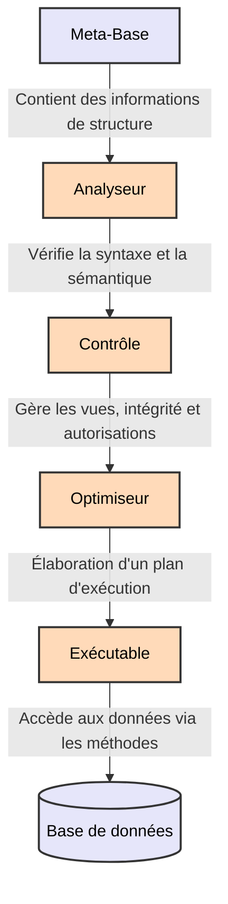
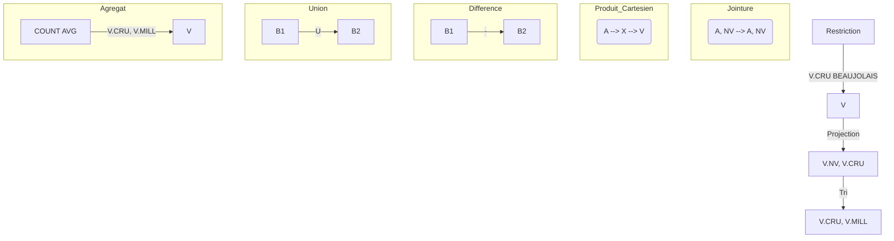

---






### Explications des Opérateurs Relationnels :

1. **Restriction** :
    
    - La restriction filtre les lignes d'une table qui satisfont une condition. Dans l'exemple, on utilise une restriction pour sélectionner uniquement les vins dont le "CRU" est "BEAUJOLAIS". Cela signifie que seules les lignes ayant cette valeur spécifique pour le champ "V.CRU" seront retenues.
2. **Projection** :
    
    - La projection est utilisée pour sélectionner uniquement certaines colonnes d'une table. Ici, on projette les colonnes "V.NV" et "V.CRU", ce qui signifie qu'on ne garde que ces deux colonnes pour les lignes sélectionnées.
3. **Tri** :
    
    - L'opérateur de tri réorganise les lignes de la table selon un ordre spécifique basé sur une ou plusieurs colonnes. Dans cet exemple, les lignes sont triées par "V.CRU" et "V.MILL".
4. **Jointure** :
    
    - La jointure combine deux tables en fonction d'une condition commune. Dans le schéma, on joint deux tables "A.NV" et "V.NV" sur le champ "NV" pour fusionner les informations pertinentes.
5. **Produit Cartésien** :
    
    - Le produit cartésien crée toutes les combinaisons possibles de lignes entre deux tables. Cela signifie que chaque ligne de la première table est associée à chaque ligne de la seconde, ce qui peut entraîner un grand nombre de combinaisons.
6. **Différence** :
    
    - L'opérateur de différence extrait les lignes d'une table qui n'existent pas dans une autre. Ici, on soustrait la table "B2" de "B1", gardant ainsi uniquement les lignes présentes dans "B1" mais pas dans "B2".
7. **Union** :
    
    - L'union combine toutes les lignes de deux tables tout en éliminant les doublons. Ici, les lignes de "B1" et "B2" sont fusionnées en une seule table.
8. **Agrégat** :
    
    - Les fonctions d'agrégation permettent de calculer des valeurs résumées, comme la somme, la moyenne, le compte, etc. Dans cet exemple, on utilise `COUNT(*)` pour compter les lignes et `AVG(DEGREE)` pour calculer la moyenne du champ "DEGREE", tout en regroupant par "V.CRU" et "V.MILL".


### 1. Arbre Linéaire Droit

Dans un arbre linéaire droit, chaque nœud a au plus un enfant qui se situe toujours à droite. Cet arbre est similaire à une liste chaînée, où chaque nœud pointe vers un unique nœud suivant. En SQL, cela peut être modélisé par une table auto-référenciée, où chaque enregistrement pointe vers son « enfant » dans une colonne `child_id`.

#### Exemple de table SQL

```sql
CREATE TABLE ArbreLineaireDroit (
    id INT PRIMARY KEY,
    valeur VARCHAR(50),
    child_id INT, -- Identifiant du nœud enfant
    FOREIGN KEY (child_id) REFERENCES ArbreLineaireDroit(id)
);
```

#### Exemple de données

| id  | valeur | child_id |
|-----|--------|----------|
| 1   | A      | 2        |
| 2   | B      | 3        |
| 3   | C      | NULL     |

Dans cet exemple, le nœud `A` a un enfant `B`, et `B` a un enfant `C`. Il n'y a pas de bifurcation ; chaque nœud pointe uniquement vers le suivant à droite, jusqu'à `NULL`, qui marque la fin de la chaîne.

### 2. Arbre Linéaire Gauche

Un arbre linéaire gauche est similaire à un arbre linéaire droit, sauf que chaque nœud a au plus un enfant situé à gauche. Cette structure est également comme une liste chaînée, mais les enfants sont orientés à gauche dans une représentation visuelle.

#### Exemple de table SQL

```sql
CREATE TABLE ArbreLineaireGauche (
    id INT PRIMARY KEY,
    valeur VARCHAR(50),
    left_child_id INT, -- Identifiant du nœud enfant à gauche
    FOREIGN KEY (left_child_id) REFERENCES ArbreLineaireGauche(id)
);
```

#### Exemple de données

| id  | valeur | left_child_id |
|-----|--------|---------------|
| 1   | A      | 2             |
| 2   | B      | 3             |
| 3   | C      | NULL          |

Dans cet exemple, `A` a un enfant `B` situé à gauche, et `B` a un enfant `C` également à gauche. Comme l'arbre linéaire droit, chaque nœud a au plus un enfant, mais l'orientation visuelle serait à gauche.

### 3. Arbre Linéaire Ramifié

Un arbre linéaire ramifié, ou arbre binaire, a une structure où chaque nœud peut avoir deux enfants, généralement appelés enfant gauche (`left_child_id`) et enfant droit (`right_child_id`). C'est une structure hiérarchique courante en informatique.

#### Exemple de table SQL

```sql
CREATE TABLE ArbreLineaireRamifie (
    id INT PRIMARY KEY,
    valeur VARCHAR(50),
    left_child_id INT,  -- Identifiant de l'enfant gauche
    right_child_id INT, -- Identifiant de l'enfant droit
    FOREIGN KEY (left_child_id) REFERENCES ArbreLineaireRamifie(id),
    FOREIGN KEY (right_child_id) REFERENCES ArbreLineaireRamifie(id)
);
```

#### Exemple de données

| id  | valeur | left_child_id | right_child_id |
|-----|--------|---------------|----------------|
| 1   | A      | 2             | 3              |
| 2   | B      | 4             | NULL           |
| 3   | C      | NULL          | NULL           |
| 4   | D      | NULL          | NULL           |

Dans cet exemple :
- Le nœud `A` a deux enfants : `B` (à gauche) et `C` (à droite).
- Le nœud `B` a un enfant `D` à gauche et aucun enfant à droite.
- Les nœuds `C` et `D` n'ont pas d'enfants, ce sont des feuilles.

### Requête pour parcourir l'arbre

Pour parcourir ces types d'arbres, tu peux utiliser une requête récursive, qui est utile pour obtenir tous les descendants d'un nœud racine donné.

#### Exemple de requête pour un arbre binaire (arbre linéaire ramifié)

```sql
WITH ArbreRecursif AS (
    SELECT id, valeur, left_child_id, right_child_id
    FROM ArbreLineaireRamifie
    WHERE id = 1 -- Point de départ (racine)

    UNION ALL

    SELECT a.id, a.valeur, a.left_child_id, a.right_child_id
    FROM ArbreLineaireRamifie a
    JOIN ArbreRecursif ar ON a.id = ar.left_child_id OR a.id = ar.right_child_id
)
SELECT * FROM ArbreRecursif;
```

Cette requête va parcourir l’arbre en partant du nœud racine avec `id = 1` et en récupérant tous les descendants dans une structure hiérarchique.

### Conclusion

Ces structures d'arbres en SQL te permettent de modéliser différents types de hiérarchies :
- **Arbre linéaire droit** et **Arbre linéaire gauche** pour des relations séquentielles simples.
- **Arbre linéaire ramifié** pour des structures plus complexes avec des 192.168.1.20