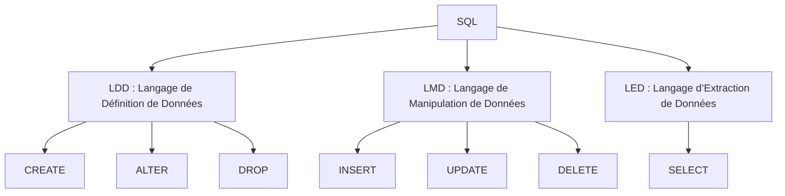

---

Le SQL est divisé en trois sous-langages principaux :

- **LDD** : Langage de Définition de Données  
  *Gère les structures des informations qui sont stockées*
  
- **LMD** : Langage de Manipulation de Données  
  *Gère les données stockées sans modifier leur structure*
  
- **LED** : Langage d’Extraction de Données  
  *Permet d'extraire et mettre en forme les données renvoyées à l'utilisateur*

---

## Syntaxe Générale

Tous les sous-langages de SQL suivent une syntaxe de base commune :

**Syntaxe générale** :  
`MOTCLEF <Paramètres>;`

- **MOTCLEF** : Représente une instruction SQL qui donne un ordre au SGBD.
- `;` : Caractère de fin de commande (modifiable).

---

### Principales commandes de chaque sous-langage

- **LDD** :  
  - `CREATE`
  - `ALTER`
  - `DROP`

- **LMD** :  
  - `INSERT`
  - `UPDATE`
  - `DELETE`

- **LED** :  
  - `SELECT`



---

## Syntaxe de la Commande SELECT

```sql
SELECT <Output>
FROM <INPUT>
[OPTIONS];
```

### `<Output>` : Champs à sélectionner

- `*` : Tous les champs
- `<NomChamp>` : Sélection explicite d'un champ
- `DISTINCT <NomChamp>` : Évite les répétitions
- `<Liste de Champs>` : Séparez les champs par des virgules pour personnaliser l'ordre
- `<Constantes>` : Peut être n'importe quelle valeur de type constant
- `Requêtes imbriquées` : Requêtes qui renvoient une seule valeur scalaire, équivalente à une constante

### `[OPTIONS]` : Options pour affiner les résultats

- **LIMIT** : Limite le nombre d’enregistrements affichés
    - `LIMIT nbEnregistrements`
    - `LIMIT Saut, nbEnregistrements`

- **ORDER BY** : Trie les informations en fonction de champs choisis
    - `<champ> ASC / DESC` (ASC pour ascendant, DESC pour descendant)
    - `<champ1>, <champ2>, <champ3>` (Par défaut, les champs sont triés en ordre ASC si aucun sens n'est spécifié)

---

## Exemples de Requêtes

### Citer les trois numéros d’employés les plus payés sans utiliser la fonction `MAX`

```sql
SELECT emp_no, salary  
FROM salaries  
ORDER BY salary DESC  
LIMIT 3;
```

### Citer les trois numéros d’employés les moins payés sans utiliser la fonction `MIN`

```sql
SELECT DISTINCT emp_no, salary  
FROM salaries  
ORDER BY salary ASC  
LIMIT 3;
```

**Remarque** : Utilise la table `salaries`.

### Calculer la différence entre le salaire maximum et le salaire des employés, et afficher les 10 personnes ayant l’écart le plus élevé

```sql
SELECT emp_no, ((SELECT MAX(salary) FROM salaries) - salary) AS deltaSalary  
FROM salaries  
ORDER BY deltaSalary DESC  
LIMIT 10;
```

### Calculs par Groupes

- **GROUP BY** : Permet de regrouper les enregistrements en fonction de valeurs de champ pour effectuer des calculs.

#### Exemple 1 : Calculer l'âge moyen des employés

```sql
SELECT AVG(TIMESTAMPDIFF(YEAR, birth_date, CURDATE())) AS average_age  
FROM employees;
```

#### Exemple 2 : Les trois femmes les plus âgées de l’entreprise

```sql
SELECT emp_no, TIMESTAMPDIFF(YEAR, birth_date, CURDATE()) AS age  
FROM employees  
WHERE gender = 'F'  
ORDER BY age DESC  
LIMIT 3;
```

#### Exemple 3 : Les 7e, 8e et 9e hommes les moins âgés

```sql
SELECT emp_no, TIMESTAMPDIFF(YEAR, birth_date, CURDATE()) AS age  
FROM employees  
WHERE gender = 'M'  
ORDER BY age ASC  
LIMIT 6, 3;
```

#### Exemple 4 : Les cinq employés les plus anciens et leur moyenne d’âge

```sql
SELECT emp_no, TIMESTAMPDIFF(YEAR, birth_date, CURDATE()) AS age,  
       (SELECT AVG(TIMESTAMPDIFF(YEAR, birth_date, CURDATE()))  
        FROM employees  
        ORDER BY TIMESTAMPDIFF(YEAR, birth_date, CURDATE()) DESC  
        LIMIT 5) AS average_age  
FROM employees  
ORDER BY age DESC  
LIMIT 5;
```

#### Exemple 5 : Identifier le numéro d’employé ayant occupé un poste le plus longtemps à partir de la table `titles`

```sql
SELECT emp_no, (to_date - from_date) AS duration  
FROM titles  
ORDER BY duration DESC  
LIMIT 5;
```

