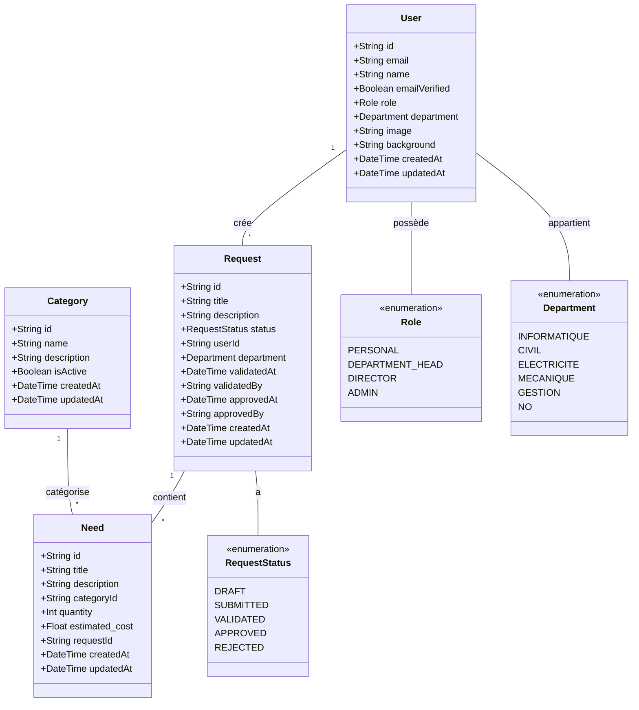
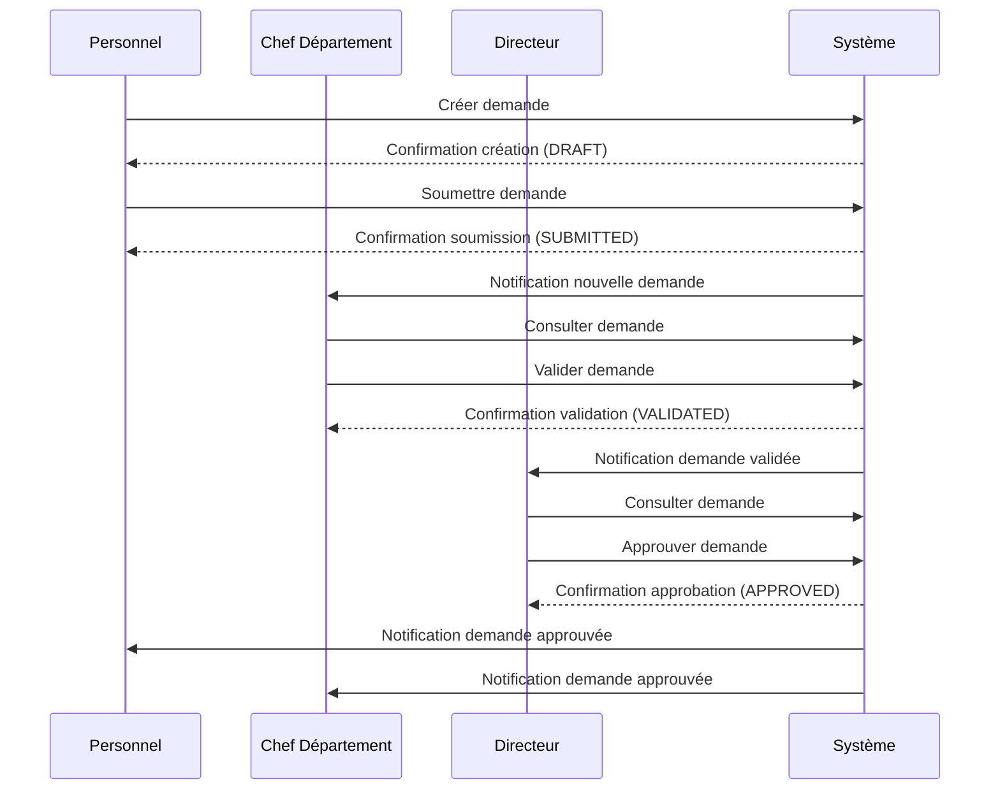
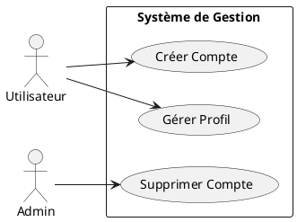

---

# Diagramme de classe

---
# Diagramme de séquence faire une demande

---

# Fiche textuelles

## Cas d'utilisation : Créer une demande

### Description
Permet à un utilisateur de créer une nouvelle demande de besoins dans le système.

### Acteur principal
- Personnel ou Chef de département

### Préconditions
- L'utilisateur est authentifié dans le système
- L'utilisateur a le rôle PERSONAL ou DEPARTMENT_HEAD

### Scénario principal
1. L'utilisateur accède à la section "Nouvelle demande"
2. L'utilisateur saisit le titre de la demande
3. L'utilisateur saisit une description (optionnel)
4. Pour chaque besoin de la demande :
   - L'utilisateur sélectionne une catégorie
   - L'utilisateur saisit le titre du besoin
   - L'utilisateur saisit la quantité
   - L'utilisateur saisit le coût estimé (optionnel)
   - L'utilisateur ajoute le besoin à la demande
5. L'utilisateur peut soit :
   - Sauvegarder en brouillon (status: DRAFT)
   - Soumettre la demande (status: SUBMITTED)
6. Le système enregistre la demande avec le département de l'utilisateur

### Extensions
4a. L'utilisateur veut supprimer un besoin
  1. L'utilisateur sélectionne le besoin à supprimer
  2. Le système retire le besoin de la demande

5a. La demande est invalide
  1. Le système affiche les erreurs de validation
  2. L'utilisateur corrige les erreurs
  3. Retour à l'étape 5

### Postconditions
- La demande est créée dans le système avec le statut DRAFT ou SUBMITTED
- Les besoins sont associés à la demande
- Le département de l'utilisateur est associé à la demande

### Règles de gestion
- Une demande doit avoir au moins un besoin
- Chaque besoin doit avoir une catégorie
- La quantité doit être supérieure à 0
- Le coût estimé, s'il est fourni, doit être positif
---
## Cas d'utilisation : Valider une demande (Chef de département)

### Description
Permet à un chef de département d'examiner et de valider les demandes soumises par son département.

### Acteur principal
- Chef de département

### Préconditions
- L'utilisateur est authentifié avec le rôle DEPARTMENT_HEAD
- Il existe des demandes en statut SUBMITTED dans son département

### Scénario principal
1. Le chef de département accède à la liste des demandes en attente
2. Le système affiche les demandes au statut SUBMITTED de son département
3. Le chef sélectionne une demande à examiner
4. Le système affiche les détails de la demande
5. Le chef examine :
   - La pertinence des besoins
   - La cohérence des quantités
   - L'estimation des coûts
6. Le chef peut :
   - Valider la demande (passage au statut VALIDATED)
   - Rejeter la demande (passage au statut REJECTED)
   - Demander des modifications (retour au statut DRAFT)
7. Le chef ajoute un commentaire (obligatoire en cas de rejet)
8. Le système enregistre la décision et notifie les parties concernées

### Postconditions
- La demande change de statut selon la décision
- Les parties concernées sont notifiées
- La date de validation et l'ID du validateur sont enregistrés

---

## Cas d'utilisation : Approuver une demande (Directeur)

### Description
Permet au directeur d'examiner et d'approuver les demandes validées par les chefs de département.

### Acteur principal
- Directeur

### Préconditions
- L'utilisateur est authentifié avec le rôle DIRECTOR
- Il existe des demandes en statut VALIDATED

### Scénario principal
1. Le directeur accède au tableau de bord des demandes
2. Le système affiche les demandes au statut VALIDATED
3. Le directeur sélectionne une demande
4. Le système présente :
   - Les détails de la demande
   - L'historique des validations
   - Le coût total estimé
5. Le directeur peut :
   - Approuver la demande (APPROVED)
   - Rejeter la demande (REJECTED)
6. Le directeur ajoute un commentaire si nécessaire
7. Le système enregistre la décision finale

### Postconditions
- La demande est finalisée (APPROVED ou REJECTED)
- Les notifications sont envoyées à tous les acteurs
- La date d'approbation et l'ID du directeur sont enregistrés

---

## Cas d'utilisation : Gérer les catégories (Administrateur)

### Description
Permet à l'administrateur de gérer les catégories de besoins dans le système.

### Acteur principal
- Administrateur

### Préconditions
- L'utilisateur est authentifié avec le rôle ADMIN

### Scénario principal
1. L'administrateur accède à la gestion des catégories
2. Le système affiche la liste des catégories existantes
3. L'administrateur peut :
   - Créer une nouvelle catégorie
   - Modifier une catégorie existante
   - Désactiver/réactiver une catégorie
4. Pour chaque action :
   - Saisie du nom
   - Saisie de la description
   - Définition du statut (actif/inactif)
5. Le système vérifie l'unicité du nom
6. Le système enregistre les modifications

### Règles de gestion
- Une catégorie ne peut être supprimée si elle est utilisée
- Le nom de la catégorie doit être unique
- Une catégorie désactivée n'apparaît plus dans les nouvelles demandes

### Postconditions
- Les modifications sont enregistrées
- L'historique des modifications est conservé
- Les catégories désactivées sont marquées comme inactives

---

## Cas d'utilisation : Créer une demande (alt)

### Scénarios alternatifs

#### 2a. Le titre existe déjà
1. Le système détecte un titre identique
2. Le système demande confirmation à l'utilisateur
3. L'utilisateur peut :
   - Modifier le titre
   - Confirmer l'utilisation du titre existant
   - Annuler l'opération

#### 4b. Catégorie indisponible
1. La catégorie sélectionnée est désactivée pendant la création
2. Le système notifie l'utilisateur
3. L'utilisateur doit choisir une nouvelle catégorie
4. Retour à l'étape 4

#### 5b. Perte de connexion
1. La connexion est perdue pendant la sauvegarde
2. Le système sauvegarde automatiquement en brouillon
3. Le système notifie l'utilisateur à la reconnexion
4. L'utilisateur peut reprendre la demande

---

## Cas d'utilisation : Valider une demande (Chef de département alt)

### Scénarios alternatifs

#### 3a. Demande modifiée pendant l'examen
1. Un utilisateur modifie la demande pendant l'examen
2. Le système détecte la modification
3. Le système notifie le chef de département
4. Le chef doit recharger la demande
5. Retour à l'étape 3

#### 6a. Conflit d'intérêts
1. Le chef détecte un conflit d'intérêts
2. Le chef signale le conflit dans le système
3. Le système transfère la demande à un autre chef
4. Le processus reprend avec le nouveau chef

#### 7a. Commentaire insuffisant
1. Le chef fournit un commentaire trop court
2. Le système refuse l'enregistrement
3. Le système demande plus de détails
4. Retour à l'étape 7

---

## Cas d'utilisation : Approuver une demande (Directeur alt)

### Scénarios alternatifs

#### 2a. Volume important de demandes
1. Plus de 20 demandes en attente
2. Le système propose un tri automatique par priorité
3. Le directeur peut :
   - Accepter le tri automatique
   - Définir ses propres critères de tri
   - Conserver l'ordre chronologique

#### 4a. Incohérence budgétaire
1. Le directeur détecte un dépassement budgétaire
2. Le système calcule l'impact sur le budget
3. Le directeur peut :
   - Demander une révision du budget
   - Rejeter avec justification
   - Approuver avec dérogation

#### 5a. Besoin d'informations supplémentaires
1. Le directeur requiert plus d'informations
2. Le système met la demande en attente
3. Notification au chef de département
4. Chef fournit les informations
5. Retour à l'étape 4

---

## Cas d'utilisation : Gérer les catégories (Administrateur)

### Scénarios alternatifs

#### 3a. Fusion de catégories
1. L'administrateur décide de fusionner deux catégories
2. Le système vérifie les demandes associées
3. Le système propose un plan de migration
4. L'administrateur valide la fusion
5. Le système met à jour toutes les demandes concernées

#### 4a. Import en masse
1. L'administrateur importe un fichier de catégories
2. Le système détecte des doublons
3. L'administrateur peut :
   - Ignorer les doublons
   - Fusionner les catégories
   - Renommer les nouvelles entrées

#### 5a. Erreur de validation
1. Erreur lors de la vérification d'unicité
2. Le système propose des alternatives
3. L'administrateur choisit :
   - Modifier le nom
   - Forcer la création
   - Annuler l'opération

#### Post-conditions additionnelles pour chaque scénario alternatif
- Toutes les actions sont journalisées
- Les utilisateurs concernés sont notifiés
- L'historique des modifications est conservé
- Les données temporaires sont nettoyées

#### Règles de gestion additionnelles
- Temps maximum de traitement défini pour chaque étape
- Nombre maximal de tentatives pour les actions critiques
- Conservation de l'historique des modifications pendant 1 an
- Backup automatique avant les opérations critiques

---
# Diagramme de cas d'utilisation

```mermaid
graph TD
    %% Acteurs
    PERS(Personnel)
    HEAD(Chef département)
    DIR(Directeur)
    ADMIN(Administrateur)

    %% Cas d'utilisation principaux - Gestion des demandes
    UC1[[Créer une demande]]
    UC2[[Gérer les brouillons]]
    UC3[[Consulter ses demandes]]
    UC4[[Modifier une demande]]
    UC5[[Soumettre une demande]]
    UC6[[Annuler une demande]]

    %% Cas d'utilisation - Chef département
    UC7[[Consulter les demandes du département]]
    UC8[[Valider une demande]]
    UC9[[Rejeter une demande]]
    UC10[[Demander des modifications]]
    UC11[[Suivre les indicateurs département]]

    %% Cas d'utilisation - Directeur
    UC12[[Consulter toutes les demandes]]
    UC13[[Approuver une demande]]
    UC14[[Rejeter définitivement]]
    UC15[[Consulter les statistiques globales]]

    %% Cas d'utilisation - Admin
    UC16[[Gérer les catégories]]
    UC17[[Gérer les utilisateurs]]
    UC18[[Configurer le système]]
    UC19[[Gérer les droits d'accès]]

    %% Relations Personnel
    PERS --> UC1
    PERS --> UC2
    PERS --> UC3
    PERS --> UC4
    PERS --> UC5
    PERS --> UC6

    %% Relations Chef département
    HEAD --> UC1
    HEAD --> UC2
    HEAD --> UC3
    HEAD --> UC4
    HEAD --> UC5
    HEAD --> UC6
    HEAD --> UC7
    HEAD --> UC8
    HEAD --> UC9
    HEAD --> UC10
    HEAD --> UC11

    %% Relations Directeur
    DIR --> UC12
    DIR --> UC13
    DIR --> UC14
    DIR --> UC15

    %% Relations Admin
    ADMIN --> UC16
    ADMIN --> UC17
    ADMIN --> UC18
    ADMIN --> UC19

    %% Relations d'extension et d'inclusion
    UC1 -.-> UC2
    UC4 -.-> UC2
    UC8 -.-> UC7
    UC9 -.-> UC7
    UC10 -.-> UC7
    UC13 -.-> UC12
    UC14 -.-> UC12

    %% Sous-systèmes
    subgraph Gestion des Demandes
        UC1
        UC2
        UC3
        UC4
        UC5
        UC6
    end

    subgraph Validation Département
        UC7
        UC8
        UC9
        UC10
        UC11
    end

    subgraph Direction
        UC12
        UC13
        UC14
        UC15
    end

    subgraph Administration
        UC16
        UC17
        UC18
        UC19
    end
```

---

